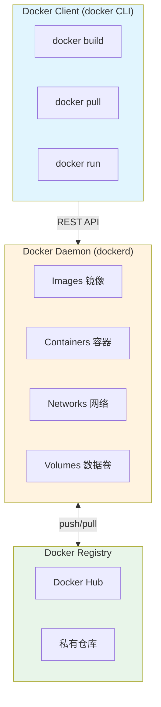
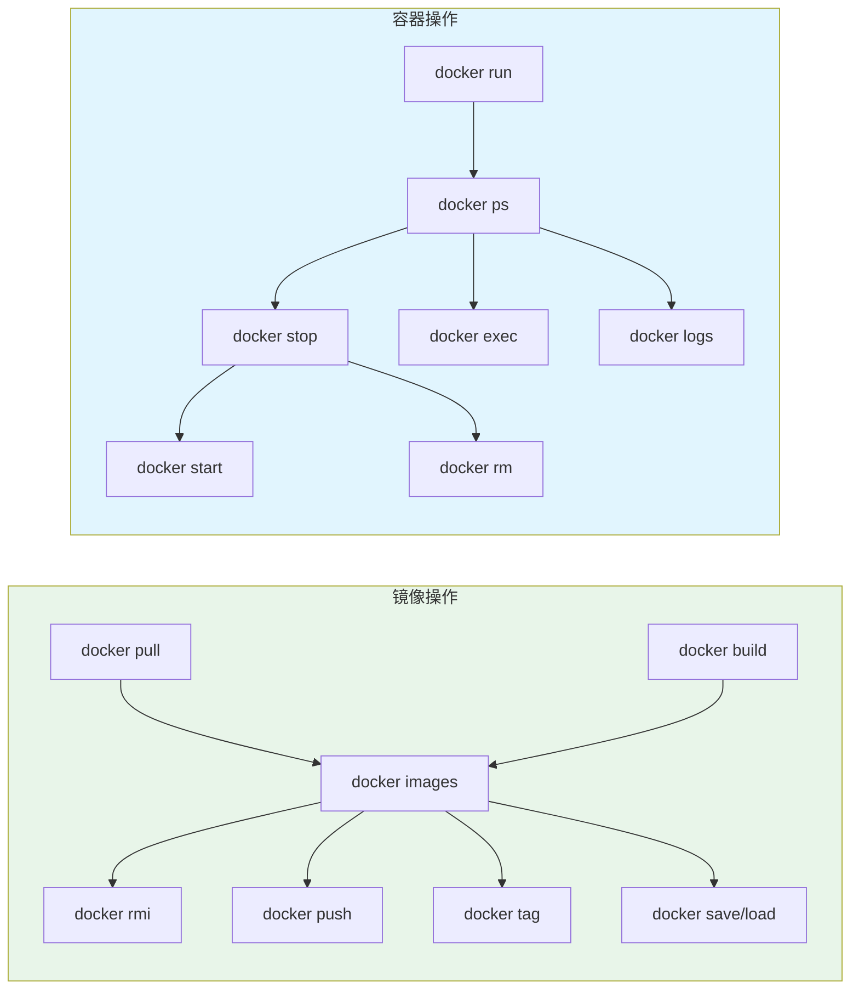
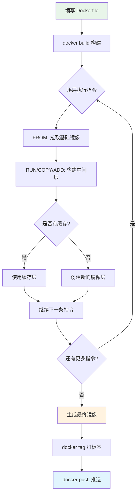
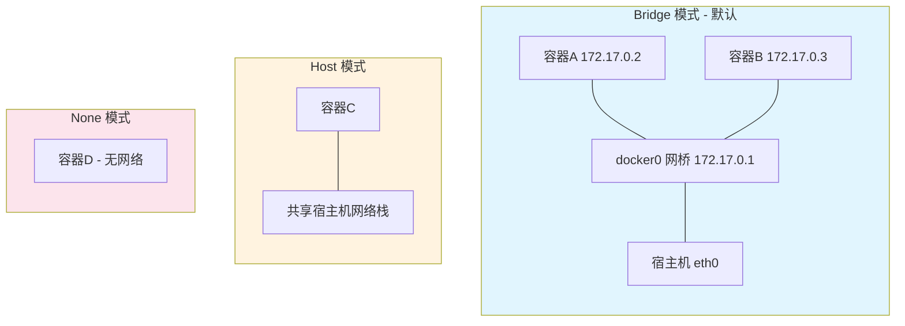
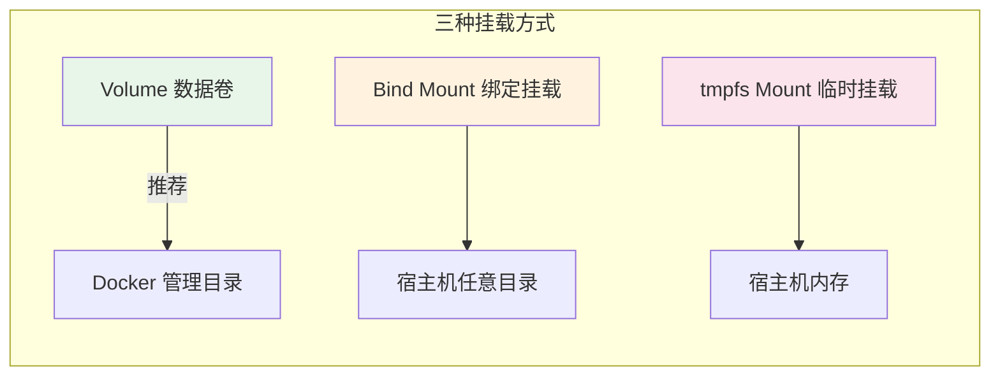
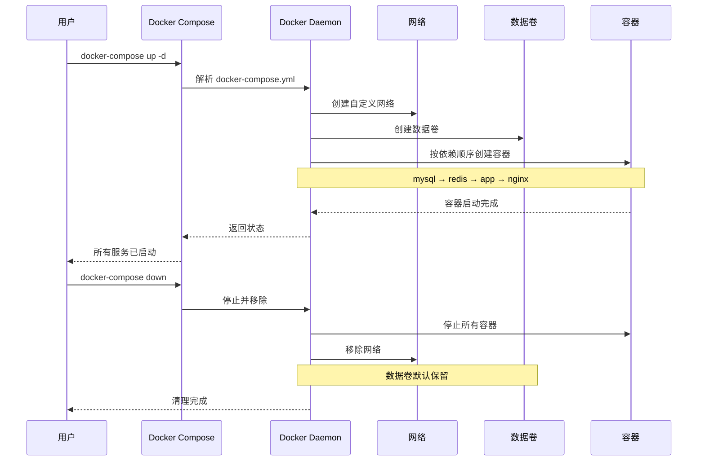
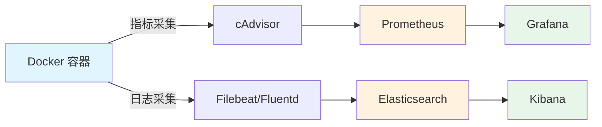

## Docker 简介

Docker 是一个开源的容器化平台，用于开发、部署和运行应用程序。它通过容器技术将应用及其依赖打包在一起，实现"一次构建，处处运行"的目标。

### 容器 vs 虚拟机

| 特性 | 容器（Docker） | 虚拟机（VM） |
|------|---------------|-------------|
| 启动速度 | 秒级 | 分钟级 |
| 资源占用 | MB级 | GB级 |
| 隔离级别 | 进程级别 | 操作系统级别 |
| 性能 | 接近原生 | 有一定损耗 |
| 镜像大小 | 通常几十MB~几百MB | 通常几GB |
| 操作系统 | 共享宿主机内核 | 独立操作系统 |

### Docker 核心架构



### 核心概念

- **镜像（Image）**：只读的模板，包含运行应用所需的文件系统和配置。镜像采用分层存储，每一层都是只读的
- **容器（Container）**：镜像的运行实例，拥有自己的文件系统、网络和进程空间。在镜像层之上增加一个可写层
- **仓库（Registry）**：存储和分发镜像的服务，如 Docker Hub、阿里云容器镜像服务
- **Dockerfile**：构建镜像的指令文件，定义了从基础镜像到最终镜像的每一步操作

## Docker 安装

### 在线安装（CentOS）

#### 1. 卸载旧版本

```bash
yum remove docker \
           docker-client \
           docker-client-latest \
           docker-common \
           docker-latest \
           docker-latest-logrotate \
           docker-logrotate \
           docker-selinux \
           docker-engine-selinux \
           docker-engine \
           docker-ce
```

#### 2. 安装依赖工具

```bash
yum install -y yum-utils \
               device-mapper-persistent-data \
               lvm2 --skip-broken
```

#### 3. 配置 Docker 镜像源

```bash
# 设置 Docker 镜像源（阿里云）
yum-config-manager \
  --add-repo \
  https://mirrors.aliyun.com/docker-ce/linux/centos/docker-ce.repo

sed -i 's/download.docker.com/mirrors.aliyun.com\/docker-ce/g' \
  /etc/yum.repos.d/docker-ce.repo

# 更新 yum 软件包索引
yum makecache fast
```

#### 4. 安装并启动 Docker

```bash
# 安装最新版 docker-ce
yum install -y docker-ce

# 启动 Docker
systemctl start docker

# 设置开机自启
systemctl enable docker

# 验证安装
docker version
docker info
```

#### 5. 配置镜像加速

```bash
# 创建配置目录
mkdir -p /etc/docker

# 编写配置文件
cat > /etc/docker/daemon.json <<EOF
{
  "registry-mirrors": [
    "https://docker.mirrors.ustc.edu.cn",
    "https://registry.docker-cn.com",
    "https://mirror.ccs.tencentyun.com"
  ],
  "log-driver": "json-file",
  "log-opts": {
    "max-size": "100m",
    "max-file": "3"
  },
  "storage-driver": "overlay2",
  "exec-opts": ["native.cgroupdriver=systemd"]
}
EOF

# 重新加载配置并重启
systemctl daemon-reload
systemctl restart docker
```

> **说明**：`daemon.json` 中的常用配置项：
> - `registry-mirrors`：镜像加速地址
> - `log-driver` / `log-opts`：日志驱动和限制（防止日志文件无限增长）
> - `storage-driver`：存储驱动，推荐 `overlay2`
> - `exec-opts`：执行选项，`systemd` cgroup 驱动适用于 Kubernetes 环境

### 离线安装

适用于无法联网的服务器环境。

#### 1. 下载安装包

在有网络的机器上下载 Docker 二进制包：

```bash
# 下载地址：https://download.docker.com/linux/static/stable/x86_64/
# 选择需要的版本，例如 docker-20.10.9.tgz
wget https://download.docker.com/linux/static/stable/x86_64/docker-20.10.9.tgz
```

#### 2. 传输并解压

```bash
# 将安装包传输到目标服务器后解压
tar -xvzf docker-20.10.9.tgz

# 将 docker 相关二进制文件移动到系统 PATH
mv docker/* /usr/bin/
```

#### 3. 创建 systemd 服务

```bash
cat > /etc/systemd/system/docker.service <<EOF
[Unit]
Description=Docker Application Container Engine
Documentation=https://docs.docker.com
After=network-online.target firewalld.service
Wants=network-online.target

[Service]
Type=notify
ExecStart=/usr/bin/dockerd
ExecReload=/bin/kill -s HUP \$MAINPID
LimitNOFILE=infinity
LimitNPROC=infinity
LimitCORE=infinity
TimeoutStartSec=0
Delegate=yes
KillMode=process
Restart=on-failure
StartLimitBurst=3
StartLimitInterval=60s

[Install]
WantedBy=multi-user.target
EOF
```

#### 4. 启动 Docker

```bash
# 重新加载 systemd
systemctl daemon-reload

# 启动 Docker
systemctl start docker

# 设置开机自启
systemctl enable docker

# 验证安装
docker version
```

### Ubuntu 安装

```bash
# 更新包索引
sudo apt-get update

# 安装依赖
sudo apt-get install -y \
    ca-certificates \
    curl \
    gnupg \
    lsb-release

# 添加 Docker 官方 GPG 密钥
sudo mkdir -m 0755 -p /etc/apt/keyrings
curl -fsSL https://download.docker.com/linux/ubuntu/gpg | \
    sudo gpg --dearmor -o /etc/apt/keyrings/docker.gpg

# 设置仓库
echo \
  "deb [arch=$(dpkg --print-architecture) signed-by=/etc/apt/keyrings/docker.gpg] \
  https://download.docker.com/linux/ubuntu \
  $(lsb_release -cs) stable" | \
  sudo tee /etc/apt/sources.list.d/docker.list > /dev/null

# 安装 Docker Engine
sudo apt-get update
sudo apt-get install -y docker-ce docker-ce-cli containerd.io docker-buildx-plugin docker-compose-plugin

# 启动并设置开机自启
sudo systemctl start docker
sudo systemctl enable docker
```

## Docker 常用命令

### 命令速查表



### 镜像管理

```bash
# 搜索镜像
docker search nginx

# 拉取镜像（默认 latest 标签）
docker pull nginx
docker pull nginx:1.25-alpine    # 指定版本和变体

# 查看本地镜像
docker images
docker images --format "table {{.Repository}}\t{{.Tag}}\t{{.Size}}"

# 查看镜像详细信息
docker inspect nginx

# 查看镜像构建历史
docker history nginx

# 给镜像打标签
docker tag nginx:latest myregistry.com/nginx:v1.0

# 推送镜像到仓库
docker push myregistry.com/nginx:v1.0

# 删除镜像
docker rmi nginx:latest
docker rmi $(docker images -q -f "dangling=true")   # 删除所有悬空镜像

# 导出/导入镜像（离线传输）
docker save -o nginx.tar nginx:latest                # 导出为 tar 文件
docker load -i nginx.tar                              # 从 tar 文件导入
```

### 容器管理

```bash
# 创建并启动容器
docker run -d \                   # 后台运行
  --name my-nginx \               # 容器名称
  -p 8080:80 \                    # 端口映射（宿主机:容器）
  -v /host/path:/container/path \ # 目录挂载
  -e ENV_VAR=value \              # 环境变量
  --restart=unless-stopped \      # 重启策略
  --memory=512m \                 # 内存限制
  --cpus=1.5 \                    # CPU 限制
  nginx:latest

# 查看运行中的容器
docker ps
docker ps -a                      # 包含已停止的容器
docker ps --format "table {{.Names}}\t{{.Status}}\t{{.Ports}}"

# 启动/停止/重启容器
docker start my-nginx
docker stop my-nginx
docker restart my-nginx

# 进入容器
docker exec -it my-nginx /bin/bash      # 交互式终端
docker exec my-nginx cat /etc/nginx/nginx.conf  # 执行单条命令

# 查看容器日志
docker logs my-nginx
docker logs -f my-nginx                 # 实时跟踪日志
docker logs --tail 100 my-nginx         # 最后100行
docker logs --since 2h my-nginx         # 最近2小时

# 查看容器资源使用
docker stats
docker stats my-nginx

# 查看容器详细信息
docker inspect my-nginx

# 容器与宿主机之间复制文件
docker cp my-nginx:/etc/nginx/nginx.conf ./nginx.conf   # 从容器复制
docker cp ./index.html my-nginx:/usr/share/nginx/html/  # 复制到容器

# 删除容器
docker rm my-nginx                      # 删除已停止的容器
docker rm -f my-nginx                   # 强制删除运行中的容器
docker rm $(docker ps -aq)              # 删除所有已停止的容器

# 系统清理
docker system prune                     # 清理未使用的资源
docker system prune -a --volumes        # 深度清理（包括未使用的镜像和卷）
docker system df                        # 查看磁盘使用情况
```

### 容器重启策略

| 策略 | 说明 |
|------|------|
| `no` | 不自动重启（默认） |
| `on-failure[:max-retries]` | 非正常退出时重启，可设置最大重试次数 |
| `always` | 总是重启，包括手动停止后 Docker daemon 重启时 |
| `unless-stopped` | 类似 always，但手动停止后不会在 daemon 重启时自动启动 |

## Dockerfile 编写

### Dockerfile 指令详解

```dockerfile
# 基础镜像（推荐使用 alpine 等轻量级镜像）
FROM openjdk:17-jdk-alpine

# 维护者信息
LABEL maintainer="your-email@example.com"
LABEL version="1.0"
LABEL description="Spring Boot Application"

# 设置环境变量
ENV APP_HOME=/app \
    JAVA_OPTS="-Xms256m -Xmx512m" \
    TZ=Asia/Shanghai

# 设置工作目录
WORKDIR $APP_HOME

# 设置时区
RUN ln -snf /usr/share/zoneinfo/$TZ /etc/localtime && echo $TZ > /etc/timezone

# 复制文件（COPY 比 ADD 更透明，推荐优先使用）
COPY target/*.jar app.jar

# 暴露端口（仅声明，实际映射需在 run 时指定 -p）
EXPOSE 8080

# 健康检查
HEALTHCHECK --interval=30s --timeout=10s --start-period=40s --retries=3 \
    CMD curl -f http://localhost:8080/actuator/health || exit 1

# 以非 root 用户运行（安全最佳实践）
RUN addgroup -S appgroup && adduser -S appuser -G appgroup
USER appuser

# 启动命令（推荐 exec 形式，可以接收系统信号）
ENTRYPOINT ["sh", "-c", "java $JAVA_OPTS -jar app.jar"]
```

### 镜像构建流程



### 多阶段构建（减小镜像体积）

```dockerfile
# ========== 构建阶段 ==========
FROM maven:3.9-eclipse-temurin-17-alpine AS builder
WORKDIR /build
COPY pom.xml .
# 先下载依赖（利用 Docker 层缓存）
RUN mvn dependency:go-offline
COPY src ./src
RUN mvn package -DskipTests

# ========== 运行阶段 ==========
FROM eclipse-temurin:17-jre-alpine
LABEL maintainer="your-email@example.com"

ENV TZ=Asia/Shanghai
RUN ln -snf /usr/share/zoneinfo/$TZ /etc/localtime && echo $TZ > /etc/timezone

WORKDIR /app
# 从构建阶段复制产物
COPY --from=builder /build/target/*.jar app.jar

RUN addgroup -S appgroup && adduser -S appuser -G appgroup
USER appuser

EXPOSE 8080
ENTRYPOINT ["java", "-jar", "app.jar"]
```

> **多阶段构建优势**：构建阶段的 Maven、源码等不会进入最终镜像，通常可将镜像体积从 800MB+ 缩减到 200MB 以下。

### Dockerfile 最佳实践

1. **使用轻量级基础镜像**：优先选择 `alpine` 变体（如 `openjdk:17-jdk-alpine`）
2. **合并 RUN 指令**：减少镜像层数，使用 `&&` 连接多条命令
3. **利用构建缓存**：将变化频率低的指令放在前面（如依赖安装）
4. **使用 .dockerignore**：排除不需要的文件，加速构建
5. **不以 root 运行**：使用 `USER` 指令切换到非特权用户
6. **使用多阶段构建**：分离构建环境和运行环境，减小体积

#### .dockerignore 示例

```text
.git
.gitignore
.idea
*.md
target/
node_modules/
*.log
docker-compose*.yml
Dockerfile
```

## Docker 网络

### 网络模式



| 模式 | 说明 | 适用场景 |
|------|------|---------|
| `bridge` | 默认模式，容器通过虚拟网桥通信 | 大多数场景 |
| `host` | 容器直接使用宿主机网络，无端口映射 | 高性能网络场景 |
| `none` | 容器无网络连接 | 安全隔离场景 |
| `container` | 共享另一个容器的网络命名空间 | Pod 模式、Sidecar |
| `overlay` | 跨主机容器通信 | Docker Swarm / 集群 |
| `macvlan` | 为容器分配 MAC 地址，像物理设备一样接入网络 | 需要直接接入物理网络 |

### 网络管理命令

```bash
# 创建自定义网络
docker network create my-network
docker network create --driver bridge --subnet 172.20.0.0/16 my-custom-net

# 查看网络列表
docker network ls

# 查看网络详情
docker network inspect my-network

# 容器加入网络
docker run -d --name app --network my-network nginx
docker network connect my-network existing-container

# 容器离开网络
docker network disconnect my-network existing-container

# 删除网络
docker network rm my-network
docker network prune    # 删除所有未使用的网络
```

> **自定义网络的优势**：同一自定义网络中的容器可以通过**容器名**互相访问（内置 DNS），而默认 bridge 网络只能通过 IP 访问。

## Docker 数据卷

### 数据持久化方式



| 方式 | 特点 | 使用场景 |
|------|------|---------|
| Volume | Docker 管理，可跨容器共享，支持驱动扩展 | 持久化数据库数据、应用数据 |
| Bind Mount | 直接映射宿主机目录，性能好 | 开发环境、配置文件挂载 |
| tmpfs | 数据存于内存，容器停止后丢失 | 敏感信息、临时缓存 |

### 数据卷操作

```bash
# 创建数据卷
docker volume create my-data

# 查看所有数据卷
docker volume ls

# 查看数据卷详情
docker volume inspect my-data

# 使用数据卷启动容器
docker run -d \
  --name mysql \
  -v my-data:/var/lib/mysql \          # 命名卷
  -v /host/conf:/etc/mysql/conf.d \    # 绑定挂载
  -e MYSQL_ROOT_PASSWORD=123456 \
  mysql:8.0

# 删除数据卷
docker volume rm my-data
docker volume prune                     # 删除所有未使用的卷
```

## Docker Compose

Docker Compose 是一个用于定义和运行多容器应用的工具，通过 YAML 文件描述服务、网络和数据卷。

### 安装 Docker Compose

#### 方式一：下载二进制文件

```bash
# 下载（从 GitHub Releases 获取最新版本）
# https://github.com/docker/compose/releases
sudo curl -L "https://github.com/docker/compose/releases/download/v2.24.0/docker-compose-$(uname -s)-$(uname -m)" \
  -o /usr/local/bin/docker-compose

# 添加执行权限
sudo chmod +x /usr/local/bin/docker-compose

# 验证安装
docker-compose --version
```

#### 方式二：离线安装

```bash
# 在有网环境下载对应版本的二进制文件
# https://github.com/docker/compose/releases
# 例如：docker-compose-linux-x86_64

# 传输到目标服务器
sudo mv docker-compose-linux-x86_64 /usr/local/bin/docker-compose
sudo chmod +x /usr/local/bin/docker-compose

# 验证
docker-compose --version
```

#### 方式三：Docker Compose V2（插件模式）

```bash
# Docker 20.10+ 支持以插件形式使用
# 安装 docker-compose-plugin
yum install -y docker-compose-plugin

# 使用方式变为 docker compose（不再有连字符）
docker compose version
```

### docker-compose.yml 详解

```yaml
# Docker Compose 文件版本
version: "3.8"

# 定义服务
services:
  # Nginx 服务
  nginx:
    image: nginx:1.25-alpine
    container_name: my-nginx
    ports:
      - "80:80"
      - "443:443"
    volumes:
      - ./nginx/conf.d:/etc/nginx/conf.d   # 配置文件
      - ./nginx/html:/usr/share/nginx/html  # 静态文件
      - nginx-logs:/var/log/nginx           # 日志（命名卷）
    networks:
      - frontend
    depends_on:
      - app
    restart: unless-stopped
    healthcheck:
      test: ["CMD", "curl", "-f", "http://localhost"]
      interval: 30s
      timeout: 10s
      retries: 3

  # Spring Boot 应用
  app:
    build:
      context: .
      dockerfile: Dockerfile
    container_name: my-app
    ports:
      - "8080:8080"
    environment:
      - SPRING_PROFILES_ACTIVE=prod
      - DB_HOST=mysql
      - DB_PORT=3306
      - REDIS_HOST=redis
    volumes:
      - app-logs:/app/logs
    networks:
      - frontend
      - backend
    depends_on:
      mysql:
        condition: service_healthy
      redis:
        condition: service_started
    restart: unless-stopped

  # MySQL 数据库
  mysql:
    image: mysql:8.0
    container_name: my-mysql
    ports:
      - "3306:3306"
    environment:
      MYSQL_ROOT_PASSWORD: ${MYSQL_ROOT_PASSWORD:-rootpass}
      MYSQL_DATABASE: myapp
      MYSQL_USER: appuser
      MYSQL_PASSWORD: ${MYSQL_PASSWORD:-apppass}
    volumes:
      - mysql-data:/var/lib/mysql
      - ./mysql/init:/docker-entrypoint-initdb.d   # 初始化脚本
      - ./mysql/conf:/etc/mysql/conf.d              # 自定义配置
    networks:
      - backend
    command: --character-set-server=utf8mb4 --collation-server=utf8mb4_unicode_ci
    healthcheck:
      test: ["CMD", "mysqladmin", "ping", "-h", "localhost"]
      interval: 10s
      timeout: 5s
      retries: 5
    restart: unless-stopped

  # Redis 缓存
  redis:
    image: redis:7-alpine
    container_name: my-redis
    ports:
      - "6379:6379"
    command: redis-server --requirepass ${REDIS_PASSWORD:-redispass} --appendonly yes
    volumes:
      - redis-data:/data
    networks:
      - backend
    restart: unless-stopped

# 定义网络
networks:
  frontend:
    driver: bridge
  backend:
    driver: bridge

# 定义数据卷
volumes:
  mysql-data:
  redis-data:
  nginx-logs:
  app-logs:
```

### 服务编排流程



### Docker Compose 常用命令

```bash
# 启动服务（后台模式）
docker-compose up -d

# 启动并重新构建
docker-compose up -d --build

# 查看服务状态
docker-compose ps

# 查看服务日志
docker-compose logs -f
docker-compose logs -f app              # 指定服务

# 停止服务
docker-compose stop

# 停止并移除容器、网络
docker-compose down

# 停止并移除容器、网络、数据卷
docker-compose down -v

# 重启服务
docker-compose restart
docker-compose restart app              # 重启指定服务

# 进入容器
docker-compose exec app /bin/sh

# 查看服务配置
docker-compose config                   # 验证并查看解析后的配置

# 扩缩容（无状态服务）
docker-compose up -d --scale app=3
```

### 使用 .env 文件管理环境变量

```bash
# .env 文件（与 docker-compose.yml 同目录）
MYSQL_ROOT_PASSWORD=my-secret-pw
MYSQL_PASSWORD=app-secret
REDIS_PASSWORD=redis-secret
COMPOSE_PROJECT_NAME=myproject
```

## 生产环境最佳实践

### 安全建议

1. **不以 root 运行容器**：在 Dockerfile 中使用 `USER` 指令
2. **使用只读文件系统**：`docker run --read-only`
3. **限制资源**：使用 `--memory`、`--cpus` 限制容器资源
4. **扫描镜像漏洞**：使用 `docker scout`、Trivy 等工具
5. **使用私有镜像仓库**：不要在公共仓库存放包含敏感信息的镜像
6. **定期更新基础镜像**：及时修复安全漏洞

### 日志管理

```bash
# 查看容器日志驱动
docker inspect --format='{{.HostConfig.LogConfig.Type}}' container_name

# 配置日志大小限制（daemon.json 或 docker run）
docker run -d \
  --log-opt max-size=50m \
  --log-opt max-file=3 \
  nginx
```

### 监控方案



### 常见问题排查

```bash
# 容器无法启动 → 查看日志
docker logs container_name

# 网络不通 → 检查网络配置
docker network inspect bridge
docker exec container_name ping target_host

# 磁盘空间不足 → 清理
docker system df                         # 查看占用
docker system prune -a --volumes         # 深度清理

# 容器内 DNS 解析失败
docker exec container_name cat /etc/resolv.conf
# 可在 daemon.json 中配置 DNS
# "dns": ["8.8.8.8", "114.114.114.114"]

# 查看容器内进程
docker top container_name

# 查看容器文件系统变化
docker diff container_name
```
