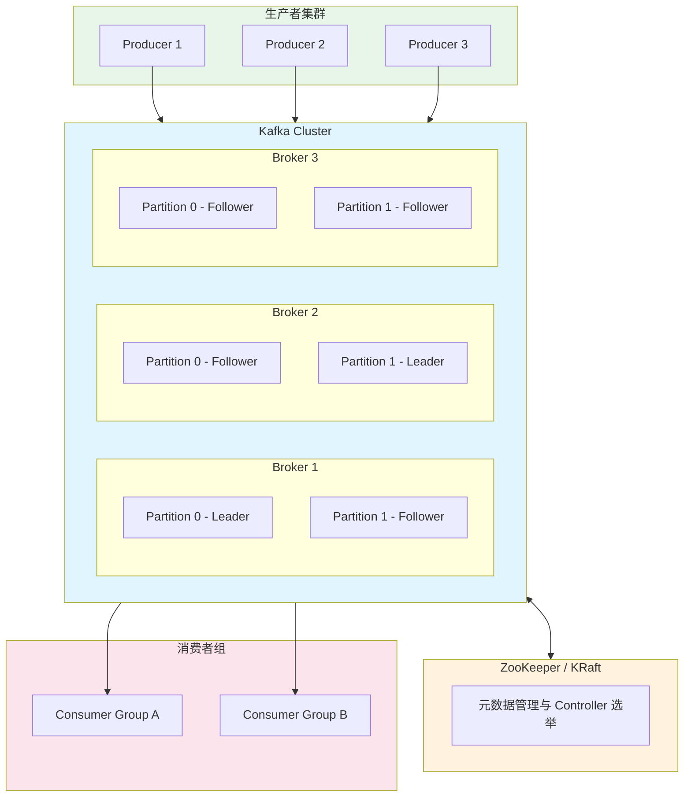
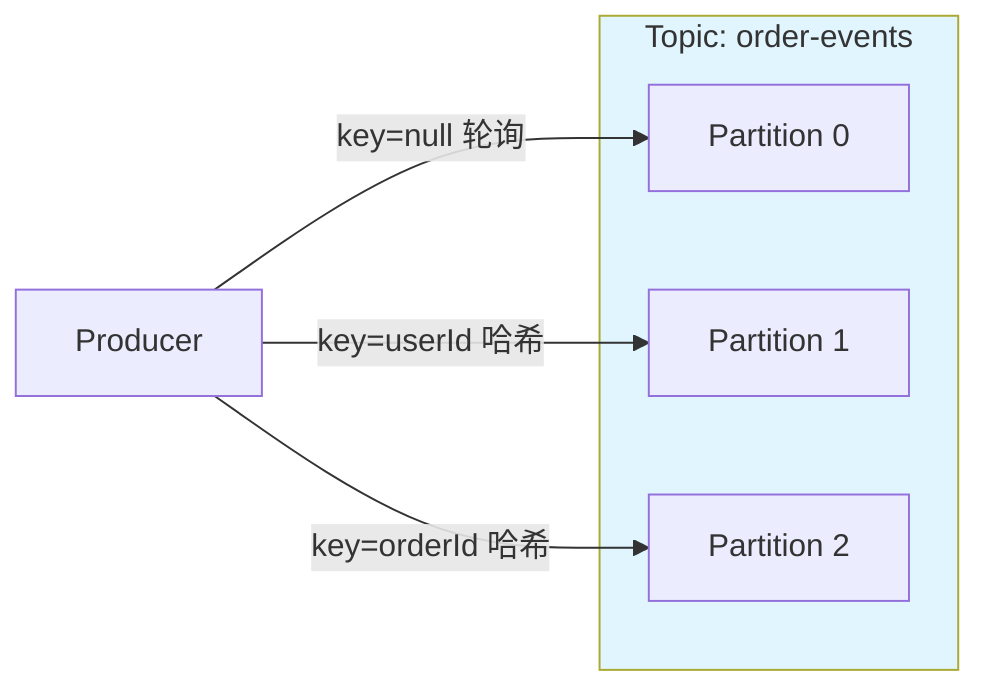
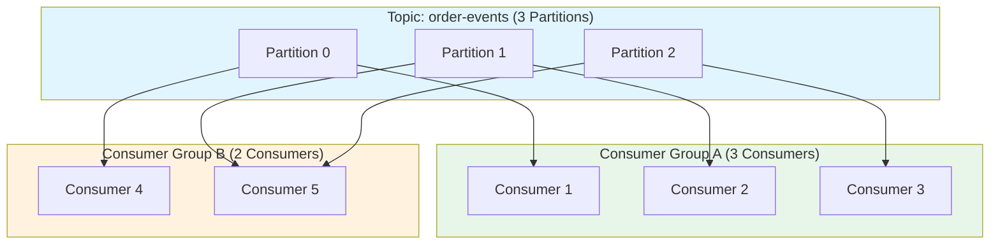
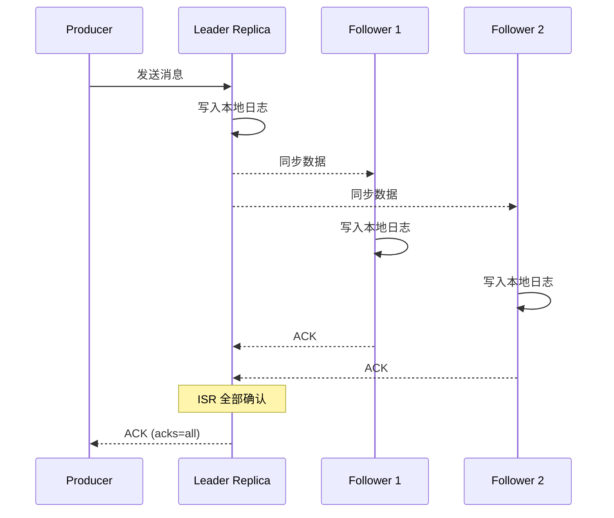
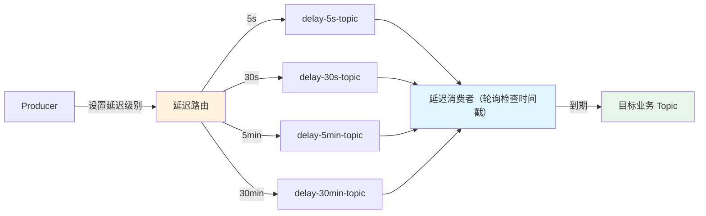
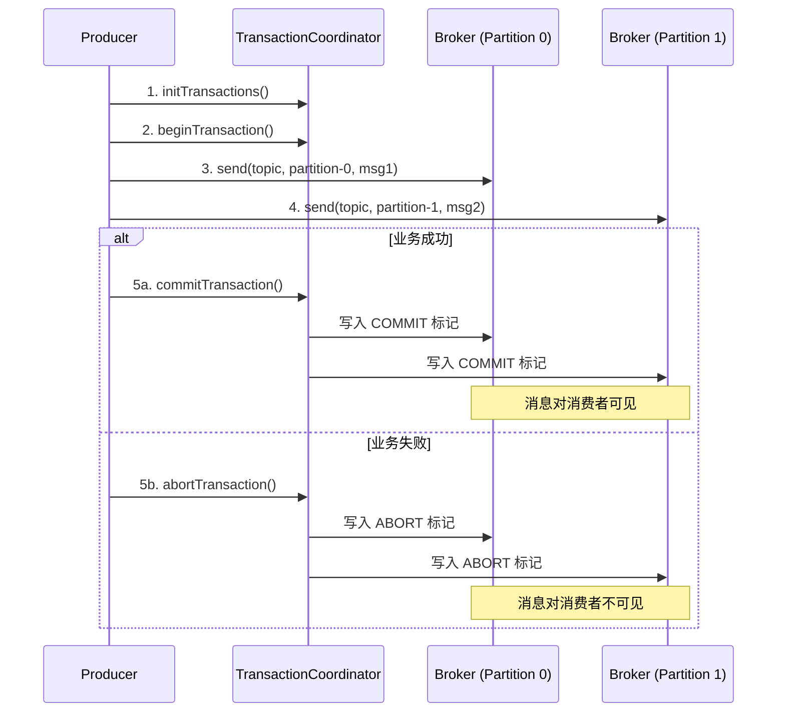
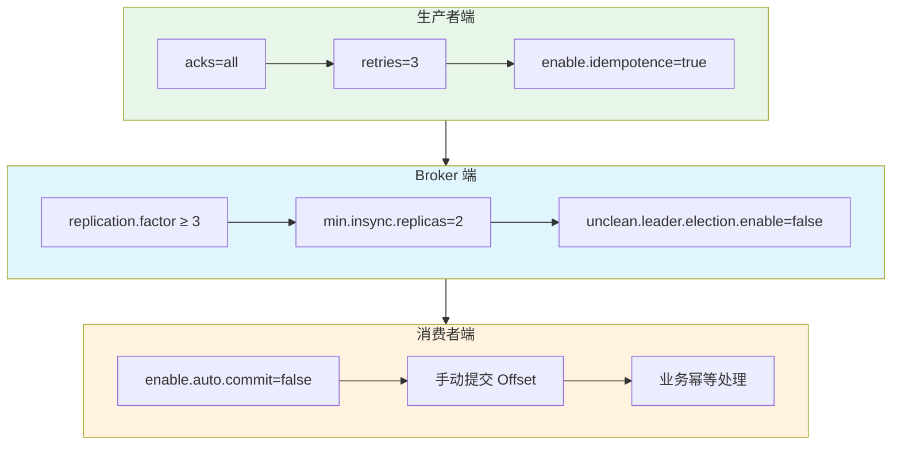

## Kafka 简介

Apache Kafka 是一个分布式流处理平台，最初由 LinkedIn 开发，后成为 Apache 顶级项目。它具有高吞吐量、低延迟、高可用和可水平扩展的特点，广泛应用于日志收集、消息队列、流处理、事件驱动架构等场景。

### 核心特性

| 特性 | 说明 |
|------|------|
| 高吞吐量 | 单机可达百万级 TPS，通过分区并行和顺序写磁盘实现 |
| 低延迟 | 毫秒级消息投递 |
| 持久化 | 消息持久化到磁盘，支持按时间戳回溯 |
| 可扩展 | 支持在线水平扩展，动态增减 Broker |
| 高可用 | 多副本机制，自动故障转移 |
| 消息有序 | 单分区内严格有序 |
| 流处理 | 内置 Kafka Streams，支持实时流计算 |

### Kafka 架构总览



### 核心概念

#### Broker

Kafka 集群中的每一台服务器称为一个 Broker。每个 Broker 持有部分分区数据，集群中的 Broker 协同工作来提供高可用服务。

#### Topic 与 Partition



- **Topic**：消息的逻辑分类，类似于数据库中的表
- **Partition**：Topic 的物理分片，每个 Partition 是一个有序的、不可变的消息序列
- **Offset**：消息在 Partition 中的唯一标识（递增序号），消费者通过 Offset 追踪消费位置
- **分区策略**：
  - `key = null`：轮询（Round Robin）/ 粘性分区（Sticky，Kafka 2.4+ 默认）分配到各分区
  - `key != null`：按 key 的哈希值分配，相同 key 的消息进入同一分区（保证局部有序）
  - 自定义分区器：实现 `Partitioner` 接口

#### Consumer Group



- **消费者组**内的消费者分摊消费分区，一个分区只能被组内一个消费者消费
- **不同消费者组**独立消费，互不影响（发布/订阅模式）
- 消费者数量 ≤ 分区数时效果最佳；超过分区数的消费者将空闲

#### 副本机制（Replication）



- **Leader**：每个 Partition 有一个 Leader 副本，负责所有读写请求
- **Follower**：从 Leader 同步数据，不对外提供服务（Kafka 2.4+ 支持 Follower 读取）
- **ISR（In-Sync Replicas）**：与 Leader 保持同步的副本集合
- **acks 参数**：
  - `acks=0`：不等待确认，速度最快，可能丢消息
  - `acks=1`：Leader 写入即确认，Leader 宕机可能丢消息
  - `acks=all(-1)`：ISR 中所有副本确认，最安全

## Docker 安装 Kafka

### 单节点部署（开发环境）

```bash
# 创建 Docker 网络
docker network create kafka-net

# 启动 ZooKeeper
docker run -d \
  --name zookeeper \
  --network kafka-net \
  -p 2181:2181 \
  -e ALLOW_ANONYMOUS_LOGIN=yes \
  -v /etc/localtime:/etc/localtime \
  wurstmeister/zookeeper

# 启动 Kafka
docker run -d \
  --name kafka \
  --network kafka-net \
  -p 9092:9092 \
  -e KAFKA_BROKER_ID=0 \
  -e KAFKA_ZOOKEEPER_CONNECT=zookeeper:2181 \
  -e KAFKA_ADVERTISED_LISTENERS=PLAINTEXT://192.168.131.128:9092 \
  -e KAFKA_LISTENERS=PLAINTEXT://0.0.0.0:9092 \
  -e KAFKA_LOG_RETENTION_HOURS=168 \
  -e KAFKA_LOG_SEGMENT_BYTES=1073741824 \
  -e KAFKA_NUM_PARTITIONS=3 \
  -v kafka-data:/kafka \
  -v /etc/localtime:/etc/localtime \
  wurstmeister/kafka
```

#### 验证安装

```bash
# 进入 Kafka 容器
docker exec -it kafka /bin/bash

# 创建测试 Topic
kafka-topics.sh --create \
  --bootstrap-server localhost:9092 \
  --replication-factor 1 \
  --partitions 3 \
  --topic test-topic

# 查看 Topic 列表
kafka-topics.sh --list --bootstrap-server localhost:9092

# 发送测试消息
kafka-console-producer.sh --broker-list localhost:9092 --topic test-topic
> Hello Kafka
> Test Message

# 消费消息（新开终端）
kafka-console-consumer.sh --bootstrap-server localhost:9092 \
  --topic test-topic --from-beginning
```

### KRaft 模式（无 ZooKeeper，推荐 Kafka 3.3+）

Kafka 3.3+ 支持 KRaft 模式，无需依赖 ZooKeeper，简化部署架构。Kafka 4.0 已完全移除 ZooKeeper 依赖。

```bash
docker run -d \
  --name kafka-kraft \
  -p 9092:9092 \
  -e KAFKA_NODE_ID=1 \
  -e KAFKA_PROCESS_ROLES=broker,controller \
  -e KAFKA_LISTENERS=PLAINTEXT://0.0.0.0:9092,CONTROLLER://0.0.0.0:9093 \
  -e KAFKA_ADVERTISED_LISTENERS=PLAINTEXT://192.168.131.128:9092 \
  -e KAFKA_CONTROLLER_LISTENER_NAMES=CONTROLLER \
  -e KAFKA_LISTENER_SECURITY_PROTOCOL_MAP=CONTROLLER:PLAINTEXT,PLAINTEXT:PLAINTEXT \
  -e KAFKA_CONTROLLER_QUORUM_VOTERS=1@localhost:9093 \
  -e KAFKA_OFFSETS_TOPIC_REPLICATION_FACTOR=1 \
  -e CLUSTER_ID=MkU3OEVBNTcwNTJENDM2Qk \
  -v kafka-kraft-data:/var/lib/kafka/data \
  apache/kafka:3.7.0
```

### 集群部署

> 服务器建议至少 4GB 内存

#### ZooKeeper 集群（docker-compose.yml）

```yaml
version: "3.8"

networks:
  kafka-cluster:
    driver: bridge

services:
  zoo1:
    image: zookeeper:3.8
    restart: always
    container_name: zoo1
    hostname: zoo1
    ports:
      - "2181:2181"
    volumes:
      - ./zoo1/data:/data
      - ./zoo1/datalog:/datalog
    environment:
      ZOO_MY_ID: 1
      ZOO_SERVERS: server.1=zoo1:2888:3888;2181 server.2=zoo2:2888:3888;2181 server.3=zoo3:2888:3888;2181
    networks:
      - kafka-cluster

  zoo2:
    image: zookeeper:3.8
    restart: always
    container_name: zoo2
    hostname: zoo2
    ports:
      - "2182:2181"
    volumes:
      - ./zoo2/data:/data
      - ./zoo2/datalog:/datalog
    environment:
      ZOO_MY_ID: 2
      ZOO_SERVERS: server.1=zoo1:2888:3888;2181 server.2=zoo2:2888:3888;2181 server.3=zoo3:2888:3888;2181
    networks:
      - kafka-cluster

  zoo3:
    image: zookeeper:3.8
    restart: always
    container_name: zoo3
    hostname: zoo3
    ports:
      - "2183:2181"
    volumes:
      - ./zoo3/data:/data
      - ./zoo3/datalog:/datalog
    environment:
      ZOO_MY_ID: 3
      ZOO_SERVERS: server.1=zoo1:2888:3888;2181 server.2=zoo2:2888:3888;2181 server.3=zoo3:2888:3888;2181
    networks:
      - kafka-cluster
```

#### Kafka 集群（docker-compose.yml）

```yaml
version: "3.8"

networks:
  kafka-cluster:
    external: true
    name: kafka-cluster

services:
  kafka1:
    image: wurstmeister/kafka:latest
    restart: unless-stopped
    container_name: kafka1
    hostname: kafka1
    ports:
      - "9092:9092"
    depends_on:
      - zoo1
      - zoo2
      - zoo3
    environment:
      KAFKA_BROKER_ID: 1
      KAFKA_LISTENERS: PLAINTEXT://0.0.0.0:9092
      KAFKA_ADVERTISED_LISTENERS: PLAINTEXT://192.168.131.128:9092
      KAFKA_ZOOKEEPER_CONNECT: "zoo1:2181,zoo2:2181,zoo3:2181"
      KAFKA_NUM_PARTITIONS: 3
      KAFKA_DEFAULT_REPLICATION_FACTOR: 2
      KAFKA_LOG_RETENTION_HOURS: 168
      KAFKA_LOG_SEGMENT_BYTES: 1073741824
      KAFKA_MESSAGE_MAX_BYTES: 10485760
      KAFKA_REPLICA_FETCH_MAX_BYTES: 10485760
    volumes:
      - ./kafka/kafka1/data:/kafka
    networks:
      - kafka-cluster

  kafka2:
    image: wurstmeister/kafka:latest
    restart: unless-stopped
    container_name: kafka2
    hostname: kafka2
    ports:
      - "9093:9092"
    depends_on:
      - zoo1
      - zoo2
      - zoo3
    environment:
      KAFKA_BROKER_ID: 2
      KAFKA_LISTENERS: PLAINTEXT://0.0.0.0:9092
      KAFKA_ADVERTISED_LISTENERS: PLAINTEXT://192.168.131.128:9093
      KAFKA_ZOOKEEPER_CONNECT: "zoo1:2181,zoo2:2181,zoo3:2181"
      KAFKA_NUM_PARTITIONS: 3
      KAFKA_DEFAULT_REPLICATION_FACTOR: 2
      KAFKA_LOG_RETENTION_HOURS: 168
      KAFKA_LOG_SEGMENT_BYTES: 1073741824
      KAFKA_MESSAGE_MAX_BYTES: 10485760
      KAFKA_REPLICA_FETCH_MAX_BYTES: 10485760
    volumes:
      - ./kafka/kafka2/data:/kafka
    networks:
      - kafka-cluster

  kafka3:
    image: wurstmeister/kafka:latest
    restart: unless-stopped
    container_name: kafka3
    hostname: kafka3
    ports:
      - "9094:9092"
    depends_on:
      - zoo1
      - zoo2
      - zoo3
    environment:
      KAFKA_BROKER_ID: 3
      KAFKA_LISTENERS: PLAINTEXT://0.0.0.0:9092
      KAFKA_ADVERTISED_LISTENERS: PLAINTEXT://192.168.131.128:9094
      KAFKA_ZOOKEEPER_CONNECT: "zoo1:2181,zoo2:2181,zoo3:2181"
      KAFKA_NUM_PARTITIONS: 3
      KAFKA_DEFAULT_REPLICATION_FACTOR: 2
      KAFKA_LOG_RETENTION_HOURS: 168
      KAFKA_LOG_SEGMENT_BYTES: 1073741824
      KAFKA_MESSAGE_MAX_BYTES: 10485760
      KAFKA_REPLICA_FETCH_MAX_BYTES: 10485760
    volumes:
      - ./kafka/kafka3/data:/kafka
    networks:
      - kafka-cluster

  # Kafka 图形化管理界面
  kafka-ui:
    image: provectuslabs/kafka-ui:latest
    restart: unless-stopped
    container_name: kafka-ui
    ports:
      - "9000:8080"
    environment:
      KAFKA_CLUSTERS_0_NAME: local-cluster
      KAFKA_CLUSTERS_0_BOOTSTRAPSERVERS: kafka1:9092,kafka2:9092,kafka3:9092
      KAFKA_CLUSTERS_0_ZOOKEEPER: zoo1:2181,zoo2:2181,zoo3:2181
    networks:
      - kafka-cluster
```

> **说明**：推荐使用 `kafka-ui`（Provectus）替代已停止维护的 `kafka-manager`，提供更现代的 Web 管理界面。

### Kafka 常用命令

```bash
# ===== Topic 管理 =====

# 创建 Topic
kafka-topics.sh --create \
  --bootstrap-server localhost:9092 \
  --topic my-topic \
  --partitions 6 \
  --replication-factor 3

# 查看 Topic 列表
kafka-topics.sh --list --bootstrap-server localhost:9092

# 查看 Topic 详情（分区、副本、ISR）
kafka-topics.sh --describe --bootstrap-server localhost:9092 --topic my-topic

# 修改 Topic 分区数（只能增加，不能减少）
kafka-topics.sh --alter --bootstrap-server localhost:9092 \
  --topic my-topic --partitions 12

# 删除 Topic
kafka-topics.sh --delete --bootstrap-server localhost:9092 --topic my-topic

# ===== 消费者组管理 =====

# 查看消费者组列表
kafka-consumer-groups.sh --list --bootstrap-server localhost:9092

# 查看消费者组详情（Lag 信息）
kafka-consumer-groups.sh --describe \
  --bootstrap-server localhost:9092 \
  --group my-group

# 重置消费者组 Offset（需先停止消费者）
kafka-consumer-groups.sh --reset-offsets \
  --bootstrap-server localhost:9092 \
  --group my-group \
  --topic my-topic \
  --to-earliest \
  --execute

# 按时间戳重置 Offset
kafka-consumer-groups.sh --reset-offsets \
  --bootstrap-server localhost:9092 \
  --group my-group \
  --topic my-topic \
  --to-datetime "2025-10-01T00:00:00.000" \
  --execute

# ===== 性能测试 =====

# 生产者性能测试
kafka-producer-perf-test.sh \
  --topic test-perf \
  --num-records 1000000 \
  --record-size 1024 \
  --throughput -1 \
  --producer-props bootstrap.servers=localhost:9092

# 消费者性能测试
kafka-consumer-perf-test.sh \
  --broker-list localhost:9092 \
  --topic test-perf \
  --messages 1000000
```

## Spring Boot 集成 Kafka

### 添加依赖

```xml
<dependency>
    <groupId>org.springframework.boot</groupId>
    <artifactId>spring-boot-starter</artifactId>
</dependency>
<dependency>
    <groupId>org.springframework.kafka</groupId>
    <artifactId>spring-kafka</artifactId>
</dependency>
```

> Spring Boot 会自动管理 `spring-kafka` 版本，无需显式指定。

### 完整配置（application.yml）

```yaml
spring:
  kafka:
    # Kafka 集群地址
    bootstrap-servers: 192.168.131.128:9092,192.168.131.128:9093,192.168.131.128:9094

    # 生产者配置
    producer:
      acks: all
      retries: 3
      batch-size: 16384
      buffer-memory: 33554432
      key-serializer: org.apache.kafka.common.serialization.StringSerializer
      value-serializer: org.springframework.kafka.support.serializer.JsonSerializer
      properties:
        linger.ms: 5
        enable.idempotence: true
        max.request.size: 10485760

    # 消费者配置
    consumer:
      group-id: ${spring.application.name}-group
      auto-offset-reset: earliest
      enable-auto-commit: false
      max-poll-records: 500
      key-deserializer: org.apache.kafka.common.serialization.StringDeserializer
      value-deserializer: org.springframework.kafka.support.serializer.JsonDeserializer
      properties:
        spring.json.trusted.packages: "*"
        max.poll.interval.ms: 300000

    # 监听器配置
    listener:
      ack-mode: manual_immediate
      concurrency: 3
      type: single
```

### Topic 自动创建

```java
import org.apache.kafka.clients.admin.NewTopic;
import org.springframework.context.annotation.Bean;
import org.springframework.context.annotation.Configuration;
import org.springframework.kafka.config.TopicBuilder;

@Configuration
public class KafkaTopicConfig {

    @Bean
    public NewTopic orderTopic() {
        return TopicBuilder.name("order-topic")
            .partitions(6)
            .replicas(3)
            .config("retention.ms", "604800000")   // 7天过期
            .config("cleanup.policy", "delete")
            .build();
    }

    @Bean
    public NewTopic logTopic() {
        return TopicBuilder.name("log-topic")
            .partitions(12)
            .replicas(2)
            .config("retention.ms", "259200000")   // 3天过期
            .build();
    }
}
```

### 生产者实现

```java
import lombok.RequiredArgsConstructor;
import lombok.extern.slf4j.Slf4j;
import org.apache.kafka.clients.producer.ProducerRecord;
import org.apache.kafka.common.header.internals.RecordHeader;
import org.springframework.kafka.core.KafkaTemplate;
import org.springframework.kafka.support.SendResult;
import org.springframework.stereotype.Service;

import java.nio.charset.StandardCharsets;
import java.util.concurrent.CompletableFuture;

@Slf4j
@Service
@RequiredArgsConstructor
public class KafkaProducerService {

    private final KafkaTemplate<String, Object> kafkaTemplate;

    /**
     * 异步发送 + 回调
     */
    public void sendMessage(String topic, String key, Object message) {
        CompletableFuture<SendResult<String, Object>> future =
            kafkaTemplate.send(topic, key, message);

        future.whenComplete((result, ex) -> {
            if (ex != null) {
                log.error("消息发送失败: topic={}, key={}, error={}",
                    topic, key, ex.getMessage());
            } else {
                log.info("消息发送成功: topic={}, partition={}, offset={}",
                    result.getRecordMetadata().topic(),
                    result.getRecordMetadata().partition(),
                    result.getRecordMetadata().offset());
            }
        });
    }

    /**
     * 同步发送（等待确认）
     */
    public SendResult<String, Object> sendMessageSync(String topic, String key, Object message) {
        try {
            return kafkaTemplate.send(topic, key, message).get();
        } catch (Exception e) {
            log.error("同步发送消息失败: {}", e.getMessage());
            throw new RuntimeException("消息发送失败", e);
        }
    }

    /**
     * 发送带 Header 的消息（可用于消息过滤、追踪等）
     */
    public void sendWithHeaders(String topic, String key, Object message,
                                String headerKey, String headerValue) {
        ProducerRecord<String, Object> record = new ProducerRecord<>(topic, key, message);
        record.headers().add(new RecordHeader(headerKey,
            headerValue.getBytes(StandardCharsets.UTF_8)));
        kafkaTemplate.send(record);
    }
}
```

### 消费者实现

```java
import lombok.extern.slf4j.Slf4j;
import org.apache.kafka.clients.consumer.ConsumerRecord;
import org.springframework.kafka.annotation.KafkaListener;
import org.springframework.kafka.support.Acknowledgment;
import org.springframework.stereotype.Component;

@Slf4j
@Component
public class KafkaConsumerListener {

    /**
     * 单条消息消费（手动 ACK）
     */
    @KafkaListener(
        topics = "order-topic",
        groupId = "order-group",
        concurrency = "3"
    )
    public void consumeOrder(ConsumerRecord<String, String> record, Acknowledgment ack) {
        try {
            log.info("收到消息: topic={}, partition={}, offset={}, key={}, value={}",
                record.topic(), record.partition(), record.offset(),
                record.key(), record.value());

            processOrder(record.value());
            ack.acknowledge();
        } catch (Exception e) {
            log.error("消息处理失败: {}", e.getMessage());
            // 不调用 ack，消息将被重新消费
            // 生产环境应配合 DefaultErrorHandler + 死信队列
        }
    }

    /**
     * 批量消费
     */
    @KafkaListener(
        topics = "log-topic",
        groupId = "log-group",
        containerFactory = "batchListenerFactory"
    )
    public void consumeLogs(
            java.util.List<ConsumerRecord<String, String>> records,
            Acknowledgment ack) {
        log.info("批量消费: 收到 {} 条消息", records.size());
        try {
            for (ConsumerRecord<String, String> record : records) {
                processLog(record.value());
            }
            ack.acknowledge();
        } catch (Exception e) {
            log.error("批量消费失败: {}", e.getMessage());
        }
    }

    /**
     * 通过 Header 过滤消息
     */
    @KafkaListener(topics = "event-topic", groupId = "event-group")
    public void consumeFiltered(ConsumerRecord<String, String> record, Acknowledgment ack) {
        // 从 Header 获取事件类型
        var header = record.headers().lastHeader("eventType");
        String eventType = header != null ? new String(header.value()) : "unknown";

        if ("ORDER_CREATED".equals(eventType)) {
            processOrder(record.value());
        }
        // 不关心的事件也要 ack，否则会阻塞
        ack.acknowledge();
    }

    private void processOrder(String order) { /* 订单处理 */ }
    private void processLog(String logData) { /* 日志处理 */ }
}
```

### 批量消费者工厂配置

```java
import org.apache.kafka.clients.consumer.ConsumerConfig;
import org.apache.kafka.common.serialization.StringDeserializer;
import org.springframework.context.annotation.Bean;
import org.springframework.context.annotation.Configuration;
import org.springframework.kafka.config.ConcurrentKafkaListenerContainerFactory;
import org.springframework.kafka.core.ConsumerFactory;
import org.springframework.kafka.core.DefaultKafkaConsumerFactory;
import org.springframework.kafka.listener.ContainerProperties;

import java.util.HashMap;
import java.util.Map;

@Configuration
public class KafkaConsumerConfig {

    @Bean
    public ConcurrentKafkaListenerContainerFactory<String, String> batchListenerFactory() {
        ConcurrentKafkaListenerContainerFactory<String, String> factory =
            new ConcurrentKafkaListenerContainerFactory<>();
        factory.setConsumerFactory(consumerFactory());
        factory.setConcurrency(3);
        factory.setBatchListener(true);
        factory.getContainerProperties().setAckMode(ContainerProperties.AckMode.MANUAL_IMMEDIATE);
        return factory;
    }

    @Bean
    public ConsumerFactory<String, String> consumerFactory() {
        Map<String, Object> props = new HashMap<>();
        props.put(ConsumerConfig.BOOTSTRAP_SERVERS_CONFIG, "192.168.131.128:9092");
        props.put(ConsumerConfig.KEY_DESERIALIZER_CLASS_CONFIG, StringDeserializer.class);
        props.put(ConsumerConfig.VALUE_DESERIALIZER_CLASS_CONFIG, StringDeserializer.class);
        props.put(ConsumerConfig.MAX_POLL_RECORDS_CONFIG, 500);
        return new DefaultKafkaConsumerFactory<>(props);
    }
}
```

## 延迟队列

Kafka **没有原生的延迟队列**支持。以下介绍两种在生产中可落地的实现方案。

### 方案一：多级延迟 Topic（推荐）

按延迟时间创建多个 Topic，消费者按到期时间投递到目标 Topic。



#### Topic 和配置声明

```java
@Configuration
public class DelayTopicConfig {

    /** 延迟级别定义 */
    public static final Map<String, Long> DELAY_LEVELS = Map.of(
        "delay-5s-topic",    5_000L,
        "delay-30s-topic",   30_000L,
        "delay-5min-topic",  300_000L,
        "delay-30min-topic", 1_800_000L,
        "delay-1h-topic",    3_600_000L
    );

    @Bean
    public NewTopic delay5sTopic() {
        return TopicBuilder.name("delay-5s-topic").partitions(3).replicas(2).build();
    }

    @Bean
    public NewTopic delay30sTopic() {
        return TopicBuilder.name("delay-30s-topic").partitions(3).replicas(2).build();
    }

    @Bean
    public NewTopic delay5minTopic() {
        return TopicBuilder.name("delay-5min-topic").partitions(3).replicas(2).build();
    }

    @Bean
    public NewTopic delay30minTopic() {
        return TopicBuilder.name("delay-30min-topic").partitions(3).replicas(2).build();
    }

    @Bean
    public NewTopic delay1hTopic() {
        return TopicBuilder.name("delay-1h-topic").partitions(3).replicas(2).build();
    }
}
```

#### 延迟消息生产者

```java
@Slf4j
@Service
@RequiredArgsConstructor
public class DelayMessageProducer {

    private final KafkaTemplate<String, Object> kafkaTemplate;

    /**
     * 发送延迟消息
     * @param targetTopic 到期后投递到的目标 Topic
     * @param key         消息 Key
     * @param payload     消息体
     * @param delayMs     延迟毫秒数
     */
    public void sendDelayMessage(String targetTopic, String key, Object payload, long delayMs) {
        // 根据延迟时间匹配最接近的延迟 Topic
        String delayTopic = matchDelayTopic(delayMs);
        long executeTime = System.currentTimeMillis() + delayMs;

        ProducerRecord<String, Object> record = new ProducerRecord<>(delayTopic, key, payload);
        // 通过 Header 携带目标 Topic 和预期执行时间
        record.headers()
            .add("delay_target_topic", targetTopic.getBytes(StandardCharsets.UTF_8))
            .add("delay_execute_time", String.valueOf(executeTime).getBytes(StandardCharsets.UTF_8));

        kafkaTemplate.send(record);
        log.info("延迟消息已发送: delayTopic={}, targetTopic={}, delayMs={}", delayTopic, targetTopic, delayMs);
    }

    private String matchDelayTopic(long delayMs) {
        // 选择大于等于延迟时间的最小 Topic
        return DelayTopicConfig.DELAY_LEVELS.entrySet().stream()
            .filter(e -> e.getValue() >= delayMs)
            .min(Map.Entry.comparingByValue())
            .map(Map.Entry::getKey)
            .orElse("delay-1h-topic");  // 超过最大级别用最大的
    }
}
```

#### 延迟消费者（核心调度逻辑）

```java
@Slf4j
@Component
@RequiredArgsConstructor
public class DelayMessageConsumer {

    private final KafkaTemplate<String, Object> kafkaTemplate;

    @KafkaListener(
        topics = {"delay-5s-topic", "delay-30s-topic", "delay-5min-topic",
                  "delay-30min-topic", "delay-1h-topic"},
        groupId = "delay-consumer-group"
    )
    public void consume(ConsumerRecord<String, Object> record, Acknowledgment ack) {
        // 从 Header 获取目标 Topic 和执行时间
        String targetTopic = getHeader(record, "delay_target_topic");
        long executeTime = Long.parseLong(getHeader(record, "delay_execute_time"));
        long now = System.currentTimeMillis();

        if (now >= executeTime) {
            // 已到期，投递到目标 Topic
            kafkaTemplate.send(targetTopic, record.key(), record.value());
            ack.acknowledge();
            log.info("延迟消息到期，已投递: targetTopic={}, key={}", targetTopic, record.key());
        } else {
            // 未到期，暂停消费等待
            // 注意：这里用 sleep 简化演示，生产中应使用 pause/resume 机制
            long waitMs = Math.min(executeTime - now, 1000);
            try {
                Thread.sleep(waitMs);
            } catch (InterruptedException e) {
                Thread.currentThread().interrupt();
            }
            // 不 ack，下次 poll 会重新拿到（需配合 max.poll.interval.ms）
        }
    }

    private String getHeader(ConsumerRecord<?, ?> record, String key) {
        var header = record.headers().lastHeader(key);
        return header != null ? new String(header.value(), StandardCharsets.UTF_8) : "";
    }
}
```

### 方案二：Spring Kafka 内置重试 Topic 实现延迟

Spring Kafka 2.7+ 提供了 `@RetryableTopic` 注解，利用重试 Topic 的退避机制天然实现延迟效果，无需额外代码。

```java
import org.springframework.kafka.annotation.DltHandler;
import org.springframework.kafka.annotation.KafkaListener;
import org.springframework.kafka.annotation.RetryableTopic;
import org.springframework.kafka.retrytopic.TopicSuffixingStrategy;
import org.springframework.retry.annotation.Backoff;
import org.springframework.stereotype.Component;

@Slf4j
@Component
public class RetryableDelayConsumer {

    /**
     * 利用 @RetryableTopic 实现延迟效果
     * 消费失败后按 backoff 退避重试，自动创建重试 Topic：
     * order-timeout-topic-retry-0 (10s后重试)
     * order-timeout-topic-retry-1 (30s后重试)
     * order-timeout-topic-retry-2 (60s后重试)
     * order-timeout-topic-dlt (死信)
     */
    @RetryableTopic(
        attempts = "4",
        backoff = @Backoff(delay = 10_000, multiplier = 3, maxDelay = 60_000),
        topicSuffixingStrategy = TopicSuffixingStrategy.SUFFIX_WITH_INDEX_VALUE,
        dltStrategy = org.springframework.kafka.retrytopic.DltStrategy.ALWAYS_RETRY_ON_ERROR
    )
    @KafkaListener(topics = "order-timeout-topic", groupId = "timeout-group")
    public void consume(ConsumerRecord<String, String> record) {
        String orderId = record.value();
        boolean isPaid = checkOrderPaid(orderId);
        if (!isPaid) {
            // 抛异常触发重试（延迟效果）
            throw new RuntimeException("订单未支付，等待重试: " + orderId);
        }
        log.info("订单已支付，跳过: {}", orderId);
    }

    @DltHandler
    public void handleDlt(ConsumerRecord<String, String> record) {
        // 多次重试后仍未支付，执行超时取消
        log.warn("订单超时未支付，执行取消: {}", record.value());
        cancelOrder(record.value());
    }

    private boolean checkOrderPaid(String orderId) { /* 查询支付状态 */ return false; }
    private void cancelOrder(String orderId) { /* 取消订单 */ }
}
```

> **两种方案对比**：
> - **多级延迟 Topic**：更灵活，延迟精度高，适合通用延迟场景
> - **@RetryableTopic**：实现简单，Spring Boot 原生支持，适合"延迟重试检查"场景（如订单超时检查）

## 顺序消息

Kafka 保证**同一 Partition 内的消息严格有序**，实现顺序消息的关键是确保相关消息进入同一分区。

### 实现方式

```java
/**
 * 顺序消息生产者
 * 相同 orderId 的消息发送到同一 Partition（通过 key 哈希）
 */
@Service
@RequiredArgsConstructor
public class OrderlyProducer {

    private final KafkaTemplate<String, Object> kafkaTemplate;

    public void sendOrderSteps(String orderId) {
        String topic = "order-step-topic";
        // 同一个 orderId 作为 key，保证进入同一 Partition
        kafkaTemplate.send(topic, orderId, Map.of("step", "创建订单", "orderId", orderId));
        kafkaTemplate.send(topic, orderId, Map.of("step", "扣减库存", "orderId", orderId));
        kafkaTemplate.send(topic, orderId, Map.of("step", "扣减余额", "orderId", orderId));
        kafkaTemplate.send(topic, orderId, Map.of("step", "订单完成", "orderId", orderId));
    }
}

/**
 * 顺序消息消费者
 * concurrency=1 或每个 Partition 一个消费者线程，保证顺序
 */
@Slf4j
@Component
public class OrderlyConsumer {

    @KafkaListener(
        topics = "order-step-topic",
        groupId = "order-step-group",
        concurrency = "1"  // 单线程保证全局有序，或设为分区数保证分区有序
    )
    public void consume(ConsumerRecord<String, String> record, Acknowledgment ack) {
        log.info("顺序消费: partition={}, offset={}, key={}, value={}",
            record.partition(), record.offset(), record.key(), record.value());
        ack.acknowledge();
    }
}
```

> **注意事项**：
> - 顺序消息必须使用**同步发送**（`send().get()`）或确保**幂等开启 + max.in.flight.requests=1**
> - `concurrency` 设为 1 是全局有序但吞吐低；设为分区数是分区有序且吞吐高
> - 消费失败不能跳过（否则打破顺序），应该阻塞重试

## Kafka 事务消息

Kafka 支持跨分区的原子写入，保证多条消息要么全部成功，要么全部失败。

### 事务消息流程



### Spring Boot 事务配置

```yaml
spring:
  kafka:
    producer:
      transaction-id-prefix: kafka_tx.
      acks: all
      properties:
        enable.idempotence: true
    consumer:
      properties:
        isolation.level: read_committed
```

### 编程式事务

```java
@Service
@RequiredArgsConstructor
public class OrderService {

    private final KafkaTemplate<String, Object> kafkaTemplate;

    /**
     * executeInTransaction 实现编程式事务
     */
    public void placeOrder(Order order) {
        kafkaTemplate.executeInTransaction(operations -> {
            operations.send("order-topic", order.getId(), order);
            operations.send("inventory-topic", order.getProductId(),
                new InventoryDeduction(order.getProductId(), order.getQuantity()));
            operations.send("notification-topic", order.getUserId(),
                new OrderNotification(order.getId(), "ORDER_CREATED"));
            // 任意一条失败，全部回滚
            return true;
        });
    }
}
```

### 声明式事务

```java
@Service
@RequiredArgsConstructor
public class PaymentService {

    private final KafkaTemplate<String, Object> kafkaTemplate;

    @Transactional(rollbackFor = Exception.class)
    public void processPayment(Payment payment) {
        kafkaTemplate.send("payment-topic", payment.getOrderId(), payment);
        kafkaTemplate.send("order-status-topic", payment.getOrderId(),
            new OrderStatusUpdate(payment.getOrderId(), "PAID"));

        if (payment.getAmount().compareTo(BigDecimal.ZERO) <= 0) {
            throw new IllegalArgumentException("支付金额必须大于0");
        }
    }
}
```

## 消息可靠性保证

### 三种消息语义

| 语义 | 说明 | 实现方式 |
|------|------|---------|
| At Most Once | 最多一次，可能丢消息 | 消费前提交 Offset |
| At Least Once | 至少一次，可能重复消费 | 消费成功后提交 Offset |
| Exactly Once | 精确一次，不丢不重 | 幂等性 + 事务 |

### 消息不丢失方案



#### 生产者端

```properties
acks=all
retries=3
enable.idempotence=true
# 幂等模式下必须 ≤ 5
max.in.flight.requests.per.connection=5
```

#### Broker 端

```properties
default.replication.factor=3
min.insync.replicas=2
# 禁止非 ISR 副本成为 Leader
unclean.leader.election.enable=false
```

#### 消费者端

```properties
enable.auto.commit=false
auto.offset.reset=earliest
```

### 消费者幂等处理

```java
@Slf4j
@Service
@RequiredArgsConstructor
public class IdempotentConsumer {

    private final StringRedisTemplate redisTemplate;

    @KafkaListener(topics = "order-topic", groupId = "order-group")
    public void consume(ConsumerRecord<String, String> record, Acknowledgment ack) {
        String idempotentKey = String.format("kafka:consumed:%s:%d:%d",
            record.topic(), record.partition(), record.offset());

        Boolean isNew = redisTemplate.opsForValue()
            .setIfAbsent(idempotentKey, "1", Duration.ofDays(7));

        if (Boolean.TRUE.equals(isNew)) {
            try {
                processMessage(record.value());
                ack.acknowledge();
            } catch (Exception e) {
                redisTemplate.delete(idempotentKey);
                throw e;
            }
        } else {
            log.warn("重复消息，跳过: {}", idempotentKey);
            ack.acknowledge();
        }
    }

    private void processMessage(String msg) { /* 业务处理 */ }
}
```

## 死信队列（DLQ）

消费失败超过最大重试次数后，消息自动转入死信 Topic，避免阻塞正常消费。

```java
import org.springframework.context.annotation.Bean;
import org.springframework.context.annotation.Configuration;
import org.springframework.kafka.core.KafkaTemplate;
import org.springframework.kafka.listener.DeadLetterPublishingRecoverer;
import org.springframework.kafka.listener.DefaultErrorHandler;
import org.springframework.util.backoff.FixedBackOff;

@Configuration
public class KafkaErrorConfig {

    /**
     * 错误处理器：最多重试 3 次，每次间隔 1 秒，最终发送到 原topic.DLT
     */
    @Bean
    public DefaultErrorHandler errorHandler(KafkaTemplate<String, Object> kafkaTemplate) {
        DeadLetterPublishingRecoverer recoverer =
            new DeadLetterPublishingRecoverer(kafkaTemplate);
        FixedBackOff backOff = new FixedBackOff(1000L, 3L);
        DefaultErrorHandler handler = new DefaultErrorHandler(recoverer, backOff);
        // 指定不需要重试的异常类型
        handler.addNotRetryableExceptions(
            IllegalArgumentException.class,
            com.fasterxml.jackson.core.JsonParseException.class
        );
        return handler;
    }
}
```

```java
@Slf4j
@Component
public class DlqConsumer {

    @KafkaListener(topics = "order-topic.DLT", groupId = "dlq-group")
    public void consumeDlq(ConsumerRecord<String, String> record, Acknowledgment ack) {
        log.error("死信消息: topic={}, partition={}, offset={}, value={}",
            record.topic(), record.partition(), record.offset(), record.value());
        // 记录到数据库或告警系统
        saveToDatabaseForManualProcessing(record);
        ack.acknowledge();
    }

    private void saveToDatabaseForManualProcessing(ConsumerRecord<?, ?> record) { /* 持久化 */ }
}
```

## Kafka Streams 简介

Kafka Streams 是 Kafka 内置的轻量级流处理库，无需额外集群（如 Flink/Spark），直接以 Java 应用方式运行。

### 添加依赖

```xml
<dependency>
    <groupId>org.apache.kafka</groupId>
    <artifactId>kafka-streams</artifactId>
</dependency>
<dependency>
    <groupId>org.springframework.kafka</groupId>
    <artifactId>spring-kafka</artifactId>
</dependency>
```

### 实时统计示例：5 分钟内订单金额 TopN

```java
import org.apache.kafka.common.serialization.Serdes;
import org.apache.kafka.streams.StreamsBuilder;
import org.apache.kafka.streams.kstream.*;
import org.springframework.context.annotation.Bean;
import org.springframework.context.annotation.Configuration;
import org.springframework.kafka.annotation.EnableKafkaStreams;

import java.time.Duration;

@Configuration
@EnableKafkaStreams
public class KafkaStreamsConfig {

    @Bean
    public KStream<String, String> orderAmountStream(StreamsBuilder builder) {
        KStream<String, String> source = builder.stream("order-topic");

        // 每 5 分钟统计各用户订单金额总和
        source
            .mapValues(value -> parseAmount(value))
            .groupByKey()
            .windowedBy(TimeWindows.ofSizeWithNoGrace(Duration.ofMinutes(5)))
            .reduce(Double::sum, Materialized.with(Serdes.String(), Serdes.Double()))
            .toStream()
            .map((windowedKey, amount) -> KeyValue.pair(
                windowedKey.key(),
                String.format("user=%s, window=%s, amount=%.2f",
                    windowedKey.key(), windowedKey.window().startTime(), amount)
            ))
            .to("order-stats-topic");

        return source;
    }

    private Double parseAmount(String orderJson) {
        // 解析订单金额，简化示例
        return 100.0;
    }
}
```

```yaml
# application.yml 中 Kafka Streams 配置
spring:
  kafka:
    streams:
      application-id: order-stats-app
      bootstrap-servers: 192.168.131.128:9092
      default-key-serde: org.apache.kafka.common.serialization.Serdes$StringSerde
      default-value-serde: org.apache.kafka.common.serialization.Serdes$StringSerde
      properties:
        commit.interval.ms: 1000
```

## 生产环境最佳实践

### Topic 设计原则

| 原则 | 建议 |
|------|------|
| 分区数 | 一般设为 Broker 数量的倍数，如 6、12、24 |
| 副本数 | 至少 3 个副本 |
| 命名规范 | `业务域-事件类型` 格式，如 `order-created`、`payment-completed` |
| 消息大小 | 单条消息建议 < 1MB，大文件使用引用方式 |
| 数据保留 | 根据业务需求设置，通常 3~7 天 |
| Key 设计 | 需要顺序性的用业务 ID 作为 Key；不需要的用 null（均匀分布） |

### 性能优化

```properties
# ===== 生产者优化 =====
batch.size=65536
linger.ms=10
# 压缩算法（lz4 速度快，zstd 压缩比高）
compression.type=lz4
buffer.memory=67108864

# ===== 消费者优化 =====
max.poll.records=500
fetch.min.bytes=1048576
fetch.max.wait.ms=500

# ===== Broker 优化 =====
num.network.threads=8
num.io.threads=16
log.segment.bytes=1073741824
log.flush.interval.messages=10000
log.flush.interval.ms=1000
```

### 监控指标

| 指标 | 含义 | 关注重点 |
|------|------|---------|
| Consumer Lag | 消费延迟 | 最重要指标，持续增长说明消费能力不足 |
| ISR Shrink | ISR 缩减 | 频繁缩减意味着 Broker 负载过高或网络问题 |
| Under Replicated Partitions | 副本不足的分区 | > 0 需立即排查 |
| Request Rate | 请求速率 | 异常升高可能是业务突增或异常 |
| Disk Usage | 磁盘使用率 | > 75% 需扩容或调整保留策略 |
| Network IO | 网络吞吐 | 接近网卡上限需扩容 |

> 推荐监控方案：**JMX Metrics → Prometheus → Grafana**，或直接使用 **Kafka UI** 查看关键指标。

### 常见问题排查

| 问题 | 可能原因 | 解决方案 |
|------|---------|---------|
| Consumer Lag 持续增长 | 消费者处理能力不足 | 增加分区数和消费者数 |
| 消息重复消费 | 消费者 Rebalance / Offset 提交失败 | 实现幂等消费 + 减少 session.timeout.ms |
| 消息发送超时 | 网络问题 / Broker 负载高 | 检查网络、调整 request.timeout.ms |
| Rebalance 频繁 | 消费者处理超时 / 心跳超时 | 增大 max.poll.interval.ms / 减少 max.poll.records |
| 磁盘空间不足 | 消息积压 / 保留时间过长 | 调整 retention.ms / 扩容磁盘 |
| 消息乱序 | 重试导致乱序 | 开启幂等 + max.in.flight.requests=1 |

## Kafka vs RabbitMQ vs RocketMQ

| 特性 | Kafka | RabbitMQ | RocketMQ |
|------|-------|----------|----------|
| 开发语言 | Scala/Java | Erlang | Java |
| 单机吞吐 | 百万级 | 万级 | 十万级 |
| 消息延迟 | 毫秒级 | 微秒级 | 毫秒级 |
| 延迟队列 | 不原生支持（需自行实现） | 插件支持 | 内置 18 级 |
| 事务消息 | 支持（0.11+） | 不原生支持 | 原生支持 |
| 顺序消息 | 分区有序 | 不保证 | 分区有序 |
| 消息回溯 | 按 Offset / 时间戳 | 不支持 | 按时间戳 |
| 消息过滤 | 不支持（客户端自行过滤） | Routing Key | Tag / SQL92 |
| 流处理 | Kafka Streams 内置 | 无 | 无（需外部引擎） |
| 协议 | 自定义协议 | AMQP | 自定义协议 |
| 适用场景 | 日志采集、大数据、流处理、事件溯源 | 中小规模、复杂路由、低延迟 | 电商/金融、事务消息、大规模业务 |
