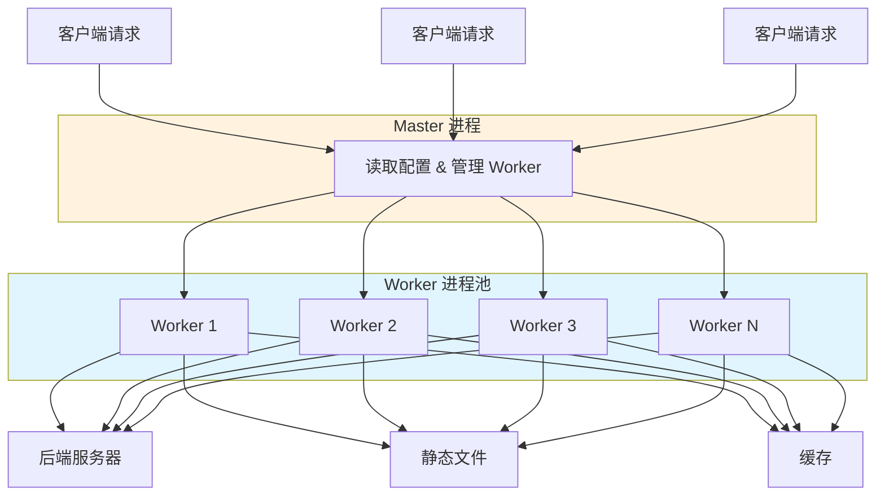
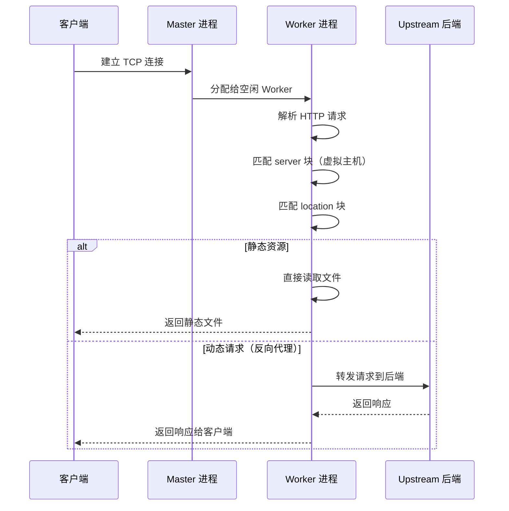
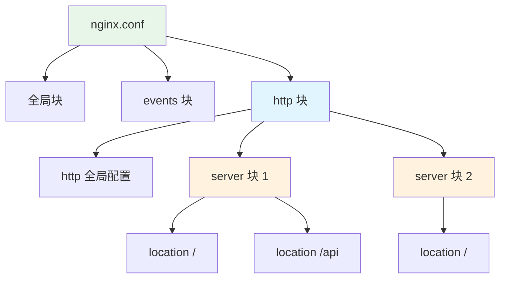
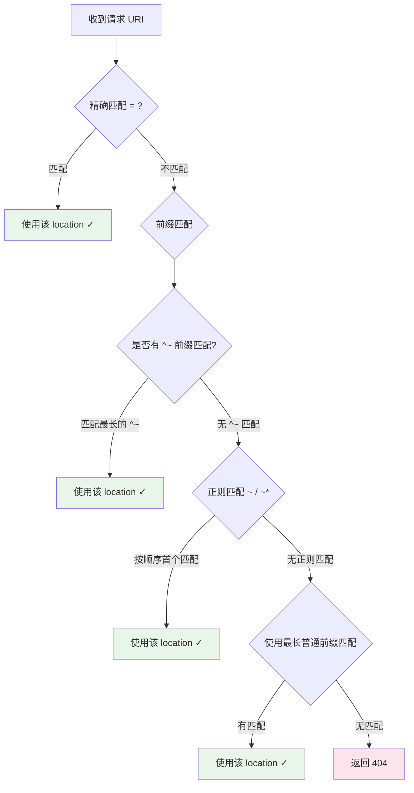
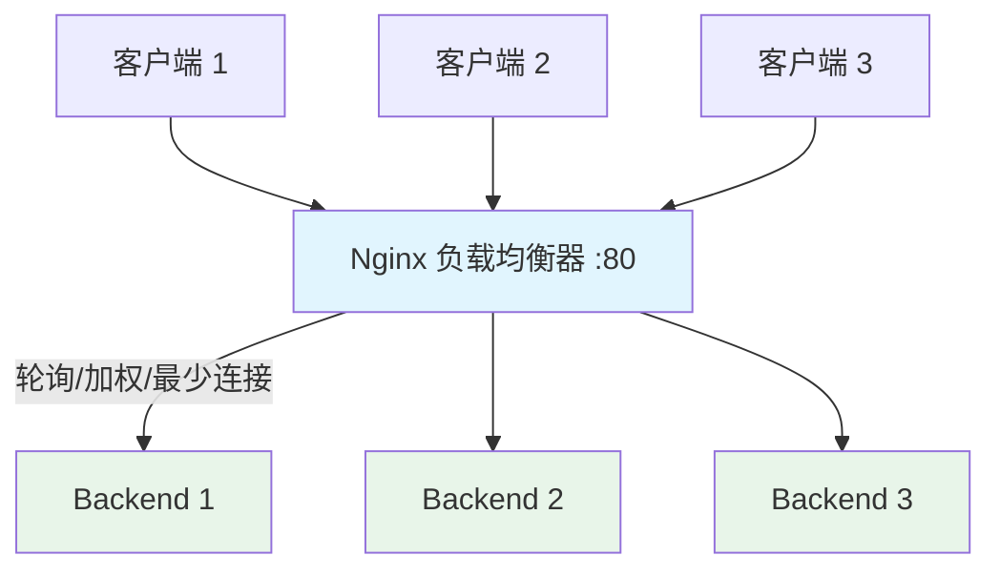
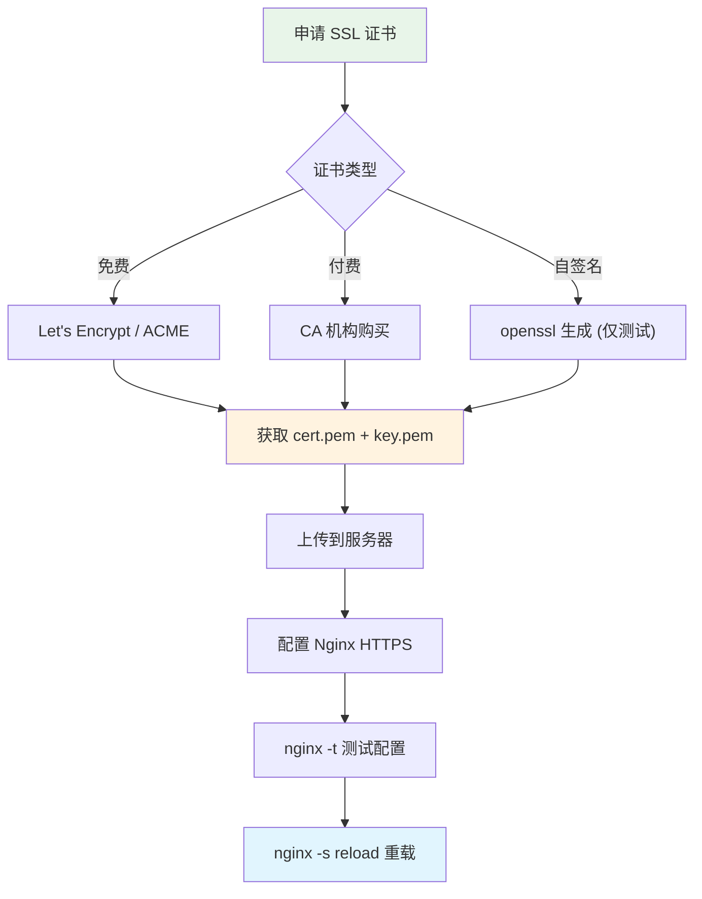
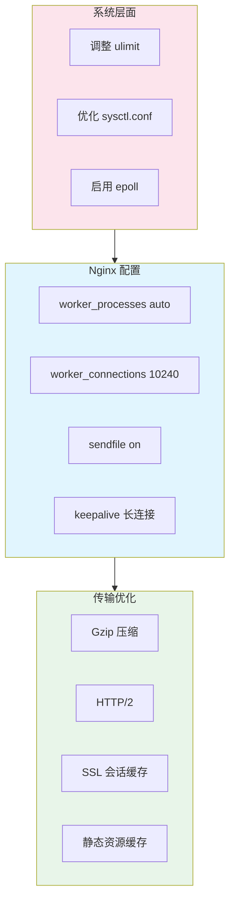

## Nginx 简介

Nginx（发音：engine X）是一个高性能的 HTTP 和反向代理服务器，同时也是 IMAP/POP3/SMTP 代理服务器。它以高并发、低内存占用和稳定性著称，全球超过 30% 的网站使用 Nginx。

### 主要应用场景

| 场景 | 说明 |
|------|------|
| 静态资源服务 | 高效处理 HTML、CSS、JS、图片等静态文件 |
| 反向代理 | 将请求转发到后端应用服务器（Tomcat、Node.js 等） |
| 负载均衡 | 将流量分发到多台后端服务器，提高系统吞吐量和可用性 |
| API 网关 | 路由转发、限流、鉴权等 |
| SSL/TLS 终端 | 统一处理 HTTPS 加密，后端服务无需关心证书 |
| 缓存服务 | 缓存后端响应，减轻服务器压力 |

### Nginx 架构



Nginx 采用 **Master-Worker** 多进程模型：

- **Master 进程**：读取和验证配置、管理 Worker 进程、接收信号（reload/stop）
- **Worker 进程**：处理实际请求，采用**事件驱动**（epoll/kqueue）的非阻塞 I/O 模型
- 每个 Worker 进程可以处理数千个并发连接，无需为每个连接创建线程

### 请求处理流程



## Nginx 安装

### 方式一：包管理器安装（推荐）

#### CentOS / RHEL

```bash
# ===== CentOS 7 =====
# 更新系统
sudo yum update -y

# 安装 EPEL 仓库（提供较新版本的 Nginx）
sudo yum install epel-release -y

# 或者使用 Nginx 官方仓库（推荐，版本更新）
cat > /etc/yum.repos.d/nginx.repo <<EOF
[nginx-stable]
name=nginx stable repo
baseurl=http://nginx.org/packages/centos/\$releasever/\$basearch/
gpgcheck=1
enabled=1
gpgkey=https://nginx.org/keys/nginx_signing.key
module_hotfixes=true
EOF

# 安装 Nginx
sudo yum install nginx -y

# ===== CentOS 8+ / RHEL 8+ =====
sudo dnf install nginx -y

# 启动并设置开机自启
sudo systemctl start nginx
sudo systemctl enable nginx

# 验证状态
sudo systemctl status nginx
nginx -v
```

#### Ubuntu / Debian

```bash
# 更新包索引
sudo apt-get update

# 安装 Nginx
sudo apt-get install nginx -y

# 启动并设置开机自启
sudo systemctl start nginx
sudo systemctl enable nginx

# 验证
sudo systemctl status nginx
nginx -v
```

#### 配置防火墙

```bash
# ===== firewalld（CentOS/RHEL） =====
# 开放 HTTP 端口（80）
sudo firewall-cmd --zone=public --add-port=80/tcp --permanent

# 开放 HTTPS 端口（443）
sudo firewall-cmd --zone=public --add-port=443/tcp --permanent

# 重新加载防火墙规则
sudo firewall-cmd --reload

# 验证
sudo firewall-cmd --list-ports

# ===== ufw（Ubuntu） =====
sudo ufw allow 'Nginx Full'
sudo ufw status
```

### 方式二：源码编译安装

适用于需要自定义模块或特定编译参数的场景。

#### 安装依赖

```bash
# CentOS 7
sudo yum install gcc gcc-c++ pcre-devel zlib-devel openssl-devel wget make -y

# CentOS 8+
sudo dnf install gcc gcc-c++ pcre-devel zlib-devel openssl-devel wget make -y

# Ubuntu
sudo apt-get install build-essential libpcre3 libpcre3-dev zlib1g-dev libssl-dev wget -y
```

#### 下载并编译

```bash
# 进入临时目录
cd /tmp

# 下载最新稳定版源码（请根据实际需要选择版本）
wget http://nginx.org/download/nginx-1.26.2.tar.gz

# 解压
tar -zxvf nginx-1.26.2.tar.gz
cd nginx-1.26.2

# 配置编译参数
sudo ./configure \
  --prefix=/usr/local/nginx \
  --sbin-path=/usr/sbin/nginx \
  --conf-path=/etc/nginx/nginx.conf \
  --error-log-path=/var/log/nginx/error.log \
  --http-log-path=/var/log/nginx/access.log \
  --pid-path=/var/run/nginx.pid \
  --lock-path=/var/run/nginx.lock \
  --with-http_ssl_module \
  --with-http_v2_module \
  --with-http_realip_module \
  --with-http_gzip_static_module \
  --with-http_stub_status_module \
  --with-http_sub_module \
  --with-stream \
  --with-stream_ssl_module \
  --with-pcre

# 编译（-j 参数根据 CPU 核心数调整）
sudo make -j$(nproc)

# 安装
sudo make install
```

> **常用编译模块说明**：
> - `--with-http_ssl_module`：HTTPS 支持
> - `--with-http_v2_module`：HTTP/2 支持
> - `--with-http_realip_module`：获取客户端真实 IP
> - `--with-http_gzip_static_module`：预压缩文件直接返回
> - `--with-http_stub_status_module`：状态监控页面
> - `--with-stream`：TCP/UDP 代理（四层负载均衡）

#### 创建 systemd 服务

```bash
cat > /usr/lib/systemd/system/nginx.service <<EOF
[Unit]
Description=Nginx Web Server
Documentation=http://nginx.org/en/docs/
After=network-online.target remote-fs.target nss-lookup.target
Wants=network-online.target

[Service]
Type=forking
PIDFile=/var/run/nginx.pid
ExecStartPre=/usr/sbin/nginx -t -q
ExecStart=/usr/sbin/nginx
ExecReload=/bin/kill -s HUP \$MAINPID
ExecStop=/bin/kill -s QUIT \$MAINPID
PrivateTmp=true
LimitNOFILE=65535

[Install]
WantedBy=multi-user.target
EOF

# 重新加载服务配置
sudo systemctl daemon-reload

# 启动并设置开机自启
sudo systemctl start nginx
sudo systemctl enable nginx

# 验证
sudo systemctl status nginx
```

### 方式三：Docker 安装

```bash
# 拉取官方镜像
docker pull nginx:1.26-alpine

# 基础启动
docker run -d \
  --name nginx \
  -p 80:80 \
  -p 443:443 \
  nginx:1.26-alpine

# 生产环境启动（挂载配置和数据）
docker run -d \
  --name nginx \
  -p 80:80 \
  -p 443:443 \
  -v /data/nginx/conf/nginx.conf:/etc/nginx/nginx.conf \
  -v /data/nginx/conf.d:/etc/nginx/conf.d \
  -v /data/nginx/html:/usr/share/nginx/html \
  -v /data/nginx/logs:/var/log/nginx \
  -v /data/nginx/ssl:/etc/nginx/ssl \
  --restart=unless-stopped \
  nginx:1.26-alpine
```

### Nginx 常用管理命令

```bash
# 查看版本
nginx -v                          # 简要版本
nginx -V                          # 详细版本（含编译参数）

# 测试配置文件语法
nginx -t
nginx -T                          # 测试并输出完整配置

# 启动/停止/重载
systemctl start nginx             # 启动
systemctl stop nginx              # 停止
systemctl restart nginx           # 重启（会中断连接）
systemctl reload nginx            # 重载配置（平滑重启，不中断连接）

# 直接使用 nginx 命令
nginx                             # 启动
nginx -s stop                     # 快速停止
nginx -s quit                     # 优雅停止（等待请求处理完成）
nginx -s reload                   # 重载配置
nginx -s reopen                   # 重新打开日志文件

# 查看 Nginx 进程
ps -ef | grep nginx
```

## 配置文件详解

### 配置文件结构

Nginx 配置文件采用层级结构，默认位于 `/etc/nginx/nginx.conf`。



### 完整配置示例

```nginx
# ========== 全局块 ==========
# Worker 进程数（通常设为 CPU 核心数，auto 自动检测）
worker_processes auto;

# 错误日志路径和级别
error_log /var/log/nginx/error.log warn;

# PID 文件
pid /var/run/nginx.pid;

# 每个进程最大打开文件数
worker_rlimit_nofile 65535;

# ========== events 块 ==========
events {
    # 每个 Worker 最大连接数
    worker_connections 10240;
    # 事件驱动模型（Linux 推荐 epoll）
    use epoll;
    # 允许一个 Worker 同时接受多个连接
    multi_accept on;
}

# ========== http 块 ==========
http {
    # 引入 MIME 类型映射
    include       /etc/nginx/mime.types;
    default_type  application/octet-stream;

    # 日志格式
    log_format main '$remote_addr - $remote_user [$time_local] "$request" '
                    '$status $body_bytes_sent "$http_referer" '
                    '"$http_user_agent" "$http_x_forwarded_for" '
                    '$request_time $upstream_response_time';

    # 访问日志
    access_log /var/log/nginx/access.log main;

    # ===== 性能优化 =====
    # 开启 sendfile（零拷贝）
    sendfile on;
    # 开启 TCP_NOPUSH（配合 sendfile 使用）
    tcp_nopush on;
    # 开启 TCP_NODELAY
    tcp_nodelay on;
    # Keep-Alive 超时时间
    keepalive_timeout 65;
    # 请求头读取超时
    client_header_timeout 15;
    # 请求体读取超时
    client_body_timeout 15;
    # 响应发送超时
    send_timeout 15;
    # 客户端请求体最大限制
    client_max_body_size 50m;

    # ===== Gzip 压缩 =====
    gzip on;
    gzip_min_length 1k;
    gzip_comp_level 4;
    gzip_types text/plain text/css text/javascript
               application/json application/javascript
               application/xml application/xml+rss
               image/svg+xml;
    gzip_vary on;
    gzip_proxied any;
    gzip_buffers 16 8k;

    # ===== 安全头 =====
    add_header X-Frame-Options "SAMEORIGIN" always;
    add_header X-Content-Type-Options "nosniff" always;
    add_header X-XSS-Protection "1; mode=block" always;

    # 引入其他配置文件
    include /etc/nginx/conf.d/*.conf;
}
```

### Location 匹配规则

Nginx 的 `location` 指令用于匹配请求 URI，匹配规则有优先级顺序。

#### 匹配语法

| 修饰符 | 说明 | 优先级 |
|--------|------|--------|
| `=` | 精确匹配 | 最高（1） |
| `^~` | 前缀匹配，匹配后不再检查正则 | 高（2） |
| `~` | 正则匹配（区分大小写） | 中（3） |
| `~*` | 正则匹配（不区分大小写） | 中（3） |
| `/path` | 普通前缀匹配 | 低（4） |
| `/` | 通用匹配（兜底） | 最低（5） |

#### 匹配流程



#### 匹配示例

```nginx
server {
    listen 80;
    server_name example.com;

    # 优先级 1：精确匹配 /
    location = / {
        # 仅匹配 http://example.com/
        return 200 "exact root match";
    }

    # 优先级 2：前缀匹配，匹配后不检查正则
    location ^~ /static/ {
        # 匹配 /static/css/style.css 等
        root /data/www;
        expires 30d;
    }

    # 优先级 3：正则匹配
    location ~* \.(gif|jpg|jpeg|png|webp|ico)$ {
        # 匹配图片文件（不区分大小写）
        root /data/images;
        expires 7d;
    }

    # 优先级 4：普通前缀匹配
    location /api/ {
        # 匹配 /api/users 等
        proxy_pass http://backend;
    }

    # 优先级 5：兜底匹配
    location / {
        # 匹配所有其他请求
        root /usr/share/nginx/html;
        index index.html;
        try_files $uri $uri/ /index.html;
    }
}
```

## 反向代理

### 基础反向代理


```nginx
server {
    listen 80;
    server_name api.example.com;

    location / {
        # 代理到后端服务
        proxy_pass http://127.0.0.1:8080;

        # 传递客户端真实信息
        proxy_set_header Host $host;
        proxy_set_header X-Real-IP $remote_addr;
        proxy_set_header X-Forwarded-For $proxy_add_x_forwarded_for;
        proxy_set_header X-Forwarded-Proto $scheme;

        # 超时设置
        proxy_connect_timeout 60s;
        proxy_send_timeout 60s;
        proxy_read_timeout 60s;

        # 缓冲区设置
        proxy_buffering on;
        proxy_buffer_size 4k;
        proxy_buffers 8 4k;
    }
}
```

### 多路径代理

```nginx
server {
    listen 80;
    server_name www.example.com;

    # 前端静态资源
    location / {
        root /usr/share/nginx/html;
        index index.html;
        try_files $uri $uri/ /index.html;  # SPA 应用路由
    }

    # 后端 API
    location /api/ {
        proxy_pass http://127.0.0.1:8080/;  # 注意尾部的 /
        proxy_set_header Host $host;
        proxy_set_header X-Real-IP $remote_addr;
        proxy_set_header X-Forwarded-For $proxy_add_x_forwarded_for;
    }

    # WebSocket
    location /ws/ {
        proxy_pass http://127.0.0.1:8080;
        proxy_http_version 1.1;
        proxy_set_header Upgrade $http_upgrade;
        proxy_set_header Connection "upgrade";
        proxy_set_header Host $host;
        proxy_read_timeout 3600s;  # WebSocket 长连接超时
    }

    # 静态资源目录
    location /uploads/ {
        alias /data/uploads/;
        expires 30d;
        add_header Cache-Control "public, immutable";
    }
}
```

> **`proxy_pass` 尾部斜杠的区别**：
> - `proxy_pass http://backend;`：请求 `/api/user` → 转发到 `/api/user`
> - `proxy_pass http://backend/;`：请求 `/api/user` → 转发到 `/user`（去掉匹配的 location 前缀）

## 负载均衡

### 负载均衡架构



### 负载均衡策略

| 策略 | 说明 | 适用场景 |
|------|------|---------|
| 轮询（默认） | 依次分配请求 | 服务器性能相近 |
| 加权轮询 | 按权重分配，权重高的分配更多请求 | 服务器性能差异明显 |
| IP Hash | 根据客户端 IP 分配，同一 IP 固定到同一服务器 | 需要会话保持 |
| Least Connections | 分配给当前连接数最少的服务器 | 请求处理时间差异大 |
| Random | 随机选择 | 大规模集群 |
| Hash | 按自定义变量（如 URI）哈希 | 缓存场景 |

### 配置示例

```nginx
# ===== 加权轮询 =====
upstream backend {
    server 192.168.1.11:8080 weight=5;    # 权重 5（分到更多请求）
    server 192.168.1.12:8080 weight=3;    # 权重 3
    server 192.168.1.13:8080 weight=2;    # 权重 2
    
    # 备用服务器（仅在主服务器都不可用时启用）
    server 192.168.1.14:8080 backup;
    
    # 标记为不可用（临时下线维护）
    # server 192.168.1.15:8080 down;
}

# ===== IP Hash =====
upstream backend_sticky {
    ip_hash;
    server 192.168.1.11:8080;
    server 192.168.1.12:8080;
    server 192.168.1.13:8080;
}

# ===== 最少连接 =====
upstream backend_least {
    least_conn;
    server 192.168.1.11:8080;
    server 192.168.1.12:8080;
    server 192.168.1.13:8080;
}

# ===== 一致性 Hash（按 URI） =====
upstream backend_hash {
    hash $request_uri consistent;
    server 192.168.1.11:8080;
    server 192.168.1.12:8080;
    server 192.168.1.13:8080;
}

# 使用 upstream
server {
    listen 80;
    server_name www.example.com;

    location / {
        proxy_pass http://backend;
        proxy_set_header Host $host;
        proxy_set_header X-Real-IP $remote_addr;
        proxy_set_header X-Forwarded-For $proxy_add_x_forwarded_for;

        # 健康检查（被动）
        proxy_next_upstream error timeout http_500 http_502 http_503;
        proxy_next_upstream_timeout 10s;
        proxy_next_upstream_tries 3;
    }
}
```

### Upstream 参数详解

```nginx
upstream backend {
    server 192.168.1.11:8080 weight=5 max_fails=3 fail_timeout=30s;
    server 192.168.1.12:8080 weight=3 max_fails=3 fail_timeout=30s;
    server 192.168.1.13:8080 backup;
    
    # Keep-Alive 连接池（减少 TCP 握手开销）
    keepalive 32;
    keepalive_timeout 60s;
}
```

| 参数 | 说明 |
|------|------|
| `weight=N` | 权重，默认为 1 |
| `max_fails=N` | 最大失败次数，超过后标记为不可用，默认 1 |
| `fail_timeout=Ns` | 失败超时时间 + 不可用时间，默认 10s |
| `backup` | 备用服务器，仅在主服务器不可用时启用 |
| `down` | 标记为永久不可用 |
| `max_conns=N` | 最大并发连接数限制 |

## HTTPS 配置

### SSL 证书部署流程



### HTTPS 配置示例

```nginx
# HTTP 强制跳转 HTTPS
server {
    listen 80;
    server_name example.com www.example.com;
    
    # 301 永久重定向到 HTTPS
    return 301 https://$host$request_uri;
}

# HTTPS 服务
server {
    listen 443 ssl http2;
    server_name example.com www.example.com;

    # SSL 证书路径
    ssl_certificate     /etc/nginx/ssl/cert.pem;        # 证书（含中间证书链）
    ssl_certificate_key /etc/nginx/ssl/private.key;     # 私钥

    # SSL 协议版本（禁用不安全的 TLSv1 和 TLSv1.1）
    ssl_protocols TLSv1.2 TLSv1.3;

    # 加密套件（推荐配置）
    ssl_ciphers ECDHE-ECDSA-AES128-GCM-SHA256:ECDHE-RSA-AES128-GCM-SHA256:ECDHE-ECDSA-AES256-GCM-SHA384:ECDHE-RSA-AES256-GCM-SHA384;
    ssl_prefer_server_ciphers on;

    # SSL 会话缓存（提高性能）
    ssl_session_cache shared:SSL:10m;
    ssl_session_timeout 10m;
    ssl_session_tickets off;

    # OCSP Stapling（加速证书验证）
    ssl_stapling on;
    ssl_stapling_verify on;
    resolver 8.8.8.8 114.114.114.114 valid=300s;
    resolver_timeout 5s;

    # HSTS（强制浏览器使用 HTTPS，max-age 为 1 年）
    add_header Strict-Transport-Security "max-age=31536000; includeSubDomains" always;

    # 站点配置
    root /usr/share/nginx/html;
    index index.html;

    location / {
        try_files $uri $uri/ /index.html;
    }

    location /api/ {
        proxy_pass http://backend;
        proxy_set_header Host $host;
        proxy_set_header X-Real-IP $remote_addr;
        proxy_set_header X-Forwarded-For $proxy_add_x_forwarded_for;
        proxy_set_header X-Forwarded-Proto $scheme;
    }
}
```

### Let's Encrypt 免费证书（Certbot）

```bash
# 安装 Certbot
# CentOS
sudo yum install certbot python3-certbot-nginx -y

# Ubuntu
sudo apt-get install certbot python3-certbot-nginx -y

# 自动获取证书并配置 Nginx
sudo certbot --nginx -d example.com -d www.example.com

# 测试自动续期
sudo certbot renew --dry-run

# 设置自动续期定时任务（每月检查）
echo "0 0 1 * * root certbot renew --quiet && systemctl reload nginx" >> /etc/crontab
```

## 常见实战配置

### 静态资源服务 + 缓存

```nginx
server {
    listen 80;
    server_name static.example.com;
    root /data/static;

    # 图片缓存 30 天
    location ~* \.(jpg|jpeg|png|gif|webp|ico|svg)$ {
        expires 30d;
        add_header Cache-Control "public, immutable";
        access_log off;
    }

    # CSS/JS 缓存 7 天
    location ~* \.(css|js)$ {
        expires 7d;
        add_header Cache-Control "public";
        access_log off;
    }

    # 字体文件缓存 1 年
    location ~* \.(woff|woff2|ttf|eot)$ {
        expires 1y;
        add_header Cache-Control "public, immutable";
        # 允许跨域加载字体
        add_header Access-Control-Allow-Origin *;
        access_log off;
    }

    # 禁止访问隐藏文件
    location ~ /\. {
        deny all;
        access_log off;
    }
}
```

### SPA 单页应用部署

```nginx
server {
    listen 80;
    server_name app.example.com;
    root /data/www/dist;

    # 入口页面不缓存
    location = /index.html {
        add_header Cache-Control "no-cache, no-store, must-revalidate";
        add_header Pragma "no-cache";
        add_header Expires "0";
    }

    # 静态资源（带 hash 的文件名可长期缓存）
    location /assets/ {
        expires 1y;
        add_header Cache-Control "public, immutable";
    }

    # 所有路由交给 index.html 处理（Vue/React Router history 模式）
    location / {
        try_files $uri $uri/ /index.html;
    }

    # API 代理
    location /api/ {
        proxy_pass http://127.0.0.1:8080/;
        proxy_set_header Host $host;
        proxy_set_header X-Real-IP $remote_addr;
        proxy_set_header X-Forwarded-For $proxy_add_x_forwarded_for;
        proxy_set_header X-Forwarded-Proto $scheme;
    }
}
```

### 限流配置

```nginx
http {
    # 定义限流区域
    # $binary_remote_addr：按客户端 IP 限流
    # zone=api_limit:10m：10MB 共享内存区域，约可存储 16 万个 IP
    # rate=10r/s：每秒 10 个请求
    limit_req_zone $binary_remote_addr zone=api_limit:10m rate=10r/s;
    limit_conn_zone $binary_remote_addr zone=conn_limit:10m;

    server {
        listen 80;
        server_name api.example.com;

        location /api/ {
            # 限制请求速率
            # burst=20：允许 20 个突发请求排队
            # nodelay：不延迟处理突发请求
            limit_req zone=api_limit burst=20 nodelay;
            
            # 限制并发连接数
            limit_conn conn_limit 10;
            
            # 限流时返回 503（默认）
            limit_req_status 503;
            
            proxy_pass http://backend;
        }
    }
}
```

### 跨域（CORS）配置

```nginx
location /api/ {
    # 允许的来源域名
    add_header Access-Control-Allow-Origin $http_origin always;
    add_header Access-Control-Allow-Methods "GET, POST, PUT, DELETE, OPTIONS" always;
    add_header Access-Control-Allow-Headers "Authorization, Content-Type, X-Requested-With" always;
    add_header Access-Control-Allow-Credentials "true" always;
    add_header Access-Control-Max-Age 3600 always;

    # 处理 OPTIONS 预检请求
    if ($request_method = 'OPTIONS') {
        return 204;
    }

    proxy_pass http://backend;
}
```

### 状态监控

```nginx
# 启用 stub_status 模块（需编译时包含 --with-http_stub_status_module）
server {
    listen 8088;
    server_name localhost;

    location /nginx_status {
        stub_status;
        # 仅允许内网访问
        allow 127.0.0.1;
        allow 192.168.0.0/16;
        deny all;
    }
}
```

访问 `http://localhost:8088/nginx_status` 可看到：

```text
Active connections: 291                    # 当前活跃连接数
server accepts handled requests
 16630948 16630948 31070465               # 总连接数 / 总处理数 / 总请求数
Reading: 6 Writing: 179 Waiting: 106      # 读取/写入/等待连接数
```

## 性能优化

### 优化建议总览



### 系统参数优化

```bash
# /etc/security/limits.conf —— 提高文件描述符限制
* soft nofile 65535
* hard nofile 65535

# /etc/sysctl.conf —— 内核网络参数优化
# 最大连接数
net.core.somaxconn = 65535
# TCP 接收/发送缓冲区
net.core.rmem_max = 16777216
net.core.wmem_max = 16777216
# 开启 SYN Cookies（防御 SYN Flood）
net.ipv4.tcp_syncookies = 1
# TIME_WAIT 优化
net.ipv4.tcp_tw_reuse = 1
net.ipv4.tcp_fin_timeout = 15
# TCP Keep-Alive
net.ipv4.tcp_keepalive_time = 600
net.ipv4.tcp_keepalive_probes = 3
net.ipv4.tcp_keepalive_intvl = 15

# 应用内核参数
sysctl -p
```

### Nginx 配置优化要点

| 配置项 | 推荐值 | 说明 |
|--------|--------|------|
| `worker_processes` | `auto` | 自动匹配 CPU 核心数 |
| `worker_connections` | `10240` | 每个 Worker 最大连接数 |
| `sendfile` | `on` | 零拷贝传输文件 |
| `tcp_nopush` | `on` | 减少网络包数量 |
| `tcp_nodelay` | `on` | 禁用 Nagle 算法，减少延迟 |
| `keepalive_timeout` | `65` | 长连接超时时间 |
| `gzip` | `on` | 启用 Gzip 压缩 |
| `gzip_comp_level` | `4` | 压缩级别（1-9，建议 4-6） |
| `open_file_cache` | `max=10000 inactive=20s` | 文件描述符缓存 |

## 日志管理

### 日志格式自定义

```nginx
# JSON 格式日志（便于 ELK 采集分析）
log_format json_log escape=json
    '{'
        '"time": "$time_iso8601",'
        '"remote_addr": "$remote_addr",'
        '"request_method": "$request_method",'
        '"request_uri": "$request_uri",'
        '"status": $status,'
        '"body_bytes_sent": $body_bytes_sent,'
        '"request_time": $request_time,'
        '"upstream_response_time": "$upstream_response_time",'
        '"http_referer": "$http_referer",'
        '"http_user_agent": "$http_user_agent",'
        '"http_x_forwarded_for": "$http_x_forwarded_for"'
    '}';

access_log /var/log/nginx/access.json json_log;
```

### 日志切割（logrotate）

```bash
# /etc/logrotate.d/nginx
/var/log/nginx/*.log {
    daily              # 按天切割
    missingok          # 日志不存在不报错
    rotate 30          # 保留 30 天
    compress           # 旧日志 gzip 压缩
    delaycompress      # 延迟压缩（保留最近一个不压缩）
    notifempty         # 空文件不切割
    create 0644 nginx nginx
    sharedscripts
    postrotate
        # 切割后通知 Nginx 重新打开日志文件
        [ -f /var/run/nginx.pid ] && kill -USR1 $(cat /var/run/nginx.pid)
    endscript
}
```

## 常见问题排查

| 问题 | 排查方式 | 解决方案 |
|------|---------|---------|
| 502 Bad Gateway | 检查后端服务是否存活 | 启动后端服务 / 检查 `proxy_pass` 地址 |
| 504 Gateway Timeout | 检查后端响应时间 | 增大 `proxy_read_timeout` |
| 403 Forbidden | 检查文件权限和 SELinux | `chmod` / `setenforce 0` |
| 413 Request Entity Too Large | 请求体超过限制 | 增大 `client_max_body_size` |
| Connection Refused | Nginx 未启动或端口未监听 | 检查 `listen` 配置 / 防火墙 |
| 配置修改不生效 | 未重新加载配置 | `nginx -t && nginx -s reload` |
| upstream timed out | 后端响应超时 | 优化后端性能 / 调整超时配置 |
| too many open files | 文件描述符耗尽 | 增大 `worker_rlimit_nofile` 和系统 ulimit |

### 排查命令

```bash
# 检查 Nginx 错误日志
tail -f /var/log/nginx/error.log

# 检查配置语法
nginx -t

# 查看 Nginx 进程和连接数
ps -ef | grep nginx
ss -tlnp | grep nginx

# 查看连接状态统计
ss -s

# 实时查看访问日志
tail -f /var/log/nginx/access.log

# 按 HTTP 状态码统计
awk '{print $9}' /var/log/nginx/access.log | sort | uniq -c | sort -rn

# 查看并发连接数最多的 IP
awk '{print $1}' /var/log/nginx/access.log | sort | uniq -c | sort -rn | head -20
```
