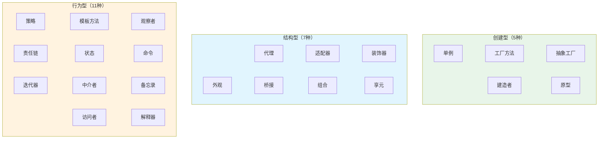
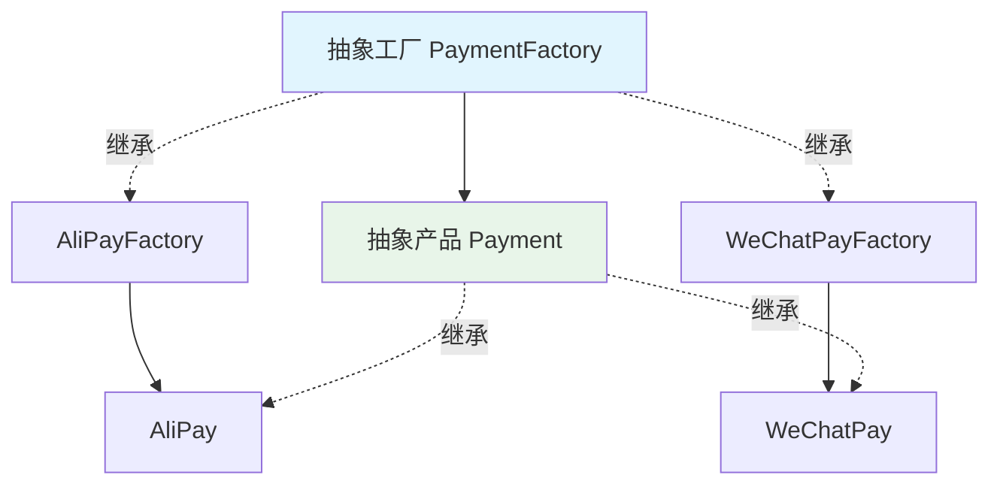
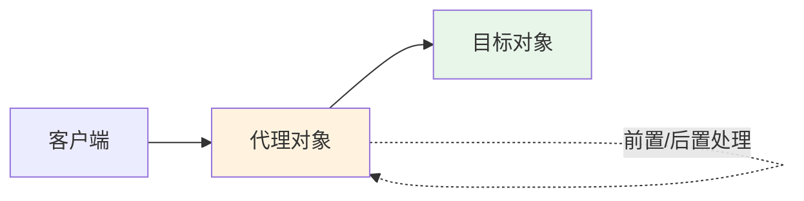

## 设计模式概述

设计模式是软件开发中**反复出现的问题的经典解决方案**，由 GoF（Gang of Four）在《Design Patterns》一书中系统总结为 23 种模式。

### 六大设计原则（SOLID + 迪米特）

| 原则 | 说明 | 一句话 |
|------|------|--------|
| **S** - 单一职责 | 一个类只负责一个功能领域 | 一个类只有一个变化的原因 |
| **O** - 开闭原则 | 对扩展开放，对修改关闭 | 新增功能不改老代码 |
| **L** - 里氏替换 | 子类可以替换父类且行为不变 | 子类不要破坏父类契约 |
| **I** - 接口隔离 | 接口应该小而专，不强迫实现不需要的方法 | 多个专用接口优于一个大接口 |
| **D** - 依赖倒置 | 依赖抽象而非具体实现 | 面向接口编程 |
| **迪米特法则** | 只与直接朋友通信，不和陌生人说话 | 最少知识原则 |

### 三大分类



---

## 创建型模式

### 1. 单例模式（Singleton）

确保一个类只有一个实例，并提供全局访问点。

#### 推荐实现：枚举单例

```java
public enum Singleton {
    INSTANCE;

    private final Map<String, Object> cache = new ConcurrentHashMap<>();

    public void put(String key, Object value) { cache.put(key, value); }
    public Object get(String key) { return cache.get(key); }
}

// 使用
Singleton.INSTANCE.put("key", "value");
```

> 枚举单例天然防止反射攻击和反序列化破坏，是 Effective Java 推荐的写法。

#### 双重检查锁（DCL）

```java
public class Singleton {
    private static volatile Singleton instance;
    private Singleton() {}

    public static Singleton getInstance() {
        if (instance == null) {
            synchronized (Singleton.class) {
                if (instance == null) {
                    instance = new Singleton();
                }
            }
        }
        return instance;
    }
}
```

#### 静态内部类（懒加载 + 线程安全）

```java
public class Singleton {
    private Singleton() {}

    private static class Holder {
        private static final Singleton INSTANCE = new Singleton();
    }

    public static Singleton getInstance() {
        return Holder.INSTANCE;
    }
}
```

**Spring 中的应用**：Spring Bean 默认是单例（`@Scope("singleton")`），由 IoC 容器管理。

---

### 2. 工厂方法模式（Factory Method）

定义创建对象的接口，让子类决定实例化哪个类。



```java
// 产品接口
public interface Payment {
    void pay(BigDecimal amount);
}

public class AliPay implements Payment {
    @Override
    public void pay(BigDecimal amount) {
        System.out.println("支付宝支付: " + amount);
    }
}

public class WeChatPay implements Payment {
    @Override
    public void pay(BigDecimal amount) {
        System.out.println("微信支付: " + amount);
    }
}

// 简单工厂（静态工厂方法，最常用）
public class PaymentFactory {
    public static Payment create(String type) {
        return switch (type) {
            case "alipay" -> new AliPay();
            case "wechat" -> new WeChatPay();
            default -> throw new IllegalArgumentException("不支持的支付方式: " + type);
        };
    }
}
```

**Spring 中的应用**：`BeanFactory` 是典型工厂模式；`FactoryBean<T>` 允许自定义 Bean 创建逻辑。

---

### 3. 抽象工厂模式（Abstract Factory）

创建一系列相关对象的工厂，无需指定具体类。

```java
// 抽象工厂：创建一整套 UI 组件
public interface UIFactory {
    Button createButton();
    Input createInput();
    Dialog createDialog();
}

// 具体工厂：Material 风格
public class MaterialUIFactory implements UIFactory {
    public Button createButton() { return new MaterialButton(); }
    public Input createInput() { return new MaterialInput(); }
    public Dialog createDialog() { return new MaterialDialog(); }
}

// 具体工厂：iOS 风格
public class IOSUIFactory implements UIFactory {
    public Button createButton() { return new IOSButton(); }
    public Input createInput() { return new IOSInput(); }
    public Dialog createDialog() { return new IOSDialog(); }
}

// 客户端代码只依赖抽象工厂
public class Application {
    private final UIFactory uiFactory;
    public Application(UIFactory uiFactory) { this.uiFactory = uiFactory; }

    public void render() {
        Button btn = uiFactory.createButton();
        Input input = uiFactory.createInput();
        btn.render();
        input.render();
    }
}
```

> **工厂方法** vs **抽象工厂**：工厂方法创建单一产品，抽象工厂创建一族相关产品。

---

### 4. 建造者模式（Builder）

分步骤构建复杂对象，同样的构建过程可以创建不同的表示。

```java
public class HttpRequest {
    private final String method;
    private final String url;
    private final Map<String, String> headers;
    private final String body;
    private final int timeout;

    private HttpRequest(Builder builder) {
        this.method = builder.method;
        this.url = builder.url;
        this.headers = builder.headers;
        this.body = builder.body;
        this.timeout = builder.timeout;
    }

    public static class Builder {
        // 必选参数
        private final String method;
        private final String url;
        // 可选参数（带默认值）
        private Map<String, String> headers = new HashMap<>();
        private String body;
        private int timeout = 30000;

        public Builder(String method, String url) {
            this.method = method;
            this.url = url;
        }

        public Builder header(String key, String value) {
            this.headers.put(key, value);
            return this;
        }

        public Builder body(String body) {
            this.body = body;
            return this;
        }

        public Builder timeout(int timeout) {
            this.timeout = timeout;
            return this;
        }

        public HttpRequest build() {
            // 可在此做参数校验
            return new HttpRequest(this);
        }
    }
}

// 链式调用
HttpRequest request = new HttpRequest.Builder("POST", "https://api.example.com/users")
    .header("Content-Type", "application/json")
    .header("Authorization", "Bearer token")
    .body("{\"name\":\"Alice\"}")
    .timeout(5000)
    .build();
```

**Spring/Java 中的应用**：`StringBuilder`、`Stream.Builder`、Lombok `@Builder`、Spring `WebClient.builder()`。

---

### 5. 原型模式（Prototype）

通过复制现有对象来创建新对象，避免重复初始化的开销。

```java
public class ReportTemplate implements Cloneable {
    private String title;
    private String format;
    private List<String> sections;  // 引用类型需要深拷贝

    @Override
    public ReportTemplate clone() {
        try {
            ReportTemplate copy = (ReportTemplate) super.clone();
            copy.sections = new ArrayList<>(this.sections);  // 深拷贝
            return copy;
        } catch (CloneNotSupportedException e) {
            throw new RuntimeException(e);
        }
    }
}

// 使用
ReportTemplate template = new ReportTemplate("月报", "PDF", List.of("概述", "数据"));
ReportTemplate copy = template.clone();
copy.setTitle("周报");  // 修改副本不影响原型
```

**Spring 中的应用**：`@Scope("prototype")` 每次注入创建新实例。

---

## 结构型模式

### 6. 代理模式（Proxy）

为对象提供一个替身，控制对目标对象的访问。



#### 静态代理

```java
public interface UserService {
    User getById(Long id);
}

public class UserServiceImpl implements UserService {
    public User getById(Long id) {
        return userDao.findById(id);
    }
}

// 静态代理：编译时确定
public class UserServiceProxy implements UserService {
    private final UserService target;

    public UserServiceProxy(UserService target) { this.target = target; }

    public User getById(Long id) {
        log.info("查询用户: id={}", id);      // 前置
        User user = target.getById(id);       // 委托
        log.info("查询结果: {}", user);        // 后置
        return user;
    }
}
```

#### JDK 动态代理

```java
// 基于接口（要求目标类实现接口）
UserService proxy = (UserService) Proxy.newProxyInstance(
    UserService.class.getClassLoader(),
    new Class[]{UserService.class},
    (proxyObj, method, args) -> {
        log.info("Before: {}", method.getName());
        Object result = method.invoke(target, args);
        log.info("After: {}", method.getName());
        return result;
    }
);
```

#### CGLIB 动态代理

```java
// 基于继承（无需接口，Spring AOP 默认方式）
Enhancer enhancer = new Enhancer();
enhancer.setSuperclass(UserServiceImpl.class);
enhancer.setCallback((MethodInterceptor) (obj, method, args, methodProxy) -> {
    log.info("Before: {}", method.getName());
    Object result = methodProxy.invokeSuper(obj, args);
    log.info("After: {}", method.getName());
    return result;
});
UserServiceImpl proxy = (UserServiceImpl) enhancer.create();
```

**Spring 中的应用**：AOP（`@Transactional`、`@Cacheable`、`@Async`）、MyBatis Mapper 接口。

---

### 7. 适配器模式（Adapter）

将一个类的接口转换为客户端期望的另一个接口。

```java
// 目标接口：统一的消息发送接口
public interface MessageSender {
    void send(String to, String content);
}

// 已有的第三方 SDK（接口不兼容）
public class AliyunSmsClient {
    public void sendSms(String phoneNumber, String templateCode, Map<String, String> params) {
        // 阿里云 SMS SDK 调用
    }
}

public class TencentEmailClient {
    public boolean sendEmail(String recipient, String subject, String body) {
        // 腾讯云邮件 SDK 调用
        return true;
    }
}

// 适配器：将第三方 SDK 适配为统一接口
public class AliyunSmsAdapter implements MessageSender {
    private final AliyunSmsClient client = new AliyunSmsClient();

    @Override
    public void send(String to, String content) {
        client.sendSms(to, "SMS_001", Map.of("content", content));
    }
}

public class TencentEmailAdapter implements MessageSender {
    private final TencentEmailClient client = new TencentEmailClient();

    @Override
    public void send(String to, String content) {
        client.sendEmail(to, "通知", content);
    }
}
```

**Spring 中的应用**：`HandlerAdapter`（DispatcherServlet 适配不同类型的 Controller）。

---

### 8. 装饰器模式（Decorator）

动态地给对象添加额外职责，比继承更灵活。

```java
// 基础接口
public interface DataSource {
    void writeData(String data);
    String readData();
}

// 基础实现
public class FileDataSource implements DataSource {
    private final String filename;
    public FileDataSource(String filename) { this.filename = filename; }

    public void writeData(String data) { /* 写文件 */ }
    public String readData() { return /* 读文件 */; }
}

// 装饰器基类
public abstract class DataSourceDecorator implements DataSource {
    protected final DataSource wrapped;
    public DataSourceDecorator(DataSource source) { this.wrapped = source; }

    public void writeData(String data) { wrapped.writeData(data); }
    public String readData() { return wrapped.readData(); }
}

// 具体装饰器：加密
public class EncryptionDecorator extends DataSourceDecorator {
    public EncryptionDecorator(DataSource source) { super(source); }

    @Override
    public void writeData(String data) {
        super.writeData(encrypt(data));  // 加密后再写
    }
    @Override
    public String readData() {
        return decrypt(super.readData());  // 读出后解密
    }
    private String encrypt(String data) { return Base64.encode(data); }
    private String decrypt(String data) { return Base64.decode(data); }
}

// 具体装饰器：压缩
public class CompressionDecorator extends DataSourceDecorator {
    public CompressionDecorator(DataSource source) { super(source); }

    @Override
    public void writeData(String data) {
        super.writeData(compress(data));
    }
    @Override
    public String readData() {
        return decompress(super.readData());
    }
}

// 自由组合装饰（先压缩再加密）
DataSource source = new EncryptionDecorator(
    new CompressionDecorator(
        new FileDataSource("data.txt")
    )
);
source.writeData("Hello World");
```

**Java/Spring 中的应用**：`InputStream` 体系（`BufferedInputStream`、`GZIPInputStream`）、`HttpServletRequestWrapper`。

---

### 9. 外观模式（Facade）

为复杂子系统提供一个简单的统一接口。

```java
// 子系统：库存、支付、物流
public class InventoryService { public boolean deduct(String sku, int qty) { /*...*/ } }
public class PaymentService { public boolean charge(String userId, BigDecimal amount) { /*...*/ } }
public class ShippingService { public String createShipment(String orderId, String address) { /*...*/ } }

// 外观：统一订单处理入口
@Service
@RequiredArgsConstructor
public class OrderFacade {
    private final InventoryService inventoryService;
    private final PaymentService paymentService;
    private final ShippingService shippingService;

    /** 一键下单：封装复杂流程 */
    public OrderResult placeOrder(OrderRequest request) {
        // 1. 扣减库存
        if (!inventoryService.deduct(request.getSku(), request.getQty())) {
            throw new RuntimeException("库存不足");
        }
        // 2. 扣款
        if (!paymentService.charge(request.getUserId(), request.getAmount())) {
            inventoryService.rollback(request.getSku(), request.getQty());
            throw new RuntimeException("支付失败");
        }
        // 3. 创建物流
        String trackingNo = shippingService.createShipment(request.getOrderId(), request.getAddress());
        return new OrderResult(request.getOrderId(), trackingNo);
    }
}
```

**Spring 中的应用**：`JdbcTemplate`（封装 JDBC 繁琐操作）、`RestTemplate`（封装 HTTP 调用）。

---

### 10. 桥接模式（Bridge）

将抽象部分与实现部分分离，使它们可以独立变化。

```java
// 实现层：消息发送渠道
public interface MessageChannel {
    void deliver(String to, String content);
}

public class SmsChannel implements MessageChannel {
    public void deliver(String to, String content) { /* 短信发送 */ }
}

public class EmailChannel implements MessageChannel {
    public void deliver(String to, String content) { /* 邮件发送 */ }
}

public class PushChannel implements MessageChannel {
    public void deliver(String to, String content) { /* APP 推送 */ }
}

// 抽象层：消息类型
public abstract class Notification {
    protected MessageChannel channel;  // 桥接

    public Notification(MessageChannel channel) { this.channel = channel; }

    public abstract void notify(String to, String message);
}

public class UrgentNotification extends Notification {
    public UrgentNotification(MessageChannel channel) { super(channel); }

    @Override
    public void notify(String to, String message) {
        channel.deliver(to, "【紧急】" + message);
        channel.deliver(to, "【紧急重发】" + message);  // 紧急消息发两次
    }
}

public class NormalNotification extends Notification {
    public NormalNotification(MessageChannel channel) { super(channel); }

    @Override
    public void notify(String to, String message) {
        channel.deliver(to, message);
    }
}

// 消息类型和发送渠道自由组合
Notification urgentSms = new UrgentNotification(new SmsChannel());
Notification normalEmail = new NormalNotification(new EmailChannel());
```

---

### 11. 组合模式（Composite）

将对象组合成树形结构，使单个对象和组合对象的使用具有一致性。

```java
// 统一接口：菜单组件
public interface MenuComponent {
    String getName();
    BigDecimal getPrice();
    void print(int indent);
}

// 叶子节点：菜品
public class MenuItem implements MenuComponent {
    private final String name;
    private final BigDecimal price;
    // constructor, getName, getPrice...

    public void print(int indent) {
        System.out.println(" ".repeat(indent) + name + " ￥" + price);
    }
}

// 组合节点：菜单（可包含菜品和子菜单）
public class Menu implements MenuComponent {
    private final String name;
    private final List<MenuComponent> children = new ArrayList<>();

    public void add(MenuComponent component) { children.add(component); }

    public String getName() { return name; }
    public BigDecimal getPrice() {
        return children.stream().map(MenuComponent::getPrice).reduce(BigDecimal.ZERO, BigDecimal::add);
    }

    public void print(int indent) {
        System.out.println(" ".repeat(indent) + "【" + name + "】");
        children.forEach(c -> c.print(indent + 2));
    }
}
```

**应用场景**：文件系统（文件/目录）、组织架构（员工/部门）、UI 组件树。

---

### 12. 享元模式（Flyweight）

共享细粒度对象，减少内存占用。

```java
// 享元对象（不可变，可共享）
public class ChessPiece {
    private final String color;  // 内部状态（共享）
    private final String shape;

    public ChessPiece(String color, String shape) {
        this.color = color;
        this.shape = shape;
    }

    // 外部状态（不共享）由调用方传入
    public void place(int x, int y) {
        System.out.printf("%s%s 放置在 (%d, %d)%n", color, shape, x, y);
    }
}

// 享元工厂
public class ChessPieceFactory {
    private static final Map<String, ChessPiece> cache = new HashMap<>();

    public static ChessPiece get(String color, String shape) {
        String key = color + "_" + shape;
        return cache.computeIfAbsent(key, k -> new ChessPiece(color, shape));
    }
}
```

**Java 中的应用**：`Integer.valueOf()` 缓存 -128~127、`String.intern()` 字符串池。

---

## 行为型模式

### 13. 策略模式（Strategy）

定义一组算法，将每个算法封装起来，使它们可以互相替换。

```java
// 策略接口
public interface DiscountStrategy {
    BigDecimal calculate(BigDecimal originalPrice);
}

// 具体策略
@Component("normalDiscount")
public class NormalDiscount implements DiscountStrategy {
    public BigDecimal calculate(BigDecimal price) { return price; }
}

@Component("vipDiscount")
public class VipDiscount implements DiscountStrategy {
    public BigDecimal calculate(BigDecimal price) {
        return price.multiply(new BigDecimal("0.8"));
    }
}

@Component("promotionDiscount")
public class PromotionDiscount implements DiscountStrategy {
    public BigDecimal calculate(BigDecimal price) {
        return price.subtract(new BigDecimal("50")).max(BigDecimal.ZERO);
    }
}

// Spring 自动注入所有策略，根据 key 选择
@Service
public class PriceService {
    private final Map<String, DiscountStrategy> strategyMap;

    // Spring 自动将所有 DiscountStrategy 实现注入为 Map<beanName, bean>
    public PriceService(Map<String, DiscountStrategy> strategyMap) {
        this.strategyMap = strategyMap;
    }

    public BigDecimal calcPrice(String userType, BigDecimal originalPrice) {
        DiscountStrategy strategy = strategyMap.getOrDefault(
            userType + "Discount", strategyMap.get("normalDiscount"));
        return strategy.calculate(originalPrice);
    }
}
```

> **策略 + Spring Map 注入** 是消除 `if-else` / `switch` 的最佳实践。

---

### 14. 模板方法模式（Template Method）

在父类定义算法骨架，将某些步骤延迟到子类实现。

```java
public abstract class AbstractExportService {

    // 模板方法（final 防止子类覆盖流程）
    public final void export(ExportRequest request) {
        validate(request);
        List<Map<String, Object>> data = queryData(request);
        byte[] file = generateFile(data);
        upload(request.getFileName(), file);
        notify(request.getUserId());
    }

    // 公共步骤
    private void validate(ExportRequest request) {
        if (request.getFileName() == null) throw new IllegalArgumentException("文件名不能为空");
    }

    private void upload(String fileName, byte[] file) { /* MinIO 上传 */ }

    private void notify(String userId) { /* 发送完成通知 */ }

    // 抽象步骤：子类实现
    protected abstract List<Map<String, Object>> queryData(ExportRequest request);
    protected abstract byte[] generateFile(List<Map<String, Object>> data);
}

// 具体实现：Excel 导出
@Service
public class ExcelExportService extends AbstractExportService {
    @Override
    protected List<Map<String, Object>> queryData(ExportRequest request) {
        return orderMapper.selectByCondition(request.getCondition());
    }

    @Override
    protected byte[] generateFile(List<Map<String, Object>> data) {
        // EasyExcel 生成 Excel 字节数组
        return EasyExcelUtil.write(data);
    }
}

// 具体实现：CSV 导出
@Service
public class CsvExportService extends AbstractExportService {
    @Override
    protected List<Map<String, Object>> queryData(ExportRequest request) { /*...*/ }
    @Override
    protected byte[] generateFile(List<Map<String, Object>> data) { /* CSV 生成 */ }
}
```

**Spring 中的应用**：`JdbcTemplate`、`AbstractApplicationContext.refresh()`、`HttpServlet.service()`。

---

### 15. 观察者模式（Observer）

定义对象间一对多的依赖关系，当一个对象状态改变时，所有依赖者自动收到通知。

```java
// 使用 Spring 事件机制（推荐）

// 1. 定义事件
public class OrderCreatedEvent extends ApplicationEvent {
    private final Order order;
    public OrderCreatedEvent(Object source, Order order) {
        super(source);
        this.order = order;
    }
    public Order getOrder() { return order; }
}

// 2. 发布事件
@Service
@RequiredArgsConstructor
public class OrderService {
    private final ApplicationEventPublisher eventPublisher;

    public Order createOrder(OrderRequest request) {
        Order order = orderRepository.save(buildOrder(request));
        // 发布事件（解耦后续操作）
        eventPublisher.publishEvent(new OrderCreatedEvent(this, order));
        return order;
    }
}

// 3. 监听事件（多个监听器互不干扰）
@Component
public class InventoryListener {
    @EventListener
    public void onOrderCreated(OrderCreatedEvent event) {
        inventoryService.deduct(event.getOrder().getSku(), event.getOrder().getQty());
    }
}

@Component
public class NotificationListener {
    @Async  // 异步处理，不阻塞主流程
    @EventListener
    public void onOrderCreated(OrderCreatedEvent event) {
        smsService.send(event.getOrder().getUserPhone(), "下单成功");
    }
}

@Component
public class PointsListener {
    @EventListener
    public void onOrderCreated(OrderCreatedEvent event) {
        pointsService.addPoints(event.getOrder().getUserId(), 10);
    }
}
```

> 新增监听器无需修改 `OrderService`，完美遵循开闭原则。

---

### 16. 责任链模式（Chain of Responsibility）

将请求沿着处理链传递，每个节点决定处理或转发。

```java
// 抽象处理器
public abstract class ApprovalHandler {
    protected ApprovalHandler next;

    public ApprovalHandler setNext(ApprovalHandler next) {
        this.next = next;
        return next;  // 支持链式设置
    }

    public abstract void handle(LeaveRequest request);
}

// 具体处理器
public class TeamLeaderHandler extends ApprovalHandler {
    @Override
    public void handle(LeaveRequest request) {
        if (request.getDays() <= 1) {
            System.out.println("组长审批通过: " + request.getDays() + "天");
        } else if (next != null) {
            next.handle(request);
        }
    }
}

public class ManagerHandler extends ApprovalHandler {
    @Override
    public void handle(LeaveRequest request) {
        if (request.getDays() <= 3) {
            System.out.println("经理审批通过: " + request.getDays() + "天");
        } else if (next != null) {
            next.handle(request);
        }
    }
}

public class DirectorHandler extends ApprovalHandler {
    @Override
    public void handle(LeaveRequest request) {
        if (request.getDays() <= 7) {
            System.out.println("总监审批通过: " + request.getDays() + "天");
        } else {
            System.out.println("请假超过7天，需 HR 特批");
        }
    }
}

// 构建链
ApprovalHandler chain = new TeamLeaderHandler();
chain.setNext(new ManagerHandler()).setNext(new DirectorHandler());
chain.handle(new LeaveRequest("张三", 5));  // → 总监审批通过
```

**Spring 中的应用**：`Filter` 链、`HandlerInterceptor` 链、Spring Security 过滤器链。

---

### 17. 状态模式（State）

允许对象在内部状态改变时改变其行为（看起来像修改了对象的类）。

```java
// 状态接口
public interface OrderState {
    void pay(OrderContext context);
    void ship(OrderContext context);
    void receive(OrderContext context);
    String getName();
}

// 具体状态
public class PendingPaymentState implements OrderState {
    public void pay(OrderContext ctx) {
        System.out.println("支付成功");
        ctx.setState(new PaidState());
    }
    public void ship(OrderContext ctx) { System.out.println("未支付，不能发货"); }
    public void receive(OrderContext ctx) { System.out.println("未支付，不能收货"); }
    public String getName() { return "待支付"; }
}

public class PaidState implements OrderState {
    public void pay(OrderContext ctx) { System.out.println("已支付，请勿重复支付"); }
    public void ship(OrderContext ctx) {
        System.out.println("已发货");
        ctx.setState(new ShippedState());
    }
    public void receive(OrderContext ctx) { System.out.println("未发货，不能收货"); }
    public String getName() { return "已支付"; }
}

public class ShippedState implements OrderState {
    public void pay(OrderContext ctx) { System.out.println("已支付"); }
    public void ship(OrderContext ctx) { System.out.println("已发货"); }
    public void receive(OrderContext ctx) {
        System.out.println("收货成功，订单完成");
        ctx.setState(new CompletedState());
    }
    public String getName() { return "已发货"; }
}

// 上下文
public class OrderContext {
    private OrderState state;
    public OrderContext() { this.state = new PendingPaymentState(); }

    public void setState(OrderState state) { this.state = state; }
    public void pay() { state.pay(this); }
    public void ship() { state.ship(this); }
    public void receive() { state.receive(this); }
}
```

> 状态模式消除了复杂的状态条件判断（大量 `if (status == "PAID")` 的代码）。

---

### 18. 命令模式（Command）

将请求封装为对象，支持撤销、队列化和日志记录。

```java
// 命令接口
public interface Command {
    void execute();
    void undo();
}

// 具体命令
public class TransferCommand implements Command {
    private final BankService bankService;
    private final String from, to;
    private final BigDecimal amount;

    public TransferCommand(BankService bankService, String from, String to, BigDecimal amount) {
        this.bankService = bankService;
        this.from = from;
        this.to = to;
        this.amount = amount;
    }

    @Override
    public void execute() {
        bankService.transfer(from, to, amount);
    }

    @Override
    public void undo() {
        bankService.transfer(to, from, amount);  // 反向转账
    }
}

// 调用者（支持撤销）
public class CommandInvoker {
    private final Deque<Command> history = new ArrayDeque<>();

    public void execute(Command command) {
        command.execute();
        history.push(command);
    }

    public void undo() {
        if (!history.isEmpty()) {
            history.pop().undo();
        }
    }
}
```

---

### 19. 迭代器模式（Iterator）

提供一种方法顺序访问聚合对象中的各个元素，而不暴露其内部结构。

```java
// Java 内置 Iterator，实际开发中直接使用即可
List<String> list = List.of("A", "B", "C");
Iterator<String> it = list.iterator();
while (it.hasNext()) {
    System.out.println(it.next());
}

// 增强 for 循环本质就是迭代器
for (String s : list) {
    System.out.println(s);
}
```

**Java 中的应用**：所有 `Collection`、`Stream`、`ResultSet`。

---

### 20. 中介者模式（Mediator）

用一个中介对象封装一系列对象的交互，使各对象不需要显式互相引用。

```java
// Spring 中的典型中介者：ApplicationContext（各 Bean 通过容器交互而非直接引用）
// MVC 中的 DispatcherServlet 也是中介者（协调 Controller、ViewResolver、HandlerMapping）
```

---

### 21. 备忘录模式（Memento）

捕获对象的内部状态，以便后续恢复。

```java
// 备忘录
public record EditorMemento(String content, int cursorPosition) {}

// 发起人
public class TextEditor {
    private String content = "";
    private int cursorPosition = 0;

    public void type(String text) {
        content += text;
        cursorPosition = content.length();
    }

    public EditorMemento save() {
        return new EditorMemento(content, cursorPosition);
    }

    public void restore(EditorMemento memento) {
        this.content = memento.content();
        this.cursorPosition = memento.cursorPosition();
    }
}

// 管理者（撤销栈）
public class History {
    private final Deque<EditorMemento> stack = new ArrayDeque<>();
    public void push(EditorMemento memento) { stack.push(memento); }
    public EditorMemento pop() { return stack.pop(); }
}
```

---

### 22. 访问者模式（Visitor）

在不修改元素类的前提下，定义新的操作。

```java
// 元素
public interface FileNode {
    void accept(FileVisitor visitor);
}

public class TextFile implements FileNode {
    private final String name;
    private final int lineCount;
    public void accept(FileVisitor visitor) { visitor.visit(this); }
}

public class ImageFile implements FileNode {
    private final String name;
    private final long sizeBytes;
    public void accept(FileVisitor visitor) { visitor.visit(this); }
}

// 访问者
public interface FileVisitor {
    void visit(TextFile file);
    void visit(ImageFile file);
}

// 具体访问者：统计报告
public class StatisticsVisitor implements FileVisitor {
    private int totalLines = 0;
    private long totalSize = 0;

    public void visit(TextFile file) { totalLines += file.getLineCount(); }
    public void visit(ImageFile file) { totalSize += file.getSizeBytes(); }
}
```

> 访问者模式适合**数据结构稳定但操作频繁变化**的场景，如编译器 AST 遍历。

---

### 23. 解释器模式（Interpreter）

为语言的文法定义一个解释器。实际开发中较少直接使用，常见于 DSL、规则引擎。

**应用场景**：SpEL 表达式、正则表达式、SQL 解析、规则引擎（Drools）。

---

## 模式选型速查

### 实际开发高频模式

| 模式 | 使用频率 | 典型场景 |
|------|---------|---------|
| **策略** | 极高 | 消除 if-else，多种算法/规则切换 |
| **模板方法** | 极高 | 固定流程 + 可变步骤 |
| **观察者** | 极高 | 事件驱动、解耦通知 |
| **建造者** | 极高 | 复杂对象构建（Lombok @Builder） |
| **工厂** | 高 | 对象创建解耦 |
| **代理** | 高 | AOP、远程调用、缓存 |
| **装饰器** | 高 | 动态增强功能（IO 流、Filter） |
| **责任链** | 高 | 过滤器链、审批流 |
| **单例** | 高 | 全局唯一实例 |
| **适配器** | 中 | 对接第三方 SDK |
| **外观** | 中 | 简化复杂子系统调用 |
| **状态** | 中 | 订单状态机、工作流 |

### 模式对比

| 对比 | 区别 |
|------|------|
| 策略 vs 状态 | 策略由调用方选择算法；状态由对象内部自动切换 |
| 工厂方法 vs 抽象工厂 | 工厂方法创建单一产品；抽象工厂创建一族产品 |
| 代理 vs 装饰器 | 代理控制访问（可能不调用目标）；装饰器增强功能（一定调用目标） |
| 适配器 vs 桥接 | 适配器是事后补救（接口不兼容）；桥接是事前设计（分离抽象与实现） |
| 组合 vs 装饰器 | 组合是整体-部分的树形结构；装饰器是层层包装的链式结构 |
| 观察者 vs 中介者 | 观察者是一对多通知；中介者是多对多协调 |
| 模板方法 vs 策略 | 模板方法用继承扩展步骤；策略用组合替换算法 |
