## 架构演进

### 从单体到微服务


| 架构 | 特点 | 适用场景 |
|------|------|---------|
| **单体** | 一个应用包含所有功能，单进程部署 | 初创项目、小团队（< 5人） |
| **垂直拆分** | 按业务线拆分为多个独立应用 | 业务线独立、中等规模 |
| **SOA** | 服务化 + ESB 企业服务总线 | 企业级异构系统集成 |
| **微服务** | 细粒度服务、独立部署、去中心化 | 大型互联网、快速迭代 |
| **云原生** | 容器化 + K8s + Service Mesh + Serverless | 超大规模、多语言、弹性伸缩 |

### 微服务架构全景

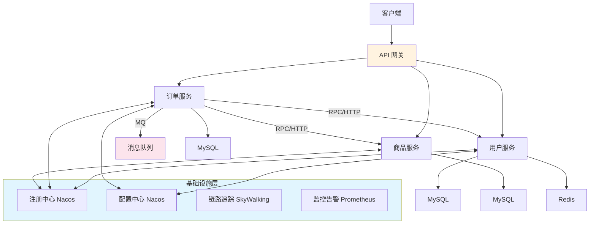

---

## 分布式核心理论

### CAP 定理

分布式系统不可能同时满足以下三个特性，最多只能满足其中两个：

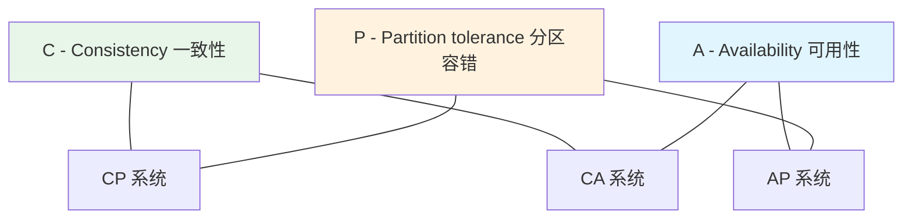

| 组合 | 特点 | 典型系统 |
|------|------|---------|
| **CP** | 强一致 + 分区容错，牺牲可用性 | ZooKeeper、Etcd、HBase |
| **AP** | 高可用 + 分区容错，牺牲强一致（最终一致） | Nacos（默认）、Eureka、Cassandra |
| **CA** | 强一致 + 高可用，不支持分区（单机） | 单机 MySQL |

> 网络分区（P）在分布式环境中不可避免，实际是在 **CP 和 AP 之间选择**。

### BASE 理论

对 CAP 中 AP 的延伸，核心思想是即使无法做到强一致性，可以采用**最终一致性**。

| 概念 | 说明 |
|------|------|
| **BA** - Basically Available | 基本可用：允许损失部分非核心功能（降级） |
| **S** - Soft State | 软状态：允许数据存在中间状态（不同步） |
| **E** - Eventually Consistent | 最终一致性：经过一段时间后，数据最终一致 |

### 一致性级别

| 级别 | 说明 | 场景 |
|------|------|------|
| 强一致性 | 写入后立即对所有节点可见 | 金融转账 |
| 弱一致性 | 不保证何时能读到最新值 | DNS |
| 最终一致性 | 经过一段时间后一定一致 | 电商库存、消息队列 |
| 因果一致性 | 有因果关系的操作保证顺序 | 社交评论 |
| 线性一致性 | 所有操作像在单机上顺序执行 | Raft/Paxos |

---

## 注册中心

### 主流注册中心对比

| 特性 | Nacos | Eureka | ZooKeeper | Consul |
|------|-------|--------|-----------|--------|
| CAP | AP + CP 可切换 | AP | CP | CP |
| 健康检查 | TCP/HTTP/MySQL | 心跳 | 会话保持 | TCP/HTTP/gRPC |
| 配置中心 | 内置 | 无 | 可实现 | 内置 |
| 一致性协议 | Raft(CP) / Distro(AP) | 无（对等复制） | ZAB | Raft |
| Spring Cloud 支持 | 原生支持 | 原生支持 | 需适配 | 原生支持 |
| 推荐度 | 首选 | 已停更 | 重量级 | 多语言场景 |

### Nacos 注册中心集成

```yaml
# application.yml
spring:
  application:
    name: order-service
  cloud:
    nacos:
      discovery:
        server-addr: 192.168.131.128:8848
        namespace: dev
        group: DEFAULT_GROUP
        # 临时实例（AP）/ 持久实例（CP）
        ephemeral: true
```

```java
// 服务间调用（声明式）
@FeignClient(name = "user-service", fallbackFactory = UserClientFallback.class)
public interface UserClient {
    @GetMapping("/api/users/{id}")
    User getById(@PathVariable Long id);
}
```

### 服务发现流程

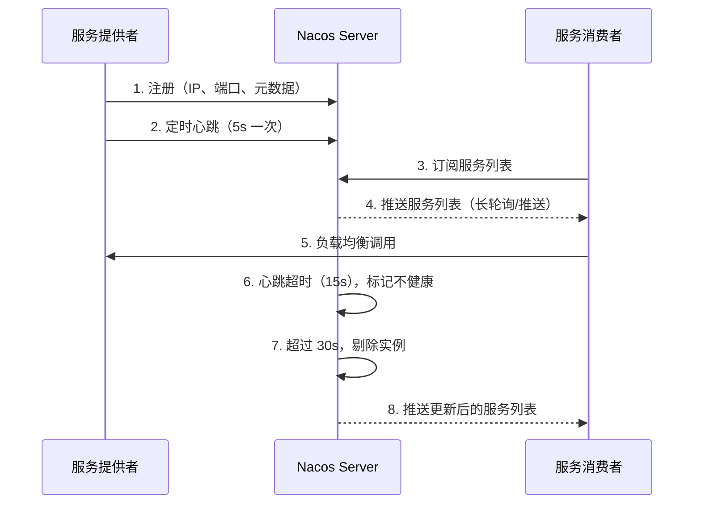

---

## 配置中心

### Nacos 配置中心

```yaml
# bootstrap.yml（优先于 application.yml 加载）
spring:
  application:
    name: order-service
  cloud:
    nacos:
      config:
        server-addr: 192.168.131.128:8848
        namespace: dev
        group: DEFAULT_GROUP
        file-extension: yaml
        # 共享配置
        shared-configs:
          - data-id: common-db.yaml
            group: DEFAULT_GROUP
            refresh: true
          - data-id: common-redis.yaml
            group: DEFAULT_GROUP
            refresh: true
```

```java
// 动态刷新配置
@RestController
@RefreshScope  // 配置变更时重新注入
public class ConfigController {

    @Value("${order.timeout:30}")
    private int orderTimeout;

    @GetMapping("/config/timeout")
    public int getTimeout() {
        return orderTimeout;
    }
}

// 监听配置变更
@Component
public class ConfigChangeListener {

    @NacosConfigListener(dataId = "order-service.yaml", groupId = "DEFAULT_GROUP")
    public void onConfigChanged(String newConfig) {
        log.info("配置已变更: {}", newConfig);
    }
}
```

---

## 服务网关

### Spring Cloud Gateway


```yaml
spring:
  cloud:
    gateway:
      routes:
        # 用户服务路由
        - id: user-service
          uri: lb://user-service       # lb:// 表示负载均衡
          predicates:
            - Path=/api/users/**
          filters:
            - StripPrefix=0
            - name: RequestRateLimiter  # 限流
              args:
                redis-rate-limiter.replenishRate: 100
                redis-rate-limiter.burstCapacity: 200
                key-resolver: "#{@ipKeyResolver}"

        # 订单服务路由
        - id: order-service
          uri: lb://order-service
          predicates:
            - Path=/api/orders/**
          filters:
            - StripPrefix=0

      # 全局默认过滤器
      default-filters:
        - AddRequestHeader=X-Request-Source, gateway
```

#### 自定义全局过滤器

```java
@Component
@Order(-1)  // 优先级最高
public class AuthGlobalFilter implements GlobalFilter {

    @Override
    public Mono<Void> filter(ServerWebExchange exchange, GatewayFilterChain chain) {
        String token = exchange.getRequest().getHeaders().getFirst("Authorization");

        if (token == null || !token.startsWith("Bearer ")) {
            exchange.getResponse().setStatusCode(HttpStatus.UNAUTHORIZED);
            return exchange.getResponse().setComplete();
        }

        // 解析 Token，将用户信息传递给下游
        String userId = JwtUtil.parseToken(token.substring(7));
        ServerHttpRequest request = exchange.getRequest().mutate()
            .header("X-User-Id", userId)
            .build();

        return chain.filter(exchange.mutate().request(request).build());
    }
}
```

---

## 负载均衡

### 常见负载均衡策略

| 策略 | 说明 | 适用场景 |
|------|------|---------|
| 轮询（Round Robin） | 依次分配 | 服务实例性能相近 |
| 加权轮询 | 按权重比例分配 | 实例性能不均 |
| 随机 | 随机选择 | 简单场景 |
| 最少连接 | 选择连接数最少的实例 | 长连接场景 |
| 一致性哈希 | 相同参数路由到相同实例 | 有状态/缓存场景 |

### Spring Cloud LoadBalancer

```java
// 自定义负载均衡策略
@Configuration
public class LoadBalancerConfig {

    @Bean
    public ReactorLoadBalancer<ServiceInstance> customLoadBalancer(
            Environment environment,
            LoadBalancerClientFactory clientFactory) {
        String name = environment.getProperty(LoadBalancerClientFactory.PROPERTY_NAME);
        return new RandomLoadBalancer(
            clientFactory.getLazyProvider(name, ServiceInstanceListSupplier.class), name);
    }
}

// 对特定服务使用自定义策略
@LoadBalancerClient(name = "user-service", configuration = LoadBalancerConfig.class)
public class UserServiceConfig {}
```

---

## 熔断、降级与限流

### 三者关系

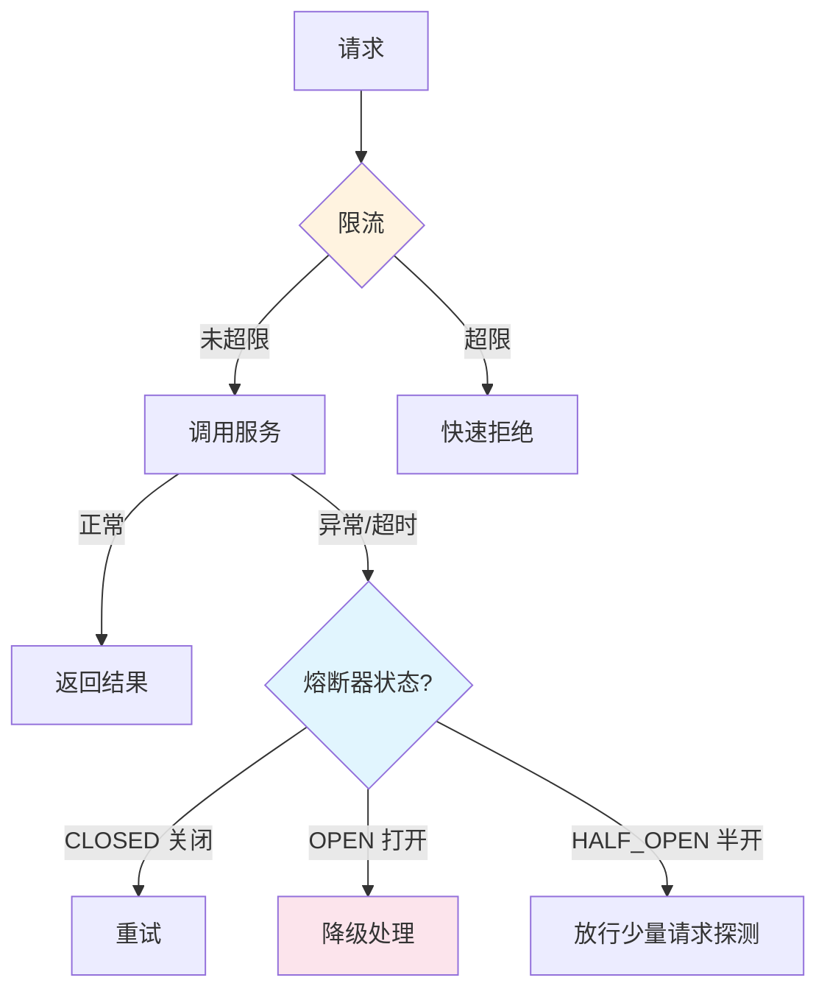

### 熔断器状态机

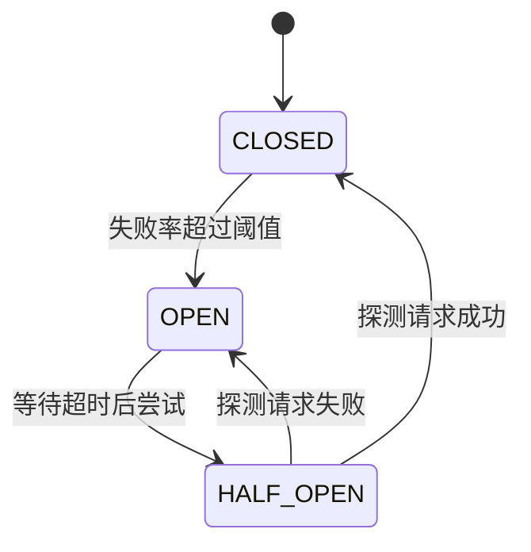

### Sentinel 集成（阿里，推荐）

```xml
<dependency>
    <groupId>com.alibaba.cloud</groupId>
    <artifactId>spring-cloud-starter-alibaba-sentinel</artifactId>
</dependency>
```

```yaml
spring:
  cloud:
    sentinel:
      transport:
        dashboard: 192.168.131.128:8080
      # 饥饿加载，服务启动即连接
      eager: true
```

```java
// 注解方式：熔断 + 降级
@Service
public class OrderService {

    @SentinelResource(
        value = "createOrder",
        blockHandler = "createOrderBlock",     // 限流/熔断时的处理
        fallback = "createOrderFallback"       // 业务异常时的降级
    )
    public Order createOrder(OrderRequest request) {
        // 正常业务逻辑
        return orderRepository.save(buildOrder(request));
    }

    // 限流/熔断处理（参数必须匹配 + BlockException）
    public Order createOrderBlock(OrderRequest request, BlockException ex) {
        log.warn("订单创建被限流: {}", ex.getClass().getSimpleName());
        throw new RuntimeException("系统繁忙，请稍后再试");
    }

    // 业务降级（参数匹配 + Throwable）
    public Order createOrderFallback(OrderRequest request, Throwable ex) {
        log.error("订单创建降级: {}", ex.getMessage());
        // 写入消息队列，异步重试
        mqProducer.send("order-retry-topic", request);
        return Order.pending(request.getOrderId());
    }
}
```

### Resilience4j 集成

```java
// 熔断器
@CircuitBreaker(name = "userService", fallbackMethod = "getUserFallback")
// 重试
@Retry(name = "userService", fallbackMethod = "getUserFallback")
// 限流
@RateLimiter(name = "userService")
// 超时
@TimeLimiter(name = "userService")
public CompletableFuture<User> getUser(Long id) {
    return CompletableFuture.supplyAsync(() -> userClient.getById(id));
}

public CompletableFuture<User> getUserFallback(Long id, Throwable ex) {
    log.warn("获取用户降级: id={}, error={}", id, ex.getMessage());
    return CompletableFuture.completedFuture(User.defaultUser());
}
```

```yaml
# application.yml
resilience4j:
  circuitbreaker:
    instances:
      userService:
        sliding-window-size: 10           # 统计窗口大小
        failure-rate-threshold: 50        # 失败率阈值 50%
        wait-duration-in-open-state: 30s  # 熔断后等待 30s 进入半开
        permitted-number-of-calls-in-half-open-state: 3
  retry:
    instances:
      userService:
        max-attempts: 3
        wait-duration: 1s
  ratelimiter:
    instances:
      userService:
        limit-for-period: 100             # 每周期允许 100 个请求
        limit-refresh-period: 1s
```

---

## 分布式事务

### 方案对比

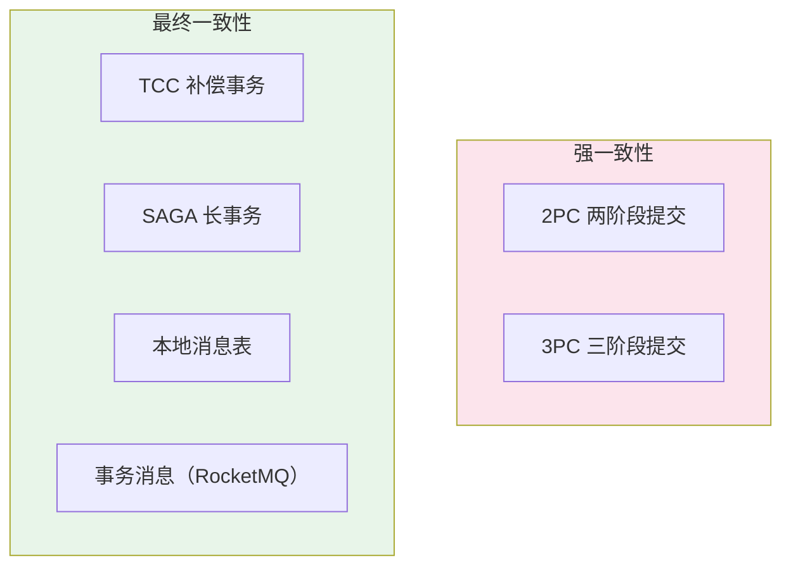

| 方案 | 一致性 | 性能 | 复杂度 | 适用场景 |
|------|--------|------|--------|---------|
| 2PC（Seata AT） | 强一致 | 低 | 低 | 强一致要求、内部系统 |
| TCC | 最终一致 | 高 | 高 | 金融转账、资金操作 |
| SAGA | 最终一致 | 高 | 中 | 长流程业务、跨公司 |
| 本地消息表 | 最终一致 | 高 | 中 | 异步解耦、可靠通知 |
| 事务消息 | 最终一致 | 高 | 低 | RocketMQ 场景 |

### Seata 分布式事务

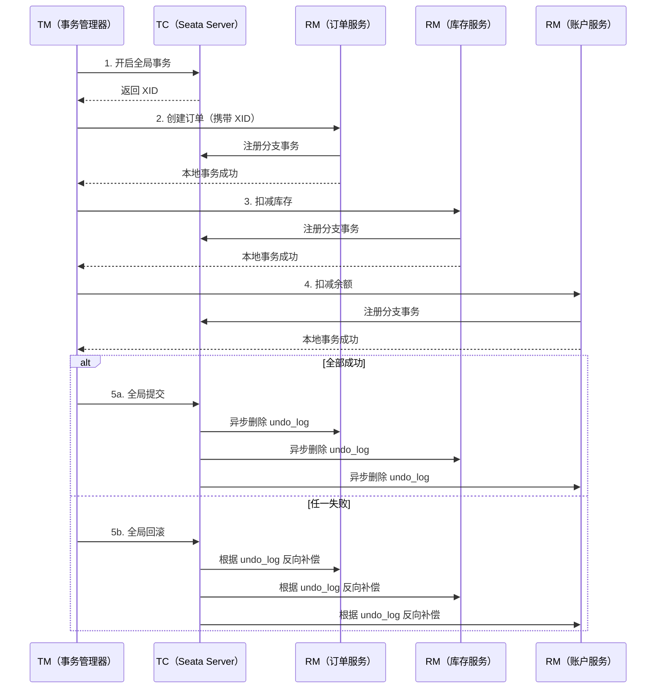

```java
// Seata AT 模式：最简单，侵入最小
@Service
public class OrderService {

    @GlobalTransactional(timeoutMills = 30000, rollbackFor = Exception.class)
    public void placeOrder(OrderRequest request) {
        // 1. 创建订单（本地数据库）
        orderMapper.insert(buildOrder(request));

        // 2. 远程调用：扣减库存
        inventoryClient.deduct(request.getSku(), request.getQty());

        // 3. 远程调用：扣减余额
        accountClient.debit(request.getUserId(), request.getAmount());

        // 任一步骤异常 → Seata 自动全局回滚
    }
}
```

### 本地消息表（最终一致性）

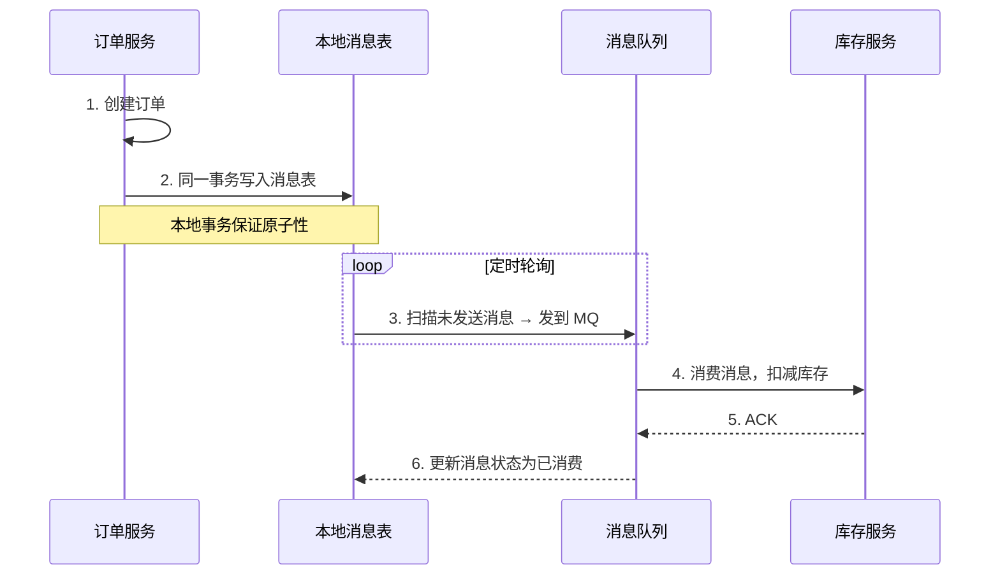

```java
// 本地消息表实现
@Service
@RequiredArgsConstructor
public class OrderService {

    private final OrderMapper orderMapper;
    private final LocalMessageMapper messageMapper;

    @Transactional
    public void createOrder(OrderRequest request) {
        // 1. 写订单
        orderMapper.insert(buildOrder(request));

        // 2. 同一事务写消息表
        LocalMessage msg = new LocalMessage();
        msg.setMessageId(UUID.randomUUID().toString());
        msg.setTopic("inventory-deduct");
        msg.setPayload(JsonUtil.toJson(new DeductCommand(request.getSku(), request.getQty())));
        msg.setStatus("PENDING");
        messageMapper.insert(msg);
    }
}

// 定时任务：扫描并发送
@Scheduled(fixedDelay = 5000)
public void scanAndSend() {
    List<LocalMessage> messages = messageMapper.selectPending(100);
    for (LocalMessage msg : messages) {
        try {
            mqProducer.send(msg.getTopic(), msg.getPayload());
            messageMapper.updateStatus(msg.getId(), "SENT");
        } catch (Exception e) {
            log.error("消息发送失败: {}", msg.getMessageId());
            // 下次轮询重试
        }
    }
}
```

---

## 分布式锁

### 方案对比

| 方案 | 性能 | 可靠性 | 实现复杂度 | 推荐场景 |
|------|------|--------|-----------|---------|
| Redis（Redisson） | 极高 | 高（RedLock） | 低 | 高并发场景（首选） |
| ZooKeeper | 中等 | 极高 | 中 | 强一致性要求 |
| MySQL | 低 | 中等 | 低 | 低并发、无 Redis |

### Redisson 分布式锁

```java
@Service
@RequiredArgsConstructor
public class StockService {

    private final RedissonClient redissonClient;

    public void deductStock(String productId, int quantity) {
        RLock lock = redissonClient.getLock("lock:stock:" + productId);
        try {
            // 等待 5 秒获取锁，持有 10 秒自动释放
            boolean acquired = lock.tryLock(5, 10, TimeUnit.SECONDS);
            if (!acquired) {
                throw new RuntimeException("获取锁失败");
            }
            // 业务逻辑
            int stock = getStock(productId);
            if (stock < quantity) {
                throw new RuntimeException("库存不足");
            }
            updateStock(productId, stock - quantity);
        } catch (InterruptedException e) {
            Thread.currentThread().interrupt();
        } finally {
            if (lock.isHeldByCurrentThread()) {
                lock.unlock();
            }
        }
    }
}
```

> Redisson 内置看门狗机制（Watch Dog）：如果不指定 `leaseTime`，默认 30s，每 10s 自动续期，防止业务未完成锁已过期。

### Redis 分布式锁核心原理

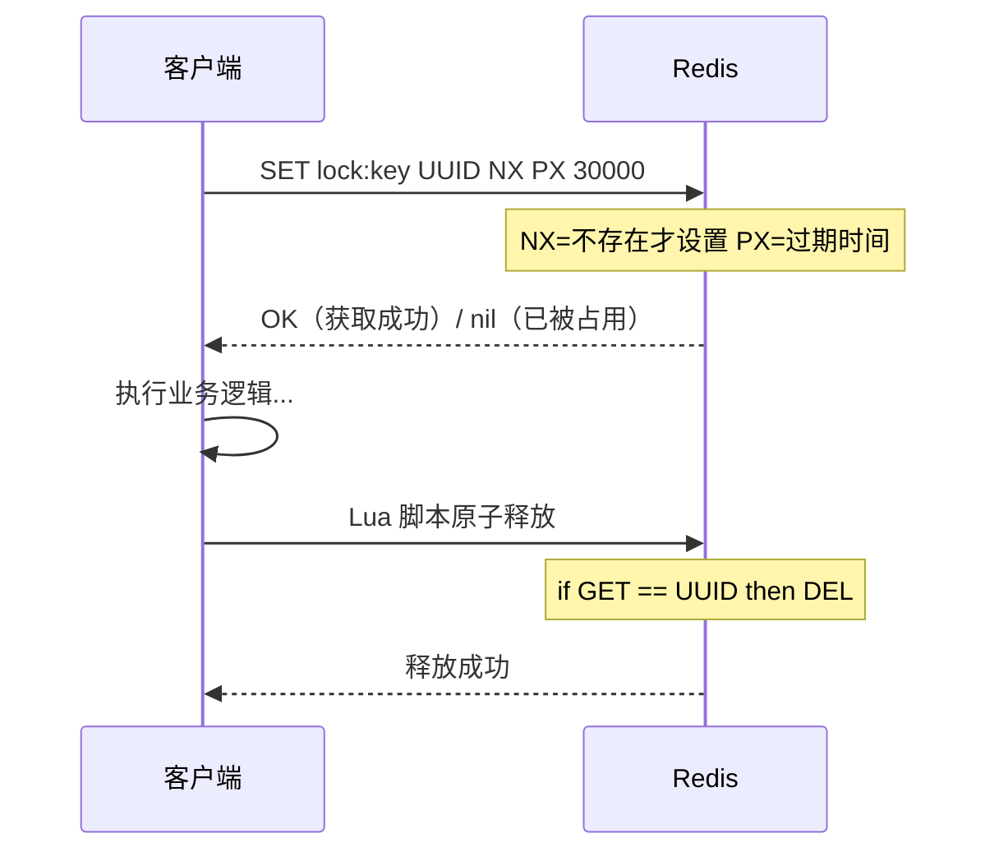

```lua
-- 释放锁的 Lua 脚本（保证原子性）
if redis.call("GET", KEYS[1]) == ARGV[1] then
    return redis.call("DEL", KEYS[1])
else
    return 0
end
```

---

## 分布式 ID

### 方案对比

| 方案 | 性能 | 有序性 | 可用性 | 实现 |
|------|------|--------|--------|------|
| UUID | 极高 | 无序 | 极高 | JDK 内置 |
| 数据库自增 | 低 | 有序 | 单点风险 | AUTO_INCREMENT |
| 数据库号段模式 | 高 | 有序 | 高 | Leaf-Segment |
| Redis INCR | 高 | 有序 | 高 | Redis 原子自增 |
| 雪花算法 | 极高 | 趋势有序 | 高 | Snowflake |

### 雪花算法（Snowflake）

```
0 | 0000000000 0000000000 0000000000 0000000000 0 | 00000 | 00000 | 000000000000
符  |<------------ 41位时间戳 ------------>|<- 5位 ->|<- 5位 ->|<-- 12位序列号 -->|
号  |           (69年)                     | 数据中心 | 机器ID  |  (4096/ms)      |
```

```java
public class SnowflakeIdGenerator {

    private final long datacenterId;
    private final long machineId;
    private long sequence = 0L;
    private long lastTimestamp = -1L;

    // 起始时间戳（2024-01-01）
    private static final long EPOCH = 1704067200000L;
    private static final long SEQUENCE_BITS = 12L;
    private static final long MACHINE_BITS = 5L;
    private static final long DATACENTER_BITS = 5L;
    private static final long MAX_SEQUENCE = ~(-1L << SEQUENCE_BITS);

    public SnowflakeIdGenerator(long datacenterId, long machineId) {
        this.datacenterId = datacenterId;
        this.machineId = machineId;
    }

    public synchronized long nextId() {
        long timestamp = System.currentTimeMillis();

        if (timestamp < lastTimestamp) {
            throw new RuntimeException("时钟回拨，拒绝生成 ID");
        }

        if (timestamp == lastTimestamp) {
            sequence = (sequence + 1) & MAX_SEQUENCE;
            if (sequence == 0) {
                // 同一毫秒序列号用尽，等待下一毫秒
                timestamp = waitNextMillis(lastTimestamp);
            }
        } else {
            sequence = 0L;
        }

        lastTimestamp = timestamp;

        return ((timestamp - EPOCH) << (DATACENTER_BITS + MACHINE_BITS + SEQUENCE_BITS))
             | (datacenterId << (MACHINE_BITS + SEQUENCE_BITS))
             | (machineId << SEQUENCE_BITS)
             | sequence;
    }

    private long waitNextMillis(long last) {
        long ts = System.currentTimeMillis();
        while (ts <= last) { ts = System.currentTimeMillis(); }
        return ts;
    }
}
```

> 生产环境推荐使用 **美团 Leaf**（号段模式 + 雪花算法双模式）或 **百度 UidGenerator**。

---

## 分布式缓存

### 缓存架构

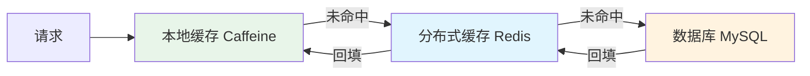

### 缓存三大问题

#### 缓存穿透

查询**不存在**的数据，请求穿透缓存直达数据库。

```java
// 方案一：缓存空值
public User getUser(Long id) {
    String key = "user:" + id;
    String cached = redis.get(key);
    if (cached != null) {
        return "NULL".equals(cached) ? null : JsonUtil.parse(cached, User.class);
    }
    User user = userMapper.selectById(id);
    if (user != null) {
        redis.setex(key, 3600, JsonUtil.toJson(user));
    } else {
        redis.setex(key, 300, "NULL");  // 空值缓存较短过期
    }
    return user;
}

// 方案二：布隆过滤器（Redisson 实现）
RBloomFilter<Long> bloomFilter = redissonClient.getBloomFilter("user:bloom");
bloomFilter.tryInit(1000000, 0.01);  // 预计 100 万数据，误判率 1%

// 查询前先检查布隆过滤器
public User getUser(Long id) {
    if (!bloomFilter.contains(id)) {
        return null;  // 一定不存在，直接返回
    }
    // 可能存在，查缓存 → 查数据库
}
```

#### 缓存击穿

**热点 key 过期**瞬间，大量并发请求打到数据库。

```java
// 方案：互斥锁（singleflight 思想）
public User getHotUser(Long id) {
    String key = "user:" + id;
    String cached = redis.get(key);
    if (cached != null) return JsonUtil.parse(cached, User.class);

    String lockKey = "lock:user:" + id;
    boolean locked = redis.setnx(lockKey, "1", 10);
    if (locked) {
        try {
            // 双重检查
            cached = redis.get(key);
            if (cached != null) return JsonUtil.parse(cached, User.class);

            User user = userMapper.selectById(id);
            redis.setex(key, 3600, JsonUtil.toJson(user));
            return user;
        } finally {
            redis.del(lockKey);
        }
    } else {
        // 其他线程在加载，短暂等待后重试
        Thread.sleep(50);
        return getHotUser(id);
    }
}
```

#### 缓存雪崩

**大量 key 同时过期**或 **Redis 宕机**，导致请求全部涌向数据库。

```java
// 方案一：过期时间加随机值
int ttl = 3600 + ThreadLocalRandom.current().nextInt(600);  // 1小时 ± 10分钟
redis.setex(key, ttl, value);

// 方案二：多级缓存（本地缓存 + Redis + DB）
// 方案三：Redis 集群 + 哨兵保证高可用
// 方案四：热点数据永不过期 + 异步更新
```

### 缓存一致性

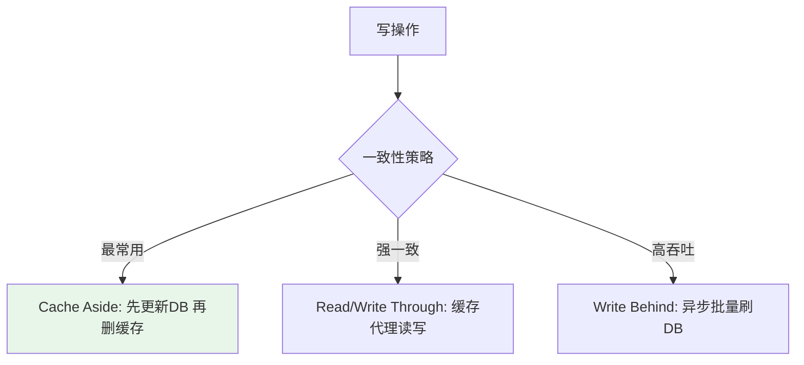

```java
// Cache Aside Pattern（旁路缓存，推荐）
@Service
public class UserService {

    // 读：缓存 → DB → 回填缓存
    public User getUser(Long id) {
        String key = "user:" + id;
        User user = cacheGet(key, User.class);
        if (user == null) {
            user = userMapper.selectById(id);
            if (user != null) cacheSet(key, user, 3600);
        }
        return user;
    }

    // 写：先更新 DB → 再删缓存（延迟双删更保险）
    @Transactional
    public void updateUser(User user) {
        userMapper.updateById(user);
        redis.del("user:" + user.getId());

        // 延迟双删：防止并发读写导致的不一致
        CompletableFuture.runAsync(() -> {
            try { Thread.sleep(500); } catch (Exception ignored) {}
            redis.del("user:" + user.getId());
        });
    }
}
```

---

## 链路追踪

### 核心概念

| 概念 | 说明 |
|------|------|
| Trace | 一次完整的请求调用链（全局唯一 TraceId） |
| Span | 调用链中的一个环节（方法调用、RPC、SQL） |
| Parent Span | 上游调用方 |

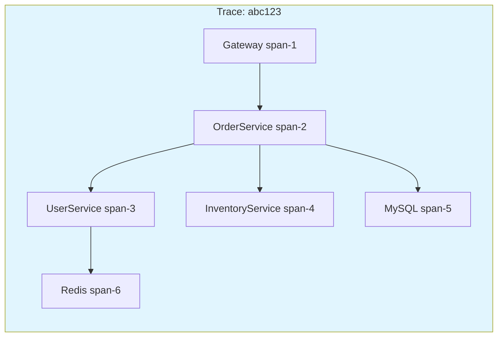

### SkyWalking 集成

```bash
# Java Agent 方式接入（零代码侵入）
java -javaagent:/path/to/skywalking-agent.jar \
  -Dskywalking.agent.service_name=order-service \
  -Dskywalking.collector.backend_service=192.168.131.128:11800 \
  -jar order-service.jar
```

### Micrometer Tracing（Spring Boot 3+）

```xml
<dependency>
    <groupId>io.micrometer</groupId>
    <artifactId>micrometer-tracing-bridge-brave</artifactId>
</dependency>
<dependency>
    <groupId>io.zipkin.reporter2</groupId>
    <artifactId>zipkin-reporter-brave</artifactId>
</dependency>
```

```yaml
management:
  tracing:
    sampling:
      probability: 1.0  # 采样率（生产环境建议 0.1~0.5）
  zipkin:
    tracing:
      endpoint: http://192.168.131.128:9411/api/v2/spans
```

---

## 高可用架构设计

### 高可用核心指标

| 可用性 | 年故障时间 | 说明 |
|--------|-----------|------|
| 99%（2个9） | 3.65 天 | 基本可用 |
| 99.9%（3个9） | 8.76 小时 | 较高可用 |
| 99.99%（4个9） | 52.6 分钟 | 高可用 |
| 99.999%（5个9） | 5.26 分钟 | 极高可用（金融级） |

### 高可用手段

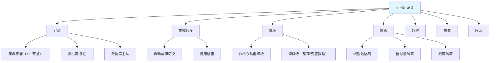

### 容灾方案

| 方案 | 说明 | RPO/RTO |
|------|------|---------|
| 冷备 | 定期备份，故障时恢复 | RPO 高，RTO 小时级 |
| 温备 | 数据实时同步，故障时切换 | RPO 低，RTO 分钟级 |
| 热备（主从） | 实时同步，自动切换 | RPO ≈ 0，RTO 秒级 |
| 同城双活 | 两机房同时对外服务 | RPO = 0，RTO 秒级 |
| 异地多活 | 多地域独立服务，数据最终一致 | RPO ≈ 0，RTO 秒级 |

> **RPO**（Recovery Point Objective）：能容忍丢失多少数据。**RTO**（Recovery Time Objective）：恢复服务需要多长时间。

### 生产架构 Checklist

| 类别 | 检查项 |
|------|--------|
| **服务** | 无状态设计、集群 ≥ 3 节点、优雅停机 |
| **数据库** | 主从复制、读写分离、定时备份、慢 SQL 监控 |
| **缓存** | Redis 哨兵/Cluster、持久化、热 key 打散 |
| **消息队列** | 集群部署、消息持久化、消费幂等、死信队列 |
| **网关** | 限流、鉴权、灰度、黑白名单 |
| **监控** | 指标采集（Prometheus）、日志（ELK）、链路追踪、告警 |
| **容灾** | 降级开关、熔断配置、多机房部署、定期演练 |
| **安全** | HTTPS、JWT/OAuth2、SQL 注入防护、XSS 过滤 |

---

## 面试高频总结

| 问题 | 要点 |
|------|------|
| CAP 定理 | 分布式系统最多满足两个；网络分区不可避免，实际选 CP 或 AP |
| BASE 理论 | 基本可用 + 软状态 + 最终一致性，AP 的延伸 |
| 注册中心选型 | Nacos（AP/CP 可切换，内置配置中心）首选 |
| 分布式事务方案 | 强一致用 Seata AT/XA；最终一致用本地消息表/事务消息/TCC |
| 分布式锁 | Redis Redisson（看门狗续期）首选；强一致用 ZooKeeper |
| 分布式 ID | 雪花算法（趋势有序、高性能）；号段模式（Leaf） |
| 缓存穿透/击穿/雪崩 | 穿透→布隆过滤器/缓存空值；击穿→互斥锁；雪崩→随机TTL/多级缓存 |
| 缓存一致性 | Cache Aside（先更新DB再删缓存）+ 延迟双删 |
| 熔断和降级 | 熔断：故障自动切断调用；降级：返回兜底数据保证可用 |
| 限流算法 | 令牌桶（平滑突发）、滑动窗口（精确计数）、漏桶（平滑输出） |
| 微服务拆分原则 | 单一职责、高内聚低耦合、独立数据库、独立部署 |
| 高可用设计 | 冗余+故障转移+降级+隔离+超时重试+限流 |
