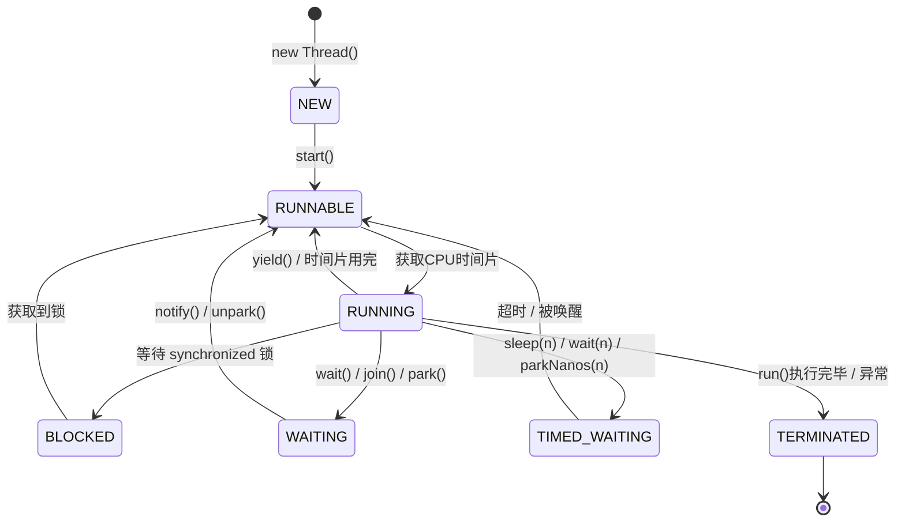
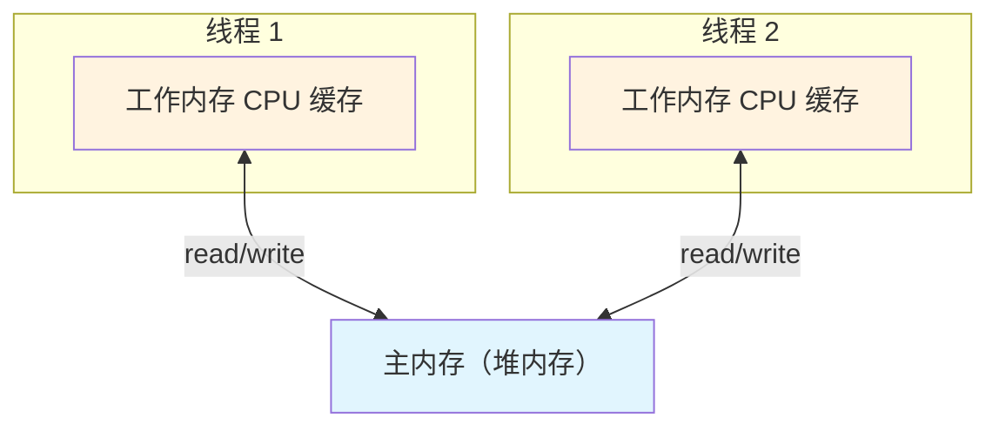
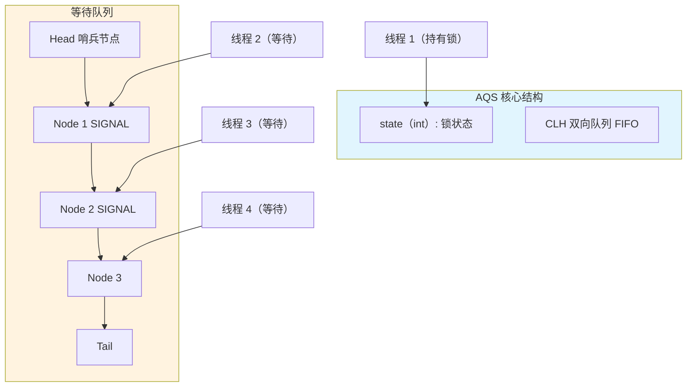
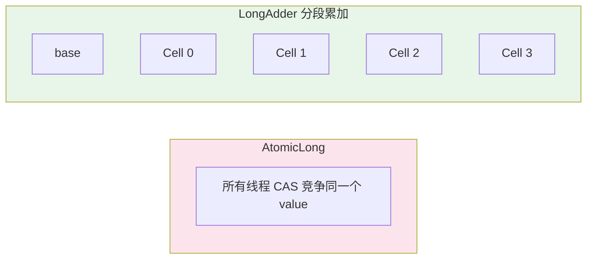
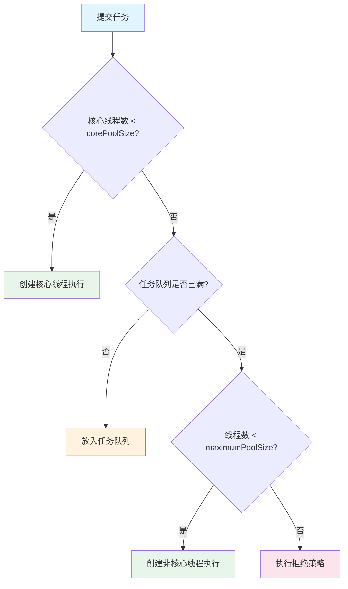
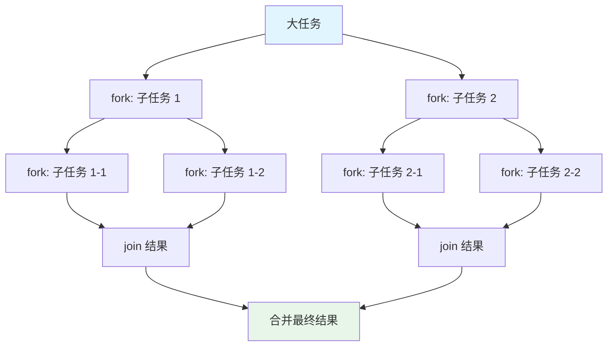
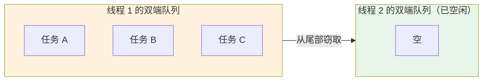
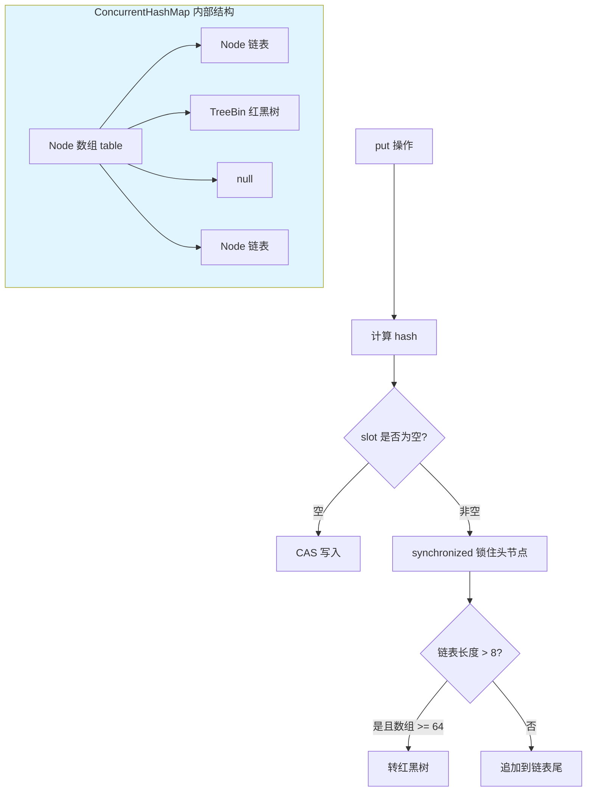
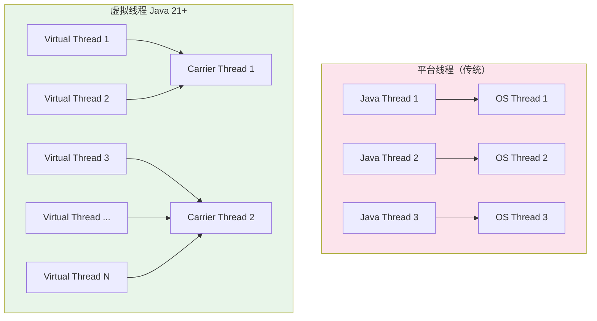
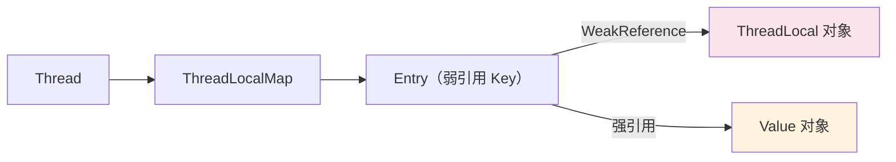

## 线程基础

### 进程与线程

| 概念 | 说明 |
|------|------|
| **进程** | 操作系统资源分配的最小单位，拥有独立的内存空间 |
| **线程** | CPU 调度的最小单位，共享进程的内存空间 |
| **协程/虚拟线程** | 用户态轻量级线程，由 JVM 调度（Java 21+） |

### 创建线程的方式

```java
// 方式一：继承 Thread
class MyThread extends Thread {
    @Override
    public void run() {
        System.out.println("Thread: " + Thread.currentThread().getName());
    }
}

// 方式二：实现 Runnable（推荐，支持多继承）
class MyRunnable implements Runnable {
    @Override
    public void run() {
        System.out.println("Runnable: " + Thread.currentThread().getName());
    }
}

// 方式三：实现 Callable（可返回结果、可抛异常）
class MyCallable implements Callable<String> {
    @Override
    public String call() throws Exception {
        return "Result from " + Thread.currentThread().getName();
    }
}

// 方式四：线程池（生产推荐）
ExecutorService executor = Executors.newFixedThreadPool(4);
executor.submit(() -> System.out.println("ThreadPool: " + Thread.currentThread().getName()));

// 使用示例
public static void main(String[] args) throws Exception {
    new MyThread().start();
    new Thread(new MyRunnable()).start();

    FutureTask<String> futureTask = new FutureTask<>(new MyCallable());
    new Thread(futureTask).start();
    System.out.println(futureTask.get()); // 阻塞获取结果
}
```

### 线程生命周期



> Java 中 `RUNNABLE` 状态包含了操作系统层面的"就绪"和"运行中"两种状态。

### 线程常用方法

| 方法 | 说明 |
|------|------|
| `start()` | 启动线程（只能调用一次） |
| `run()` | 线程执行体（直接调用不会创建新线程） |
| `sleep(ms)` | 让当前线程休眠指定毫秒，**不释放锁** |
| `yield()` | 让出 CPU 时间片，回到就绪状态 |
| `join()` | 等待目标线程执行完毕 |
| `interrupt()` | 中断线程（设置中断标志位） |
| `isInterrupted()` | 判断是否被中断 |
| `Thread.currentThread()` | 获取当前线程对象 |
| `setDaemon(true)` | 设置为守护线程（所有非守护线程结束后 JVM 退出） |

### sleep vs wait vs yield

| 特性 | sleep | wait | yield |
|------|-------|------|-------|
| 所属类 | Thread | Object | Thread |
| 释放锁 | 不释放 | 释放 | 不释放 |
| 唤醒方式 | 超时自动 | notify/notifyAll | 立即回到就绪 |
| 使用场景 | 定时暂停 | 线程协作 | 让出 CPU |
| 需要同步块 | 否 | 是（必须在 synchronized 中） | 否 |

### 线程中断机制

```java
public class InterruptDemo {

    public static void main(String[] args) throws InterruptedException {
        Thread worker = new Thread(() -> {
            while (!Thread.currentThread().isInterrupted()) {
                try {
                    System.out.println("工作中...");
                    Thread.sleep(1000);
                } catch (InterruptedException e) {
                    // sleep/wait/join 抛出 InterruptedException 时会清除中断标志
                    // 需要重新设置中断标志，否则循环不会退出
                    Thread.currentThread().interrupt();
                    System.out.println("收到中断信号，准备退出");
                }
            }
            System.out.println("线程正常退出");
        });

        worker.start();
        Thread.sleep(3000);
        worker.interrupt();  // 发送中断信号
        worker.join();
    }
}
```

> **中断最佳实践**：不要用 `stop()`（已废弃），应通过 `interrupt()` + 业务代码检查中断标志来优雅停止线程。

## synchronized 关键字

### 三种用法

```java
public class SynchronizedDemo {

    private int count = 0;
    private static int staticCount = 0;
    private final Object lock = new Object();

    // 1. 同步实例方法 → 锁是 this 对象
    public synchronized void increment() {
        count++;
    }

    // 2. 同步静态方法 → 锁是 Class 对象
    public static synchronized void staticIncrement() {
        staticCount++;
    }

    // 3. 同步代码块 → 锁是指定对象（推荐，粒度更细）
    public void blockIncrement() {
        synchronized (lock) {
            count++;
        }
    }
}
```

### synchronized 锁升级（JDK 6+）


| 锁状态 | 适用场景 | 性能 | 实现方式 |
|--------|---------|------|---------|
| 偏向锁 | 只有一个线程访问 | 最高（无 CAS） | 对象头记录线程 ID |
| 轻量级锁 | 少量线程交替访问，竞争不激烈 | 较高（CAS 自旋） | Lock Record + CAS |
| 重量级锁 | 多线程激烈竞争 | 最低（涉及内核态切换） | ObjectMonitor（Mutex） |

> JDK 15 默认禁用偏向锁（`-XX:-UseBiasedLocking`），JDK 18+ 完全移除。

### wait / notify 线程协作

```java
public class ProducerConsumer {

    private final Queue<Integer> queue = new LinkedList<>();
    private final int capacity = 10;

    public synchronized void produce(int item) throws InterruptedException {
        while (queue.size() == capacity) {
            wait();  // 队列满，等待消费者消费
        }
        queue.offer(item);
        System.out.println("生产: " + item + ", 队列大小: " + queue.size());
        notifyAll();  // 唤醒消费者
    }

    public synchronized int consume() throws InterruptedException {
        while (queue.isEmpty()) {
            wait();  // 队列空，等待生产者生产
        }
        int item = queue.poll();
        System.out.println("消费: " + item + ", 队列大小: " + queue.size());
        notifyAll();  // 唤醒生产者
        return item;
    }
}
```

> **注意**：`wait()` 必须在 `while` 循环中（非 `if`），防止虚假唤醒（spurious wakeup）。

## volatile 关键字

### 两大作用

1. **可见性**：一个线程修改 volatile 变量后，其他线程立即可见
2. **有序性**：禁止指令重排序（通过内存屏障实现）

> **不保证原子性**：`volatile int count; count++` 不是线程安全的（读-改-写非原子操作）。

### 典型场景：DCL 单例

```java
public class Singleton {
    // volatile 防止指令重排序
    private static volatile Singleton instance;

    private Singleton() {}

    public static Singleton getInstance() {
        if (instance == null) {                    // 第一次检查（无锁）
            synchronized (Singleton.class) {
                if (instance == null) {            // 第二次检查（有锁）
                    instance = new Singleton();    // 非原子操作：1.分配内存 2.初始化 3.赋值引用
                }
            }
        }
        return instance;
    }
}
```

> 不加 `volatile` 可能导致其他线程读到未初始化完成的对象（步骤 2 和 3 被重排序）。

### Java 内存模型（JMM）



- 每个线程有自己的**工作内存**（CPU 缓存），存放主内存中变量的副本
- 线程对变量的操作在工作内存中进行，然后同步回主内存
- `volatile` 强制每次读写都直接操作主内存
- `synchronized` 在进入时从主内存刷新，退出时同步回主内存

### happens-before 规则

| 规则 | 说明 |
|------|------|
| 程序顺序规则 | 同一线程内，前面的操作 happens-before 后面的操作 |
| 监视器锁规则 | 解锁 happens-before 后续对该锁的加锁 |
| volatile 规则 | volatile 写 happens-before 后续对该 volatile 的读 |
| 线程启动规则 | `start()` happens-before 线程中的所有操作 |
| 线程终止规则 | 线程中的所有操作 happens-before `join()` 返回 |
| 传递性 | A happens-before B，B happens-before C → A happens-before C |

## Lock 与 AQS

### ReentrantLock vs synchronized

```java
import java.util.concurrent.locks.ReentrantLock;
import java.util.concurrent.locks.Condition;

public class ReentrantLockDemo {

    private final ReentrantLock lock = new ReentrantLock(true); // true 为公平锁
    private final Condition notFull = lock.newCondition();
    private final Condition notEmpty = lock.newCondition();
    private final Queue<Integer> queue = new LinkedList<>();
    private final int capacity = 10;

    public void produce(int item) throws InterruptedException {
        lock.lock();
        try {
            while (queue.size() == capacity) {
                notFull.await();       // 精确等待：队列不满
            }
            queue.offer(item);
            notEmpty.signal();         // 精确唤醒：通知消费者
        } finally {
            lock.unlock();             // 必须在 finally 中释放锁
        }
    }

    public int consume() throws InterruptedException {
        lock.lock();
        try {
            while (queue.isEmpty()) {
                notEmpty.await();
            }
            int item = queue.poll();
            notFull.signal();
            return item;
        } finally {
            lock.unlock();
        }
    }
}
```

| 特性 | synchronized | ReentrantLock |
|------|-------------|---------------|
| 加锁方式 | 隐式（自动释放） | 显式（必须手动 unlock） |
| 锁类型 | 非公平 | 公平/非公平可选 |
| 条件变量 | 一个（wait/notify） | 多个 Condition |
| 可中断 | 不可中断 | `lockInterruptibly()` |
| 超时获取 | 不支持 | `tryLock(timeout)` |
| 锁状态查询 | 不支持 | `isLocked()`、`getHoldCount()` |
| 性能 | JDK 6+ 优化后差距不大 | 差距不大 |

### 读写锁 ReentrantReadWriteLock

适用于**读多写少**场景，读读不互斥，读写/写写互斥。

```java
import java.util.concurrent.locks.ReentrantReadWriteLock;

public class CachedData {

    private final ReentrantReadWriteLock rwLock = new ReentrantReadWriteLock();
    private final ReentrantReadWriteLock.ReadLock readLock = rwLock.readLock();
    private final ReentrantReadWriteLock.WriteLock writeLock = rwLock.writeLock();
    private final Map<String, Object> cache = new HashMap<>();

    public Object get(String key) {
        readLock.lock();             // 多线程可同时读
        try {
            return cache.get(key);
        } finally {
            readLock.unlock();
        }
    }

    public void put(String key, Object value) {
        writeLock.lock();            // 写时独占
        try {
            cache.put(key, value);
        } finally {
            writeLock.unlock();
        }
    }
}
```

### StampedLock（JDK 8+）

比 `ReentrantReadWriteLock` 性能更高，支持**乐观读**，但不可重入。

```java
import java.util.concurrent.locks.StampedLock;

public class Point {

    private double x, y;
    private final StampedLock lock = new StampedLock();

    /** 写锁 */
    public void move(double deltaX, double deltaY) {
        long stamp = lock.writeLock();
        try {
            x += deltaX;
            y += deltaY;
        } finally {
            lock.unlockWrite(stamp);
        }
    }

    /** 乐观读：先乐观读，被修改了再升级为悲观读 */
    public double distanceFromOrigin() {
        long stamp = lock.tryOptimisticRead();   // 乐观读，不加锁
        double currentX = x, currentY = y;
        if (!lock.validate(stamp)) {             // 检查期间是否有写操作
            stamp = lock.readLock();              // 被修改了，升级为悲观读
            try {
                currentX = x;
                currentY = y;
            } finally {
                lock.unlockRead(stamp);
            }
        }
        return Math.sqrt(currentX * currentX + currentY * currentY);
    }
}
```

| 锁类型 | 可重入 | 乐观读 | 适用场景 |
|--------|--------|--------|---------|
| ReentrantReadWriteLock | 是 | 否 | 读多写少，需要可重入 |
| StampedLock | 否 | 是 | 读多写少，追求极致性能 |

### AQS 原理（AbstractQueuedSynchronizer）

AQS 是 `ReentrantLock`、`Semaphore`、`CountDownLatch` 等的底层框架。



**核心流程**：
1. 线程尝试通过 CAS 修改 `state`（0 → 1）获取锁
2. 获取成功则执行临界区代码
3. 获取失败则封装为 `Node` 加入 CLH 队列尾部，线程 `park()` 挂起
4. 前驱节点释放锁后 `unpark()` 唤醒后继节点
5. 被唤醒的线程重新尝试获取锁

### 基于 AQS 实现自定义同步器

```java
import java.util.concurrent.locks.AbstractQueuedSynchronizer;

/**
 * 自定义互斥锁（不可重入）
 */
public class SimpleMutex {

    private final Sync sync = new Sync();

    private static class Sync extends AbstractQueuedSynchronizer {

        /** 尝试获取锁：CAS 将 state 从 0 改为 1 */
        @Override
        protected boolean tryAcquire(int arg) {
            if (compareAndSetState(0, 1)) {
                setExclusiveOwnerThread(Thread.currentThread());
                return true;
            }
            return false;
        }

        /** 尝试释放锁 */
        @Override
        protected boolean tryRelease(int arg) {
            if (getState() == 0) throw new IllegalMonitorStateException();
            setExclusiveOwnerThread(null);
            setState(0);
            return true;
        }

        @Override
        protected boolean isHeldExclusively() {
            return getState() == 1;
        }
    }

    public void lock()    { sync.acquire(1); }
    public void unlock()  { sync.release(1); }
    public boolean tryLock() { return sync.tryAcquire(1); }
}
```

## 原子类（Atomic）

基于 CAS（Compare-And-Swap）实现无锁线程安全操作。

### 常用原子类

| 类型 | 类名 | 说明 |
|------|------|------|
| 基本类型 | `AtomicInteger`、`AtomicLong`、`AtomicBoolean` | 原子操作基本类型 |
| 引用类型 | `AtomicReference<V>`、`AtomicStampedReference<V>` | 原子操作对象引用 |
| 数组类型 | `AtomicIntegerArray`、`AtomicLongArray` | 原子操作数组元素 |
| 字段更新 | `AtomicIntegerFieldUpdater` | 原子更新对象的某个字段 |
| 累加器 | `LongAdder`、`LongAccumulator` | 高并发累加（JDK 8+） |

### 使用示例

```java
import java.util.concurrent.atomic.*;

// AtomicInteger 基本用法
AtomicInteger counter = new AtomicInteger(0);
counter.incrementAndGet();               // ++i，返回新值
counter.getAndIncrement();               // i++，返回旧值
counter.compareAndSet(1, 2);             // CAS：期望值 1，更新为 2
counter.updateAndGet(x -> x * 2);        // 函数式更新

// AtomicReference：原子更新对象
AtomicReference<User> userRef = new AtomicReference<>(new User("Alice"));
userRef.updateAndGet(u -> new User(u.name() + " Updated"));

// AtomicStampedReference：解决 ABA 问题
AtomicStampedReference<Integer> stampedRef = new AtomicStampedReference<>(1, 0);
int stamp = stampedRef.getStamp();
stampedRef.compareAndSet(1, 2, stamp, stamp + 1);

// AtomicIntegerFieldUpdater：原子更新对象字段（减少内存开销）
class Account {
    volatile int balance;  // 必须是 volatile
}
AtomicIntegerFieldUpdater<Account> updater =
    AtomicIntegerFieldUpdater.newUpdater(Account.class, "balance");
Account account = new Account();
updater.addAndGet(account, 100);
```

### LongAdder vs AtomicLong



```java
// 高并发计数器推荐 LongAdder
LongAdder adder = new LongAdder();
adder.increment();
adder.add(10);
long sum = adder.sum();  // 获取总和（非精确快照）

// LongAccumulator：自定义累加规则
LongAccumulator maxAccumulator = new LongAccumulator(Long::max, Long.MIN_VALUE);
maxAccumulator.accumulate(10);
maxAccumulator.accumulate(20);
System.out.println(maxAccumulator.get()); // 20

// AtomicLong 适合需要精确值的场景
AtomicLong atomicLong = new AtomicLong(0);
long exact = atomicLong.incrementAndGet();
```

> **LongAdder 原理**：将竞争分散到多个 Cell 中，最终 `sum()` 时汇总。高并发下吞吐量远高于 `AtomicLong`，但 `sum()` 不保证精确快照。

### CAS 的三大问题

| 问题 | 说明 | 解决方案 |
|------|------|---------|
| ABA 问题 | 值从 A → B → A，CAS 认为没变过 | `AtomicStampedReference`（版本号） |
| 自旋开销 | 竞争激烈时大量线程空转浪费 CPU | 适当降级为锁，或使用 `LongAdder` 分散竞争 |
| 单变量限制 | CAS 只能保护一个共享变量 | 封装为对象用 `AtomicReference`，或使用锁 |

## 线程池

### 为什么要用线程池

- 避免频繁创建/销毁线程的开销
- 控制并发线程数量，防止资源耗尽
- 提供任务队列、拒绝策略等管理能力

### 核心参数

```java
public ThreadPoolExecutor(
    int corePoolSize,           // 核心线程数（常驻）
    int maximumPoolSize,        // 最大线程数
    long keepAliveTime,         // 非核心线程空闲存活时间
    TimeUnit unit,              // 时间单位
    BlockingQueue<Runnable> workQueue,   // 任务队列
    ThreadFactory threadFactory,         // 线程工厂
    RejectedExecutionHandler handler     // 拒绝策略
)
```

### 线程池执行流程



### 四种拒绝策略

| 策略 | 行为 | 适用场景 |
|------|------|---------|
| `AbortPolicy`（默认） | 抛出 `RejectedExecutionException` | 关键业务，不允许丢失 |
| `CallerRunsPolicy` | 由提交任务的线程执行 | 不想丢弃，可降速 |
| `DiscardPolicy` | 静默丢弃 | 日志等可丢弃场景 |
| `DiscardOldestPolicy` | 丢弃队列最旧的任务 | 最新数据优先 |

### 常用队列选择

| 队列 | 特点 | 适用场景 |
|------|------|---------|
| `LinkedBlockingQueue` | 可选有界/无界链表 | 通用场景（**必须设容量**） |
| `ArrayBlockingQueue` | 有界数组，公平/非公平 | 固定容量缓冲 |
| `SynchronousQueue` | 无缓冲，直接交接 | `CachedThreadPool`、任务实时性高 |
| `PriorityBlockingQueue` | 优先级排序，无界 | 任务优先级调度 |
| `DelayQueue` | 延迟到期才能取出 | 定时任务、缓存过期 |

### 生产环境线程池配置

```java
import java.util.concurrent.*;

@Configuration
public class ThreadPoolConfig {

    /**
     * CPU 密集型：核心线程数 = CPU 核数 + 1
     * IO 密集型：核心线程数 = CPU 核数 * 2（或根据 IO 等待比例计算）
     * 混合型：拆分为 CPU 池和 IO 池分别配置
     */
    @Bean("businessPool")
    public ThreadPoolExecutor businessPool() {
        int cpuCores = Runtime.getRuntime().availableProcessors();
        return new ThreadPoolExecutor(
            cpuCores * 2,                              // 核心线程（IO 密集型）
            cpuCores * 4,                              // 最大线程
            60, TimeUnit.SECONDS,                      // 空闲线程存活 60 秒
            new LinkedBlockingQueue<>(1000),            // 有界队列（必须有界！）
            new ThreadFactoryBuilder()                  // Guava 线程工厂
                .setNameFormat("business-pool-%d")
                .setUncaughtExceptionHandler((t, e) ->
                    log.error("线程异常: {}", t.getName(), e))
                .build(),
            new ThreadPoolExecutor.CallerRunsPolicy()   // 拒绝策略：调用者执行
        );
    }
}
```

> **Executors 工厂方法的陷阱**（阿里规约明确禁止）：
> - `newFixedThreadPool` / `newSingleThreadExecutor`：使用无界队列 `LinkedBlockingQueue`，可能导致 OOM
> - `newCachedThreadPool`：maximumPoolSize 为 `Integer.MAX_VALUE`，可能创建大量线程导致 OOM

### 线程池优雅关闭

```java
/**
 * 优雅关闭线程池
 * 1. shutdown()：停止接收新任务，等待已提交任务完成
 * 2. awaitTermination()：等待指定时间
 * 3. shutdownNow()：超时后强制中断所有线程
 */
public void gracefulShutdown(ExecutorService pool) {
    pool.shutdown();
    try {
        if (!pool.awaitTermination(60, TimeUnit.SECONDS)) {
            pool.shutdownNow();
            if (!pool.awaitTermination(60, TimeUnit.SECONDS)) {
                log.error("线程池未能完全关闭");
            }
        }
    } catch (InterruptedException e) {
        pool.shutdownNow();
        Thread.currentThread().interrupt();
    }
}
```

### 线程池监控

```java
@Scheduled(fixedRate = 30000)
public void monitorThreadPool(@Qualifier("businessPool") ThreadPoolExecutor pool) {
    log.info("线程池状态: 核心={}, 活跃={}, 最大={}, 队列={}, 已完成={}",
        pool.getCorePoolSize(),
        pool.getActiveCount(),
        pool.getLargestPoolSize(),
        pool.getQueue().size(),
        pool.getCompletedTaskCount());
}
```

### 动态调整线程池参数

```java
/**
 * 运行时动态调整线程池参数（配合配置中心）
 */
public void resizePool(ThreadPoolExecutor pool, int coreSize, int maxSize, int queueCapacity) {
    pool.setCorePoolSize(coreSize);
    pool.setMaximumPoolSize(maxSize);
    // 注意：LinkedBlockingQueue 的 capacity 是 final 的，无法动态调整
    // 如需动态调整队列大小，可使用 ResizableCapacityLinkedBlockingQueue
    log.info("线程池参数已调整: core={}, max={}", coreSize, maxSize);
}
```

## ForkJoinPool

### 分治思想

`ForkJoinPool` 是 JDK 7 引入的特殊线程池，基于**分治（Divide and Conquer）** 和**工作窃取（Work-Stealing）** 算法，适合递归可拆分的计算密集型任务。



### 工作窃取算法



- 每个线程有自己的**双端队列（Deque）**
- 线程从**头部**取自己的任务执行
- 空闲线程从其他线程队列的**尾部**窃取任务
- 减少线程间争用，提高 CPU 利用率

### 使用示例

```java
import java.util.concurrent.RecursiveTask;
import java.util.concurrent.ForkJoinPool;

/**
 * RecursiveTask：有返回值的分治任务
 * RecursiveAction：无返回值的分治任务
 */
public class SumTask extends RecursiveTask<Long> {

    private static final int THRESHOLD = 10_000;  // 任务拆分阈值
    private final long[] array;
    private final int start, end;

    public SumTask(long[] array, int start, int end) {
        this.array = array;
        this.start = start;
        this.end = end;
    }

    @Override
    protected Long compute() {
        if (end - start <= THRESHOLD) {
            // 小任务直接计算
            long sum = 0;
            for (int i = start; i < end; i++) {
                sum += array[i];
            }
            return sum;
        }

        // 大任务拆分为两个子任务
        int mid = (start + end) / 2;
        SumTask left = new SumTask(array, start, mid);
        SumTask right = new SumTask(array, mid, end);

        left.fork();              // 异步执行左半部分
        long rightResult = right.compute();  // 当前线程计算右半部分
        long leftResult = left.join();       // 等待左半部分结果

        return leftResult + rightResult;
    }

    public static void main(String[] args) {
        long[] array = new long[10_000_000];
        for (int i = 0; i < array.length; i++) array[i] = i;

        ForkJoinPool pool = new ForkJoinPool();  // 默认线程数 = CPU 核数
        long result = pool.invoke(new SumTask(array, 0, array.length));
        System.out.println("总和: " + result);
    }
}
```

### parallelStream 与 ForkJoinPool

```java
// parallelStream 底层使用公共 ForkJoinPool
long sum = LongStream.rangeClosed(1, 10_000_000).parallel().sum();

// 使用自定义 ForkJoinPool（避免公共池被阻塞）
ForkJoinPool customPool = new ForkJoinPool(4);
long result = customPool.submit(() ->
    list.parallelStream()
        .filter(item -> item.isActive())
        .mapToLong(Item::getAmount)
        .sum()
).get();
```

> **parallelStream 注意事项**：
> - 默认使用公共 `ForkJoinPool.commonPool()`，所有 parallelStream 共享
> - IO 操作不要用 parallelStream（会阻塞公共池中的线程）
> - 数据量小（< 10000）时 parallelStream 可能比串行更慢（拆分和合并有开销）
> - 使用 `LinkedList` 等不支持随机访问的集合时拆分效率低

## 并发工具类

### CountDownLatch（倒计时门栓）

等待 N 个线程全部完成后再继续，**一次性**。

```java
int taskCount = 5;
CountDownLatch latch = new CountDownLatch(taskCount);
ExecutorService executor = Executors.newFixedThreadPool(taskCount);

for (int i = 0; i < taskCount; i++) {
    final int taskId = i;
    executor.submit(() -> {
        try {
            Thread.sleep((long) (Math.random() * 3000));
            System.out.println("任务 " + taskId + " 完成");
        } catch (InterruptedException e) {
            Thread.currentThread().interrupt();
        } finally {
            latch.countDown();  // 计数 -1
        }
    });
}

latch.await();  // 阻塞等待计数归零
// 也可设置超时：latch.await(10, TimeUnit.SECONDS)
System.out.println("所有任务完成，继续执行");
executor.shutdown();
```

### CyclicBarrier（循环栅栏）

N 个线程互相等待，全部到达后一起继续（**可重复使用**）。

```java
int parties = 3;
CyclicBarrier barrier = new CyclicBarrier(parties, () -> {
    System.out.println("=== 所有线程到达屏障，开始下一阶段 ===");
});

for (int i = 0; i < parties; i++) {
    final int id = i;
    new Thread(() -> {
        try {
            System.out.println("线程 " + id + " 第一阶段完成");
            barrier.await();  // 等待其他线程

            System.out.println("线程 " + id + " 第二阶段完成");
            barrier.await();  // 可重复使用

        } catch (Exception e) {
            Thread.currentThread().interrupt();
        }
    }).start();
}
```

| 特性 | CountDownLatch | CyclicBarrier |
|------|---------------|---------------|
| 计数方向 | 递减到 0 | 递增到 parties |
| 可重用 | 一次性 | 可重复使用（`reset()`） |
| 等待方 | 主线程等待子线程 | 线程之间互相等待 |
| 回调 | 无 | 支持到达屏障时的回调 |

### Semaphore（信号量）

控制同时访问资源的线程数。

```java
// 限制最多 3 个线程同时访问数据库连接
Semaphore semaphore = new Semaphore(3);

for (int i = 0; i < 10; i++) {
    final int id = i;
    new Thread(() -> {
        try {
            semaphore.acquire();  // 获取许可（无许可则阻塞）
            System.out.println("线程 " + id + " 获取到连接");
            Thread.sleep(2000);   // 模拟操作
        } catch (InterruptedException e) {
            Thread.currentThread().interrupt();
        } finally {
            semaphore.release();  // 释放许可
            System.out.println("线程 " + id + " 释放连接");
        }
    }).start();
}
```

### Phaser（阶段器，JDK 7+）

比 `CyclicBarrier` 更灵活：支持动态注册/注销参与者，多阶段同步。

```java
Phaser phaser = new Phaser(3);  // 初始 3 个参与者

for (int i = 0; i < 3; i++) {
    final int id = i;
    new Thread(() -> {
        System.out.println("线程 " + id + " 完成第一阶段");
        phaser.arriveAndAwaitAdvance();  // 等待所有人完成第一阶段

        System.out.println("线程 " + id + " 完成第二阶段");
        phaser.arriveAndAwaitAdvance();  // 等待所有人完成第二阶段

        System.out.println("线程 " + id + " 完成第三阶段");
        phaser.arriveAndDeregister();    // 完成并注销
    }).start();
}
```

### Exchanger（交换器）

两个线程之间交换数据。

```java
Exchanger<String> exchanger = new Exchanger<>();

new Thread(() -> {
    try {
        String received = exchanger.exchange("来自线程A的数据");
        System.out.println("线程A收到: " + received);
    } catch (InterruptedException e) { }
}).start();

new Thread(() -> {
    try {
        String received = exchanger.exchange("来自线程B的数据");
        System.out.println("线程B收到: " + received);
    } catch (InterruptedException e) { }
}).start();
```

## 并发容器

### 主要并发容器

| 容器 | 特点 | 适用场景 |
|------|------|---------|
| `ConcurrentHashMap` | CAS + synchronized（锁单个桶） | 高并发 KV 缓存 |
| `CopyOnWriteArrayList` | 写时复制，读不加锁 | 读多写少（配置列表等） |
| `ConcurrentLinkedQueue` | 无锁（CAS）无界队列 | 高并发非阻塞队列 |
| `LinkedBlockingQueue` | 加锁有界/无界阻塞队列 | 生产者-消费者模式 |
| `ArrayBlockingQueue` | 加锁有界阻塞队列（数组实现） | 固定容量的缓冲区 |
| `PriorityBlockingQueue` | 优先级阻塞队列 | 任务优先级调度 |
| `DelayQueue` | 延迟队列，元素到期后才能取出 | 定时任务、缓存过期 |
| `SynchronousQueue` | 无缓冲，生产者直接交给消费者 | `CachedThreadPool` 使用 |
| `ConcurrentSkipListMap` | 跳表实现的有序并发 Map | 需要排序的并发场景 |

### ConcurrentHashMap 关键原理（JDK 8+）



- 取消分段锁，使用 **Node 数组 + CAS + synchronized（锁单个桶）**
- 链表长度 > 8 且数组长度 ≥ 64 时转红黑树；< 6 时退化为链表
- `size()` 使用 `CounterCell`（类似 LongAdder）统计
- 扩容采用多线程协助搬迁（transfer），每个线程负责一段桶

### CopyOnWriteArrayList

```java
// 写时复制：每次写操作都会创建底层数组的副本
CopyOnWriteArrayList<String> list = new CopyOnWriteArrayList<>();
list.add("A");   // 复制数组，写入新数组，替换引用
list.add("B");

// 读操作无锁，直接读取当前数组快照
// 适合：监听器列表、路由表、配置缓存等读多写少场景
// 不适合：频繁写入（每次写都要复制数组）
```

### BlockingQueue 生产者-消费者

```java
BlockingQueue<String> queue = new LinkedBlockingQueue<>(100);

// 生产者
new Thread(() -> {
    try {
        for (int i = 0; i < 1000; i++) {
            queue.put("消息-" + i);  // 队列满时阻塞
        }
    } catch (InterruptedException e) {
        Thread.currentThread().interrupt();
    }
}).start();

// 消费者
new Thread(() -> {
    try {
        while (true) {
            String msg = queue.take();  // 队列空时阻塞
            process(msg);
        }
    } catch (InterruptedException e) {
        Thread.currentThread().interrupt();
    }
}).start();
```

### DelayQueue 延迟队列

```java
import java.util.concurrent.Delayed;
import java.util.concurrent.DelayQueue;
import java.util.concurrent.TimeUnit;

class DelayedTask implements Delayed {
    private final String name;
    private final long executeTime;  // 执行时间（毫秒时间戳）

    public DelayedTask(String name, long delayMs) {
        this.name = name;
        this.executeTime = System.currentTimeMillis() + delayMs;
    }

    @Override
    public long getDelay(TimeUnit unit) {
        return unit.convert(executeTime - System.currentTimeMillis(), TimeUnit.MILLISECONDS);
    }

    @Override
    public int compareTo(Delayed other) {
        return Long.compare(this.executeTime, ((DelayedTask) other).executeTime);
    }

    @Override
    public String toString() { return name; }
}

// 使用
DelayQueue<DelayedTask> delayQueue = new DelayQueue<>();
delayQueue.put(new DelayedTask("订单超时取消", 30_000));   // 30秒后执行
delayQueue.put(new DelayedTask("发送提醒短信", 60_000));   // 60秒后执行

// 消费者（到期才能取出）
new Thread(() -> {
    while (true) {
        try {
            DelayedTask task = delayQueue.take();  // 阻塞直到有到期元素
            System.out.println("执行: " + task);
        } catch (InterruptedException e) {
            break;
        }
    }
}).start();
```

## CompletableFuture 异步编程

JDK 8 引入的异步编程利器，支持链式调用、组合、异常处理。

### 创建异步任务

```java
// 无返回值
CompletableFuture<Void> cf1 = CompletableFuture.runAsync(() -> {
    System.out.println("异步任务执行");
});

// 有返回值
CompletableFuture<String> cf2 = CompletableFuture.supplyAsync(() -> {
    return "Hello";
});

// 指定线程池（推荐，避免使用公共 ForkJoinPool）
ExecutorService pool = Executors.newFixedThreadPool(4);
CompletableFuture<String> cf3 = CompletableFuture.supplyAsync(() -> "Result", pool);
```

### 链式处理

```java
CompletableFuture.supplyAsync(() -> queryUser(userId))
    .thenApply(user -> enrichUserInfo(user))          // 同步转换（同一线程）
    .thenApplyAsync(user -> calculateScore(user))     // 异步转换（另一个线程）
    .thenAccept(user -> sendNotification(user))       // 消费结果（无返回值）
    .thenRun(() -> log.info("流程完成"))               // 不关心结果，执行动作
    .exceptionally(ex -> {                            // 异常处理
        log.error("处理失败: {}", ex.getMessage());
        return null;
    });
```

### 异常处理

```java
CompletableFuture<String> future = CompletableFuture.supplyAsync(() -> {
    if (true) throw new RuntimeException("模拟异常");
    return "ok";
});

// 方式一：exceptionally（只处理异常）
future.exceptionally(ex -> "默认值");

// 方式二：handle（无论成功/失败都处理）
future.handle((result, ex) -> {
    if (ex != null) {
        log.error("异常: {}", ex.getMessage());
        return "fallback";
    }
    return result.toUpperCase();
});

// 方式三：whenComplete（不改变结果，做收尾工作）
future.whenComplete((result, ex) -> {
    if (ex != null) log.error("失败", ex);
    else log.info("成功: {}", result);
});
```

### 组合多个异步任务

```java
CompletableFuture<String> userFuture = CompletableFuture.supplyAsync(() -> queryUser(id));
CompletableFuture<String> orderFuture = CompletableFuture.supplyAsync(() -> queryOrder(id));

// thenCombine：两个都完成后组合
CompletableFuture<String> combined = userFuture.thenCombine(orderFuture,
    (user, order) -> user + " - " + order);

// thenCompose：一个完成后触发另一个（类似 flatMap）
CompletableFuture<Order> orderChain = userFuture
    .thenCompose(user -> CompletableFuture.supplyAsync(() -> queryOrderByUser(user)));

// anyOf：任意一个完成即可
CompletableFuture<Object> anyOf = CompletableFuture.anyOf(cf1, cf2, cf3);

// allOf：全部完成
CompletableFuture<Void> allOf = CompletableFuture.allOf(cf1, cf2, cf3);
allOf.thenRun(() -> System.out.println("所有任务完成"));
```

### 实战：并行查询聚合

```java
public UserDetailVO getUserDetail(Long userId) {
    CompletableFuture<User> userFuture =
        CompletableFuture.supplyAsync(() -> userService.getById(userId), pool);
    CompletableFuture<List<Order>> orderFuture =
        CompletableFuture.supplyAsync(() -> orderService.listByUserId(userId), pool);
    CompletableFuture<UserScore> scoreFuture =
        CompletableFuture.supplyAsync(() -> scoreService.getByUserId(userId), pool);

    // 等待全部完成（设置超时）
    CompletableFuture.allOf(userFuture, orderFuture, scoreFuture)
        .orTimeout(5, TimeUnit.SECONDS)    // JDK 9+
        .join();

    UserDetailVO vo = new UserDetailVO();
    vo.setUser(userFuture.join());
    vo.setOrders(orderFuture.join());
    vo.setScore(scoreFuture.join());
    return vo;
}
```

### 超时控制（JDK 9+）

```java
CompletableFuture<String> future = CompletableFuture.supplyAsync(() -> {
    sleep(5000);
    return "result";
});

// 超时抛 TimeoutException
future.orTimeout(3, TimeUnit.SECONDS);

// 超时返回默认值
future.completeOnTimeout("default", 3, TimeUnit.SECONDS);
```

### CompletableFuture API 速查

| 方法 | 入参 | 返回 | 说明 |
|------|------|------|------|
| `thenApply` | T → U | `CF<U>` | 同步转换 |
| `thenApplyAsync` | T → U | `CF<U>` | 异步转换 |
| `thenAccept` | T → void | `CF<Void>` | 消费结果 |
| `thenRun` | void → void | `CF<Void>` | 执行动作 |
| `thenCompose` | T → CF\<U\> | `CF<U>` | 链式异步（flatMap） |
| `thenCombine` | (T, U) → V | `CF<V>` | 两个结果合并 |
| `exceptionally` | Throwable → T | `CF<T>` | 异常恢复 |
| `handle` | (T, Throwable) → U | `CF<U>` | 成功/异常统一处理 |
| `allOf` | CF... | `CF<Void>` | 全部完成 |
| `anyOf` | CF... | `CF<Object>` | 任一完成 |

## 虚拟线程（Java 21+）

### 虚拟线程 vs 平台线程



| 特性 | 平台线程 | 虚拟线程 |
|------|---------|---------|
| 调度 | OS 内核调度 | JVM 用户态调度 |
| 内存开销 | ~1MB / 线程 | ~几KB / 线程 |
| 创建数量 | 通常数千个 | 可创建数百万个 |
| 适用场景 | CPU 密集型 | IO 密集型 |
| 阻塞代价 | 高（占用 OS 线程） | 低（自动 unmount） |

### 使用方式

```java
// 方式一：Thread.startVirtualThread
Thread vt = Thread.startVirtualThread(() -> {
    System.out.println("虚拟线程: " + Thread.currentThread());
});
vt.join();

// 方式二：Thread.ofVirtual()
Thread vt2 = Thread.ofVirtual()
    .name("my-vthread")
    .start(() -> System.out.println("命名虚拟线程"));

// 方式三：虚拟线程池（推荐）
try (var executor = Executors.newVirtualThreadPerTaskExecutor()) {
    // 每个任务一个虚拟线程，可提交百万级任务
    List<Future<String>> futures = new ArrayList<>();
    for (int i = 0; i < 100_000; i++) {
        futures.add(executor.submit(() -> {
            Thread.sleep(Duration.ofSeconds(1));
            return "done";
        }));
    }
    // 收集结果
    for (Future<String> f : futures) {
        f.get();
    }
}

// 方式四：Spring Boot 3.2+ 配置
// application.yml:
// spring.threads.virtual.enabled=true
```

### 虚拟线程注意事项

```java
// ❌ 不要在虚拟线程中使用 synchronized（会 pin 住载体线程）
synchronized (lock) {
    // IO 操作会 pin 住载体线程，浪费资源
    httpClient.send(request);
}

// ✅ 改用 ReentrantLock
ReentrantLock lock = new ReentrantLock();
lock.lock();
try {
    httpClient.send(request);  // 虚拟线程可以正常 unmount
} finally {
    lock.unlock();
}
```

> **核心原则**：
> - 虚拟线程中**不要使用 synchronized**（会 pin 住载体线程），改用 `ReentrantLock`
> - 虚拟线程**不需要池化**，每个任务独立一个虚拟线程
> - **CPU 密集型任务不适合虚拟线程**（线程数应 ≤ CPU 核数）
> - 虚拟线程中不要使用 `ThreadLocal` 存储大量数据（百万虚拟线程会放大内存占用）

### 结构化并发（Java 21 Preview）

```java
import java.util.concurrent.StructuredTaskScope;

/**
 * 结构化并发：子任务的生命周期绑定到父任务
 * 任一子任务失败，其余自动取消
 */
public UserDetailVO getUserDetail(Long userId) throws Exception {
    try (var scope = new StructuredTaskScope.ShutdownOnFailure()) {
        // 并行提交子任务
        Subtask<User> userTask = scope.fork(() -> userService.getById(userId));
        Subtask<List<Order>> orderTask = scope.fork(() -> orderService.listByUserId(userId));
        Subtask<UserScore> scoreTask = scope.fork(() -> scoreService.getByUserId(userId));

        // 等待所有子任务完成（或任一失败）
        scope.join()
             .throwIfFailed();  // 任一失败则抛出异常，其余自动取消

        // 所有子任务成功，聚合结果
        return new UserDetailVO(userTask.get(), orderTask.get(), scoreTask.get());
    }
}
```

> 结构化并发解决了 `CompletableFuture` 中子任务生命周期不可控的问题（父任务取消后子任务仍在执行）。

## ThreadLocal

### 基本用法

```java
public class UserContext {

    private static final ThreadLocal<User> CURRENT_USER = new ThreadLocal<>();

    public static void set(User user) {
        CURRENT_USER.set(user);
    }

    public static User get() {
        return CURRENT_USER.get();
    }

    public static void remove() {
        CURRENT_USER.remove();  // 必须清理，防止内存泄漏
    }
}

// 在拦截器中使用
public class AuthInterceptor implements HandlerInterceptor {
    @Override
    public boolean preHandle(HttpServletRequest request, HttpServletResponse response,
                             Object handler) {
        User user = parseToken(request.getHeader("Authorization"));
        UserContext.set(user);
        return true;
    }

    @Override
    public void afterCompletion(HttpServletRequest request, HttpServletResponse response,
                                Object handler, Exception ex) {
        UserContext.remove();  // 请求结束必须清理
    }
}

// 在任意 Service 中获取当前用户
@Service
public class OrderService {
    public void createOrder(OrderRequest request) {
        User currentUser = UserContext.get();
        // ...
    }
}
```

### ThreadLocal 内存泄漏



- ThreadLocalMap 的 Key 是 ThreadLocal 的**弱引用**
- 当 ThreadLocal 对象被 GC 回收后，Key 变为 `null`，但 **Value 仍被强引用**
- 若线程长期存活（如线程池），这些 Value 就无法回收 → **内存泄漏**
- **解决**：使用完毕后务必调用 `remove()`

### InheritableThreadLocal 与 TransmittableThreadLocal

```java
// InheritableThreadLocal：子线程可继承父线程的值
InheritableThreadLocal<String> itl = new InheritableThreadLocal<>();
itl.set("parent-value");
new Thread(() -> System.out.println(itl.get())).start();  // 输出 "parent-value"

// 问题：线程池复用线程时，子线程的值不会更新
// 解决：使用阿里的 TransmittableThreadLocal（TTL）
// <dependency>com.alibaba:transmittable-thread-local</dependency>
TransmittableThreadLocal<String> ttl = new TransmittableThreadLocal<>();
ttl.set("request-001");
// 包装线程池
ExecutorService ttlExecutor = TtlExecutors.getTtlExecutorService(pool);
ttlExecutor.submit(() -> System.out.println(ttl.get()));  // 正确获取 "request-001"
```

## 常见并发问题与解决方案

### 死锁

```java
// 死锁示例：两个线程互相等待对方释放锁
Object lockA = new Object();
Object lockB = new Object();

Thread t1 = new Thread(() -> {
    synchronized (lockA) {
        sleep(100);
        synchronized (lockB) { /* ... */ }  // 等待 t2 释放 lockB
    }
});

Thread t2 = new Thread(() -> {
    synchronized (lockB) {
        sleep(100);
        synchronized (lockA) { /* ... */ }  // 等待 t1 释放 lockA
    }
});
```

**死锁排查**：

```bash
# 方式一：jstack
jstack <pid> | grep -A 20 "deadlock"

# 方式二：jconsole / VisualVM 图形化检测

# 方式三：代码中检测
ThreadMXBean tmx = ManagementFactory.getThreadMXBean();
long[] deadlockedThreads = tmx.findDeadlockedThreads();
```

**避免死锁**：
1. 按固定顺序获取锁
2. 使用 `tryLock(timeout)` 避免无限等待
3. 减小锁粒度，缩短持锁时间
4. 使用并发工具替代手动加锁

### 活锁与饥饿

| 问题 | 说明 | 解决方案 |
|------|------|---------|
| **死锁** | 线程互相等待，都不释放 | 按序加锁、tryLock 超时 |
| **活锁** | 线程不阻塞，但互相谦让导致无法推进 | 引入随机退避（random backoff） |
| **饥饿** | 低优先级线程长时间得不到执行 | 使用公平锁、避免过度同步 |

### 线程安全集合的误用

```java
// ❌ 错误：check-then-act 不是原子操作
ConcurrentHashMap<String, Integer> map = new ConcurrentHashMap<>();
if (!map.containsKey("key")) {
    map.put("key", 1);  // 两步操作不是原子的
}

// ✅ 正确：使用原子操作
map.putIfAbsent("key", 1);
map.computeIfAbsent("key", k -> expensiveCompute(k));
map.compute("key", (k, v) -> v == null ? 1 : v + 1);
map.merge("key", 1, Integer::sum);  // 原子累加
```

### 异步任务异常丢失

```java
// ❌ 线程池中的异常会被吞掉（execute 会打印到 stderr，submit 完全吞掉）
pool.submit(() -> {
    throw new RuntimeException("异常被吞掉了");
});

// ✅ 方案一：submit 获取 Future 并处理
Future<?> future = pool.submit(() -> { throw new RuntimeException("error"); });
try {
    future.get();
} catch (ExecutionException e) {
    log.error("任务异常", e.getCause());
}

// ✅ 方案二：设置全局 UncaughtExceptionHandler
ThreadFactory factory = r -> {
    Thread t = new Thread(r);
    t.setUncaughtExceptionHandler((thread, ex) ->
        log.error("线程 {} 异常: {}", thread.getName(), ex.getMessage()));
    return t;
};

// ✅ 方案三：重写 ThreadPoolExecutor.afterExecute
ThreadPoolExecutor pool = new ThreadPoolExecutor(...) {
    @Override
    protected void afterExecute(Runnable r, Throwable t) {
        if (t == null && r instanceof Future<?> f) {
            try { f.get(); } catch (Exception e) { t = e; }
        }
        if (t != null) log.error("任务异常", t);
    }
};
```

## 面试高频总结

| 问题 | 要点 |
|------|------|
| synchronized 和 Lock 的区别 | 隐式/显式、公平锁、可中断、多 Condition、tryLock |
| synchronized 锁升级过程 | 无锁 → 偏向锁 → 轻量级锁（CAS） → 重量级锁（Mutex） |
| volatile 的作用 | 可见性 + 有序性（内存屏障），**不保证原子性** |
| CAS 的缺点 | ABA 问题（StampedReference）、自旋开销、单变量限制 |
| 线程池参数如何设置 | CPU 密集：N+1；IO 密集：2N；必须有界队列；根据压测调整 |
| 线程池的执行流程 | core → queue → max → reject |
| ThreadLocal 内存泄漏 | 弱引用 Key + 强引用 Value，用完必须 remove() |
| 死锁的四个条件 | 互斥、占有等待、不可抢占、循环等待 |
| AQS 的核心原理 | state + CLH 队列 + CAS + park/unpark |
| CompletableFuture 和 Future | CF 支持链式调用、组合、异常处理；Future 只能阻塞 get |
| 虚拟线程适用场景 | IO 密集型，不要用 synchronized，不需要池化 |
| ConcurrentHashMap 原理 | JDK 8+：Node 数组 + CAS + synchronized 锁桶 + 红黑树 |
| parallelStream 注意事项 | 共享公共 ForkJoinPool，不适合 IO，小数据量反而更慢 |
