## JVM 概述

JVM（Java Virtual Machine）是 Java 程序的运行环境，负责将字节码翻译为机器码执行。它提供了内存管理、垃圾回收、安全沙箱等能力，使 Java 程序"一次编写，到处运行"。

### Java 程序执行流程

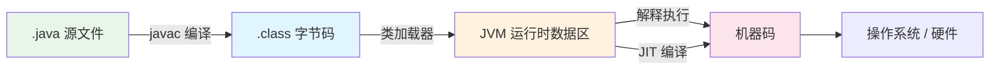

### 主流 JVM 实现

| JVM | 开发者 | 特点 |
|-----|--------|------|
| **HotSpot** | Oracle | 最广泛使用，默认 JVM，JIT 编译优化成熟 |
| **OpenJ9** | Eclipse/IBM | 内存占用小，启动快，适合云原生 |
| **GraalVM** | Oracle | 支持多语言（JS/Python/Ruby），AOT 编译 |
| **Azul Zing** | Azul | 无停顿 GC（C4），适合低延迟场景 |

## 运行时数据区

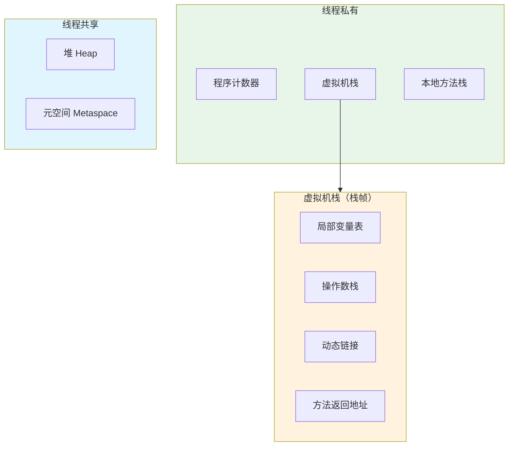

### 线程私有区域

#### 程序计数器（Program Counter）

- 当前线程执行到的**字节码行号指示器**
- 每个线程有独立的程序计数器（线程切换后恢复执行位置）
- 执行 Java 方法时记录字节码地址；执行 Native 方法时为空（Undefined）
- **唯一不会发生 OutOfMemoryError 的区域**

#### 虚拟机栈（VM Stack）

每个方法调用创建一个**栈帧（Stack Frame）**，包含：

| 组成 | 说明 |
|------|------|
| 局部变量表 | 存放方法参数和局部变量（基本类型、对象引用） |
| 操作数栈 | 方法执行过程中的临时操作区（入栈/出栈） |
| 动态链接 | 指向运行时常量池中该方法的引用 |
| 方法返回地址 | 方法退出后回到调用者的位置 |

```java
// 栈帧示例
public int calculate(int a, int b) {  // 局部变量表：this, a, b, result
    int result = a + b;               // 操作数栈：push a, push b, iadd
    return result;                    // 方法返回地址：回到调用者
}
```

- 栈深度超限 → `StackOverflowError`（常见于无限递归）
- 栈扩展失败 → `OutOfMemoryError`
- 默认栈大小：`-Xss256k`~`-Xss1m`

#### 本地方法栈（Native Method Stack）

- 为 `native` 方法（C/C++ 实现）服务
- HotSpot 中与虚拟机栈合并实现

### 线程共享区域

#### 堆（Heap）

**JVM 中最大的内存区域**，所有对象实例和数组都在堆上分配。

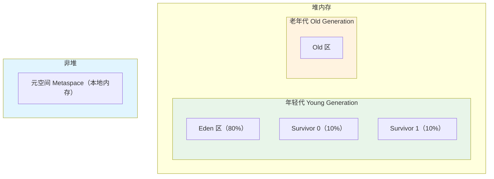

| 区域 | 说明 | GC 类型 |
|------|------|--------|
| Eden | 新对象首先分配在此 | Minor GC（Young GC） |
| Survivor 0/1 | Eden 存活对象拷贝到此，交替使用 | Minor GC |
| Old | 长期存活或大对象 | Major GC / Full GC |

**常用参数**：

```bash
-Xms512m        # 堆初始大小（建议与 -Xmx 相同，避免动态扩展）
-Xmx2g          # 堆最大大小
-Xmn256m        # 年轻代大小
-XX:SurvivorRatio=8          # Eden:S0:S1 = 8:1:1
-XX:NewRatio=2               # 老年代:年轻代 = 2:1
-XX:MaxTenuringThreshold=15  # 对象晋升老年代的年龄阈值
```

#### 元空间（Metaspace，JDK 8+）

- 取代 JDK 7 的永久代（PermGen），使用**本地内存（Native Memory）**
- 存储类的元数据（类结构、方法、字段、常量池等）
- 默认无上限，可通过 `-XX:MaxMetaspaceSize` 限制
- 不足时触发 Full GC 卸载不用的类

```bash
-XX:MetaspaceSize=128m         # 初始触发 GC 的阈值
-XX:MaxMetaspaceSize=512m      # 最大元空间
```

#### 运行时常量池

- 属于元空间的一部分
- 存放编译期生成的字面量和符号引用
- **字符串常量池（String Pool）**：JDK 7+ 移到堆中

```java
String s1 = "hello";                     // 字符串常量池
String s2 = new String("hello");          // 堆中新对象
String s3 = s2.intern();                  // 返回常量池中的引用
System.out.println(s1 == s3);             // true
System.out.println(s1 == s2);             // false
```

### 直接内存（Direct Memory）

- 不属于 JVM 运行时数据区，但频繁使用
- NIO 的 `ByteBuffer.allocateDirect()` 分配，避免 Java 堆与 Native 堆之间的数据拷贝
- 受限于 `-XX:MaxDirectMemorySize`
- 不足时抛出 `OutOfMemoryError`

## 对象的创建与内存布局

### 对象创建流程

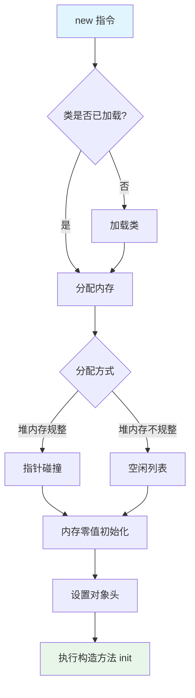

**并发分配安全**：
- **CAS + 失败重试**：保证分配操作的原子性
- **TLAB（Thread Local Allocation Buffer）**：每个线程预分配一小块 Eden 区内存，线程内分配无需同步

### 对象内存布局

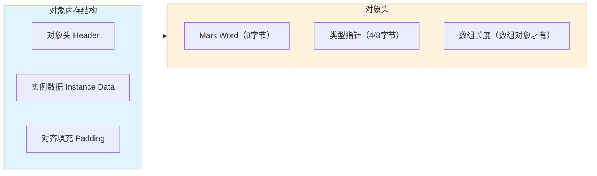

**Mark Word（64 位系统）**：

| 锁状态 | 内容 | 标志位 |
|--------|------|--------|
| 无锁 | hashCode、GC 分代年龄 | 01 |
| 偏向锁 | 线程 ID、Epoch、GC 年龄 | 01 |
| 轻量级锁 | 指向栈中 Lock Record 的指针 | 00 |
| 重量级锁 | 指向 Monitor 的指针 | 10 |
| GC 标记 | 空 | 11 |

> 对象大小必须是 **8 字节的整数倍**（对齐填充），有助于 CPU 缓存行对齐。

### 对象的访问定位

| 方式 | 实现 | 优点 | 缺点 |
|------|------|------|------|
| 句柄 | 栈引用 → 句柄池 → 对象实例 + 类型 | GC 移动对象时只改句柄 | 多一次间接寻址 |
| 直接指针（HotSpot 使用） | 栈引用 → 对象实例（含类型指针） | 速度快，少一次寻址 | GC 需更新所有引用 |

## 垃圾回收（GC）

### 如何判断对象可回收

#### 引用计数法（JVM 未采用）

为每个对象维护引用计数，计数为 0 则可回收。**缺陷：无法处理循环引用**。

#### 可达性分析（JVM 采用）

从 **GC Roots** 出发，沿引用链遍历，不可达的对象即为可回收。

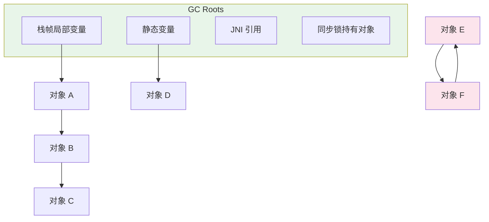

> 对象 E 和 F 虽然互相引用，但不可达于 GC Roots，仍会被回收。

**GC Roots 包括**：
- 虚拟机栈中引用的对象（局部变量、参数）
- 方法区中静态属性引用的对象
- 方法区中常量引用的对象
- 本地方法栈中 JNI 引用的对象
- synchronized 持有的对象
- JVM 内部引用（系统类加载器、基本类型的 Class 对象等）

### 四种引用类型

| 引用类型 | 回收时机 | 用途 | 示例 |
|---------|---------|------|------|
| 强引用（Strong） | 永不回收（只要可达） | 普通对象引用 | `Object obj = new Object()` |
| 软引用（Soft） | 内存不足时回收 | 缓存 | `SoftReference<byte[]>` |
| 弱引用（Weak） | 下次 GC 一定回收 | ThreadLocalMap 的 Key | `WeakReference<Object>` |
| 虚引用（Phantom） | 随时可能回收，无法获取对象 | 跟踪对象被 GC 的时机 | `PhantomReference` + `ReferenceQueue` |

```java
// 软引用做缓存：内存够时保留，不够时自动回收
SoftReference<byte[]> cache = new SoftReference<>(new byte[1024 * 1024 * 10]);
byte[] data = cache.get();  // 可能为 null（已被回收）

// 弱引用：GC 即回收
WeakReference<Object> weakRef = new WeakReference<>(new Object());
System.gc();
System.out.println(weakRef.get());  // null
```

### 垃圾回收算法

#### 标记-清除（Mark-Sweep）

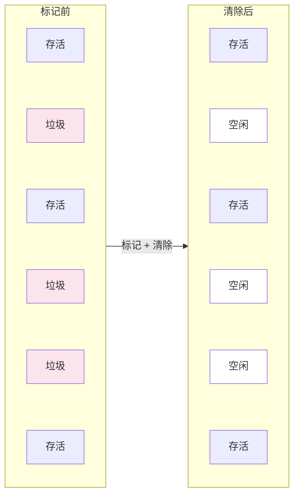

- 优点：简单
- 缺点：产生**内存碎片**，分配大对象时可能触发额外 GC

#### 标记-复制（Mark-Copy）

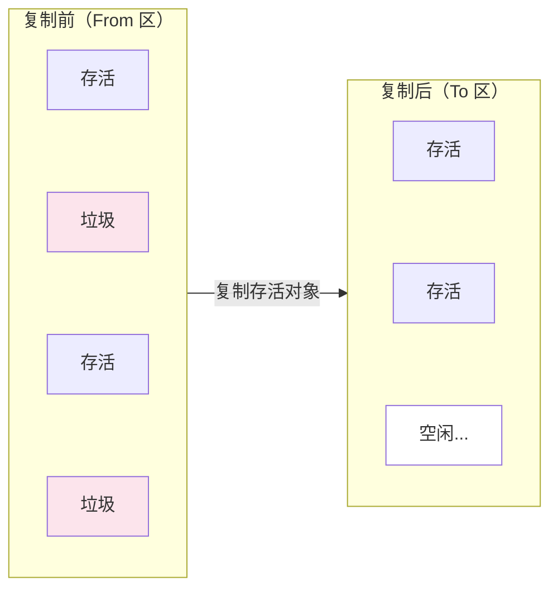

- 优点：无碎片，分配快（指针碰撞）
- 缺点：浪费一半内存空间
- **应用**：年轻代（Eden + Survivor 优化为 8:1:1，只浪费 10%）

#### 标记-整理（Mark-Compact）

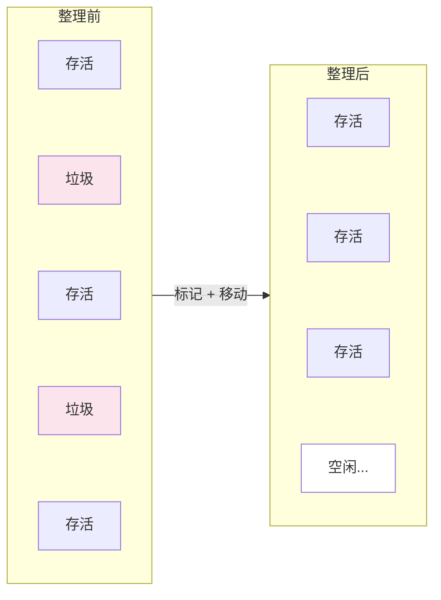

- 优点：无碎片
- 缺点：移动对象需要更新引用，STW 时间较长
- **应用**：老年代

#### 分代收集策略

| 代 | 算法 | 原因 |
|----|------|------|
| 年轻代 | 标记-复制 | 98% 以上对象朝生夕死，复制开销小 |
| 老年代 | 标记-清除 / 标记-整理 | 对象存活率高，复制开销大 |

### 垃圾收集器

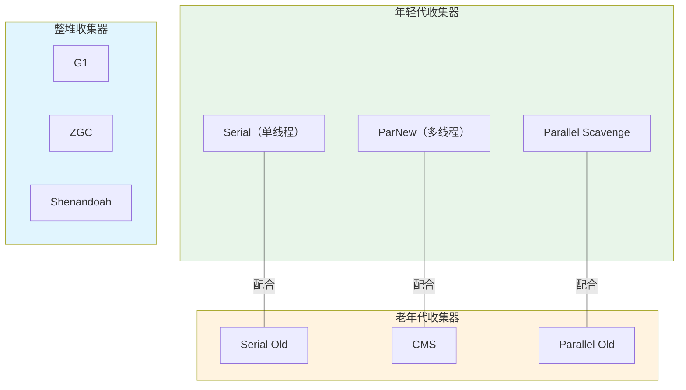

#### Serial / Serial Old

- **单线程**收集，GC 时 STW（Stop The World）
- 适合单核 CPU 或小内存（< 100MB）应用
- 参数：`-XX:+UseSerialGC`

#### Parallel Scavenge / Parallel Old（JDK 8 默认）

- **多线程**并行收集，追求高吞吐量
- 吞吐量 = 用户代码运行时间 / (用户代码运行时间 + GC 时间)
- 适合后台计算型应用（批处理、大数据）

```bash
-XX:+UseParallelGC                # 年轻代 Parallel Scavenge + 老年代 Parallel Old
-XX:ParallelGCThreads=8           # GC 线程数
-XX:MaxGCPauseMillis=200          # 最大停顿时间目标
-XX:GCTimeRatio=99                # 吞吐量目标（GC 时间占比 ≤ 1%）
-XX:+UseAdaptiveSizePolicy        # 自适应调整年轻代各区比例
```

#### CMS（Concurrent Mark Sweep）

以获取**最短回收停顿时间**为目标的老年代收集器（JDK 9 标记废弃，JDK 14 移除）。

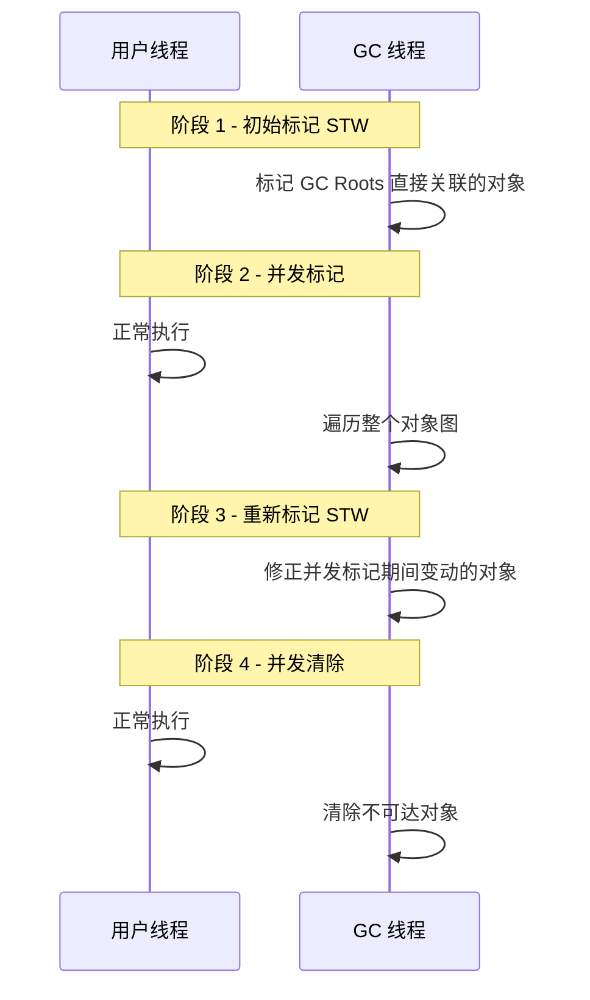

- 优点：并发收集，停顿短
- 缺点：CPU 敏感、产生浮动垃圾、内存碎片（标记-清除）
- 碎片过多时退化为 Serial Old 做 Full GC

#### G1（Garbage First，JDK 9+ 默认）

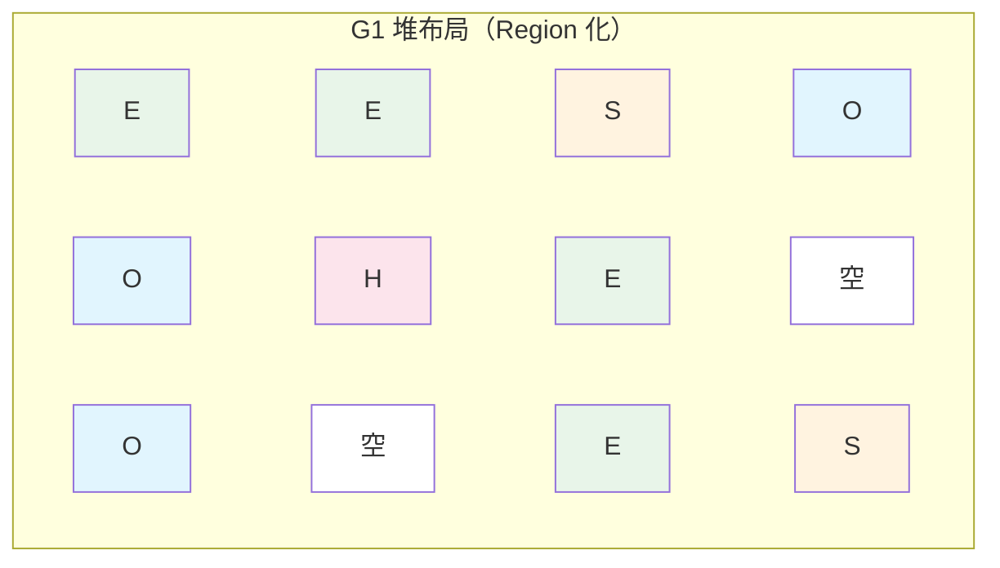

**核心设计**：
- 将堆划分为大小相等的 **Region**（1~32MB），取消物理分代
- 每个 Region 可以是 Eden、Survivor、Old 或 Humongous（大对象）
- 优先回收**垃圾最多**的 Region（Garbage First 名称由来）
- 通过 `MaxGCPauseMillis` 控制停顿时间目标

**回收过程**：

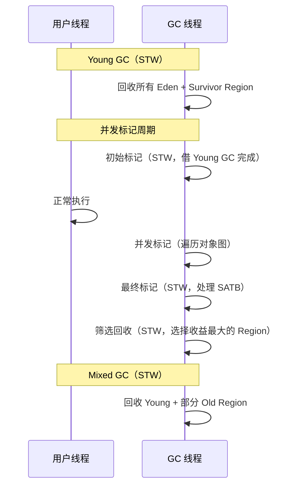

```bash
-XX:+UseG1GC                      # 启用 G1（JDK 9+ 默认）
-XX:MaxGCPauseMillis=200          # 目标停顿时间（默认 200ms）
-XX:G1HeapRegionSize=4m           # Region 大小（1~32MB，2 的幂）
-XX:InitiatingHeapOccupancyPercent=45  # 触发并发标记的堆占用比
-XX:G1MixedGCCountTarget=8       # Mixed GC 最大次数
```

#### ZGC（JDK 15+ 生产可用）

**超低延迟**收集器，停顿时间 **< 1ms**（不随堆大小增长）。

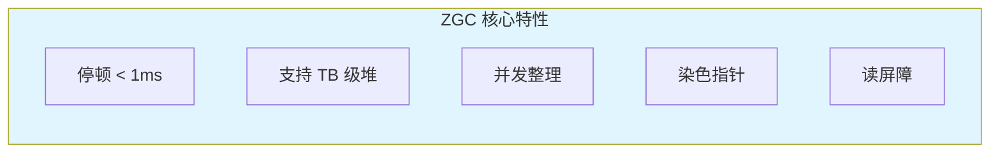

| 特性 | G1 | ZGC |
|------|-----|-----|
| 停顿时间 | 数十~数百 ms | < 1ms |
| 最大堆 | 数十 GB | 16 TB |
| 整理方式 | 部分并发 | 完全并发 |
| 核心技术 | SATB + Remember Set | 染色指针 + 读屏障 |
| JDK 版本 | 9+（默认） | 15+（生产可用） |

```bash
-XX:+UseZGC                        # 启用 ZGC
-XX:+ZGenerational                 # 分代 ZGC（JDK 21+，推荐）
-Xmx16g                           # 设置堆大小
-XX:SoftMaxHeapSize=4g             # 软性堆上限（ZGC 会尽量保持在此以下）
```

> **JDK 21+ 推荐使用分代 ZGC**（`-XX:+ZGenerational`），相比非分代 ZGC 大幅减少内存占用和 CPU 开销。

#### 收集器选择指南

| 场景 | 推荐收集器 | 理由 |
|------|-----------|------|
| 小内存（< 256MB） | Serial | 简单高效 |
| 后台计算/批处理 | Parallel | 高吞吐量 |
| Web 应用（JDK 8） | CMS / G1 | 低延迟 |
| Web 应用（JDK 11+） | G1 | 默认且成熟 |
| 低延迟要求（JDK 17+） | ZGC | 亚毫秒停顿 |
| 超大堆（> 16GB） | ZGC / G1 | ZGC 优于 G1 |

## 类加载机制

### 类的生命周期

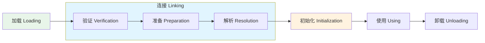

| 阶段 | 说明 |
|------|------|
| **加载** | 通过类全限定名找到 .class 文件，生成 `Class` 对象 |
| **验证** | 校验字节码合法性（格式、语义、字节码、符号引用） |
| **准备** | 为**类变量**（static）分配内存并设零值（`static int a = 10` → 先设为 0） |
| **解析** | 将符号引用替换为直接引用 |
| **初始化** | 执行 `<clinit>()` 方法（static 块、static 变量赋值），此时 `a = 10` |

### 类加载器与双亲委派

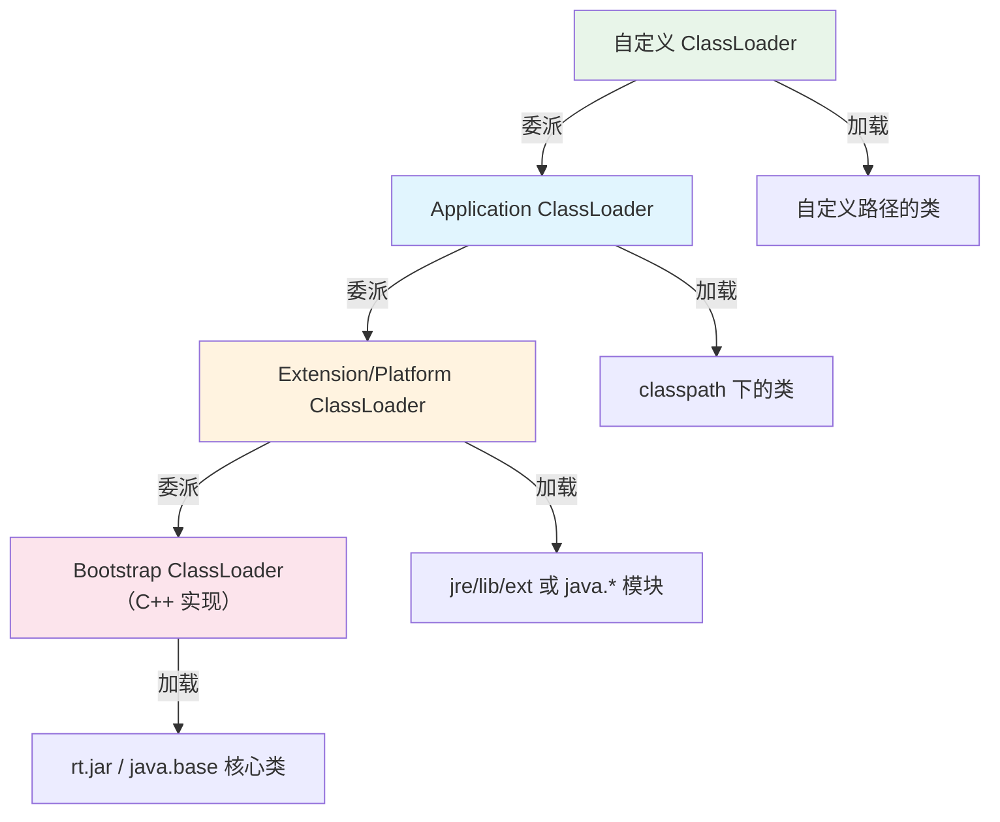

**双亲委派模型**：
1. 类加载请求先**向上委派**给父加载器
2. 父加载器无法加载时，才**向下**由子加载器尝试加载
3. 保证核心类库不被篡改（如自定义 `java.lang.String` 不会被加载）

```java
// 查看类加载器层级
ClassLoader cl = MyClass.class.getClassLoader();
while (cl != null) {
    System.out.println(cl);
    cl = cl.getParent();
}
// 输出：
// jdk.internal.loader.ClassLoaders$AppClassLoader
// jdk.internal.loader.ClassLoaders$PlatformClassLoader
// null (Bootstrap ClassLoader，C++ 实现，Java 中表示为 null)
```

### 打破双亲委派

| 场景 | 方式 | 示例 |
|------|------|------|
| SPI（Service Provider Interface） | 线程上下文类加载器 | JDBC 驱动、SLF4J |
| 热部署/热加载 | 自定义 ClassLoader | Tomcat、Spring DevTools |
| 模块隔离 | 自定义 ClassLoader | OSGi、Pandora |

```java
// 自定义类加载器（打破双亲委派）
public class HotSwapClassLoader extends ClassLoader {

    private final String classPath;

    public HotSwapClassLoader(String classPath) {
        this.classPath = classPath;
    }

    @Override
    protected Class<?> loadClass(String name, boolean resolve) throws ClassNotFoundException {
        // 非核心类：自己加载（打破双亲委派）
        if (!name.startsWith("java.") && !name.startsWith("javax.")) {
            Class<?> clazz = findLoadedClass(name);
            if (clazz == null) {
                byte[] bytes = loadClassBytes(name);
                if (bytes != null) {
                    clazz = defineClass(name, bytes, 0, bytes.length);
                }
            }
            if (clazz != null) {
                if (resolve) resolveClass(clazz);
                return clazz;
            }
        }
        // 核心类：委派给父加载器
        return super.loadClass(name, resolve);
    }

    private byte[] loadClassBytes(String name) {
        String path = classPath + "/" + name.replace('.', '/') + ".class";
        try (InputStream is = new FileInputStream(path)) {
            return is.readAllBytes();
        } catch (Exception e) {
            return null;
        }
    }
}
```

### 触发类初始化的时机

| 场景 | 示例 |
|------|------|
| `new` 创建对象 | `new User()` |
| 访问类的静态字段（非 final 常量） | `Config.MAX_SIZE` |
| 调用类的静态方法 | `Utils.parse()` |
| 反射调用 | `Class.forName("com.example.User")` |
| 子类初始化触发父类初始化 | 子类 `extends` 父类 |
| 启动类（main 方法所在类） | JVM 启动 |

> **不会触发初始化**：通过子类引用父类的静态字段、`Class.forName(name, false, loader)` 设置 initialize=false、final 常量（编译期已内联）。

## JIT 编译与优化

### 解释执行 vs JIT 编译

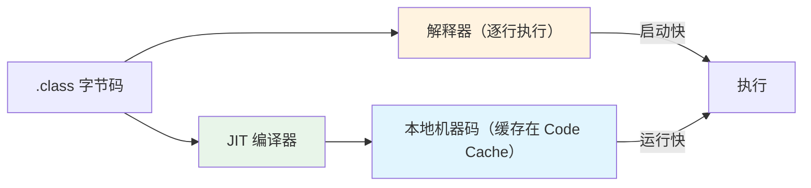

- **解释器**：启动快，逐行翻译执行
- **C1 编译器（Client）**：简单优化，编译快
- **C2 编译器（Server）**：深度优化，编译慢但运行最快
- **分层编译（Tiered Compilation）**：默认策略，先 C1 后 C2

### 热点探测

JIT 编译只针对**热点代码**（被频繁调用的方法或循环体）：

```bash
-XX:CompileThreshold=10000         # 方法调用计数器阈值（默认 10000 次）
-XX:+PrintCompilation              # 打印 JIT 编译日志
-XX:+UnlockDiagnosticVMOptions -XX:+PrintInlining  # 打印内联信息
```

### 常见 JIT 优化

| 优化技术 | 说明 |
|---------|------|
| 方法内联（Inlining） | 将短方法的代码嵌入调用处，消除方法调用开销 |
| 逃逸分析（Escape Analysis） | 分析对象是否逃逸出方法/线程 |
| 标量替换 | 不逃逸的对象拆散为基本类型放到栈上（避免堆分配） |
| 栈上分配 | 不逃逸的对象直接在栈上分配（方法结束自动回收） |
| 锁消除 | 不可能存在竞争的锁自动移除 |
| 锁粗化 | 连续多次加锁/解锁合并为一次 |
| 循环展开 | 减少循环判断次数 |
| 空值检查消除 | 通过分析移除不必要的 null 检查 |

```java
// 逃逸分析示例
public int calculate() {
    // point 没有逃逸出方法 → JIT 可以标量替换
    Point point = new Point(1, 2);
    return point.x + point.y;
    // 优化后等价于：return 1 + 2;（无需堆分配）
}

// 锁消除示例
public String concat(String s1, String s2) {
    // StringBuffer 是线程安全的（内部加锁），但这里不可能被其他线程访问
    // JIT 会消除 StringBuffer 内部的 synchronized
    StringBuffer sb = new StringBuffer();
    sb.append(s1);
    sb.append(s2);
    return sb.toString();
}
```

## 内存溢出（OOM）排查

### 常见 OOM 类型

| OOM 类型 | 原因 | 排查方向 |
|---------|------|---------|
| `Java heap space` | 堆内存不足 | 内存泄漏、大对象、堆太小 |
| `Metaspace` | 元空间不足 | 类太多、动态代理、JSP 编译 |
| `GC overhead limit exceeded` | GC 回收不到足够内存 | 内存泄漏、堆太小 |
| `Direct buffer memory` | 直接内存不足 | NIO ByteBuffer 未释放 |
| `unable to create new native thread` | 线程数超限 | 线程泄漏、系统 ulimit 限制 |
| `StackOverflowError` | 栈溢出 | 无限递归、栈太小 |

### OOM 排查流程

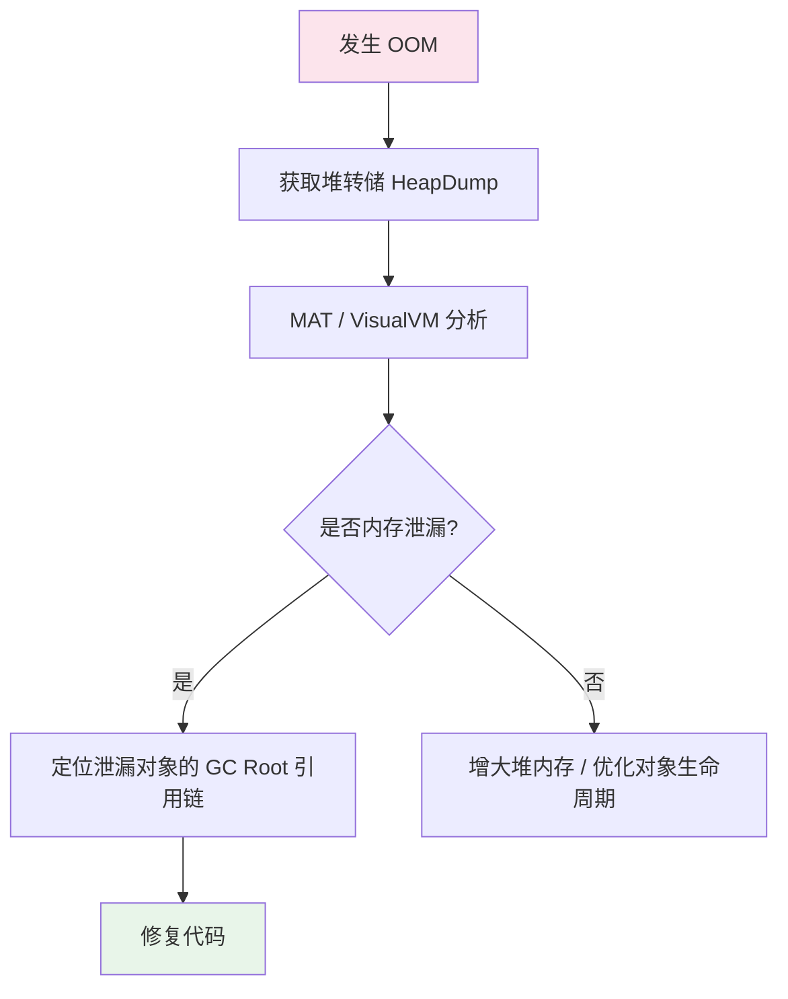

### 常用诊断命令

```bash
# ===== 堆内存信息 =====

# 查看堆内存使用情况
jmap -heap <pid>

# 生成堆转储文件（Heap Dump）
jmap -dump:format=b,file=heapdump.hprof <pid>

# 存活对象统计（会触发 Full GC）
jmap -histo:live <pid> | head -30

# ===== JVM 启动时配置自动 dump =====
-XX:+HeapDumpOnOutOfMemoryError
-XX:HeapDumpPath=/tmp/heapdump.hprof

# ===== 线程信息 =====

# 线程堆栈（排查死锁、CPU 高）
jstack <pid>

# 查看线程数
jstack <pid> | grep "java.lang.Thread.State" | sort | uniq -c

# ===== 实时监控 =====

# 查看 GC 统计（每秒刷新）
jstat -gcutil <pid> 1000

# 输出示例：
#   S0     S1     E      O      M     CCS    YGC     YGCT    FGC    FGCT     GCT
#   0.00  95.20  65.30  45.12  97.50  94.20    120    1.230     3    0.560   1.790
# E=Eden O=Old M=Metaspace YGC=Young GC次数 FGC=Full GC次数

# ===== JDK 自带工具 =====
jconsole          # 图形化监控（JMX）
jvisualvm         # 综合分析工具（采样、Dump、线程）
jfr               # JDK Flight Recorder（低开销生产诊断）

# ===== arthas（阿里开源，生产推荐） =====
# 下载并启动
curl -O https://arthas.aliyun.com/arthas-boot.jar
java -jar arthas-boot.jar

# 常用命令
dashboard                      # 实时面板（CPU、内存、线程、GC）
thread -n 5                    # CPU 最高的 5 个线程
thread -b                      # 检测死锁
heapdump /tmp/dump.hprof       # 生成堆转储
jad com.example.MyClass        # 反编译类
watch com.example.MyService method "{params,returnObj}" -x 3  # 观察方法调用
trace com.example.MyService method  # 方法调用耗时追踪
```

### 实战：排查堆内存泄漏

```bash
# 1. 发现 Full GC 频繁，老年代持续增长
jstat -gcutil <pid> 1000
# O(Old) 持续 > 90%，FGC 次数不断增加

# 2. 导出堆转储
jmap -dump:format=b,file=heapdump.hprof <pid>

# 3. MAT（Eclipse Memory Analyzer）分析
# - 打开 heapdump.hprof
# - Leak Suspects Report → 自动检测泄漏嫌疑
# - Dominator Tree → 找占用内存最大的对象
# - Path to GC Roots → 查看谁持有引用导致不能回收

# 4. 常见泄漏原因
# - 集合（Map/List）只添加不删除
# - 静态集合持有大量对象
# - 未关闭的资源（Connection、Stream）
# - ThreadLocal 未 remove()
# - 内部类持有外部类引用
# - 监听器/回调未注销
```

## GC 日志分析

### 开启 GC 日志

```bash
# JDK 9+ 统一日志框架（推荐）
-Xlog:gc*:file=gc.log:time,uptime,level,tags:filecount=5,filesize=100m

# JDK 8
-XX:+PrintGCDetails -XX:+PrintGCDateStamps -Xloggc:gc.log
-XX:+PrintGCApplicationStoppedTime
```

### G1 GC 日志示例

```
[2026-02-08T10:30:15.123+0800] GC(142) Pause Young (Normal) (G1 Evacuation Pause)
[2026-02-08T10:30:15.123+0800] GC(142)   Eden regions: 24->0(24)
[2026-02-08T10:30:15.123+0800] GC(142)   Survivor regions: 3->3(4)
[2026-02-08T10:30:15.123+0800] GC(142)   Old regions: 18->19
[2026-02-08T10:30:15.123+0800] GC(142)   Humongous regions: 0->0
[2026-02-08T10:30:15.123+0800] GC(142) Pause Young (Normal) 180M->88M(512M) 12.345ms
```

| 字段 | 含义 |
|------|------|
| Pause Young (Normal) | 年轻代 GC（正常触发） |
| Eden 24→0 | 24 个 Eden Region 全部回收 |
| Survivor 3→3 | 3 个 Survivor Region 存活 |
| Old 18→19 | 老年代从 18 增长到 19（有晋升） |
| 180M→88M(512M) | GC 前 180M → GC 后 88M（堆总大小 512M） |
| 12.345ms | GC 停顿时间 |

### GC 日志分析工具

| 工具 | 说明 |
|------|------|
| **GCEasy**（gceasy.io） | 在线分析，生成可视化报告 |
| **GCViewer** | 开源桌面工具 |
| **Grafana + Prometheus** | JMX 指标实时监控 |
| **JDK Mission Control** | Oracle 官方分析工具 |

## 生产环境调优

### JVM 参数模板

#### Web 应用（4C8G，JDK 17，G1）

```bash
# 堆内存
-Xms4g -Xmx4g                         # 堆初始=最大，避免动态扩展
-XX:MaxMetaspaceSize=512m              # 元空间上限

# G1 收集器
-XX:+UseG1GC
-XX:MaxGCPauseMillis=200               # 目标停顿 200ms
-XX:G1HeapRegionSize=8m                # Region 8MB
-XX:InitiatingHeapOccupancyPercent=45  # 45% 堆占用触发并发标记

# GC 日志
-Xlog:gc*:file=/var/log/app/gc.log:time,uptime,level,tags:filecount=5,filesize=100m

# OOM 诊断
-XX:+HeapDumpOnOutOfMemoryError
-XX:HeapDumpPath=/var/log/app/heapdump.hprof

# 其他
-XX:+UseStringDeduplication            # G1 字符串去重
-XX:+AlwaysPreTouch                    # 启动时预分配物理内存
-XX:+DisableExplicitGC                 # 禁用 System.gc()
```

#### 低延迟应用（8C16G，JDK 21，ZGC）

```bash
-Xms8g -Xmx8g
-XX:+UseZGC
-XX:+ZGenerational                     # 分代 ZGC
-XX:SoftMaxHeapSize=6g                 # 软性堆上限
-XX:MaxMetaspaceSize=512m
-Xlog:gc*:file=gc.log:time:filecount=5,filesize=100m
-XX:+HeapDumpOnOutOfMemoryError
```

### 调优思路

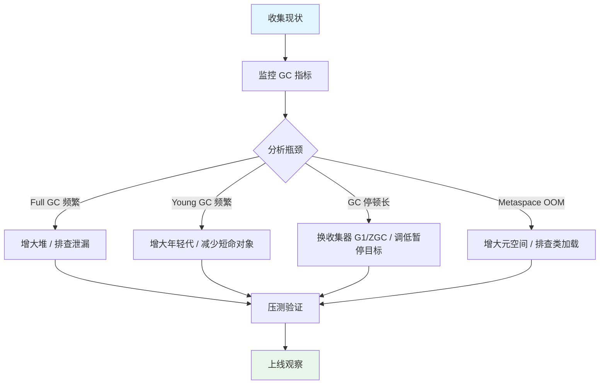

### 关键调优指标

| 指标 | 健康范围 | 告警阈值 |
|------|---------|---------|
| Young GC 频率 | < 10 次/分钟 | > 30 次/分钟 |
| Young GC 耗时 | < 50ms | > 200ms |
| Full GC 频率 | < 1 次/小时 | > 1 次/10分钟 |
| Full GC 耗时 | < 1s | > 5s |
| 堆使用率 | < 75% | > 90% |
| 元空间使用率 | < 80% | > 90% |

### 代码层面优化

```java
// 1. 避免在循环中创建对象
// ❌
for (int i = 0; i < 10000; i++) {
    String s = new String("hello");  // 创建 10000 个对象
}
// ✅
String s = "hello";  // 字符串常量池复用

// 2. 使用 StringBuilder 拼接字符串
// ❌
String result = "";
for (String s : list) {
    result += s;  // 每次拼接创建新 String + StringBuilder
}
// ✅
StringBuilder sb = new StringBuilder(list.size() * 16);
for (String s : list) {
    sb.append(s);
}
String result = sb.toString();

// 3. 合理设置集合初始容量
// ❌
List<User> users = new ArrayList<>();  // 默认 10，频繁扩容
// ✅
List<User> users = new ArrayList<>(expectedSize);

// 4. 及时释放资源
// ✅ try-with-resources
try (Connection conn = dataSource.getConnection();
     PreparedStatement ps = conn.prepareStatement(sql);
     ResultSet rs = ps.executeQuery()) {
    // ...
}

// 5. 避免大对象直接进入老年代
// 大数组分批处理，大文件流式读取

// 6. 使用对象池（连接池、线程池）
// 避免频繁创建/销毁重量级对象
```

## 面试高频总结

| 问题 | 要点 |
|------|------|
| JVM 运行时数据区 | 程序计数器、虚拟机栈、本地方法栈（线程私有）；堆、元空间（线程共享） |
| 堆的分代结构 | 年轻代（Eden + 2 Survivor）+ 老年代；新对象 Eden → Survivor → Old |
| 对象创建过程 | 类加载检查 → 分配内存（指针碰撞/空闲列表）→ 零值初始化 → 设置对象头 → 构造方法 |
| 判断对象可回收 | 可达性分析（GC Roots），非引用计数 |
| GC 算法 | 标记-清除（碎片）、标记-复制（年轻代）、标记-整理（老年代） |
| G1 收集器原理 | Region 化堆布局 + 优先回收垃圾最多的 Region + 可控停顿时间 |
| ZGC 特点 | 染色指针 + 读屏障 + 并发整理，停顿 < 1ms |
| 类加载过程 | 加载 → 验证 → 准备 → 解析 → 初始化 |
| 双亲委派模型 | 先委派父加载器，父无法加载再自己加载；保证核心类安全 |
| 打破双亲委派 | SPI（线程上下文 ClassLoader）、Tomcat 热部署、OSGi |
| OOM 排查 | HeapDump + MAT 分析 Dominator Tree + GC Roots 引用链 |
| Full GC 频繁 | 老年代不足（内存泄漏 / 大对象 / 堆太小），查 jstat + HeapDump |
| JIT 优化 | 方法内联、逃逸分析、标量替换、锁消除、锁粗化 |
| 强/软/弱/虚引用 | 强=不回收、软=OOM前回收、弱=下次GC回收、虚=跟踪回收 |
| Metaspace vs PermGen | Metaspace 使用本地内存（JDK 8+），不易 OOM；PermGen 在堆中，固定大小 |
