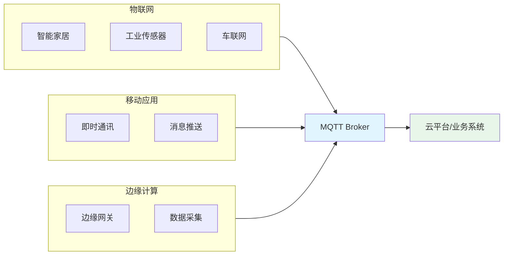
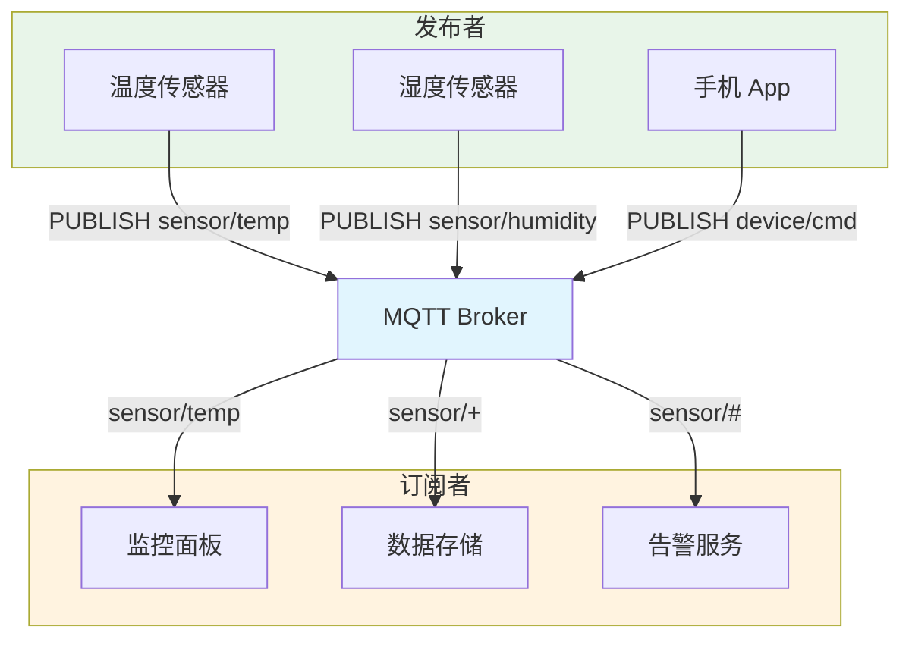
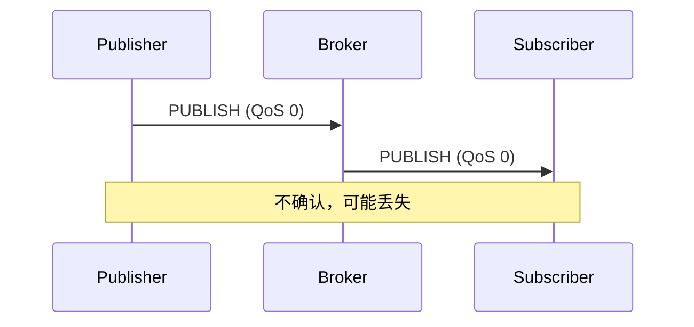
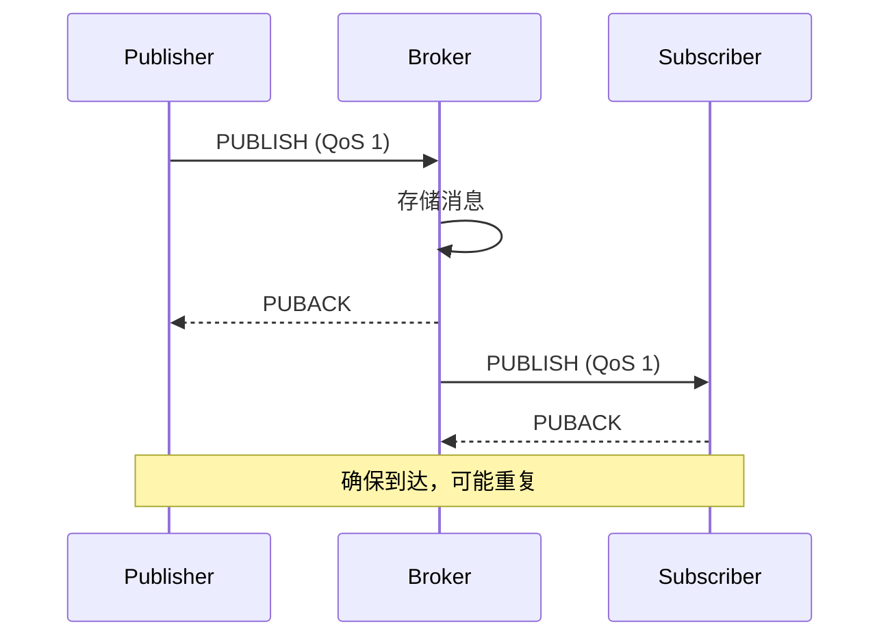
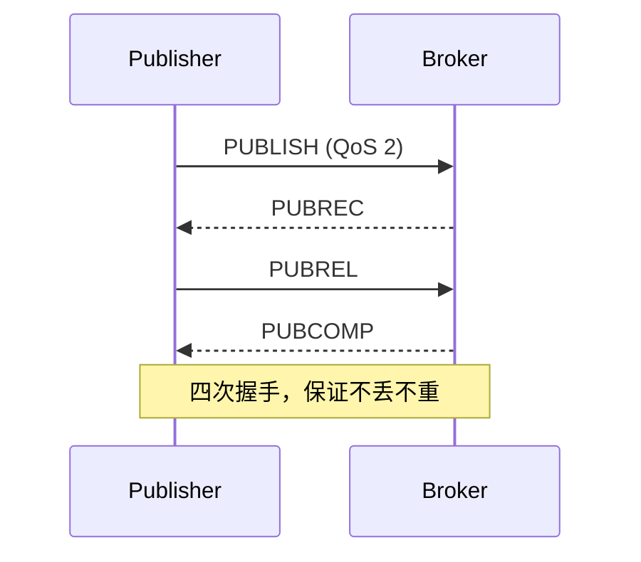
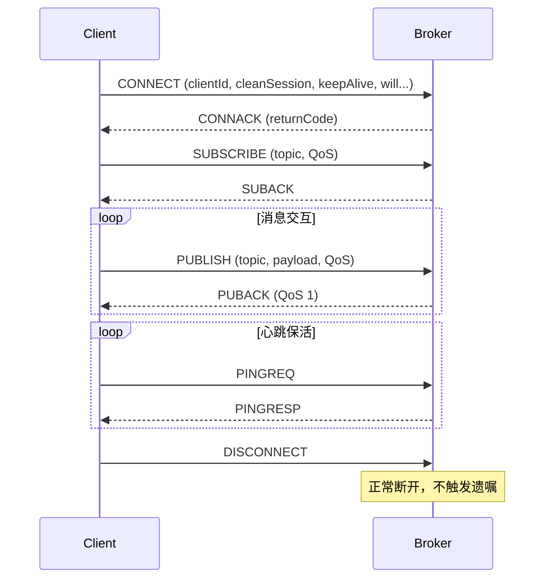
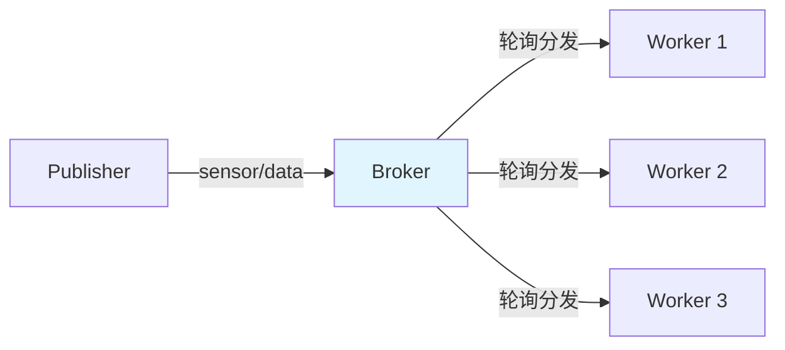
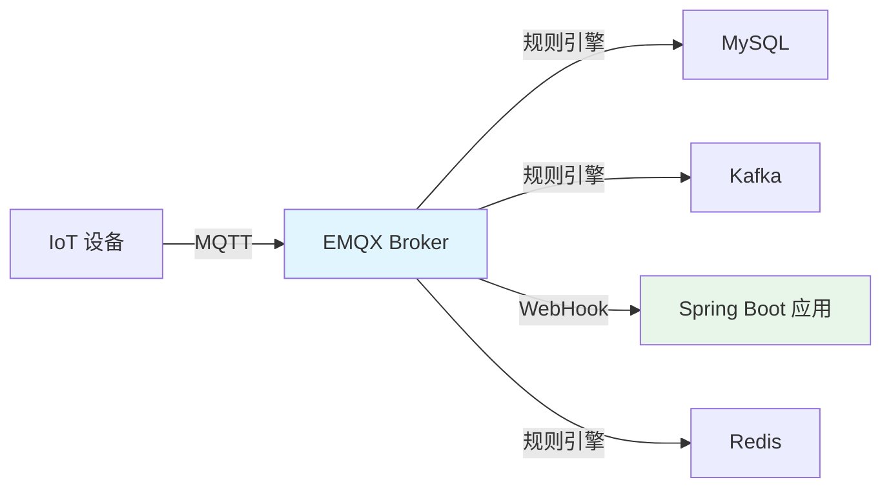
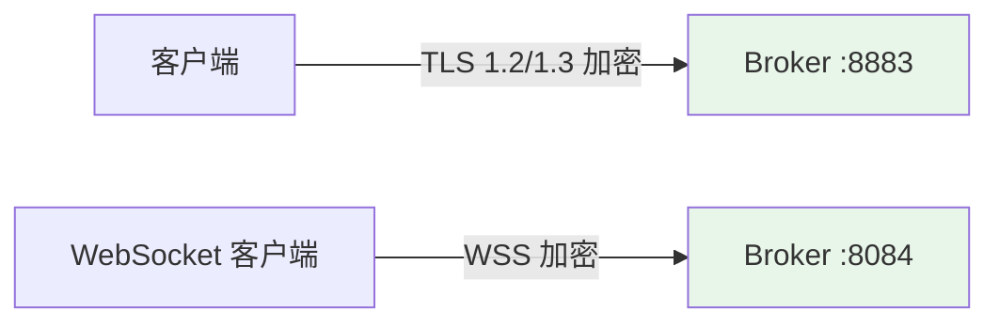
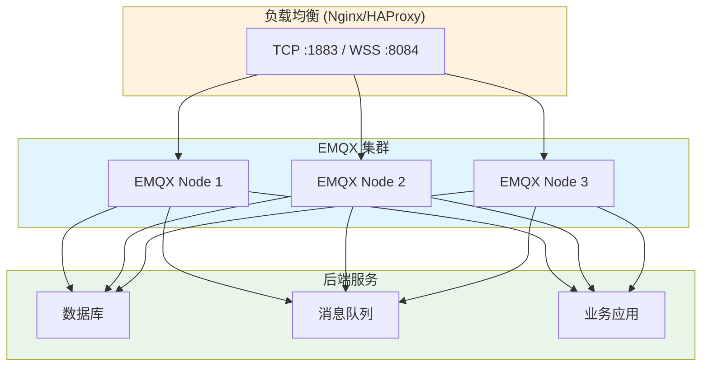

## MQTT 简介

**MQTT（Message Queuing Telemetry Transport）** 是一种基于 **发布/订阅模式** 的轻量级消息协议，专为低带宽、高延迟、不稳定网络环境设计。它由 IBM 的 Andy Stanford-Clark 和 Arlen Nipper 于 1999 年发明，2014 年成为 OASIS 标准，目前最新版本为 **MQTT 5.0**。

### 为什么选择 MQTT

| 特性 | 说明 |
|------|------|
| 轻量高效 | 协议头最小仅 2 字节，适合带宽受限的 IoT 设备 |
| 发布/订阅 | 发送方与接收方完全解耦，通过 Broker 中转 |
| QoS 保障 | 三种服务质量等级，满足不同可靠性需求 |
| 遗嘱消息 | 设备异常离线时自动发布预设消息 |
| 保留消息 | 新订阅者可立即获取主题最后一条消息 |
| 持久会话 | 离线期间消息不丢失，上线后自动推送 |
| 双向通信 | 设备既可上报数据，也可接收下行指令 |
| 跨平台 | 几乎所有语言和平台都有成熟客户端库 |

### 应用场景



- **物联网（IoT）**：智能家居、环境监测、工业 4.0、农业物联网
- **车联网（V2X）**：车辆状态上报、远程控制、OTA 升级
- **移动应用**：即时通讯、消息推送、实时位置共享
- **边缘计算**：传感器数据采集、边缘网关转发

## MQTT 协议原理

### 发布/订阅模型



**核心角色**：

- **Publisher（发布者）**：向某个主题发布消息
- **Subscriber（订阅者）**：订阅感兴趣的主题，接收消息
- **Broker（代理服务器）**：消息路由中心，负责接收、过滤和分发消息
- **Topic（主题）**：消息的通道标识，使用 `/` 分隔的层级结构

> 同一个客户端可以同时是发布者和订阅者。

### 主题（Topic）与通配符

MQTT 主题使用层级结构，支持两种通配符：

| 通配符 | 说明 | 示例 |
|--------|------|------|
| `+` | 单层通配，匹配一个层级 | `sensor/+/temp` 匹配 `sensor/room1/temp`、`sensor/room2/temp` |
| `#` | 多层通配，匹配零个或多个层级 | `sensor/#` 匹配 `sensor`、`sensor/temp`、`sensor/room1/temp` |

**主题设计最佳实践**：

```
# 推荐的层级结构
{区域}/{设备类型}/{设备ID}/{数据类型}

# 示例
building-a/sensor/device-001/temperature
building-a/sensor/device-001/humidity
building-a/camera/device-002/status
home/livingroom/light/switch
vehicle/truck-001/gps/location
```

> **注意**：主题以 `$` 开头的为系统主题（如 `$SYS/#`），不建议业务使用。

### QoS 服务质量等级

MQTT 定义了三种 QoS 等级，在消息可靠性和传输开销之间做平衡：

#### QoS 0 — 最多一次（At Most Once）



- **"发射即忘"**，不保证消息到达
- 无确认、无重试
- 适用场景：高频传感器数据（丢失个别数据点可接受）

#### QoS 1 — 至少一次（At Least Once）



- 保证消息至少到达一次，可能重复
- 接收方需做幂等处理
- 适用场景：设备指令下发、状态上报

#### QoS 2 — 精确一次（Exactly Once）



- 四次握手，保证消息恰好到达一次
- 开销最大，延迟最高
- 适用场景：金融交易、计费系统

#### QoS 等级对比

| 等级 | 可靠性 | 性能 | 报文交互 | 适用场景 |
|------|--------|------|---------|---------|
| QoS 0 | 可能丢失 | 最高 | 1 次 | 高频遥测、环境数据 |
| QoS 1 | 不丢但可能重复 | 中等 | 2 次 | 设备控制、状态上报 |
| QoS 2 | 不丢不重 | 最低 | 4 次 | 计费、交易指令 |

### 连接生命周期



### CONNECT 报文关键参数

| 参数 | 说明 |
|------|------|
| `clientId` | 客户端唯一标识，Broker 据此识别身份和持久会话 |
| `cleanSession` | `true`：连接时清除之前的会话和离线消息；`false`：恢复之前的订阅和未消费消息 |
| `keepAlive` | 心跳间隔（秒），超过 1.5 倍时间未收到消息则判定为离线 |
| `username / password` | 认证凭据 |
| `will` | 遗嘱消息（topic、payload、QoS、retain） |

### 遗嘱消息（Last Will and Testament）

客户端在 CONNECT 时可以预设一条遗嘱消息。当客户端**异常断开**（非正常 DISCONNECT）时，Broker 自动向指定主题发布该消息。

```java
// 典型用法：设备在线状态管理
// 连接时设置遗嘱
Will: topic = "device/device-001/status", payload = "offline", QoS = 1, retain = true

// 连接成功后主动发布上线消息
PUBLISH: topic = "device/device-001/status", payload = "online", retain = true

// 设备掉电或断网 → Broker 自动发布遗嘱
// 订阅者收到 "device/device-001/status" → "offline"
```

### 保留消息（Retained Message）

发布消息时设置 `retain = true`，Broker 会保存该主题最后一条保留消息。当新客户端订阅该主题时，会立即收到这条消息，无需等待下一次发布。

```
# 发布保留消息
PUBLISH topic="room/temp" payload="25.6°C" retain=true

# 新订阅者订阅后立即收到 "25.6°C"
SUBSCRIBE topic="room/temp"
→ 收到 "25.6°C"（保留消息）
```

> 适合场景：设备在线状态、最后一次传感器读数、配置下发。

### MQTT 5.0 新特性

MQTT 5.0 在 3.1.1 基础上新增了众多实用特性：

| 特性 | 说明 |
|------|------|
| 用户属性（User Properties） | 消息可携带自定义 KV 属性，类似 HTTP Header |
| 原因码（Reason Code） | 所有响应报文携带原因码，便于调试 |
| 共享订阅（Shared Subscription） | `$share/{group}/{topic}` 实现消费者负载均衡 |
| 主题别名（Topic Alias） | 用数字别名替代长主题字符串，减少带宽 |
| 消息过期（Message Expiry） | 设置消息的 TTL，过期自动丢弃 |
| 流量控制（Flow Control） | 客户端可限制 Broker 的未确认消息数 |
| 请求/响应模式 | 通过响应主题和关联数据实现类 RPC 调用 |
| 订阅选项 | 控制是否接收自己发布的消息、保留消息处理策略 |
| 会话过期间隔 | 精确控制离线会话的保留时长 |

#### 共享订阅示例

```
# 普通订阅：每个订阅者都收到所有消息
SUBSCRIBE topic="sensor/data"

# 共享订阅：组内消费者负载均衡（只有一个收到）
SUBSCRIBE topic="$share/worker-group/sensor/data"
```



## Broker 部署

### 主流 MQTT Broker 对比

| Broker | 语言 | 集群 | 性能 | 协议支持 | 适用场景 |
|--------|------|------|------|---------|---------|
| **EMQX** | Erlang | 原生集群 | 单机百万连接 | MQTT 3.1/3.1.1/5.0 | 企业级 IoT 平台 |
| **Mosquitto** | C | 需额外方案 | 单机十万连接 | MQTT 3.1/3.1.1/5.0 | 开发测试、中小项目 |
| **HiveMQ** | Java | 商业版集群 | 高 | MQTT 3.1/3.1.1/5.0 | 企业级、Kafka 集成 |
| **NanoMQ** | C | 有限支持 | 极高 | MQTT 3.1.1/5.0 | 边缘计算、嵌入式 |
| **VerneMQ** | Erlang | 原生集群 | 高 | MQTT 3.1/3.1.1/5.0 | 开源集群方案 |

### Docker 部署 EMQX（推荐）

#### 单节点部署

```bash
docker run -d \
  --name emqx \
  -p 1883:1883 \
  -p 8083:8083 \
  -p 8084:8084 \
  -p 8883:8883 \
  -p 18083:18083 \
  -v emqx-data:/opt/emqx/data \
  -v emqx-log:/opt/emqx/log \
  -e EMQX_NAME=emqx \
  -e EMQX_HOST=127.0.0.1 \
  emqx/emqx:5.6.0
```

**端口说明**：

| 端口 | 协议 | 说明 |
|------|------|------|
| 1883 | MQTT | MQTT TCP 连接 |
| 8883 | MQTTS | MQTT over TLS/SSL |
| 8083 | WS | MQTT over WebSocket |
| 8084 | WSS | MQTT over WebSocket + TLS |
| 18083 | HTTP | EMQX Dashboard 管理后台 |

> 部署后访问 `http://IP:18083`，默认账号 `admin`，密码 `public`。

#### EMQX 集群部署（docker-compose.yml）

```yaml
version: "3.8"

networks:
  emqx-bridge:
    driver: bridge

services:
  emqx1:
    image: emqx/emqx:5.6.0
    container_name: emqx1
    hostname: emqx1
    environment:
      EMQX_NAME: emqx
      EMQX_HOST: emqx1
      EMQX_CLUSTER__DISCOVERY_STRATEGY: static
      EMQX_CLUSTER__STATIC__SEEDS: "[emqx@emqx1,emqx@emqx2,emqx@emqx3]"
      EMQX_LISTENERS__TCP__DEFAULT__BIND: "0.0.0.0:1883"
      EMQX_DASHBOARD__DEFAULT_USERNAME: admin
      EMQX_DASHBOARD__DEFAULT_PASSWORD: admin123
    ports:
      - "1883:1883"
      - "8083:8083"
      - "18083:18083"
    volumes:
      - emqx1-data:/opt/emqx/data
    networks:
      - emqx-bridge

  emqx2:
    image: emqx/emqx:5.6.0
    container_name: emqx2
    hostname: emqx2
    environment:
      EMQX_NAME: emqx
      EMQX_HOST: emqx2
      EMQX_CLUSTER__DISCOVERY_STRATEGY: static
      EMQX_CLUSTER__STATIC__SEEDS: "[emqx@emqx1,emqx@emqx2,emqx@emqx3]"
      EMQX_LISTENERS__TCP__DEFAULT__BIND: "0.0.0.0:1883"
    ports:
      - "1884:1883"
    volumes:
      - emqx2-data:/opt/emqx/data
    networks:
      - emqx-bridge

  emqx3:
    image: emqx/emqx:5.6.0
    container_name: emqx3
    hostname: emqx3
    environment:
      EMQX_NAME: emqx
      EMQX_HOST: emqx3
      EMQX_CLUSTER__DISCOVERY_STRATEGY: static
      EMQX_CLUSTER__STATIC__SEEDS: "[emqx@emqx1,emqx@emqx2,emqx@emqx3]"
      EMQX_LISTENERS__TCP__DEFAULT__BIND: "0.0.0.0:1883"
    ports:
      - "1885:1883"
    volumes:
      - emqx3-data:/opt/emqx/data
    networks:
      - emqx-bridge

volumes:
  emqx1-data:
  emqx2-data:
  emqx3-data:
```

```bash
# 启动集群
docker-compose up -d

# 验证集群状态（进入任意节点）
docker exec -it emqx1 emqx_ctl cluster status
```

### Docker 部署 Mosquitto（轻量）

```bash
# 创建配置文件
mkdir -p mosquitto/config mosquitto/data mosquitto/log

cat > mosquitto/config/mosquitto.conf << 'EOF'
listener 1883
protocol mqtt
listener 9001
protocol websockets
allow_anonymous true
persistence true
persistence_location /mosquitto/data/
log_dest file /mosquitto/log/mosquitto.log
EOF

# 启动 Mosquitto
docker run -d \
  --name mosquitto \
  -p 1883:1883 \
  -p 9001:9001 \
  -v $(pwd)/mosquitto/config:/mosquitto/config \
  -v $(pwd)/mosquitto/data:/mosquitto/data \
  -v $(pwd)/mosquitto/log:/mosquitto/log \
  eclipse-mosquitto:2.0
```

#### 启用认证

```bash
# 生成密码文件
docker exec -it mosquitto mosquitto_passwd -c /mosquitto/config/passwd admin
# 输入密码

# 修改配置
cat > mosquitto/config/mosquitto.conf << 'EOF'
listener 1883
protocol mqtt
allow_anonymous false
password_file /mosquitto/config/passwd
persistence true
persistence_location /mosquitto/data/
EOF

# 重启
docker restart mosquitto
```

### 命令行测试工具

```bash
# 安装 mosquitto 客户端
# Ubuntu: apt install mosquitto-clients
# Mac: brew install mosquitto

# 订阅主题
mosquitto_sub -h 192.168.131.128 -p 1883 -t "sensor/#" -v

# 发布消息
mosquitto_pub -h 192.168.131.128 -p 1883 -t "sensor/temp" -m '{"value":25.6}'

# 带认证
mosquitto_pub -h 192.168.131.128 -p 1883 -u admin -P password \
  -t "device/cmd" -m '{"action":"reboot"}' -q 1

# 带遗嘱消息
mosquitto_sub -h 192.168.131.128 -p 1883 -t "status/#" \
  --will-topic "status/client-1" --will-payload "offline" --will-qos 1 --will-retain
```

## Java / Spring Boot 集成

### 方式一：Eclipse Paho 原生客户端

#### 添加依赖

```xml
<dependency>
    <groupId>org.eclipse.paho</groupId>
    <artifactId>org.eclipse.paho.mqttv5.client</artifactId>
    <version>1.2.5</version>
</dependency>
```

#### 连接与发布/订阅

```java
import org.eclipse.paho.mqttv5.client.*;
import org.eclipse.paho.mqttv5.common.MqttException;
import org.eclipse.paho.mqttv5.common.MqttMessage;
import org.eclipse.paho.mqttv5.common.MqttSubscription;
import org.eclipse.paho.mqttv5.common.packet.MqttProperties;

public class MqttV5Example {

    public static void main(String[] args) throws Exception {
        String broker = "tcp://192.168.131.128:1883";
        String clientId = "java-client-001";

        MqttClient client = new MqttClient(broker, clientId);

        // 连接选项
        MqttConnectionOptions options = new MqttConnectionOptions();
        options.setAutomaticReconnect(true);
        options.setCleanStart(false);             // 持久会话
        options.setKeepAliveInterval(60);
        options.setConnectionTimeout(30);
        options.setUserName("admin");
        options.setPassword("admin123".getBytes());

        // 遗嘱消息
        MqttMessage willMessage = new MqttMessage("offline".getBytes());
        willMessage.setQos(1);
        willMessage.setRetained(true);
        options.setWill("device/" + clientId + "/status", willMessage);

        // 设置回调
        client.setCallback(new MqttCallback() {
            @Override
            public void disconnected(MqttDisconnectResponse response) {
                System.out.println("连接断开: " + response.getReasonString());
            }

            @Override
            public void mqttErrorOccurred(MqttException exception) {
                System.err.println("MQTT 错误: " + exception.getMessage());
            }

            @Override
            public void messageArrived(String topic, MqttMessage message) {
                System.out.printf("收到消息: topic=%s, qos=%d, payload=%s%n",
                    topic, message.getQos(), new String(message.getPayload()));
            }

            @Override
            public void deliveryComplete(IMqttToken token) {
                System.out.println("消息已送达: " + token.getMessageId());
            }

            @Override
            public void connectComplete(boolean reconnect, String serverURI) {
                System.out.println((reconnect ? "重连" : "连接") + "成功: " + serverURI);
                // 重连后重新订阅
                try {
                    MqttSubscription sub = new MqttSubscription("sensor/#", 1);
                    client.subscribe(new MqttSubscription[]{sub}, null);
                } catch (MqttException e) {
                    e.printStackTrace();
                }
            }

            @Override
            public void authPacketArrived(int reasonCode, MqttProperties properties) { }
        });

        // 连接
        client.connect(options);

        // 发布上线状态（保留消息）
        MqttMessage onlineMsg = new MqttMessage("online".getBytes());
        onlineMsg.setQos(1);
        onlineMsg.setRetained(true);
        client.publish("device/" + clientId + "/status", onlineMsg);

        // 发布传感器数据
        for (int i = 0; i < 10; i++) {
            String payload = String.format("{\"temp\":%.1f,\"ts\":%d}", 20 + Math.random() * 10, System.currentTimeMillis());
            MqttMessage msg = new MqttMessage(payload.getBytes());
            msg.setQos(1);
            client.publish("sensor/room1/temp", msg);
            Thread.sleep(2000);
        }

        // 断开连接
        client.disconnect();
        client.close();
    }
}
```

### 方式二：Spring Integration MQTT

Spring 官方提供的 MQTT 集成方案，基于 Spring Integration 消息通道。

#### 添加依赖

```xml
<dependency>
    <groupId>org.springframework.boot</groupId>
    <artifactId>spring-boot-starter-integration</artifactId>
</dependency>
<dependency>
    <groupId>org.springframework.integration</groupId>
    <artifactId>spring-integration-mqtt</artifactId>
</dependency>
```

#### 配置（application.yml）

```yaml
mqtt:
  broker-url: tcp://192.168.131.128:1883
  client-id: spring-mqtt-client
  username: admin
  password: admin123
  default-qos: 1
  default-topic: sensor/#
  keep-alive: 60
  completion-timeout: 30000
```

#### 配置类

```java
import org.eclipse.paho.client.mqttv3.MqttConnectOptions;
import org.springframework.beans.factory.annotation.Value;
import org.springframework.context.annotation.Bean;
import org.springframework.context.annotation.Configuration;
import org.springframework.integration.annotation.ServiceActivator;
import org.springframework.integration.channel.DirectChannel;
import org.springframework.integration.mqtt.core.DefaultMqttPahoClientFactory;
import org.springframework.integration.mqtt.core.MqttPahoClientFactory;
import org.springframework.integration.mqtt.inbound.MqttPahoMessageDrivenChannelAdapter;
import org.springframework.integration.mqtt.outbound.MqttPahoMessageHandler;
import org.springframework.integration.mqtt.support.DefaultPahoMessageConverter;
import org.springframework.messaging.MessageChannel;
import org.springframework.messaging.MessageHandler;

@Configuration
public class MqttConfig {

    @Value("${mqtt.broker-url}")
    private String brokerUrl;
    @Value("${mqtt.username}")
    private String username;
    @Value("${mqtt.password}")
    private String password;
    @Value("${mqtt.default-qos}")
    private int defaultQos;
    @Value("${mqtt.default-topic}")
    private String defaultTopic;

    /** MQTT 客户端工厂 */
    @Bean
    public MqttPahoClientFactory mqttClientFactory() {
        DefaultMqttPahoClientFactory factory = new DefaultMqttPahoClientFactory();
        MqttConnectOptions options = new MqttConnectOptions();
        options.setServerURIs(new String[]{brokerUrl});
        options.setUserName(username);
        options.setPassword(password.toCharArray());
        options.setAutomaticReconnect(true);
        options.setCleanSession(false);
        options.setKeepAliveInterval(60);
        factory.setConnectionOptions(options);
        return factory;
    }

    // ========== 入站（接收消息） ==========

    @Bean
    public MessageChannel mqttInputChannel() {
        return new DirectChannel();
    }

    @Bean
    public MqttPahoMessageDrivenChannelAdapter inboundAdapter(
            MqttPahoClientFactory factory) {
        MqttPahoMessageDrivenChannelAdapter adapter =
            new MqttPahoMessageDrivenChannelAdapter(
                "spring-mqtt-inbound", factory, defaultTopic);
        adapter.setCompletionTimeout(30000);
        adapter.setConverter(new DefaultPahoMessageConverter());
        adapter.setQos(defaultQos);
        adapter.setOutputChannel(mqttInputChannel());
        return adapter;
    }

    @Bean
    @ServiceActivator(inputChannel = "mqttInputChannel")
    public MessageHandler mqttMessageHandler() {
        return message -> {
            String topic = (String) message.getHeaders().get("mqtt_receivedTopic");
            String payload = (String) message.getPayload();
            System.out.printf("收到 MQTT 消息: topic=%s, payload=%s%n", topic, payload);
            // 分发到业务处理...
        };
    }

    // ========== 出站（发送消息） ==========

    @Bean
    public MessageChannel mqttOutputChannel() {
        return new DirectChannel();
    }

    @Bean
    @ServiceActivator(inputChannel = "mqttOutputChannel")
    public MqttPahoMessageHandler outboundAdapter(MqttPahoClientFactory factory) {
        MqttPahoMessageHandler handler =
            new MqttPahoMessageHandler("spring-mqtt-outbound", factory);
        handler.setAsync(true);
        handler.setDefaultQos(defaultQos);
        handler.setDefaultTopic("default/topic");
        return handler;
    }
}
```

#### 发送消息服务

```java
import org.springframework.integration.mqtt.support.MqttHeaders;
import org.springframework.integration.support.MessageBuilder;
import org.springframework.messaging.MessageChannel;
import org.springframework.stereotype.Service;

@Service
public class MqttPublisher {

    private final MessageChannel mqttOutputChannel;

    public MqttPublisher(MessageChannel mqttOutputChannel) {
        this.mqttOutputChannel = mqttOutputChannel;
    }

    public void publish(String topic, String payload) {
        publish(topic, payload, 1);
    }

    public void publish(String topic, String payload, int qos) {
        mqttOutputChannel.send(MessageBuilder
            .withPayload(payload)
            .setHeader(MqttHeaders.TOPIC, topic)
            .setHeader(MqttHeaders.QOS, qos)
            .setHeader(MqttHeaders.RETAINED, false)
            .build());
    }
}
```

### 方式三：Spring Boot + EMQX 的 MQTT 消息流转

EMQX 支持规则引擎，可将 MQTT 消息直接写入数据库、转发到 Kafka 等，适合大规模数据处理。



```sql
-- EMQX 规则引擎 SQL 示例：筛选温度超过 30°C 的消息
SELECT
  clientid,
  topic,
  payload.temp AS temperature,
  payload.ts AS timestamp
FROM "sensor/+/temp"
WHERE payload.temp > 30
```

## Node.js 集成

### 添加依赖

```bash
npm install mqtt
```

### 完整示例

```javascript
const mqtt = require('mqtt')

// 连接选项
const options = {
  clientId: 'nodejs-client-001',
  username: 'admin',
  password: 'admin123',
  clean: false,           // 持久会话
  keepalive: 60,
  reconnectPeriod: 5000,  // 自动重连间隔
  protocolVersion: 5,     // MQTT 5.0
  will: {
    topic: 'device/nodejs-client-001/status',
    payload: 'offline',
    qos: 1,
    retain: true
  }
}

const client = mqtt.connect('mqtt://192.168.131.128:1883', options)

// 连接成功
client.on('connect', () => {
  console.log('MQTT 连接成功')

  // 订阅主题
  client.subscribe({
    'sensor/#': { qos: 1 },
    'device/+/cmd': { qos: 2 }
  }, (err, granted) => {
    if (!err) {
      console.log('订阅成功:', granted.map(g => g.topic))
    }
  })

  // 发布上线状态
  client.publish('device/nodejs-client-001/status', 'online', { qos: 1, retain: true })
})

// 收到消息
client.on('message', (topic, payload, packet) => {
  console.log(`收到消息: topic=${topic}, qos=${packet.qos}, payload=${payload.toString()}`)

  try {
    const data = JSON.parse(payload.toString())
    if (topic.includes('/temp') && data.temp > 30) {
      console.warn(`⚠ 高温告警: ${data.temp}°C`)
    }
  } catch (e) {
    // 非 JSON 格式
  }
})

// 重连
client.on('reconnect', () => console.log('正在重连...'))
client.on('error', (err) => console.error('错误:', err.message))
client.on('offline', () => console.log('客户端离线'))

// 模拟发布
setInterval(() => {
  const temp = (20 + Math.random() * 15).toFixed(1)
  const payload = JSON.stringify({ temp: parseFloat(temp), ts: Date.now() })
  client.publish('sensor/room1/temp', payload, { qos: 1 })
}, 5000)
```

### WebSocket 版本（浏览器端）

```javascript
// 浏览器中通过 WebSocket 连接 MQTT
import mqtt from 'mqtt/dist/mqtt.min'  // 或使用 CDN

const client = mqtt.connect('ws://192.168.131.128:8083/mqtt', {
  clientId: 'web-client-' + Math.random().toString(16).substring(2, 8),
  username: 'admin',
  password: 'admin123',
  protocolVersion: 5,
  keepalive: 60,
  clean: true
})

client.on('connect', () => {
  console.log('WebSocket MQTT 连接成功')
  client.subscribe('sensor/#')
})

client.on('message', (topic, payload) => {
  console.log(`${topic}: ${payload.toString()}`)
  // 更新 UI...
})

// 发布
function sendCommand(deviceId, command) {
  client.publish(`device/${deviceId}/cmd`, JSON.stringify(command), { qos: 1 })
}
```

## 安全与认证

### TLS/SSL 加密



```yaml
# EMQX TLS 配置（emqx.conf）
listeners.ssl.default {
  bind = "0.0.0.0:8883"
  ssl_options {
    cacertfile = "/etc/emqx/certs/ca.pem"
    certfile   = "/etc/emqx/certs/server.pem"
    keyfile    = "/etc/emqx/certs/server.key"
    verify     = verify_peer        # 双向认证
    fail_if_no_peer_cert = true
  }
}
```

```java
// Java 客户端 TLS 连接
MqttConnectionOptions options = new MqttConnectionOptions();
options.setSocketFactory(SSLContext.getDefault().getSocketFactory());
// 或自定义 SSLContext 加载证书

MqttClient client = new MqttClient("ssl://192.168.131.128:8883", "secure-client");
client.connect(options);
```

### 认证方式

| 方式 | 说明 | 适用场景 |
|------|------|---------|
| 用户名/密码 | 最基础的认证方式 | 开发测试、简单场景 |
| 客户端证书（mTLS） | 双向 TLS 认证 | 高安全要求、设备身份认证 |
| JWT Token | 客户端携带 JWT 连接 | 与现有用户体系集成 |
| HTTP 认证 | Broker 回调应用 HTTP 接口验证 | 动态权限管理 |
| Redis/MySQL 认证 | Broker 查询数据库验证 | 大量设备认证 |

### ACL 访问控制

```
# EMQX ACL 规则示例
# 设备只能发布自己的主题
{allow, {username, "device-001"}, publish, ["device/device-001/#"]}.
{allow, {username, "device-001"}, subscribe, ["device/device-001/cmd"]}.

# 管理后台可以订阅所有
{allow, {username, "admin"}, pubsub, ["#"]}.

# 默认拒绝
{deny, all}.
```

## 生产环境最佳实践

### 客户端设计

| 实践 | 说明 |
|------|------|
| 唯一 ClientID | 使用设备序列号或 UUID，避免冲突导致踢线 |
| 持久会话 | `cleanSession=false`，离线消息不丢失 |
| 自动重连 | 启用自动重连 + 指数退避 |
| 遗嘱消息 | 设置遗嘱实现在线状态检测 |
| 合理 QoS | 遥测数据用 QoS 0/1，指令控制用 QoS 1/2 |
| 心跳间隔 | 根据网络环境设置，移动网络建议 30~120 秒 |

### 主题设计

```
# 推荐的主题层级规范
{project}/{device-type}/{device-id}/{data-type}

# 上行数据（设备 → 云端）
iot/sensor/device-001/telemetry     # 遥测数据
iot/sensor/device-001/event         # 事件上报
iot/sensor/device-001/status        # 在线状态

# 下行指令（云端 → 设备）
iot/sensor/device-001/cmd           # 控制指令
iot/sensor/device-001/config        # 配置下发
iot/sensor/device-001/ota           # OTA 升级

# 服务端使用通配符
iot/sensor/+/telemetry              # 所有传感器的遥测
iot/+/+/status                      # 所有设备的状态
```

### Broker 集群与高可用



### 监控指标

| 指标 | 说明 | 告警阈值 |
|------|------|---------|
| 连接数 | 当前在线连接数 | > 集群容量 80% |
| 消息吞吐 | 每秒收发消息数 | 根据业务基线 |
| 消息堆积 | 未投递的消息数 | > 10000 |
| 订阅数 | 活跃订阅数 | 关注异常增长 |
| 丢包率 | QoS 0 消息丢失比例 | > 1% |
| 连接延迟 | 客户端连接耗时 | > 5s |

### 常见问题排查

| 问题 | 可能原因 | 解决方案 |
|------|---------|---------|
| 频繁断连重连 | keepAlive 太短 / 网络不稳定 | 增大 keepAlive / 检查网络 |
| 消息丢失 | QoS 0 + 网络波动 | 提升 QoS / 启用持久会话 |
| 客户端被踢线 | ClientID 重复 | 确保 ClientID 唯一 |
| 消息延迟高 | Broker 负载过高 / 消息堆积 | 扩容集群 / 检查慢消费者 |
| 订阅收不到消息 | 主题不匹配 / ACL 权限不足 | 检查主题拼写和权限配置 |
| 内存持续增长 | 大量离线消息堆积 | 设置 session 过期 / 消息 TTL |

## MQTT vs 其他协议

| 特性 | MQTT | HTTP | WebSocket | CoAP | AMQP |
|------|------|------|-----------|------|------|
| 传输层 | TCP | TCP | TCP | UDP | TCP |
| 消息模式 | 发布/订阅 | 请求/响应 | 全双工 | 请求/响应 | 多种模式 |
| 协议开销 | 极低（2字节起） | 高（Header 较大） | 中等 | 极低（4字节） | 较高 |
| QoS | 0/1/2 | 无 | 无 | CON/NON | 有 |
| 适用网络 | 低带宽/不稳定 | 宽带 | 宽带 | 受限网络 | 宽带 |
| 双向通信 | 原生支持 | 需轮询/SSE | 原生支持 | 支持 | 原生支持 |
| 典型场景 | IoT、消息推送 | Web API | 实时交互 | 受限设备 | 企业消息 |
