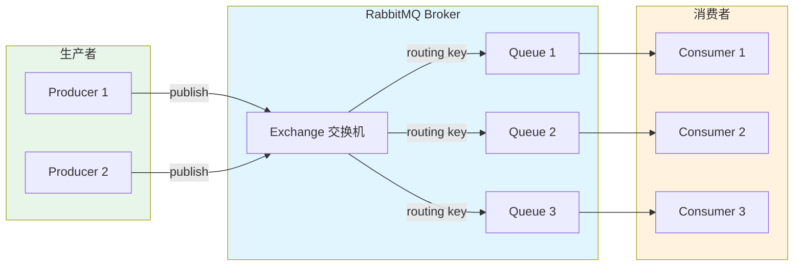
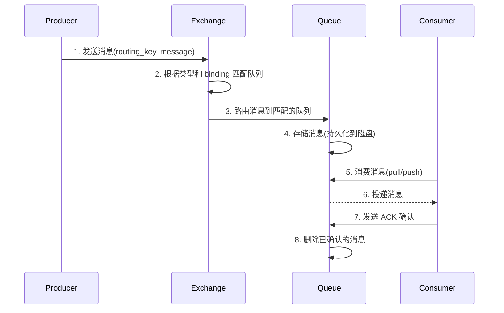
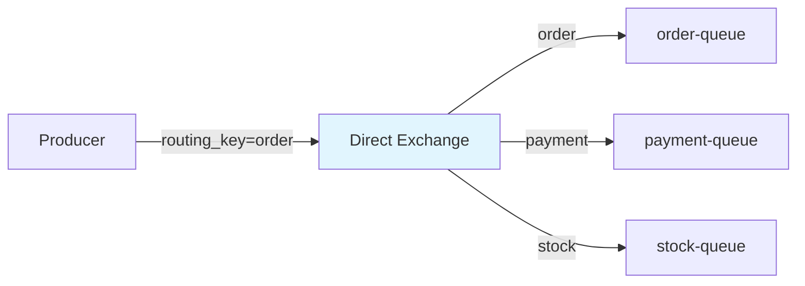
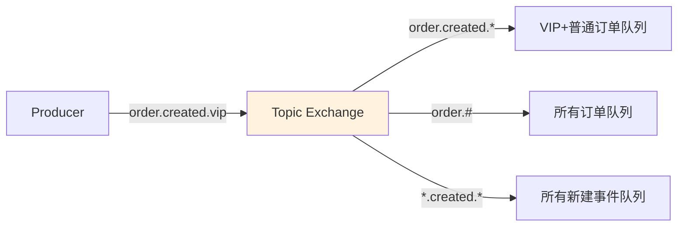
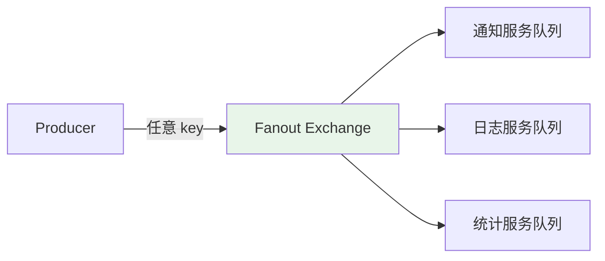
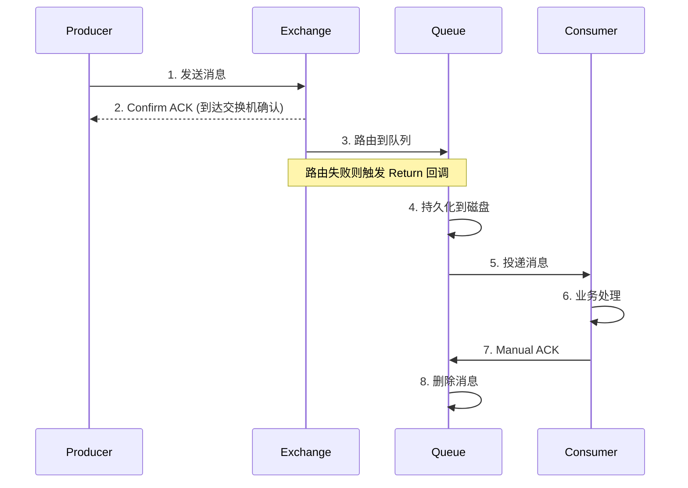
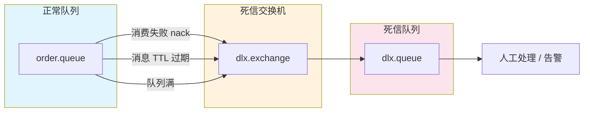

## RabbitMQ 简介

RabbitMQ 是基于 AMQP（Advanced Message Queuing Protocol）协议的开源消息中间件，由 Erlang 语言编写。它以可靠性、灵活的路由、易用的管理界面和丰富的客户端支持著称，广泛应用于异步解耦、流量削峰、分布式系统通信等场景。

### 核心特性

| 特性 | 说明 |
|------|------|
| 可靠性 | 持久化、传输确认（ACK）、发布确认（Publisher Confirm） |
| 灵活路由 | 通过 Exchange 实现 Direct / Topic / Fanout / Headers 多种路由模式 |
| 高可用 | 镜像队列（Classic）、仲裁队列（Quorum Queue）、集群部署 |
| 多协议 | AMQP 0-9-1、STOMP、MQTT、HTTP |
| 管理界面 | 内置 Web Management UI，支持监控和管理 |
| 多语言客户端 | Java、Python、Go、.NET、Node.js、Ruby 等 |
| 插件体系 | 延迟队列、联邦、Shovel 等丰富插件 |

### 架构总览



### 核心概念

- **Broker**：RabbitMQ 服务实例，接收、存储和转发消息
- **Virtual Host（vhost）**：虚拟主机，逻辑隔离单元，类似于命名空间，不同 vhost 之间资源完全隔离
- **Connection**：生产者/消费者与 Broker 之间的 TCP 连接
- **Channel**：连接内的虚拟连接，轻量级通信通道，避免频繁创建 TCP 连接
- **Exchange**：交换机，接收生产者的消息并根据路由规则分发到队列
- **Queue**：队列，存储消息，等待消费者消费
- **Binding**：绑定关系，将 Exchange 与 Queue 通过 Routing Key 关联
- **Routing Key**：路由键，生产者发送消息时指定，Exchange 根据它决定消息投递到哪个队列

### 消息流转过程



## Exchange 交换机类型

### 四种交换机对比

| 类型 | 路由规则 | 适用场景 |
|------|---------|---------|
| Direct | 精确匹配 routing_key | 点对点通信、按类型分发 |
| Topic | 通配符匹配（`*` 匹配一个词，`#` 匹配零或多个词） | 多维度订阅、日志分级 |
| Fanout | 广播到所有绑定队列，忽略 routing_key | 广播通知、事件总线 |
| Headers | 根据消息头属性匹配（较少使用） | 复杂路由条件 |

### Direct Exchange



消息的 `routing_key` 必须与 Binding Key **完全一致**才会被路由。

### Topic Exchange



- `*` 匹配一个单词：`order.created.*` 匹配 `order.created.vip`，不匹配 `order.created.vip.gold`
- `#` 匹配零或多个单词：`order.#` 匹配 `order`、`order.created`、`order.created.vip`

### Fanout Exchange



忽略 `routing_key`，将消息广播到所有绑定的队列。

## Docker 安装

### 单节点部署

```bash
# 拉取带管理界面的镜像
docker pull rabbitmq:3.13-management

# 启动容器
docker run -d \
  --name rabbitmq \
  --hostname rabbitmq-host \
  -p 5672:5672 \
  -p 15672:15672 \
  -e RABBITMQ_DEFAULT_USER=admin \
  -e RABBITMQ_DEFAULT_PASS=admin123 \
  -e RABBITMQ_DEFAULT_VHOST=/ \
  -v rabbitmq-data:/var/lib/rabbitmq \
  --restart=unless-stopped \
  rabbitmq:3.13-management
```

> **端口说明**：
> - `5672`：AMQP 协议端口（客户端连接）
> - `15672`：Web 管理界面（浏览器访问 `http://IP:15672`）
> - `25672`：集群节点间通信端口

启动后访问 `http://localhost:15672`，使用 `admin / admin123` 登录管理界面。

### 集群部署（Docker Compose）

```yaml
version: "3.8"

services:
  rabbitmq1:
    image: rabbitmq:3.13-management
    hostname: rabbitmq1
    container_name: rabbitmq1
    ports:
      - "5672:5672"
      - "15672:15672"
    environment:
      RABBITMQ_ERLANG_COOKIE: "SAME_SECRET_COOKIE"
      RABBITMQ_DEFAULT_USER: admin
      RABBITMQ_DEFAULT_PASS: admin123
      RABBITMQ_NODENAME: rabbit@rabbitmq1
    volumes:
      - rabbitmq1-data:/var/lib/rabbitmq
    networks:
      - rabbitmq-cluster

  rabbitmq2:
    image: rabbitmq:3.13-management
    hostname: rabbitmq2
    container_name: rabbitmq2
    ports:
      - "5673:5672"
      - "15673:15672"
    environment:
      RABBITMQ_ERLANG_COOKIE: "SAME_SECRET_COOKIE"
      RABBITMQ_DEFAULT_USER: admin
      RABBITMQ_DEFAULT_PASS: admin123
      RABBITMQ_NODENAME: rabbit@rabbitmq2
    volumes:
      - rabbitmq2-data:/var/lib/rabbitmq
    depends_on:
      - rabbitmq1
    networks:
      - rabbitmq-cluster

  rabbitmq3:
    image: rabbitmq:3.13-management
    hostname: rabbitmq3
    container_name: rabbitmq3
    ports:
      - "5674:5672"
      - "15674:15672"
    environment:
      RABBITMQ_ERLANG_COOKIE: "SAME_SECRET_COOKIE"
      RABBITMQ_DEFAULT_USER: admin
      RABBITMQ_DEFAULT_PASS: admin123
      RABBITMQ_NODENAME: rabbit@rabbitmq3
    volumes:
      - rabbitmq3-data:/var/lib/rabbitmq
    depends_on:
      - rabbitmq1
    networks:
      - rabbitmq-cluster

volumes:
  rabbitmq1-data:
  rabbitmq2-data:
  rabbitmq3-data:

networks:
  rabbitmq-cluster:
    driver: bridge
```

#### 组建集群

```bash
# 启动所有节点
docker-compose up -d

# rabbitmq2 加入集群
docker exec -it rabbitmq2 bash
rabbitmqctl stop_app
rabbitmqctl reset
rabbitmqctl join_cluster rabbit@rabbitmq1
rabbitmqctl start_app

# rabbitmq3 加入集群
docker exec -it rabbitmq3 bash
rabbitmqctl stop_app
rabbitmqctl reset
rabbitmqctl join_cluster rabbit@rabbitmq1
rabbitmqctl start_app

# 验证集群状态
docker exec rabbitmq1 rabbitmqctl cluster_status
```

#### 启用仲裁队列（Quorum Queue，推荐）

仲裁队列基于 Raft 协议，是 RabbitMQ 3.8+ 推荐的高可用方案，取代了镜像队列。

```bash
# 通过 Policy 设置所有队列为仲裁队列
docker exec rabbitmq1 rabbitmqctl set_policy quorum-all \
  "^" '{"queue-mode":"default","queue-type":"quorum"}' \
  --apply-to queues
```

### 常用管理命令

```bash
# 查看集群状态
rabbitmqctl cluster_status

# 查看所有队列
rabbitmqctl list_queues name messages consumers

# 查看所有交换机
rabbitmqctl list_exchanges name type

# 查看绑定关系
rabbitmqctl list_bindings

# 查看连接
rabbitmqctl list_connections

# 查看通道
rabbitmqctl list_channels

# 添加用户
rabbitmqctl add_user myuser mypassword
rabbitmqctl set_user_tags myuser administrator
rabbitmqctl set_permissions -p / myuser ".*" ".*" ".*"

# 启用/禁用插件
rabbitmq-plugins enable rabbitmq_delayed_message_exchange
rabbitmq-plugins list
```

## Spring Boot 集成

### 添加依赖

```xml
<dependency>
    <groupId>org.springframework.boot</groupId>
    <artifactId>spring-boot-starter-amqp</artifactId>
</dependency>
```

### 配置（application.yml）

```yaml
spring:
  rabbitmq:
    host: 192.168.131.128
    port: 5672
    username: admin
    password: admin123
    virtual-host: /
    # 生产者确认模式（correlated 异步回调）
    publisher-confirm-type: correlated
    # 生产者退回模式（消息无法路由到队列时回调）
    publisher-returns: true
    template:
      # 强制消息退回（配合 publisher-returns）
      mandatory: true
    listener:
      simple:
        # 手动确认
        acknowledge-mode: manual
        # 并发消费者数
        concurrency: 5
        # 最大并发消费者数
        max-concurrency: 10
        # 预取数量（每次从 Broker 取多少条）
        prefetch: 10
        # 消费失败后重试
        retry:
          enabled: true
          max-attempts: 3
          initial-interval: 1000
          multiplier: 2
          max-interval: 10000
```

### 交换机与队列配置

```java
import org.springframework.amqp.core.*;
import org.springframework.context.annotation.Bean;
import org.springframework.context.annotation.Configuration;

@Configuration
public class RabbitMQConfig {

    // ===== Direct 模式 =====
    public static final String ORDER_EXCHANGE = "order.direct.exchange";
    public static final String ORDER_QUEUE = "order.queue";
    public static final String ORDER_ROUTING_KEY = "order.create";

    @Bean
    public DirectExchange orderExchange() {
        // durable: 持久化, autoDelete: 无绑定时不自动删除
        return new DirectExchange(ORDER_EXCHANGE, true, false);
    }

    @Bean
    public Queue orderQueue() {
        return QueueBuilder.durable(ORDER_QUEUE)
            .withArgument("x-message-ttl", 60000)       // 消息 TTL 60秒
            .withArgument("x-max-length", 10000)         // 队列最大长度
            .withArgument("x-dead-letter-exchange", DLX_EXCHANGE)
            .withArgument("x-dead-letter-routing-key", DLX_ROUTING_KEY)
            .build();
    }

    @Bean
    public Binding orderBinding() {
        return BindingBuilder.bind(orderQueue())
            .to(orderExchange())
            .with(ORDER_ROUTING_KEY);
    }

    // ===== Topic 模式 =====
    public static final String LOG_EXCHANGE = "log.topic.exchange";
    public static final String LOG_ERROR_QUEUE = "log.error.queue";
    public static final String LOG_ALL_QUEUE = "log.all.queue";

    @Bean
    public TopicExchange logExchange() {
        return new TopicExchange(LOG_EXCHANGE, true, false);
    }

    @Bean
    public Queue logErrorQueue() {
        return QueueBuilder.durable(LOG_ERROR_QUEUE).build();
    }

    @Bean
    public Queue logAllQueue() {
        return QueueBuilder.durable(LOG_ALL_QUEUE).build();
    }

    @Bean
    public Binding logErrorBinding() {
        return BindingBuilder.bind(logErrorQueue())
            .to(logExchange())
            .with("log.error.*");
    }

    @Bean
    public Binding logAllBinding() {
        return BindingBuilder.bind(logAllQueue())
            .to(logExchange())
            .with("log.#");
    }

    // ===== Fanout 模式 =====
    public static final String NOTIFY_EXCHANGE = "notify.fanout.exchange";

    @Bean
    public FanoutExchange notifyExchange() {
        return new FanoutExchange(NOTIFY_EXCHANGE, true, false);
    }

    @Bean
    public Queue smsQueue() {
        return QueueBuilder.durable("notify.sms.queue").build();
    }

    @Bean
    public Queue emailQueue() {
        return QueueBuilder.durable("notify.email.queue").build();
    }

    @Bean
    public Binding smsBinding() {
        return BindingBuilder.bind(smsQueue()).to(notifyExchange());
    }

    @Bean
    public Binding emailBinding() {
        return BindingBuilder.bind(emailQueue()).to(notifyExchange());
    }

    // ===== 死信队列 =====
    public static final String DLX_EXCHANGE = "dlx.direct.exchange";
    public static final String DLX_QUEUE = "dlx.queue";
    public static final String DLX_ROUTING_KEY = "dlx.routing.key";

    @Bean
    public DirectExchange dlxExchange() {
        return new DirectExchange(DLX_EXCHANGE, true, false);
    }

    @Bean
    public Queue dlxQueue() {
        return QueueBuilder.durable(DLX_QUEUE).build();
    }

    @Bean
    public Binding dlxBinding() {
        return BindingBuilder.bind(dlxQueue())
            .to(dlxExchange())
            .with(DLX_ROUTING_KEY);
    }
}
```

### 生产者实现

```java
import lombok.RequiredArgsConstructor;
import lombok.extern.slf4j.Slf4j;
import org.springframework.amqp.core.MessageDeliveryMode;
import org.springframework.amqp.rabbit.connection.CorrelationData;
import org.springframework.amqp.rabbit.core.RabbitTemplate;
import org.springframework.stereotype.Service;

import jakarta.annotation.PostConstruct;
import java.util.UUID;

@Slf4j
@Service
@RequiredArgsConstructor
public class RabbitMQProducer {

    private final RabbitTemplate rabbitTemplate;

    @PostConstruct
    public void init() {
        // 消息到达 Exchange 的确认回调
        rabbitTemplate.setConfirmCallback((correlationData, ack, cause) -> {
            String id = correlationData != null ? correlationData.getId() : "";
            if (ack) {
                log.info("消息已到达交换机: id={}", id);
            } else {
                log.error("消息未到达交换机: id={}, cause={}", id, cause);
                // 重发或记录到数据库
            }
        });

        // 消息无法路由到队列的退回回调
        rabbitTemplate.setReturnsCallback((returned) -> {
            log.warn("消息被退回: exchange={}, routingKey={}, replyCode={}, replyText={}, message={}",
                returned.getExchange(),
                returned.getRoutingKey(),
                returned.getReplyCode(),
                returned.getReplyText(),
                new String(returned.getMessage().getBody()));
        });
    }

    /**
     * 发送消息（带确认）
     */
    public void sendMessage(String exchange, String routingKey, Object message) {
        CorrelationData correlationData = new CorrelationData(UUID.randomUUID().toString());
        rabbitTemplate.convertAndSend(exchange, routingKey, message, msg -> {
            // 消息持久化
            msg.getMessageProperties().setDeliveryMode(MessageDeliveryMode.PERSISTENT);
            return msg;
        }, correlationData);
        log.info("消息已发送: exchange={}, routingKey={}, id={}", exchange, routingKey, correlationData.getId());
    }

    /**
     * 发送延迟消息（需要 rabbitmq_delayed_message_exchange 插件）
     */
    public void sendDelayMessage(String exchange, String routingKey, Object message, int delayMs) {
        CorrelationData correlationData = new CorrelationData(UUID.randomUUID().toString());
        rabbitTemplate.convertAndSend(exchange, routingKey, message, msg -> {
            msg.getMessageProperties().setDeliveryMode(MessageDeliveryMode.PERSISTENT);
            msg.getMessageProperties().setDelay(delayMs);
            return msg;
        }, correlationData);
        log.info("延迟消息已发送: delay={}ms, id={}", delayMs, correlationData.getId());
    }
}
```

### 消费者实现

```java
import com.rabbitmq.client.Channel;
import lombok.extern.slf4j.Slf4j;
import org.springframework.amqp.core.Message;
import org.springframework.amqp.rabbit.annotation.RabbitListener;
import org.springframework.stereotype.Component;

import java.io.IOException;

@Slf4j
@Component
public class RabbitMQConsumer {

    /**
     * 消费订单消息（手动 ACK）
     */
    @RabbitListener(queues = "order.queue")
    public void consumeOrder(Message message, Channel channel) throws IOException {
        long deliveryTag = message.getMessageProperties().getDeliveryTag();
        try {
            String body = new String(message.getBody());
            log.info("收到订单消息: {}", body);

            // 业务处理
            processOrder(body);

            // 确认消息（false 表示只确认当前消息，不批量确认）
            channel.basicAck(deliveryTag, false);
        } catch (Exception e) {
            log.error("订单消息处理失败: {}", e.getMessage());
            // requeue=false：不重新入队，进入死信队列
            // requeue=true：重新入队，会导致重复消费
            channel.basicNack(deliveryTag, false, false);
        }
    }

    /**
     * 消费日志消息（Topic 模式）
     */
    @RabbitListener(queues = "log.error.queue")
    public void consumeErrorLog(Message message, Channel channel) throws IOException {
        long deliveryTag = message.getMessageProperties().getDeliveryTag();
        try {
            String body = new String(message.getBody());
            log.error("收到错误日志: {}", body);
            // 告警处理
            channel.basicAck(deliveryTag, false);
        } catch (Exception e) {
            channel.basicNack(deliveryTag, false, true);
        }
    }

    /**
     * 消费广播通知
     */
    @RabbitListener(queues = "notify.sms.queue")
    public void consumeSmsNotify(Message message, Channel channel) throws IOException {
        long deliveryTag = message.getMessageProperties().getDeliveryTag();
        try {
            String body = new String(message.getBody());
            log.info("发送短信通知: {}", body);
            channel.basicAck(deliveryTag, false);
        } catch (Exception e) {
            channel.basicNack(deliveryTag, false, false);
        }
    }

    /**
     * 消费死信消息
     */
    @RabbitListener(queues = "dlx.queue")
    public void consumeDeadLetter(Message message, Channel channel) throws IOException {
        long deliveryTag = message.getMessageProperties().getDeliveryTag();
        log.error("收到死信消息: body={}, 原交换机={}, 原路由键={}",
            new String(message.getBody()),
            message.getMessageProperties().getHeader("x-first-death-exchange"),
            message.getMessageProperties().getHeader("x-first-death-queue"));
        // 记录到数据库或告警
        channel.basicAck(deliveryTag, false);
    }

    private void processOrder(String order) {
        // 订单处理逻辑
    }
}
```

## 消息可靠性保证

### 完整可靠性链路



### 三个环节的保障

| 环节 | 机制 | 配置 |
|------|------|------|
| 生产者 → Exchange | Publisher Confirm | `publisher-confirm-type: correlated` |
| Exchange → Queue | Publisher Return | `publisher-returns: true` + `mandatory: true` |
| Queue 存储 | 持久化 | Exchange、Queue、Message 都设为 durable |
| Queue → Consumer | Manual ACK | `acknowledge-mode: manual` + `basicAck/basicNack` |

### 消费幂等性

```java
@Slf4j
@Component
@RequiredArgsConstructor
public class IdempotentConsumer {

    private final StringRedisTemplate redisTemplate;

    @RabbitListener(queues = "order.queue")
    public void consume(Message message, Channel channel) throws IOException {
        long deliveryTag = message.getMessageProperties().getDeliveryTag();
        String messageId = message.getMessageProperties().getMessageId();

        // 如果没有 messageId，用 deliveryTag + queue 作为幂等键
        if (messageId == null) {
            messageId = "mq:" + message.getMessageProperties()
                .getConsumerQueue() + ":" + deliveryTag;
        }

        String idempotentKey = "rabbitmq:consumed:" + messageId;
        Boolean isNew = redisTemplate.opsForValue()
            .setIfAbsent(idempotentKey, "1", java.time.Duration.ofDays(7));

        if (Boolean.TRUE.equals(isNew)) {
            try {
                processOrder(new String(message.getBody()));
                channel.basicAck(deliveryTag, false);
            } catch (Exception e) {
                redisTemplate.delete(idempotentKey);
                channel.basicNack(deliveryTag, false, false);
            }
        } else {
            log.warn("重复消息，跳过: messageId={}", messageId);
            channel.basicAck(deliveryTag, false);
        }
    }
}
```

## 死信队列

消息进入死信队列（Dead Letter Queue）的三种情况：

1. **消息被拒绝**（`basicNack` / `basicReject` 且 `requeue=false`）
2. **消息 TTL 过期**
3. **队列达到最大长度**



## 延迟队列

### 方案一：TTL + 死信队列

利用消息 TTL 过期自动进入死信队列实现延迟效果。

```java
@Configuration
public class DelayQueueConfig {

    @Bean
    public DirectExchange orderDelayExchange() {
        return new DirectExchange("order.delay.exchange", true, false);
    }

    // 延迟队列（设置 TTL，不消费，到期后转入死信队列）
    @Bean
    public Queue orderDelayQueue() {
        return QueueBuilder.durable("order.delay.queue")
            .withArgument("x-message-ttl", 30 * 60 * 1000)  // 30 分钟
            .withArgument("x-dead-letter-exchange", "order.direct.exchange")
            .withArgument("x-dead-letter-routing-key", "order.timeout")
            .build();
    }

    @Bean
    public Binding orderDelayBinding() {
        return BindingBuilder.bind(orderDelayQueue())
            .to(orderDelayExchange())
            .with("order.delay");
    }
}
```

> **注意**：TTL + 死信方案存在"队头阻塞"问题——如果队头消息 TTL 较长，后面 TTL 较短的消息也需要等待队头消息过期。推荐使用延迟消息插件。

### 方案二：延迟消息插件（推荐）

```bash
# 安装延迟消息插件
docker exec -it rabbitmq bash
rabbitmq-plugins enable rabbitmq_delayed_message_exchange
```

```java
@Configuration
public class DelayPluginConfig {

    // 声明延迟交换机（type = x-delayed-message）
    @Bean
    public CustomExchange delayExchange() {
        Map<String, Object> args = new HashMap<>();
        args.put("x-delayed-type", "direct");
        return new CustomExchange("delay.exchange", "x-delayed-message", true, false, args);
    }

    @Bean
    public Queue delayQueue() {
        return QueueBuilder.durable("delay.queue").build();
    }

    @Bean
    public Binding delayBinding() {
        return BindingBuilder.bind(delayQueue())
            .to(delayExchange())
            .with("delay.routing.key")
            .noargs();
    }
}
```

```java
// 发送延迟消息
public void sendDelayMessage(String message, int delayMs) {
    rabbitTemplate.convertAndSend("delay.exchange", "delay.routing.key", message, msg -> {
        msg.getMessageProperties().setDelay(delayMs);  // 设置延迟时间（毫秒）
        return msg;
    });
}
```

## 生产环境最佳实践

### 队列选型

| 类型 | 说明 | 适用场景 |
|------|------|---------|
| Classic Queue | 经典队列，支持镜像（已不推荐镜像） | 简单场景、低延迟要求 |
| Quorum Queue | 仲裁队列，基于 Raft 协议，强一致 | 数据可靠性要求高的生产环境 |
| Stream | 流队列，类似 Kafka 的日志流 | 高吞吐、消息重放 |

### 性能优化

```yaml
# 连接池（使用 CachingConnectionFactory 默认即缓存）
spring:
  rabbitmq:
    cache:
      channel:
        size: 25          # 缓存的 Channel 数量
        checkout-timeout: 5000
      connection:
        mode: CHANNEL     # 缓存模式（CHANNEL 或 CONNECTION）
```

| 优化项 | 建议 |
|--------|------|
| prefetch | 根据消费速度调整，通常 10~50 |
| Channel 缓存 | 设置 `cache.channel.size`，避免频繁创建 |
| 批量 ACK | `channel.basicAck(tag, true)` 批量确认 |
| 消息大小 | 控制在 128KB 以内，大文件走对象存储 |
| 惰性队列 | `x-queue-mode: lazy`，消息直接写磁盘，适合积压场景 |

### 监控指标

| 指标 | 含义 | 告警阈值参考 |
|------|------|-------------|
| Queue Messages Ready | 待消费消息数 | 持续增长需关注 |
| Queue Messages Unacked | 已投递未确认数 | 过高说明消费者阻塞 |
| Publish Rate / Deliver Rate | 生产/消费速率 | 生产远大于消费需扩容 |
| Connection / Channel Count | 连接数/通道数 | 不应无限增长 |
| Memory / Disk Usage | 内存/磁盘使用 | 接近水位线需处理 |

### 常见问题排查

| 问题 | 可能原因 | 解决方案 |
|------|---------|---------|
| 消息丢失 | 未开启持久化或确认 | 开启 Confirm + 持久化 + 手动 ACK |
| 消息积压 | 消费者能力不足 | 增加消费者数量 / 提高 prefetch |
| 连接断开重连 | 网络不稳定 | Spring AMQP 自带重连，配置 `recovery-interval` |
| 内存告警 | 消息积压过多 | 设置队列长度限制 + 惰性队列 |
| 重复消费 | 网络闪断导致 ACK 丢失 | 消费端做幂等处理 |
| 消费者未收到消息 | Binding 错误或 routing_key 不匹配 | 检查 Exchange/Queue/Binding 关系 |
