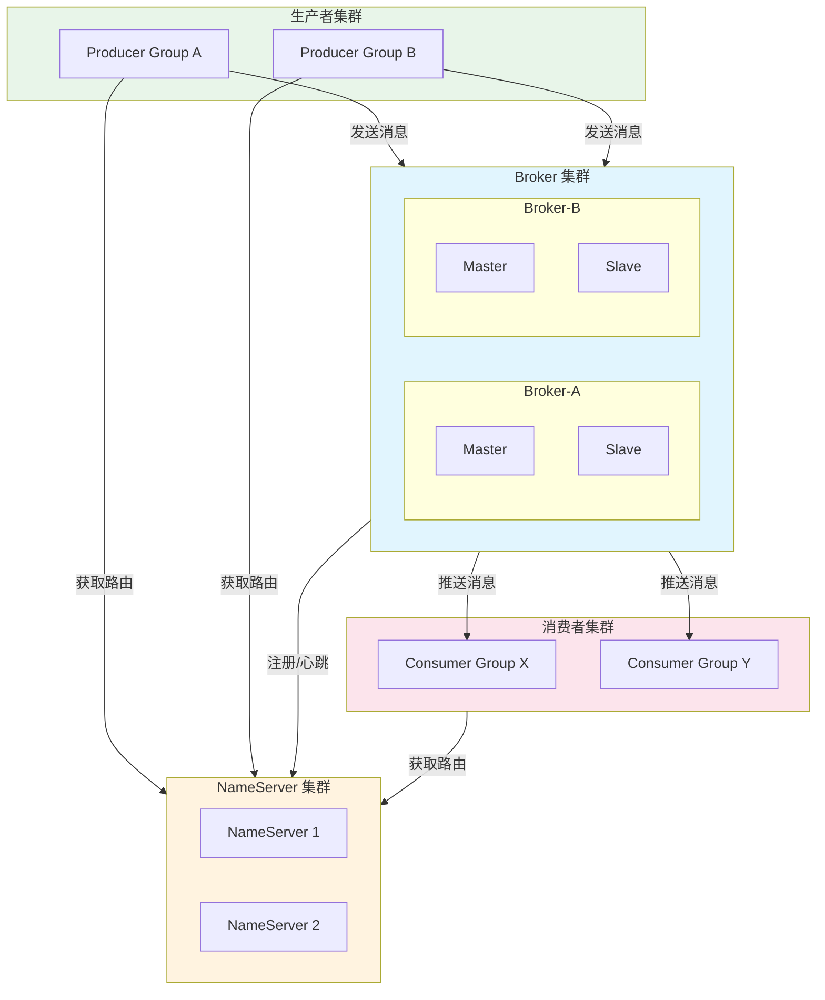
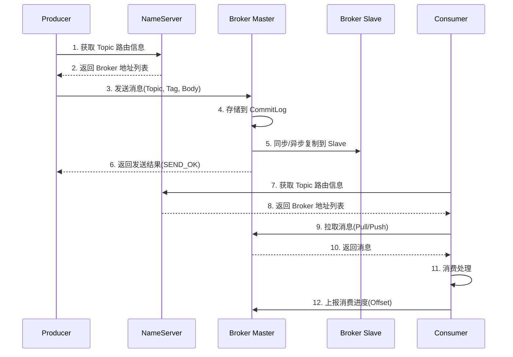
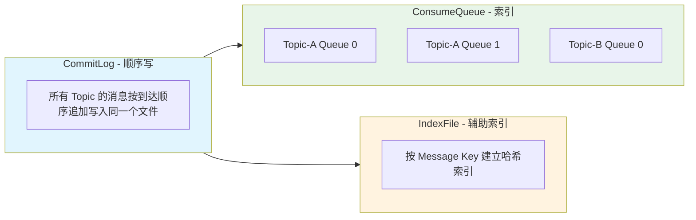
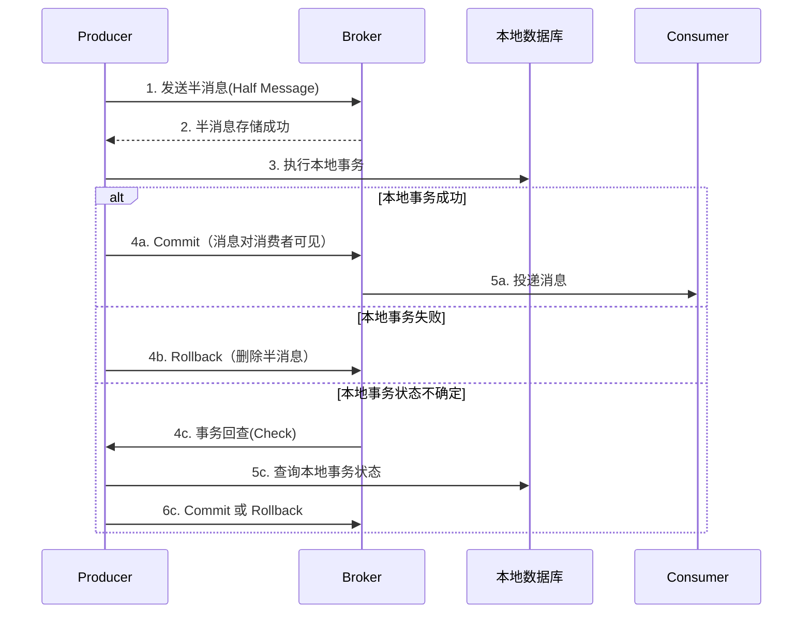
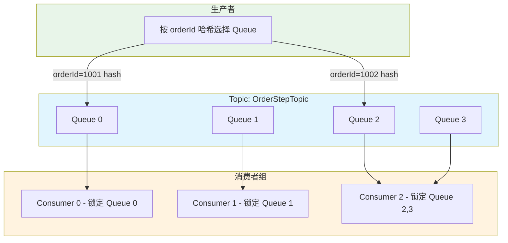
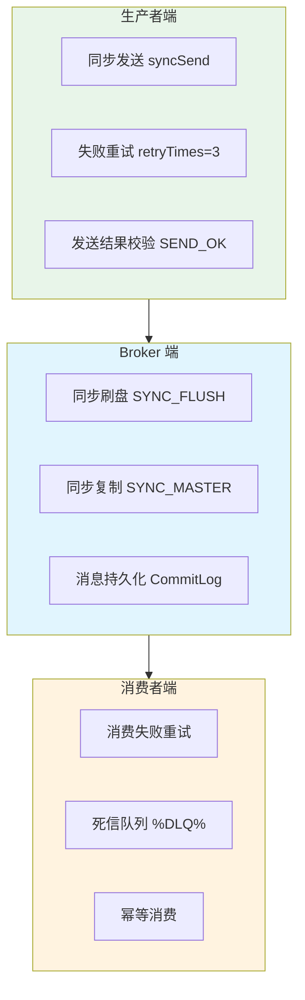

## RocketMQ 简介

Apache RocketMQ 是阿里巴巴开源的分布式消息中间件，经历了多次双十一的大规模验证，具有高吞吐、低延迟、高可用、海量消息堆积等特点。RocketMQ 5.x 引入了 gRPC 协议和 Proxy 模式，进一步增强了云原生能力。

### 核心特性

| 特性 | 说明 |
|------|------|
| 高吞吐量 | 单机十万级 TPS，支持海量消息堆积 |
| 低延迟 | 毫秒级消息投递 |
| 高可用 | 主从同步/异步复制、DLedger 自动切换 |
| 事务消息 | 原生支持分布式事务消息 |
| 顺序消息 | 支持全局有序和分区有序 |
| 延迟消息 | 支持 18 个级别的定时延迟消息 |
| 消息回溯 | 按时间戳回溯消费 |
| 消息过滤 | Tag 过滤、SQL92 属性过滤 |
| 丰富的消息类型 | 普通消息、顺序消息、延迟消息、事务消息、批量消息 |

### 架构总览



### 核心概念

- **NameServer**：轻量级注册中心，无状态，Broker 向所有 NameServer 注册，Producer/Consumer 从 NameServer 获取路由信息
- **Broker**：消息存储和转发服务器，分为 Master 和 Slave。Master 负责读写，Slave 负责备份和容灾读取
- **Producer**：消息生产者，同一类生产者组成 Producer Group
- **Consumer**：消息消费者，同一类消费者组成 Consumer Group
- **Topic**：消息的逻辑分类，一个 Topic 分布在多个 Broker 上
- **MessageQueue**：Topic 的分区，类似于 Kafka 的 Partition，消息实际存储单元
- **Tag**：消息的二级分类，用于在 Topic 内进一步过滤
- **Offset**：消费进度偏移量，标识消费到哪条消息

### 消息流转过程



## 存储模型

RocketMQ 采用 **CommitLog + ConsumeQueue** 的存储设计，是其高性能的关键。



| 组件 | 说明 |
|------|------|
| CommitLog | 所有消息的物理存储文件，**顺序追加写**，单个文件默认 1GB |
| ConsumeQueue | 消息的逻辑队列索引，每个 Topic 的每个 Queue 一个文件，存储 offset/size/tag hashcode |
| IndexFile | 按 Message Key 和时间戳建立的哈希索引，支持按 Key 查询消息 |

> **为什么快**：生产者写入 CommitLog 是顺序磁盘写（接近内存速度），消费者通过 ConsumeQueue 索引快速定位消息，避免随机 IO。

## Docker 安装

### 单节点部署

```bash
# 创建 Docker 网络
docker network create rocketmq-net

# 启动 NameServer
docker run -d \
  --name rmqnamesrv \
  --network rocketmq-net \
  -p 9876:9876 \
  -e "MAX_HEAP_SIZE=256m" \
  -e "HEAP_NEWSIZE=128m" \
  -v rmqnamesrv-logs:/home/rocketmq/logs \
  apache/rocketmq:5.3.1 \
  sh mqnamesrv

# 创建 Broker 配置文件
mkdir -p /data/rocketmq/conf
cat > /data/rocketmq/conf/broker.conf <<EOF
brokerClusterName = DefaultCluster
brokerName = broker-a
brokerId = 0
deleteWhen = 04
fileReservedTime = 48
brokerRole = ASYNC_MASTER
flushDiskType = ASYNC_FLUSH
namesrvAddr = rmqnamesrv:9876
# 宿主机 IP（外部访问需要设置）
brokerIP1 = 192.168.131.128
# 自动创建 Topic（生产环境建议关闭）
autoCreateTopicEnable = true
EOF

# 启动 Broker
docker run -d \
  --name rmqbroker \
  --network rocketmq-net \
  -p 10911:10911 \
  -p 10909:10909 \
  -p 10912:10912 \
  -e "MAX_HEAP_SIZE=512m" \
  -e "HEAP_NEWSIZE=256m" \
  -v /data/rocketmq/conf/broker.conf:/home/rocketmq/rocketmq-5.3.1/conf/broker.conf \
  -v rmqbroker-logs:/home/rocketmq/logs \
  -v rmqbroker-store:/home/rocketmq/store \
  apache/rocketmq:5.3.1 \
  sh mqbroker -c /home/rocketmq/rocketmq-5.3.1/conf/broker.conf

# 启动 Dashboard（管理界面）
docker run -d \
  --name rmq-dashboard \
  --network rocketmq-net \
  -p 8080:8080 \
  -e "JAVA_OPTS=-Drocketmq.namesrv.addr=rmqnamesrv:9876" \
  apacherocketmq/rocketmq-dashboard:latest
```

> **端口说明**：
> - `9876`：NameServer 端口
> - `10911`：Broker 对外服务端口
> - `10909`：Broker VIP 通道端口
> - `10912`：Broker HA 端口（主从同步）
> - `8080`：Dashboard 管理界面

### 集群部署（2主2从）

```yaml
version: "3.8"

services:
  namesrv1:
    image: apache/rocketmq:5.3.1
    container_name: rmq-namesrv1
    ports:
      - "9876:9876"
    command: sh mqnamesrv
    environment:
      MAX_HEAP_SIZE: 256m
      HEAP_NEWSIZE: 128m
    volumes:
      - namesrv1-logs:/home/rocketmq/logs
    networks:
      - rocketmq

  namesrv2:
    image: apache/rocketmq:5.3.1
    container_name: rmq-namesrv2
    ports:
      - "9877:9876"
    command: sh mqnamesrv
    environment:
      MAX_HEAP_SIZE: 256m
      HEAP_NEWSIZE: 128m
    volumes:
      - namesrv2-logs:/home/rocketmq/logs
    networks:
      - rocketmq

  broker-a-master:
    image: apache/rocketmq:5.3.1
    container_name: rmq-broker-a-m
    ports:
      - "10911:10911"
    command: sh mqbroker -c /home/rocketmq/conf/broker.conf
    environment:
      MAX_HEAP_SIZE: 512m
      HEAP_NEWSIZE: 256m
    volumes:
      - ./conf/broker-a-m.conf:/home/rocketmq/conf/broker.conf
      - broker-a-m-store:/home/rocketmq/store
      - broker-a-m-logs:/home/rocketmq/logs
    depends_on:
      - namesrv1
      - namesrv2
    networks:
      - rocketmq

  broker-a-slave:
    image: apache/rocketmq:5.3.1
    container_name: rmq-broker-a-s
    ports:
      - "10921:10911"
    command: sh mqbroker -c /home/rocketmq/conf/broker.conf
    environment:
      MAX_HEAP_SIZE: 512m
      HEAP_NEWSIZE: 256m
    volumes:
      - ./conf/broker-a-s.conf:/home/rocketmq/conf/broker.conf
      - broker-a-s-store:/home/rocketmq/store
      - broker-a-s-logs:/home/rocketmq/logs
    depends_on:
      - broker-a-master
    networks:
      - rocketmq

  broker-b-master:
    image: apache/rocketmq:5.3.1
    container_name: rmq-broker-b-m
    ports:
      - "10931:10911"
    command: sh mqbroker -c /home/rocketmq/conf/broker.conf
    environment:
      MAX_HEAP_SIZE: 512m
      HEAP_NEWSIZE: 256m
    volumes:
      - ./conf/broker-b-m.conf:/home/rocketmq/conf/broker.conf
      - broker-b-m-store:/home/rocketmq/store
      - broker-b-m-logs:/home/rocketmq/logs
    depends_on:
      - namesrv1
      - namesrv2
    networks:
      - rocketmq

  broker-b-slave:
    image: apache/rocketmq:5.3.1
    container_name: rmq-broker-b-s
    ports:
      - "10941:10911"
    command: sh mqbroker -c /home/rocketmq/conf/broker.conf
    environment:
      MAX_HEAP_SIZE: 512m
      HEAP_NEWSIZE: 256m
    volumes:
      - ./conf/broker-b-s.conf:/home/rocketmq/conf/broker.conf
      - broker-b-s-store:/home/rocketmq/store
      - broker-b-s-logs:/home/rocketmq/logs
    depends_on:
      - broker-b-master
    networks:
      - rocketmq

  dashboard:
    image: apacherocketmq/rocketmq-dashboard:latest
    container_name: rmq-dashboard
    ports:
      - "8080:8080"
    environment:
      JAVA_OPTS: "-Drocketmq.namesrv.addr=rmq-namesrv1:9876;rmq-namesrv2:9876"
    depends_on:
      - namesrv1
      - namesrv2
    networks:
      - rocketmq

volumes:
  namesrv1-logs:
  namesrv2-logs:
  broker-a-m-store:
  broker-a-m-logs:
  broker-a-s-store:
  broker-a-s-logs:
  broker-b-m-store:
  broker-b-m-logs:
  broker-b-s-store:
  broker-b-s-logs:

networks:
  rocketmq:
    driver: bridge
```

#### Broker 配置文件示例

`broker-a-m.conf`（Broker-A Master）：

```properties
brokerClusterName=DefaultCluster
brokerName=broker-a
brokerId=0
namesrvAddr=rmq-namesrv1:9876;rmq-namesrv2:9876
brokerIP1=192.168.131.128
defaultTopicQueueNums=8
autoCreateTopicEnable=false
autoCreateSubscriptionGroup=false
brokerRole=ASYNC_MASTER
flushDiskType=ASYNC_FLUSH
deleteWhen=04
fileReservedTime=72
mapedFileSizeCommitLog=1073741824
mapedFileSizeConsumeQueue=6000000
maxMessageSize=4194304
sendMessageThreadPoolNums=16
```

`broker-a-s.conf`（Broker-A Slave）：

```properties
brokerClusterName=DefaultCluster
brokerName=broker-a
brokerId=1
namesrvAddr=rmq-namesrv1:9876;rmq-namesrv2:9876
brokerIP1=192.168.131.128
brokerRole=SLAVE
flushDiskType=ASYNC_FLUSH
```

### 常用管理命令

```bash
# 查看集群信息
sh mqadmin clusterList -n localhost:9876

# 查看 Topic 列表
sh mqadmin topicList -n localhost:9876

# 创建 Topic
sh mqadmin updateTopic -n localhost:9876 -b broker-a:10911 \
  -t OrderTopic -r 8 -w 8

# 查看 Topic 详情（路由信息）
sh mqadmin topicRoute -n localhost:9876 -t OrderTopic

# 查看 Topic 状态（消息积压）
sh mqadmin topicStatus -n localhost:9876 -t OrderTopic

# 查看消费者组进度
sh mqadmin consumerProgress -n localhost:9876 -g OrderConsumerGroup

# 查看消费者连接
sh mqadmin consumerConnection -n localhost:9876 -g OrderConsumerGroup

# 按 Message ID 查询消息
sh mqadmin queryMsgById -n localhost:9876 -i "MSG_ID"

# 按 Message Key 查询消息
sh mqadmin queryMsgByKey -n localhost:9876 -t OrderTopic -k "order_123"

# 重置消费进度（按时间戳）
sh mqadmin resetOffsetByTime -n localhost:9876 \
  -g OrderConsumerGroup -t OrderTopic -s "2026-02-08#00:00:00:000"
```

## Spring Boot 集成

### 添加依赖

```xml
<dependency>
    <groupId>org.apache.rocketmq</groupId>
    <artifactId>rocketmq-spring-boot-starter</artifactId>
    <version>2.3.1</version>
</dependency>
```

### 配置（application.yml）

```yaml
rocketmq:
  name-server: 192.168.131.128:9876
  producer:
    group: order-producer-group
    # 发送超时时间
    send-message-timeout: 3000
    # 同步发送失败重试次数
    retry-times-when-send-failed: 3
    # 异步发送失败重试次数
    retry-times-when-send-async-failed: 3
    # 消息最大大小 4MB
    max-message-size: 4194304
    # 消息压缩阈值 4KB
    compress-message-body-threshold: 4096
```

### 生产者实现

```java
import lombok.RequiredArgsConstructor;
import lombok.extern.slf4j.Slf4j;
import org.apache.rocketmq.client.producer.SendCallback;
import org.apache.rocketmq.client.producer.SendResult;
import org.apache.rocketmq.spring.core.RocketMQTemplate;
import org.springframework.messaging.Message;
import org.springframework.messaging.support.MessageBuilder;
import org.springframework.stereotype.Service;

@Slf4j
@Service
@RequiredArgsConstructor
public class RocketMQProducer {

    private final RocketMQTemplate rocketMQTemplate;

    /**
     * 同步发送
     */
    public SendResult syncSend(String topic, String tag, Object payload) {
        String destination = topic + ":" + tag;
        Message<?> message = MessageBuilder.withPayload(payload)
            .setHeader("KEYS", "business-key-" + System.currentTimeMillis())
            .build();

        SendResult result = rocketMQTemplate.syncSend(destination, message);
        log.info("同步发送成功: msgId={}, status={}", result.getMsgId(), result.getSendStatus());
        return result;
    }

    /**
     * 异步发送
     */
    public void asyncSend(String topic, String tag, Object payload) {
        String destination = topic + ":" + tag;
        Message<?> message = MessageBuilder.withPayload(payload).build();

        rocketMQTemplate.asyncSend(destination, message, new SendCallback() {
            @Override
            public void onSuccess(SendResult sendResult) {
                log.info("异步发送成功: msgId={}", sendResult.getMsgId());
            }

            @Override
            public void onException(Throwable e) {
                log.error("异步发送失败: {}", e.getMessage());
                // 重试或记录到数据库
            }
        });
    }

    /**
     * 单向发送（不关心结果，最快）
     */
    public void onewaySend(String topic, Object payload) {
        rocketMQTemplate.sendOneWay(topic, payload);
    }

    /**
     * 发送延迟消息
     * delayLevel: 1~18 对应 1s/5s/10s/30s/1m/2m/3m/4m/5m/6m/7m/8m/9m/10m/20m/30m/1h/2h
     */
    public SendResult sendDelay(String topic, String tag, Object payload, int delayLevel) {
        String destination = topic + ":" + tag;
        Message<?> message = MessageBuilder.withPayload(payload).build();
        SendResult result = rocketMQTemplate.syncSend(destination, message, 3000, delayLevel);
        log.info("延迟消息发送成功: msgId={}, delayLevel={}", result.getMsgId(), delayLevel);
        return result;
    }

    /**
     * 发送顺序消息（按 hashKey 路由到同一个 Queue）
     */
    public SendResult sendOrderly(String topic, Object payload, String hashKey) {
        SendResult result = rocketMQTemplate.syncSendOrderly(topic, payload, hashKey);
        log.info("顺序消息发送成功: msgId={}, queue={}", result.getMsgId(),
            result.getMessageQueue().getQueueId());
        return result;
    }
}
```

### 消费者实现

```java
import lombok.extern.slf4j.Slf4j;
import org.apache.rocketmq.common.message.MessageExt;
import org.apache.rocketmq.spring.annotation.ConsumeMode;
import org.apache.rocketmq.spring.annotation.MessageModel;
import org.apache.rocketmq.spring.annotation.RocketMQMessageListener;
import org.apache.rocketmq.spring.core.RocketMQListener;
import org.springframework.stereotype.Component;

/**
 * 普通消息消费者（集群模式）
 */
@Slf4j
@Component
@RocketMQMessageListener(
    topic = "OrderTopic",
    selectorExpression = "create || update",   // Tag 过滤
    consumerGroup = "order-consumer-group",
    consumeMode = ConsumeMode.CONCURRENTLY,    // 并发消费
    messageModel = MessageModel.CLUSTERING,     // 集群模式（同组内负载均衡）
    maxReconsumeTimes = 3                       // 最大重试次数
)
public class OrderConsumer implements RocketMQListener<MessageExt> {

    @Override
    public void onMessage(MessageExt message) {
        String msgId = message.getMsgId();
        String body = new String(message.getBody());
        String tag = message.getTags();
        int reconsumeTimes = message.getReconsumeTimes();

        log.info("收到订单消息: msgId={}, tag={}, retryCount={}, body={}",
            msgId, tag, reconsumeTimes, body);

        try {
            // 业务处理
            processOrder(body, tag);
        } catch (Exception e) {
            log.error("订单消息处理失败: msgId={}, error={}", msgId, e.getMessage());
            // 抛出异常会触发重试，超过 maxReconsumeTimes 进入死信队列 %DLQ%consumerGroup
            throw new RuntimeException("处理失败，触发重试", e);
        }
    }

    private void processOrder(String body, String tag) {
        switch (tag) {
            case "create" -> log.info("处理订单创建: {}", body);
            case "update" -> log.info("处理订单更新: {}", body);
            default -> log.warn("未知 Tag: {}", tag);
        }
    }
}

/**
 * 顺序消息消费者
 */
@Slf4j
@Component
@RocketMQMessageListener(
    topic = "OrderStepTopic",
    consumerGroup = "order-step-consumer-group",
    consumeMode = ConsumeMode.ORDERLY          // 顺序消费
)
public class OrderStepConsumer implements RocketMQListener<String> {

    @Override
    public void onMessage(String message) {
        log.info("顺序消费: {}", message);
        // 同一个 Queue 内的消息严格有序
    }
}

/**
 * 广播模式消费者
 */
@Slf4j
@Component
@RocketMQMessageListener(
    topic = "NotifyTopic",
    consumerGroup = "notify-broadcast-group",
    messageModel = MessageModel.BROADCASTING   // 广播模式（每个消费者都收到）
)
public class NotifyBroadcastConsumer implements RocketMQListener<String> {

    @Override
    public void onMessage(String message) {
        log.info("广播通知: {}", message);
    }
}
```

## 事务消息

RocketMQ 原生支持分布式事务消息，基于**半消息（Half Message）+ 事务回查**机制实现。

### 事务消息流程



### 事务消息实现

```java
import lombok.extern.slf4j.Slf4j;
import org.apache.rocketmq.spring.annotation.RocketMQTransactionListener;
import org.apache.rocketmq.spring.core.RocketMQLocalTransactionListener;
import org.apache.rocketmq.spring.core.RocketMQLocalTransactionState;
import org.apache.rocketmq.spring.core.RocketMQTemplate;
import org.springframework.messaging.Message;
import org.springframework.messaging.support.MessageBuilder;
import org.springframework.stereotype.Service;

/**
 * 发送事务消息
 */
@Slf4j
@Service
public class TransactionProducer {

    private final RocketMQTemplate rocketMQTemplate;

    public TransactionProducer(RocketMQTemplate rocketMQTemplate) {
        this.rocketMQTemplate = rocketMQTemplate;
    }

    public void sendTransactionMessage(String orderId, String orderData) {
        Message<?> message = MessageBuilder.withPayload(orderData)
            .setHeader("orderId", orderId)
            .build();

        // 发送事务消息
        rocketMQTemplate.sendMessageInTransaction(
            "OrderTxTopic:create",   // destination
            message,                  // 消息
            orderId                   // arg，传递给本地事务执行方法
        );
        log.info("事务消息已发送: orderId={}", orderId);
    }
}

/**
 * 事务监听器：执行本地事务 + 事务回查
 */
@Slf4j
@RocketMQTransactionListener
public class OrderTransactionListener implements RocketMQLocalTransactionListener {

    private final OrderService orderService;
    private final OrderRepository orderRepository;

    public OrderTransactionListener(OrderService orderService, OrderRepository orderRepository) {
        this.orderService = orderService;
        this.orderRepository = orderRepository;
    }

    /**
     * 执行本地事务（半消息发送成功后回调）
     */
    @Override
    public RocketMQLocalTransactionState executeLocalTransaction(Message msg, Object arg) {
        String orderId = (String) arg;
        try {
            // 执行本地事务（如：创建订单、扣减库存等）
            orderService.createOrder(orderId, new String((byte[]) msg.getPayload()));
            log.info("本地事务执行成功: orderId={}", orderId);
            return RocketMQLocalTransactionState.COMMIT;
        } catch (Exception e) {
            log.error("本地事务执行失败: orderId={}, error={}", orderId, e.getMessage());
            return RocketMQLocalTransactionState.ROLLBACK;
        }
    }

    /**
     * 事务回查（Broker 未收到 Commit/Rollback 时定期回查）
     */
    @Override
    public RocketMQLocalTransactionState checkLocalTransaction(Message msg) {
        String orderId = msg.getHeaders().get("orderId", String.class);
        // 查询本地事务状态
        boolean exists = orderRepository.existsById(orderId);
        if (exists) {
            log.info("事务回查 - 订单存在，提交: orderId={}", orderId);
            return RocketMQLocalTransactionState.COMMIT;
        } else {
            log.warn("事务回查 - 订单不存在，回滚: orderId={}", orderId);
            return RocketMQLocalTransactionState.ROLLBACK;
        }
    }
}
```

## 延迟消息

### 内置延迟级别

RocketMQ 支持 18 个预定义延迟级别：

| 级别 | 1 | 2 | 3 | 4 | 5 | 6 | 7 | 8 | 9 | 10 | 11 | 12 | 13 | 14 | 15 | 16 | 17 | 18 |
|-----|---|---|---|---|---|---|---|---|---|----|----|----|----|----|----|----|----|-----|
| 时间 | 1s | 5s | 10s | 30s | 1m | 2m | 3m | 4m | 5m | 6m | 7m | 8m | 9m | 10m | 20m | 30m | 1h | 2h |

### 使用场景示例：订单超时取消

```java
// 下单时发送延迟消息（30分钟后检查支付状态）
// delayLevel=16 对应 30 分钟
rocketMQTemplate.syncSend("OrderTimeoutTopic", 
    MessageBuilder.withPayload(orderId).build(), 
    3000,   // timeout
    16);    // delayLevel=16 → 30分钟

// 延迟消费者
@RocketMQMessageListener(
    topic = "OrderTimeoutTopic",
    consumerGroup = "order-timeout-group"
)
public class OrderTimeoutConsumer implements RocketMQListener<String> {
    @Override
    public void onMessage(String orderId) {
        // 检查订单是否已支付
        Order order = orderService.getById(orderId);
        if (order != null && order.getStatus() == OrderStatus.UNPAID) {
            orderService.cancelOrder(orderId);
            log.info("订单超时未支付，已取消: {}", orderId);
        }
    }
}
```

## 顺序消息

### 实现原理



- **生产者**：相同 `orderId` 的消息通过哈希路由到同一个 Queue
- **消费者**：每个 Queue 只被一个消费者锁定，消费者单线程顺序消费

### 使用示例

```java
// 生产者：按 orderId 发送顺序消息
public void sendOrderSteps(String orderId) {
    String topic = "OrderStepTopic";
    rocketMQTemplate.syncSendOrderly(topic, "创建订单: " + orderId, orderId);
    rocketMQTemplate.syncSendOrderly(topic, "扣减库存: " + orderId, orderId);
    rocketMQTemplate.syncSendOrderly(topic, "扣减余额: " + orderId, orderId);
    rocketMQTemplate.syncSendOrderly(topic, "订单完成: " + orderId, orderId);
}
```

## 消息可靠性保证

### 三端配置



| 环节 | 配置 | 说明 |
|------|------|------|
| 生产者 | 同步发送 + 重试 | `syncSend` + `retryTimes=3` |
| Broker 刷盘 | 同步刷盘 | `flushDiskType=SYNC_FLUSH`（性能较低但最安全） |
| Broker 复制 | 同步复制 | `brokerRole=SYNC_MASTER`（主从都写入才返回成功） |
| 消费者 | 重试 + 死信队列 | 失败自动重试，超过次数进入 `%DLQ%consumerGroup` |
| 消费者 | 幂等处理 | 利用 `msgId` 或业务 Key 做去重 |

### 消费幂等

```java
@Slf4j
@Component
@RequiredArgsConstructor
@RocketMQMessageListener(topic = "OrderTopic", consumerGroup = "order-consumer-group")
public class IdempotentOrderConsumer implements RocketMQListener<MessageExt> {

    private final StringRedisTemplate redisTemplate;

    @Override
    public void onMessage(MessageExt message) {
        String msgId = message.getMsgId();
        String idempotentKey = "rocketmq:consumed:" + msgId;

        // Redis SETNX 保证幂等
        Boolean isNew = redisTemplate.opsForValue()
            .setIfAbsent(idempotentKey, "1", java.time.Duration.ofDays(7));

        if (Boolean.TRUE.equals(isNew)) {
            try {
                processOrder(new String(message.getBody()));
            } catch (Exception e) {
                // 处理失败，删除幂等标记，允许重试
                redisTemplate.delete(idempotentKey);
                throw e;
            }
        } else {
            log.warn("重复消息，跳过: msgId={}", msgId);
        }
    }

    private void processOrder(String body) {
        // 业务处理
    }
}
```

## 生产环境最佳实践

### 部署架构选型

| 模式 | 说明 | 适用场景 |
|------|------|---------|
| 单 Master | 一台 Broker，无高可用 | 开发测试 |
| 多 Master | 多台 Master，无 Slave | 允许少量消息丢失 |
| 多 Master 多 Slave（异步） | 主从异步复制，主宕机可能丢少量消息 | 大多数生产环境 |
| 多 Master 多 Slave（同步） | 主从同步复制，零丢失 | 金融等高可靠场景 |
| DLedger | 基于 Raft 协议自动选主 | 需要自动故障转移 |

### Topic 设计

| 原则 | 建议 |
|------|------|
| 命名规范 | `业务域_事件类型`，如 `ORDER_CREATE`、`PAYMENT_CALLBACK` |
| Queue 数量 | 通常设为消费者数量的 2~4 倍 |
| Tag 使用 | 同一 Topic 下用 Tag 区分子类型，而非创建多个 Topic |
| 消息大小 | 控制在 4MB 以内（默认上限），推荐 < 256KB |

### 性能优化

```properties
# ===== Broker 端 =====
# 发送消息线程池
sendMessageThreadPoolNums=16
# 异步刷盘（生产环境推荐，性能远高于同步刷盘）
flushDiskType=ASYNC_FLUSH
# CommitLog 文件大小 1GB
mapedFileSizeCommitLog=1073741824
# 传输方式（推荐 epoll）
useEpollNativeSelector=true
# OS PageCache 预热
warmMapedFileEnable=true

# ===== 生产者端 =====
# 发送超时
sendMsgTimeout=3000
# 异步发送（吞吐优先）用 asyncSend
# 批量发送（提高吞吐）
# 消息压缩（>4KB 自动压缩）
compressMsgBodyOverHowmuch=4096

# ===== 消费者端 =====
# 批量拉取大小
pullBatchSize=32
# 并发消费线程
consumeThreadMin=20
consumeThreadMax=64
# 单次消费消息数
consumeMessageBatchMaxSize=1
```

### 监控指标

| 指标 | 含义 | 关注重点 |
|------|------|---------|
| TPS | 生产/消费速率 | 生产 >> 消费时需扩容 |
| Consumer Diff | 消费积压量 | 持续增长需告警 |
| Broker Disk Usage | 磁盘使用率 | > 75% 需扩容或清理 |
| RT（Response Time） | 发送/消费耗时 | 异常升高需排查 |
| 失败率 | 发送/消费失败比例 | > 0.1% 需关注 |

### 常见问题排查

| 问题 | 可能原因 | 解决方案 |
|------|---------|---------|
| 消息发送超时 | 网络问题 / Broker 负载高 | 检查网络，增加超时时间 |
| 消息积压 | 消费能力不足 | 增加消费者实例 / 提高并发线程 |
| 消息丢失 | 异步刷盘 + Broker 宕机 | 改用同步刷盘 + 同步复制 |
| 重复消费 | 消费者重启导致 Offset 回退 | 做好幂等处理 |
| 消费者不消费 | 消费者组订阅关系不一致 | 确保同组内所有消费者订阅相同 Topic/Tag |
| Topic 不存在 | 未预创建且关闭了自动创建 | 手动创建 Topic 或开启 autoCreateTopicEnable |
| Broker 磁盘满 | 消息保留时间过长 | 调整 `fileReservedTime`，清理历史文件 |

## RocketMQ vs Kafka vs RabbitMQ

| 特性 | RocketMQ | Kafka | RabbitMQ |
|------|----------|-------|----------|
| 开发语言 | Java | Scala/Java | Erlang |
| 单机吞吐 | 十万级 | 百万级 | 万级 |
| 消息延迟 | 毫秒级 | 毫秒级 | 微秒级 |
| 事务消息 | 原生支持 | 支持（0.11+） | 不原生支持 |
| 延迟消息 | 内置 18 级 | 不支持 | 插件支持 |
| 顺序消息 | 分区有序 | 分区有序 | 不保证 |
| 消息回溯 | 按时间戳 | 按 Offset | 不支持 |
| 消息过滤 | Tag / SQL92 | 不支持 | Routing Key |
| 管理界面 | Dashboard | 第三方 | 内置 Management |
| 适用场景 | 电商/金融/大规模业务 | 日志/大数据/流处理 | 中小规模/复杂路由 |
