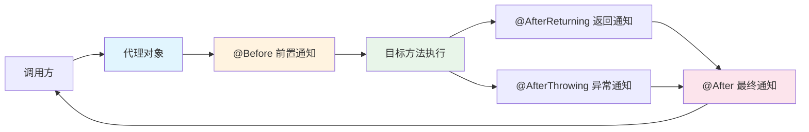
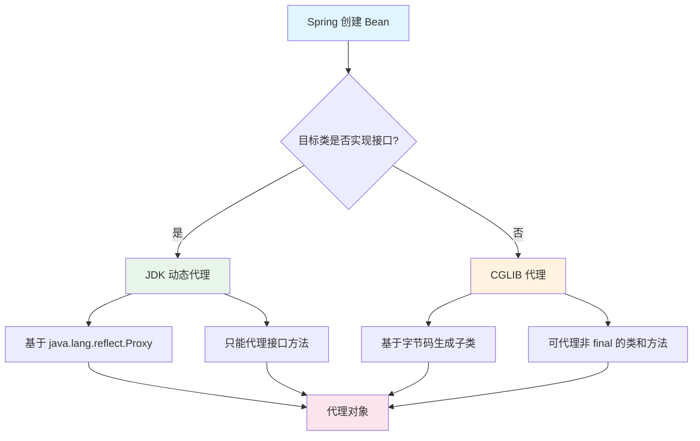
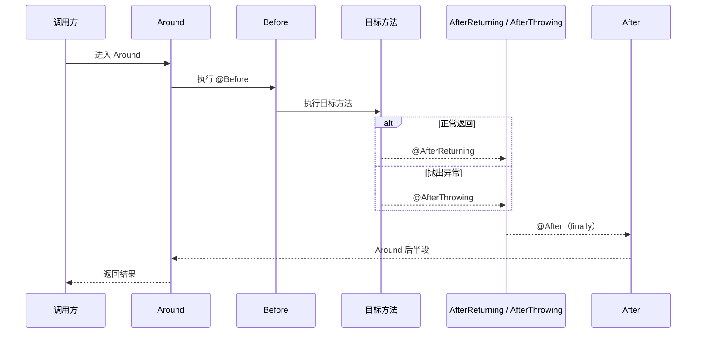
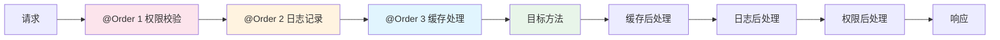

## AOP 概述

**AOP（Aspect-Oriented Programming，面向切面编程）** 是对 OOP 的补充，它将横切关注点（如日志、事务、权限）从业务逻辑中剥离，通过切面统一处理，实现代码解耦与复用。

### 核心术语

| 术语 | 说明 |
|------|------|
| **Aspect（切面）** | 横切关注点的模块化封装，包含通知 + 切入点 |
| **JoinPoint（连接点）** | 程序执行过程中的某个点，如方法调用、异常抛出 |
| **Pointcut（切入点）** | 匹配连接点的表达式，决定在哪些地方织入通知 |
| **Advice（通知）** | 切面在连接点处执行的动作（Before、After、Around 等） |
| **Target（目标对象）** | 被代理的原始对象 |
| **Proxy（代理对象）** | AOP 框架创建的代理对象 |
| **Weaving（织入）** | 将切面应用到目标对象并创建代理对象的过程 |

### AOP 执行流程



### Spring AOP 代理机制



> **Spring Boot 2.x+ 默认使用 CGLIB 代理**（`spring.aop.proxy-target-class=true`），无论是否实现接口都使用 CGLIB。若要强制 JDK 代理，需设置为 `false`。

## 快速开始

### 添加依赖

```xml
<dependency>
    <groupId>org.springframework.boot</groupId>
    <artifactId>spring-boot-starter-aop</artifactId>
</dependency>
```

> `spring-boot-starter-aop` 包含 `spring-aop` 和 `aspectjweaver`，引入后 AOP 自动生效，无需额外注解。

### 五种通知类型

```java
import lombok.extern.slf4j.Slf4j;
import org.aspectj.lang.JoinPoint;
import org.aspectj.lang.ProceedingJoinPoint;
import org.aspectj.lang.annotation.*;
import org.springframework.stereotype.Component;

@Slf4j
@Aspect
@Component
public class DemoAspect {

    /**
     * 切入点：匹配 com.example.service 包下所有类的所有方法
     */
    @Pointcut("execution(* com.example.service..*.*(..))")
    public void servicePointcut() {}

    /**
     * 前置通知：目标方法执行前
     */
    @Before("servicePointcut()")
    public void before(JoinPoint joinPoint) {
        log.info("Before: {}", joinPoint.getSignature().toShortString());
    }

    /**
     * 返回通知：目标方法正常返回后
     */
    @AfterReturning(pointcut = "servicePointcut()", returning = "result")
    public void afterReturning(JoinPoint joinPoint, Object result) {
        log.info("AfterReturning: {}, result={}", joinPoint.getSignature().toShortString(), result);
    }

    /**
     * 异常通知：目标方法抛出异常时
     */
    @AfterThrowing(pointcut = "servicePointcut()", throwing = "ex")
    public void afterThrowing(JoinPoint joinPoint, Throwable ex) {
        log.error("AfterThrowing: {}, error={}", joinPoint.getSignature().toShortString(), ex.getMessage());
    }

    /**
     * 最终通知：无论正常返回还是异常都会执行（类似 finally）
     */
    @After("servicePointcut()")
    public void after(JoinPoint joinPoint) {
        log.info("After: {}", joinPoint.getSignature().toShortString());
    }

    /**
     * 环绕通知：最强大的通知类型，可以完全控制方法执行
     */
    @Around("servicePointcut()")
    public Object around(ProceedingJoinPoint pjp) throws Throwable {
        long start = System.currentTimeMillis();
        try {
            Object result = pjp.proceed();
            return result;
        } finally {
            log.info("Around: {} 耗时 {}ms", pjp.getSignature().toShortString(),
                System.currentTimeMillis() - start);
        }
    }
}
```

### 通知执行顺序



> **Spring 5.2.7+ 的执行顺序**：`Around(前) → Before → 目标方法 → AfterReturning/AfterThrowing → After → Around(后)`

## 切入点表达式详解

### execution 表达式

```java
// 语法：execution(修饰符? 返回类型 包名.类名.方法名(参数) 异常?)

// 匹配 UserService 的所有方法
@Pointcut("execution(* com.example.service.UserService.*(..))")

// 匹配 service 包及子包下所有公共方法
@Pointcut("execution(public * com.example.service..*.*(..))")

// 匹配所有 save 开头的方法
@Pointcut("execution(* com.example..*.save*(..))")

// 匹配返回值为 String 的方法
@Pointcut("execution(String com.example.service..*.*(..))")

// 匹配第一个参数为 String 的方法
@Pointcut("execution(* com.example.service..*.*(String, ..))")
```

### @annotation 表达式

```java
// 匹配带有自定义注解 @LogRecord 的方法
@Pointcut("@annotation(com.example.annotation.LogRecord)")

// 匹配带有 @Transactional 的方法
@Pointcut("@annotation(org.springframework.transaction.annotation.Transactional)")
```

### 其他常用表达式

```java
// within：匹配类级别
@Pointcut("within(com.example.service..*)")

// @within：匹配带有指定注解的类中所有方法
@Pointcut("@within(org.springframework.stereotype.Service)")

// bean：按 Bean 名称匹配（Spring AOP 特有）
@Pointcut("bean(*Service)")

// args：按参数类型匹配
@Pointcut("args(String, Integer)")

// 组合表达式
@Pointcut("execution(* com.example.service..*.*(..)) && !execution(* com.example.service.LogService.*(..))")
```

## 实战场景

### 场景一：统一接口日志（自定义注解 + AOP）

#### 定义注解

```java
import java.lang.annotation.*;

@Target(ElementType.METHOD)
@Retention(RetentionPolicy.RUNTIME)
@Documented
public @interface ApiLog {
    /** 操作描述 */
    String value() default "";
    /** 是否记录请求参数 */
    boolean logParams() default true;
    /** 是否记录返回结果 */
    boolean logResult() default true;
}
```

#### 日志切面

```java
import com.fasterxml.jackson.databind.ObjectMapper;
import jakarta.servlet.http.HttpServletRequest;
import lombok.RequiredArgsConstructor;
import lombok.extern.slf4j.Slf4j;
import org.aspectj.lang.ProceedingJoinPoint;
import org.aspectj.lang.annotation.Around;
import org.aspectj.lang.annotation.Aspect;
import org.aspectj.lang.reflect.MethodSignature;
import org.springframework.stereotype.Component;
import org.springframework.web.context.request.RequestContextHolder;
import org.springframework.web.context.request.ServletRequestAttributes;

@Slf4j
@Aspect
@Component
@RequiredArgsConstructor
public class ApiLogAspect {

    private final ObjectMapper objectMapper;

    @Around("@annotation(apiLog)")
    public Object around(ProceedingJoinPoint pjp, ApiLog apiLog) throws Throwable {
        MethodSignature signature = (MethodSignature) pjp.getSignature();
        String methodName = signature.getDeclaringTypeName() + "." + signature.getName();

        // 获取请求信息
        ServletRequestAttributes attrs =
            (ServletRequestAttributes) RequestContextHolder.getRequestAttributes();
        String uri = "";
        String method = "";
        String ip = "";
        if (attrs != null) {
            HttpServletRequest request = attrs.getRequest();
            uri = request.getRequestURI();
            method = request.getMethod();
            ip = getClientIp(request);
        }

        // 记录请求参数
        String params = "";
        if (apiLog.logParams()) {
            try {
                params = objectMapper.writeValueAsString(pjp.getArgs());
            } catch (Exception e) {
                params = "序列化失败";
            }
        }

        log.info("┌── 请求开始: {} | {} {} | IP: {} | 方法: {} | 参数: {}",
            apiLog.value(), method, uri, ip, methodName, params);

        long start = System.currentTimeMillis();
        try {
            Object result = pjp.proceed();
            long cost = System.currentTimeMillis() - start;

            if (apiLog.logResult()) {
                String resultStr;
                try {
                    resultStr = objectMapper.writeValueAsString(result);
                    // 截断过长的返回值
                    if (resultStr.length() > 500) {
                        resultStr = resultStr.substring(0, 500) + "...(truncated)";
                    }
                } catch (Exception e) {
                    resultStr = "序列化失败";
                }
                log.info("└── 请求成功: {} | 耗时: {}ms | 结果: {}", apiLog.value(), cost, resultStr);
            } else {
                log.info("└── 请求成功: {} | 耗时: {}ms", apiLog.value(), cost);
            }
            return result;
        } catch (Throwable e) {
            long cost = System.currentTimeMillis() - start;
            log.error("└── 请求异常: {} | 耗时: {}ms | 错误: {}", apiLog.value(), cost, e.getMessage());
            throw e;
        }
    }

    private String getClientIp(HttpServletRequest request) {
        String ip = request.getHeader("X-Forwarded-For");
        if (ip == null || ip.isEmpty() || "unknown".equalsIgnoreCase(ip)) {
            ip = request.getHeader("X-Real-IP");
        }
        if (ip == null || ip.isEmpty() || "unknown".equalsIgnoreCase(ip)) {
            ip = request.getRemoteAddr();
        }
        // 多级代理取第一个
        if (ip != null && ip.contains(",")) {
            ip = ip.split(",")[0].trim();
        }
        return ip;
    }
}
```

#### 使用方式

```java
@RestController
@RequestMapping("/api/users")
public class UserController {

    @ApiLog(value = "查询用户列表")
    @GetMapping
    public List<User> list(@RequestParam(defaultValue = "1") int page) {
        return userService.list(page);
    }

    @ApiLog(value = "创建用户", logResult = false)
    @PostMapping
    public User create(@RequestBody UserCreateRequest request) {
        return userService.create(request);
    }
}
```

### 场景二：接口限流（注解 + Redis + AOP）

#### 定义注解

```java
@Target(ElementType.METHOD)
@Retention(RetentionPolicy.RUNTIME)
public @interface RateLimit {
    /** 限流 key 前缀 */
    String key() default "";
    /** 时间窗口内最大请求次数 */
    int maxRequests() default 10;
    /** 时间窗口（秒） */
    int windowSeconds() default 60;
    /** 限流维度：IP / USER / GLOBAL */
    LimitType type() default LimitType.IP;

    enum LimitType { IP, USER, GLOBAL }
}
```

#### 限流切面

```java
@Slf4j
@Aspect
@Component
@RequiredArgsConstructor
public class RateLimitAspect {

    private final StringRedisTemplate redisTemplate;

    @Around("@annotation(rateLimit)")
    public Object around(ProceedingJoinPoint pjp, RateLimit rateLimit) throws Throwable {
        String limitKey = buildKey(pjp, rateLimit);

        // Lua 脚本实现原子性的滑动窗口限流
        String luaScript = """
            local key = KEYS[1]
            local limit = tonumber(ARGV[1])
            local window = tonumber(ARGV[2])
            local current = tonumber(redis.call('GET', key) or '0')
            if current >= limit then
                return 0
            else
                redis.call('INCR', key)
                if current == 0 then
                    redis.call('EXPIRE', key, window)
                end
                return 1
            end
            """;

        Long allowed = redisTemplate.execute(
            new org.springframework.data.redis.core.script.DefaultRedisScript<>(luaScript, Long.class),
            List.of(limitKey),
            String.valueOf(rateLimit.maxRequests()),
            String.valueOf(rateLimit.windowSeconds())
        );

        if (allowed == null || allowed == 0L) {
            throw new RuntimeException("请求过于频繁，请稍后再试");
        }

        return pjp.proceed();
    }

    private String buildKey(ProceedingJoinPoint pjp, RateLimit rateLimit) {
        String prefix = rateLimit.key().isEmpty()
            ? pjp.getSignature().toShortString()
            : rateLimit.key();

        return switch (rateLimit.type()) {
            case IP -> "rate_limit:" + prefix + ":" + getClientIp();
            case USER -> "rate_limit:" + prefix + ":" + getCurrentUserId();
            case GLOBAL -> "rate_limit:" + prefix;
        };
    }

    private String getClientIp() { /* 同上文 getClientIp */ return "127.0.0.1"; }
    private String getCurrentUserId() { /* 从 SecurityContext 获取 */ return "anonymous"; }
}
```

#### 使用方式

```java
@RestController
public class SmsController {

    @RateLimit(key = "sms:send", maxRequests = 1, windowSeconds = 60, type = RateLimit.LimitType.IP)
    @PostMapping("/api/sms/send")
    public String sendSms(@RequestParam String phone) {
        smsService.send(phone);
        return "发送成功";
    }
}
```

### 场景三：接口幂等控制

```java
@Target(ElementType.METHOD)
@Retention(RetentionPolicy.RUNTIME)
public @interface Idempotent {
    /** 幂等 key 的 SpEL 表达式 */
    String key();
    /** 锁定时间（秒） */
    int expireSeconds() default 10;
    /** 重复提交提示信息 */
    String message() default "请勿重复提交";
}
```

```java
@Slf4j
@Aspect
@Component
@RequiredArgsConstructor
public class IdempotentAspect {

    private final StringRedisTemplate redisTemplate;
    private final SpelExpressionParser parser = new SpelExpressionParser();

    @Around("@annotation(idempotent)")
    public Object around(ProceedingJoinPoint pjp, Idempotent idempotent) throws Throwable {
        // 解析 SpEL 表达式获取幂等 Key
        String key = "idempotent:" + parseSpel(pjp, idempotent.key());

        Boolean locked = redisTemplate.opsForValue()
            .setIfAbsent(key, "1", Duration.ofSeconds(idempotent.expireSeconds()));

        if (!Boolean.TRUE.equals(locked)) {
            throw new RuntimeException(idempotent.message());
        }

        try {
            return pjp.proceed();
        } catch (Throwable e) {
            // 业务异常，删除幂等 key 允许重试
            redisTemplate.delete(key);
            throw e;
        }
    }

    private String parseSpel(ProceedingJoinPoint pjp, String spel) {
        MethodSignature signature = (MethodSignature) pjp.getSignature();
        StandardEvaluationContext context = new StandardEvaluationContext();
        String[] paramNames = signature.getParameterNames();
        Object[] args = pjp.getArgs();
        if (paramNames != null) {
            for (int i = 0; i < paramNames.length; i++) {
                context.setVariable(paramNames[i], args[i]);
            }
        }
        return parser.parseExpression(spel).getValue(context, String.class);
    }
}
```

```java
@RestController
public class OrderController {

    @Idempotent(key = "#request.orderNo", expireSeconds = 30, message = "订单正在处理，请勿重复提交")
    @PostMapping("/api/orders")
    public Order createOrder(@RequestBody OrderCreateRequest request) {
        return orderService.create(request);
    }
}
```

### 场景四：数据脱敏

```java
@Target(ElementType.METHOD)
@Retention(RetentionPolicy.RUNTIME)
public @interface Desensitize {
}

@Target(ElementType.FIELD)
@Retention(RetentionPolicy.RUNTIME)
public @interface SensitiveField {
    SensitiveType type();

    enum SensitiveType {
        PHONE,      // 手机号：138****1234
        ID_CARD,    // 身份证：110***********1234
        EMAIL,      // 邮箱：t***@example.com
        BANK_CARD,  // 银行卡：6222 **** **** 1234
        NAME        // 姓名：张*
    }
}
```

```java
@Slf4j
@Aspect
@Component
public class DesensitizeAspect {

    @AfterReturning(pointcut = "@annotation(desensitize)", returning = "result")
    public void doDesensitize(JoinPoint joinPoint, Desensitize desensitize, Object result) {
        if (result == null) return;

        if (result instanceof Collection<?> collection) {
            collection.forEach(this::processObject);
        } else {
            processObject(result);
        }
    }

    private void processObject(Object obj) {
        if (obj == null) return;
        for (Field field : obj.getClass().getDeclaredFields()) {
            SensitiveField annotation = field.getAnnotation(SensitiveField.class);
            if (annotation != null && field.getType() == String.class) {
                field.setAccessible(true);
                try {
                    String value = (String) field.get(obj);
                    if (value != null && !value.isEmpty()) {
                        field.set(obj, mask(value, annotation.type()));
                    }
                } catch (IllegalAccessException e) {
                    log.warn("脱敏处理失败: {}", field.getName());
                }
            }
        }
    }

    private String mask(String value, SensitiveField.SensitiveType type) {
        return switch (type) {
            case PHONE -> value.replaceAll("(\\d{3})\\d{4}(\\d{4})", "$1****$2");
            case ID_CARD -> value.replaceAll("(\\d{3})\\d{11}(\\d{4})", "$1***********$2");
            case EMAIL -> value.replaceAll("(.).+(@.+)", "$1***$2");
            case BANK_CARD -> value.replaceAll("(\\d{4})\\d+(\\d{4})", "$1 **** **** $2");
            case NAME -> value.charAt(0) + "*".repeat(value.length() - 1);
        };
    }
}
```

## AOP 常见踩坑

### 1. 同类方法内部调用 AOP 失效

```java
@Service
public class UserService {

    @Transactional
    public void createUser(User user) {
        saveUser(user);
        // 内部调用，AOP 不生效！因为是 this 调用而非代理对象调用
        sendWelcomeEmail(user);
    }

    @Async
    public void sendWelcomeEmail(User user) {
        // 这里 @Async 不会生效
    }
}
```

**解决方案**：

```java
@Service
@RequiredArgsConstructor
public class UserService {

    // 方案一：注入自身（Spring 4.3+ 支持，需要配合 @Lazy 避免循环依赖）
    @Lazy
    private final UserService self;

    @Transactional
    public void createUser(User user) {
        saveUser(user);
        self.sendWelcomeEmail(user);  // 通过代理对象调用
    }

    // 方案二：使用 AopContext（需开启 exposeProxy）
    @Transactional
    public void createUserV2(User user) {
        saveUser(user);
        ((UserService) AopContext.currentProxy()).sendWelcomeEmail(user);
    }

    @Async
    public void sendWelcomeEmail(User user) { /* ... */ }
}
```

```java
// 开启 exposeProxy（方案二需要）
@EnableAspectJAutoProxy(exposeProxy = true)
@SpringBootApplication
public class Application { }
```

### 2. 切面顺序控制

多个切面作用于同一方法时，通过 `@Order` 控制执行顺序（值越小优先级越高）：

```java
@Aspect
@Order(1)  // 最先执行
@Component
public class AuthAspect { /* 权限校验 */ }

@Aspect
@Order(2)
@Component
public class LogAspect { /* 日志记录 */ }

@Aspect
@Order(3)  // 最后执行
@Component
public class CacheAspect { /* 缓存处理 */ }
```



### 3. private / final / static 方法无法代理

- **CGLIB** 通过生成子类实现代理，因此 `final` 类、`final` 方法和 `private` 方法无法被代理
- **static** 方法属于类而非实例，也无法被代理
- **解决**：将需要代理的方法定义为 `public` 非 `final`

### 4. 注解在接口上 vs 实现类上

- Spring AOP 默认只扫描实现类上的注解
- 若注解标注在接口方法上，需使用 JDK 动态代理才能生效
- **建议**：统一将注解标注在实现类方法上
