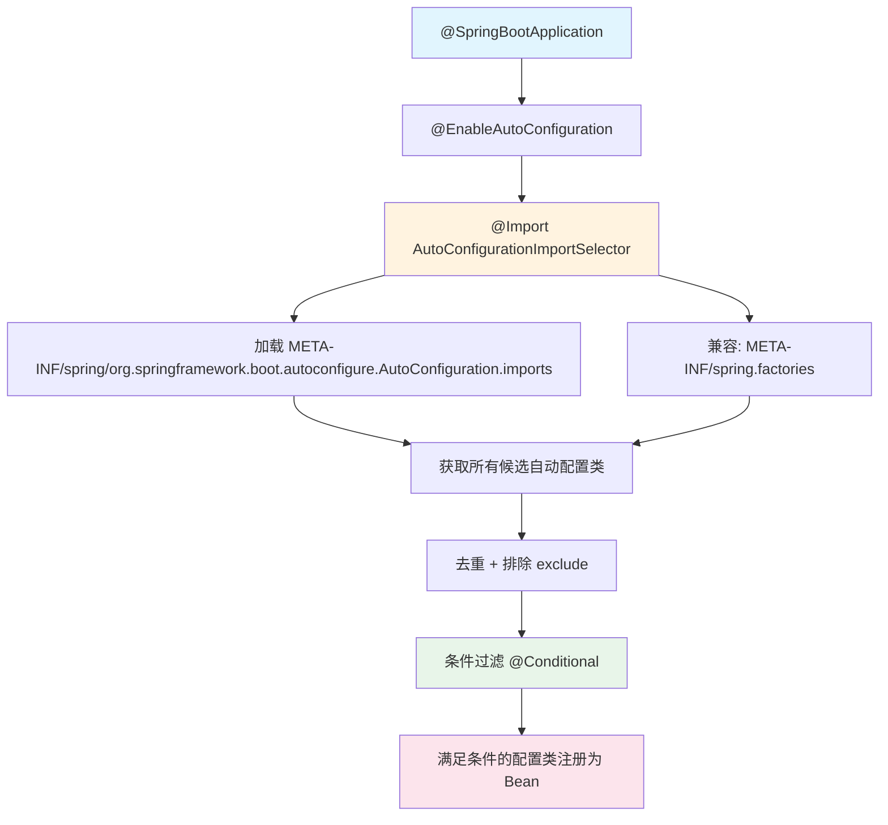
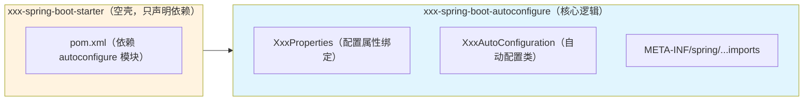
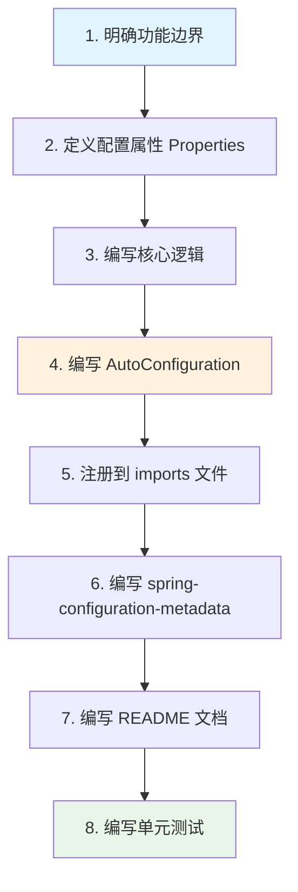

## 自动装配原理

### 什么是自动装配

Spring Boot 的核心理念是 **约定优于配置**。自动装配机制会根据引入的依赖和配置，自动创建并注册所需的 Bean，无需开发者编写大量的 XML 或 Java 配置。

例如：引入 `spring-boot-starter-web`，Spring Boot 会自动配置嵌入式 Tomcat、DispatcherServlet、JSON 序列化等组件。

### 自动装配流程



### 核心注解解析

#### @SpringBootApplication

```java
@Target(ElementType.TYPE)
@Retention(RetentionPolicy.RUNTIME)
@SpringBootConfiguration     // 标识为配置类（等同 @Configuration）
@EnableAutoConfiguration     // 开启自动装配
@ComponentScan               // 组件扫描（默认扫描启动类所在包及子包）
public @interface SpringBootApplication {
    // ...
}
```

#### @EnableAutoConfiguration

```java
@Target(ElementType.TYPE)
@Retention(RetentionPolicy.RUNTIME)
@AutoConfigurationPackage    // 注册启动类所在包路径，供后续组件扫描使用
@Import(AutoConfigurationImportSelector.class)  // 关键：导入自动配置选择器
public @interface EnableAutoConfiguration {
    Class<?>[] exclude() default {};
    String[] excludeName() default {};
}
```

#### AutoConfigurationImportSelector 核心逻辑

```java
// 简化后的关键逻辑
public class AutoConfigurationImportSelector implements DeferredImportSelector {

    @Override
    public String[] selectImports(AnnotationMetadata metadata) {
        // 1. 加载所有候选自动配置类
        List<String> configurations = getCandidateConfigurations(metadata, attributes);

        // 2. 去重
        configurations = removeDuplicates(configurations);

        // 3. 排除用户指定的 exclude 类
        Set<String> exclusions = getExclusions(metadata, attributes);
        configurations.removeAll(exclusions);

        // 4. 通过条件过滤器过滤（@ConditionalOnClass 等）
        configurations = getConfigurationClassFilter().filter(configurations);

        return configurations.toArray(new String[0]);
    }

    protected List<String> getCandidateConfigurations(AnnotationMetadata metadata,
            AnnotationAttributes attributes) {
        // Spring Boot 2.x: 从 META-INF/spring.factories 加载
        // Spring Boot 3.x: 从 META-INF/spring/...AutoConfiguration.imports 加载
        List<String> configurations = ImportCandidates.load(
            AutoConfiguration.class, getBeanClassLoader()
        ).getCandidates();
        return configurations;
    }
}
```

### 配置文件加载位置

| Spring Boot 版本 | 配置文件路径 |
|---|---|
| 2.x | `META-INF/spring.factories` |
| 3.x（推荐） | `META-INF/spring/org.springframework.boot.autoconfigure.AutoConfiguration.imports` |

> Spring Boot 3.x 仍兼容 `spring.factories`，但推荐使用新的 `.imports` 文件格式（每行一个类全限定名，无需 key-value 格式）。

### 条件注解（@Conditional 家族）

条件注解是自动装配的核心过滤器，决定某个配置类/Bean 是否生效：

| 注解 | 说明 | 示例 |
|------|------|------|
| `@ConditionalOnClass` | classpath 中存在指定类时生效 | `@ConditionalOnClass(RedisTemplate.class)` |
| `@ConditionalOnMissingClass` | classpath 中不存在指定类时生效 | |
| `@ConditionalOnBean` | 容器中存在指定 Bean 时生效 | `@ConditionalOnBean(DataSource.class)` |
| `@ConditionalOnMissingBean` | 容器中不存在指定 Bean 时生效 | 用户自定义 Bean 优先 |
| `@ConditionalOnProperty` | 配置属性满足条件时生效 | `@ConditionalOnProperty(name = "app.cache.enabled", havingValue = "true")` |
| `@ConditionalOnWebApplication` | 当前是 Web 应用时生效 | |
| `@ConditionalOnNotWebApplication` | 当前不是 Web 应用时生效 | |
| `@ConditionalOnExpression` | SpEL 表达式为 true 时生效 | `@ConditionalOnExpression("${app.feature.x:false}")` |
| `@ConditionalOnResource` | 指定资源存在时生效 | `@ConditionalOnResource(resources = "classpath:app.properties")` |

### 以 RedisAutoConfiguration 为例

```java
@AutoConfiguration
@ConditionalOnClass(RedisOperations.class)               // 1. classpath 有 Redis 依赖
@EnableConfigurationProperties(RedisProperties.class)     // 2. 绑定 spring.data.redis.* 配置
@Import({ LettuceConnectionConfiguration.class,
          JedisConnectionConfiguration.class })
public class RedisAutoConfiguration {

    @Bean
    @ConditionalOnMissingBean(name = "redisTemplate")     // 3. 用户没有自定义 redisTemplate
    public RedisTemplate<Object, Object> redisTemplate(
            RedisConnectionFactory factory) {
        RedisTemplate<Object, Object> template = new RedisTemplate<>();
        template.setConnectionFactory(factory);
        return template;
    }

    @Bean
    @ConditionalOnMissingBean
    public StringRedisTemplate stringRedisTemplate(
            RedisConnectionFactory factory) {
        return new StringRedisTemplate(factory);
    }
}
```

**关键点**：`@ConditionalOnMissingBean` 保证了用户自定义 Bean 的优先级高于自动配置，这就是为什么我们自定义 `RedisTemplate` 后可以覆盖默认配置。

## 自定义 Starter 开发

### Starter 命名规范

| 类型 | 命名格式 | 示例 |
|------|---------|------|
| 官方 Starter | `spring-boot-starter-{模块名}` | `spring-boot-starter-web` |
| 第三方 Starter | `{模块名}-spring-boot-starter` | `mybatis-spring-boot-starter` |

### Starter 项目结构

一个标准 Starter 通常包含两个模块：



> **简单 Starter 可合并为一个模块**（如下面的实战案例），不必拆分为两个。

### 实战一：操作日志 Starter

一个通用的操作日志 Starter，引入后即可通过注解自动记录操作日志到数据库或消息队列。

#### 项目结构

```
oplog-spring-boot-starter/
├── pom.xml
└── src/main/java/com/example/oplog/
│   ├── annotation/
│   │   └── OpLog.java                  # 操作日志注解
│   ├── aspect/
│   │   └── OpLogAspect.java            # 切面逻辑
│   ├── model/
│   │   └── OpLogRecord.java            # 日志记录模型
│   ├── service/
│   │   ├── OpLogRecordService.java     # 日志持久化接口
│   │   └── DefaultOpLogRecordService.java  # 默认实现（打印日志）
│   ├── properties/
│   │   └── OpLogProperties.java        # 配置属性
│   └── autoconfigure/
│       └── OpLogAutoConfiguration.java # 自动配置类
└── src/main/resources/
    └── META-INF/spring/
        └── org.springframework.boot.autoconfigure.AutoConfiguration.imports
```

#### 1. 定义 pom.xml

```xml
<?xml version="1.0" encoding="UTF-8"?>
<project xmlns="http://maven.apache.org/POM/4.0.0"
         xmlns:xsi="http://www.w3.org/2001/XMLSchema-instance"
         xsi:schemaLocation="http://maven.apache.org/POM/4.0.0
         http://maven.apache.org/xsd/maven-4.0.0.xsd">
    <modelVersion>4.0.0</modelVersion>

    <groupId>com.example</groupId>
    <artifactId>oplog-spring-boot-starter</artifactId>
    <version>1.0.0</version>

    <properties>
        <java.version>17</java.version>
        <spring-boot.version>3.2.0</spring-boot.version>
    </properties>

    <dependencies>
        <!-- Spring Boot 自动装配核心 -->
        <dependency>
            <groupId>org.springframework.boot</groupId>
            <artifactId>spring-boot-autoconfigure</artifactId>
            <version>${spring-boot.version}</version>
        </dependency>
        <!-- 配置元数据生成（IDE 提示） -->
        <dependency>
            <groupId>org.springframework.boot</groupId>
            <artifactId>spring-boot-configuration-processor</artifactId>
            <version>${spring-boot.version}</version>
            <optional>true</optional>
        </dependency>
        <!-- AOP -->
        <dependency>
            <groupId>org.springframework.boot</groupId>
            <artifactId>spring-boot-starter-aop</artifactId>
            <version>${spring-boot.version}</version>
        </dependency>
        <!-- Web（可选，用于获取请求上下文） -->
        <dependency>
            <groupId>org.springframework.boot</groupId>
            <artifactId>spring-boot-starter-web</artifactId>
            <version>${spring-boot.version}</version>
            <optional>true</optional>
        </dependency>
    </dependencies>
</project>
```

#### 2. 配置属性类

```java
package com.example.oplog.properties;

import org.springframework.boot.context.properties.ConfigurationProperties;

@ConfigurationProperties(prefix = "oplog")
public class OpLogProperties {

    /** 是否启用操作日志 */
    private boolean enabled = true;

    /** 应用名称 */
    private String appName = "default";

    /** 是否记录请求参数 */
    private boolean logParams = true;

    /** 是否记录返回结果 */
    private boolean logResult = false;

    /** 是否异步记录 */
    private boolean async = true;

    // getter / setter 省略，建议使用 Lombok @Data
    public boolean isEnabled() { return enabled; }
    public void setEnabled(boolean enabled) { this.enabled = enabled; }
    public String getAppName() { return appName; }
    public void setAppName(String appName) { this.appName = appName; }
    public boolean isLogParams() { return logParams; }
    public void setLogParams(boolean logParams) { this.logParams = logParams; }
    public boolean isLogResult() { return logResult; }
    public void setLogResult(boolean logResult) { this.logResult = logResult; }
    public boolean isAsync() { return async; }
    public void setAsync(boolean async) { this.async = async; }
}
```

#### 3. 定义注解

```java
package com.example.oplog.annotation;

import java.lang.annotation.*;

@Target(ElementType.METHOD)
@Retention(RetentionPolicy.RUNTIME)
@Documented
public @interface OpLog {
    /** 操作模块 */
    String module() default "";
    /** 操作类型 */
    String type() default "";
    /** 操作描述（支持 SpEL） */
    String description() default "";
}
```

#### 4. 日志记录模型

```java
package com.example.oplog.model;

import java.time.LocalDateTime;

public class OpLogRecord {
    private String appName;
    private String module;
    private String type;
    private String description;
    private String method;
    private String params;
    private String result;
    private boolean success;
    private String errorMsg;
    private String operator;
    private String ip;
    private long costMs;
    private LocalDateTime createTime;

    // getter / setter 省略
}
```

#### 5. 日志持久化接口

```java
package com.example.oplog.service;

import com.example.oplog.model.OpLogRecord;

/**
 * 操作日志持久化接口
 * 使用方可自行实现（存数据库、发 MQ 等），
 * 不实现则使用默认的控制台打印
 */
public interface OpLogRecordService {
    void record(OpLogRecord logRecord);
}
```

```java
package com.example.oplog.service;

import com.example.oplog.model.OpLogRecord;
import org.slf4j.Logger;
import org.slf4j.LoggerFactory;

/**
 * 默认实现：打印到日志
 */
public class DefaultOpLogRecordService implements OpLogRecordService {

    private static final Logger log = LoggerFactory.getLogger(DefaultOpLogRecordService.class);

    @Override
    public void record(OpLogRecord logRecord) {
        log.info("[操作日志] app={}, module={}, type={}, desc={}, method={}, " +
                "success={}, cost={}ms, operator={}, ip={}",
            logRecord.getAppName(), logRecord.getModule(), logRecord.getType(),
            logRecord.getDescription(), logRecord.getMethod(),
            logRecord.isSuccess(), logRecord.getCostMs(),
            logRecord.getOperator(), logRecord.getIp());
    }
}
```

#### 6. AOP 切面

```java
package com.example.oplog.aspect;

import com.example.oplog.annotation.OpLog;
import com.example.oplog.model.OpLogRecord;
import com.example.oplog.properties.OpLogProperties;
import com.example.oplog.service.OpLogRecordService;
import com.fasterxml.jackson.databind.ObjectMapper;
import jakarta.servlet.http.HttpServletRequest;
import org.aspectj.lang.ProceedingJoinPoint;
import org.aspectj.lang.annotation.Around;
import org.aspectj.lang.annotation.Aspect;
import org.aspectj.lang.reflect.MethodSignature;
import org.springframework.web.context.request.RequestContextHolder;
import org.springframework.web.context.request.ServletRequestAttributes;

import java.time.LocalDateTime;
import java.util.concurrent.CompletableFuture;

@Aspect
public class OpLogAspect {

    private final OpLogProperties properties;
    private final OpLogRecordService recordService;
    private final ObjectMapper objectMapper;

    public OpLogAspect(OpLogProperties properties,
                       OpLogRecordService recordService,
                       ObjectMapper objectMapper) {
        this.properties = properties;
        this.recordService = recordService;
        this.objectMapper = objectMapper;
    }

    @Around("@annotation(opLog)")
    public Object around(ProceedingJoinPoint pjp, OpLog opLog) throws Throwable {
        OpLogRecord record = new OpLogRecord();
        record.setAppName(properties.getAppName());
        record.setModule(opLog.module());
        record.setType(opLog.type());
        record.setDescription(opLog.description());
        record.setCreateTime(LocalDateTime.now());

        MethodSignature signature = (MethodSignature) pjp.getSignature();
        record.setMethod(signature.getDeclaringTypeName() + "." + signature.getName());

        // 请求信息
        ServletRequestAttributes attrs =
            (ServletRequestAttributes) RequestContextHolder.getRequestAttributes();
        if (attrs != null) {
            HttpServletRequest request = attrs.getRequest();
            record.setIp(request.getHeader("X-Forwarded-For") != null
                ? request.getHeader("X-Forwarded-For") : request.getRemoteAddr());
        }

        // 请求参数
        if (properties.isLogParams()) {
            try {
                record.setParams(objectMapper.writeValueAsString(pjp.getArgs()));
            } catch (Exception e) {
                record.setParams("序列化失败");
            }
        }

        long start = System.currentTimeMillis();
        try {
            Object result = pjp.proceed();
            record.setSuccess(true);
            if (properties.isLogResult() && result != null) {
                try {
                    record.setResult(objectMapper.writeValueAsString(result));
                } catch (Exception ignored) { }
            }
            return result;
        } catch (Throwable e) {
            record.setSuccess(false);
            record.setErrorMsg(e.getMessage());
            throw e;
        } finally {
            record.setCostMs(System.currentTimeMillis() - start);
            // 异步或同步记录
            if (properties.isAsync()) {
                CompletableFuture.runAsync(() -> recordService.record(record));
            } else {
                recordService.record(record);
            }
        }
    }
}
```

#### 7. 自动配置类

```java
package com.example.oplog.autoconfigure;

import com.example.oplog.aspect.OpLogAspect;
import com.example.oplog.properties.OpLogProperties;
import com.example.oplog.service.DefaultOpLogRecordService;
import com.example.oplog.service.OpLogRecordService;
import com.fasterxml.jackson.databind.ObjectMapper;
import org.springframework.boot.autoconfigure.AutoConfiguration;
import org.springframework.boot.autoconfigure.condition.ConditionalOnMissingBean;
import org.springframework.boot.autoconfigure.condition.ConditionalOnProperty;
import org.springframework.boot.context.properties.EnableConfigurationProperties;
import org.springframework.context.annotation.Bean;

@AutoConfiguration
@EnableConfigurationProperties(OpLogProperties.class)
@ConditionalOnProperty(name = "oplog.enabled", havingValue = "true", matchIfMissing = true)
public class OpLogAutoConfiguration {

    /**
     * 默认日志记录服务（用户可自定义覆盖）
     */
    @Bean
    @ConditionalOnMissingBean(OpLogRecordService.class)
    public OpLogRecordService defaultOpLogRecordService() {
        return new DefaultOpLogRecordService();
    }

    /**
     * 操作日志切面
     */
    @Bean
    @ConditionalOnMissingBean
    public OpLogAspect opLogAspect(OpLogProperties properties,
                                   OpLogRecordService recordService,
                                   ObjectMapper objectMapper) {
        return new OpLogAspect(properties, recordService, objectMapper);
    }
}
```

#### 8. 注册自动配置（Spring Boot 3.x）

创建文件 `src/main/resources/META-INF/spring/org.springframework.boot.autoconfigure.AutoConfiguration.imports`：

```
com.example.oplog.autoconfigure.OpLogAutoConfiguration
```

#### 9. 使用方引入

```xml
<!-- 引入 Starter -->
<dependency>
    <groupId>com.example</groupId>
    <artifactId>oplog-spring-boot-starter</artifactId>
    <version>1.0.0</version>
</dependency>
```

```yaml
# application.yml 配置（全部可选，有默认值）
oplog:
  enabled: true
  app-name: order-service
  log-params: true
  log-result: false
  async: true
```

```java
// 直接在 Controller/Service 方法上使用
@OpLog(module = "订单管理", type = "创建", description = "创建新订单")
@PostMapping("/api/orders")
public Order createOrder(@RequestBody OrderCreateRequest request) {
    return orderService.create(request);
}
```

```java
// 自定义日志持久化（可选，覆盖默认实现）
@Service
public class DbOpLogRecordService implements OpLogRecordService {

    private final OpLogRepository repository;

    public DbOpLogRecordService(OpLogRepository repository) {
        this.repository = repository;
    }

    @Override
    public void record(OpLogRecord logRecord) {
        // 存入数据库
        repository.save(convertToEntity(logRecord));
    }
}
```

### 实战二：分布式锁 Starter

一个基于 Redis 的分布式锁 Starter，注解式声明即可加锁。

#### 1. 配置属性

```java
@ConfigurationProperties(prefix = "distributed-lock")
public class LockProperties {

    /** 是否启用 */
    private boolean enabled = true;

    /** 锁前缀 */
    private String keyPrefix = "lock:";

    /** 默认等待时间（秒） */
    private long defaultWaitTime = 3;

    /** 默认持有时间（秒） */
    private long defaultLeaseTime = 10;

    // getter / setter 省略
}
```

#### 2. 锁注解

```java
@Target(ElementType.METHOD)
@Retention(RetentionPolicy.RUNTIME)
public @interface DistributedLock {
    /** 锁的 Key（支持 SpEL） */
    String key();
    /** 等待时间（秒），0 表示不等待 */
    long waitTime() default 3;
    /** 持有时间（秒），超时自动释放 */
    long leaseTime() default 10;
    /** 获取锁失败时的提示信息 */
    String failMessage() default "系统繁忙，请稍后再试";
}
```

#### 3. 锁切面

```java
@Aspect
public class DistributedLockAspect {

    private final StringRedisTemplate redisTemplate;
    private final LockProperties properties;
    private final SpelExpressionParser parser = new SpelExpressionParser();

    public DistributedLockAspect(StringRedisTemplate redisTemplate, LockProperties properties) {
        this.redisTemplate = redisTemplate;
        this.properties = properties;
    }

    @Around("@annotation(lock)")
    public Object around(ProceedingJoinPoint pjp, DistributedLock lock) throws Throwable {
        String lockKey = properties.getKeyPrefix() + parseSpel(pjp, lock.key());
        String lockValue = UUID.randomUUID().toString();
        long leaseTime = lock.leaseTime() > 0 ? lock.leaseTime() : properties.getDefaultLeaseTime();

        boolean acquired = tryLock(lockKey, lockValue, lock.waitTime(), leaseTime);
        if (!acquired) {
            throw new RuntimeException(lock.failMessage());
        }

        try {
            return pjp.proceed();
        } finally {
            unlock(lockKey, lockValue);
        }
    }

    private boolean tryLock(String key, String value, long waitTime, long leaseTime) {
        long deadline = System.currentTimeMillis() + waitTime * 1000;
        do {
            Boolean result = redisTemplate.opsForValue()
                .setIfAbsent(key, value, Duration.ofSeconds(leaseTime));
            if (Boolean.TRUE.equals(result)) {
                return true;
            }
            if (waitTime <= 0) break;
            try { Thread.sleep(100); } catch (InterruptedException e) {
                Thread.currentThread().interrupt();
                return false;
            }
        } while (System.currentTimeMillis() < deadline);
        return false;
    }

    private void unlock(String key, String value) {
        // Lua 脚本保证原子性：只释放自己持有的锁
        String luaScript = """
            if redis.call('GET', KEYS[1]) == ARGV[1] then
                return redis.call('DEL', KEYS[1])
            else
                return 0
            end
            """;
        redisTemplate.execute(
            new DefaultRedisScript<>(luaScript, Long.class),
            List.of(key), value
        );
    }

    private String parseSpel(ProceedingJoinPoint pjp, String spel) {
        if (!spel.contains("#")) return spel;
        MethodSignature sig = (MethodSignature) pjp.getSignature();
        StandardEvaluationContext ctx = new StandardEvaluationContext();
        String[] names = sig.getParameterNames();
        Object[] args = pjp.getArgs();
        if (names != null) {
            for (int i = 0; i < names.length; i++) {
                ctx.setVariable(names[i], args[i]);
            }
        }
        return parser.parseExpression(spel).getValue(ctx, String.class);
    }
}
```

#### 4. 自动配置

```java
@AutoConfiguration
@EnableConfigurationProperties(LockProperties.class)
@ConditionalOnProperty(name = "distributed-lock.enabled", havingValue = "true", matchIfMissing = true)
@ConditionalOnClass(StringRedisTemplate.class)
public class DistributedLockAutoConfiguration {

    @Bean
    @ConditionalOnMissingBean
    public DistributedLockAspect distributedLockAspect(
            StringRedisTemplate redisTemplate, LockProperties properties) {
        return new DistributedLockAspect(redisTemplate, properties);
    }
}
```

#### 5. 使用方式

```java
@Service
public class StockService {

    @DistributedLock(key = "'stock:' + #productId", leaseTime = 5, failMessage = "商品库存操作中，请稍后")
    public void deductStock(String productId, int quantity) {
        // 扣减库存逻辑
    }
}
```

### 实战三：MinIO 对象存储 Starter

封装 MinIO 客户端，引入即可进行文件上传、下载、删除等操作。

#### 项目结构

```
minio-spring-boot-starter/
├── pom.xml
└── src/main/java/com/example/minio/
│   ├── properties/
│   │   └── MinioProperties.java
│   ├── service/
│   │   └── MinioTemplate.java
│   └── autoconfigure/
│       └── MinioAutoConfiguration.java
└── src/main/resources/META-INF/spring/
    └── org.springframework.boot.autoconfigure.AutoConfiguration.imports
```

#### 1. pom.xml 核心依赖

```xml
<dependencies>
    <dependency>
        <groupId>org.springframework.boot</groupId>
        <artifactId>spring-boot-autoconfigure</artifactId>
    </dependency>
    <dependency>
        <groupId>org.springframework.boot</groupId>
        <artifactId>spring-boot-configuration-processor</artifactId>
        <optional>true</optional>
    </dependency>
    <dependency>
        <groupId>io.minio</groupId>
        <artifactId>minio</artifactId>
        <version>8.5.7</version>
    </dependency>
</dependencies>
```

#### 2. 配置属性

```java
@ConfigurationProperties(prefix = "minio")
public class MinioProperties {

    /** 是否启用 */
    private boolean enabled = true;
    /** MinIO 服务端地址 */
    private String endpoint = "http://localhost:9000";
    /** Access Key */
    private String accessKey;
    /** Secret Key */
    private String secretKey;
    /** 默认存储桶 */
    private String defaultBucket = "default";

    // getter / setter 省略
}
```

#### 3. MinioTemplate 核心服务

```java
import io.minio.*;
import io.minio.http.Method;
import org.slf4j.Logger;
import org.slf4j.LoggerFactory;

import java.io.InputStream;
import java.util.concurrent.TimeUnit;

public class MinioTemplate {

    private static final Logger log = LoggerFactory.getLogger(MinioTemplate.class);
    private final MinioClient minioClient;
    private final MinioProperties properties;

    public MinioTemplate(MinioClient minioClient, MinioProperties properties) {
        this.minioClient = minioClient;
        this.properties = properties;
    }

    /** 检查桶是否存在，不存在则创建 */
    public void ensureBucket(String bucket) {
        try {
            boolean exists = minioClient.bucketExists(
                BucketExistsArgs.builder().bucket(bucket).build());
            if (!exists) {
                minioClient.makeBucket(MakeBucketArgs.builder().bucket(bucket).build());
                log.info("MinIO 桶已创建: {}", bucket);
            }
        } catch (Exception e) {
            throw new RuntimeException("检查/创建 MinIO 桶失败: " + bucket, e);
        }
    }

    /** 上传文件 */
    public String upload(String objectName, InputStream inputStream,
                         String contentType) {
        return upload(properties.getDefaultBucket(), objectName, inputStream, contentType);
    }

    public String upload(String bucket, String objectName, InputStream inputStream,
                         String contentType) {
        try {
            ensureBucket(bucket);
            minioClient.putObject(PutObjectArgs.builder()
                .bucket(bucket)
                .object(objectName)
                .stream(inputStream, -1, 10485760)  // 10MB 分片
                .contentType(contentType)
                .build());
            log.info("文件上传成功: bucket={}, object={}", bucket, objectName);
            return objectName;
        } catch (Exception e) {
            throw new RuntimeException("MinIO 文件上传失败", e);
        }
    }

    /** 获取文件流 */
    public InputStream getObject(String objectName) {
        return getObject(properties.getDefaultBucket(), objectName);
    }

    public InputStream getObject(String bucket, String objectName) {
        try {
            return minioClient.getObject(GetObjectArgs.builder()
                .bucket(bucket).object(objectName).build());
        } catch (Exception e) {
            throw new RuntimeException("MinIO 文件下载失败", e);
        }
    }

    /** 生成预签名 URL（临时访问链接） */
    public String getPresignedUrl(String objectName, int expireMinutes) {
        return getPresignedUrl(properties.getDefaultBucket(), objectName, expireMinutes);
    }

    public String getPresignedUrl(String bucket, String objectName, int expireMinutes) {
        try {
            return minioClient.getPresignedObjectUrl(GetPresignedObjectUrlArgs.builder()
                .method(Method.GET)
                .bucket(bucket)
                .object(objectName)
                .expiry(expireMinutes, TimeUnit.MINUTES)
                .build());
        } catch (Exception e) {
            throw new RuntimeException("生成预签名 URL 失败", e);
        }
    }

    /** 删除文件 */
    public void removeObject(String objectName) {
        removeObject(properties.getDefaultBucket(), objectName);
    }

    public void removeObject(String bucket, String objectName) {
        try {
            minioClient.removeObject(RemoveObjectArgs.builder()
                .bucket(bucket).object(objectName).build());
            log.info("文件删除成功: bucket={}, object={}", bucket, objectName);
        } catch (Exception e) {
            throw new RuntimeException("MinIO 文件删除失败", e);
        }
    }

    /** 获取原始 MinioClient（满足高级用法） */
    public MinioClient getClient() {
        return minioClient;
    }
}
```

#### 4. 自动配置

```java
@AutoConfiguration
@EnableConfigurationProperties(MinioProperties.class)
@ConditionalOnClass(MinioClient.class)
@ConditionalOnProperty(name = "minio.enabled", havingValue = "true", matchIfMissing = true)
public class MinioAutoConfiguration {

    @Bean
    @ConditionalOnMissingBean
    public MinioClient minioClient(MinioProperties properties) {
        return MinioClient.builder()
            .endpoint(properties.getEndpoint())
            .credentials(properties.getAccessKey(), properties.getSecretKey())
            .build();
    }

    @Bean
    @ConditionalOnMissingBean
    public MinioTemplate minioTemplate(MinioClient minioClient, MinioProperties properties) {
        return new MinioTemplate(minioClient, properties);
    }
}
```

#### 5. 使用方式

```yaml
minio:
  endpoint: http://192.168.131.128:9000
  access-key: minioadmin
  secret-key: minioadmin
  default-bucket: my-app
```

```java
@RestController
@RequiredArgsConstructor
@RequestMapping("/api/files")
public class FileController {

    private final MinioTemplate minioTemplate;

    @PostMapping("/upload")
    public String upload(@RequestParam("file") MultipartFile file) throws Exception {
        String objectName = UUID.randomUUID() + "_" + file.getOriginalFilename();
        minioTemplate.upload(objectName, file.getInputStream(), file.getContentType());
        return minioTemplate.getPresignedUrl(objectName, 60);
    }

    @DeleteMapping("/{objectName}")
    public String delete(@PathVariable String objectName) {
        minioTemplate.removeObject(objectName);
        return "删除成功";
    }
}
```

---

### 实战四：MQTT 消息 Starter

封装 Eclipse Paho MQTT v5 客户端，提供发布/订阅的模板化操作。

#### 1. pom.xml 核心依赖

```xml
<dependencies>
    <dependency>
        <groupId>org.springframework.boot</groupId>
        <artifactId>spring-boot-autoconfigure</artifactId>
    </dependency>
    <dependency>
        <groupId>org.springframework.boot</groupId>
        <artifactId>spring-boot-configuration-processor</artifactId>
        <optional>true</optional>
    </dependency>
    <dependency>
        <groupId>org.eclipse.paho</groupId>
        <artifactId>org.eclipse.paho.mqttv5.client</artifactId>
        <version>1.2.5</version>
    </dependency>
</dependencies>
```

#### 2. 配置属性

```java
@ConfigurationProperties(prefix = "mqtt")
public class MqttProperties {

    private boolean enabled = true;
    /** Broker 地址 */
    private String brokerUrl = "tcp://localhost:1883";
    /** 客户端 ID */
    private String clientId = "mqtt-client-" + UUID.randomUUID().toString().substring(0, 8);
    /** 用户名 */
    private String username;
    /** 密码 */
    private String password;
    /** 默认 QoS (0/1/2) */
    private int defaultQos = 1;
    /** 自动重连 */
    private boolean autoReconnect = true;
    /** 连接超时（秒） */
    private int connectionTimeout = 30;
    /** 心跳间隔（秒） */
    private int keepAliveInterval = 60;

    // getter / setter 省略
}
```

#### 3. MQTT 消息模板

```java
import org.eclipse.paho.mqttv5.client.*;
import org.eclipse.paho.mqttv5.common.MqttException;
import org.eclipse.paho.mqttv5.common.MqttMessage;
import org.eclipse.paho.mqttv5.common.MqttSubscription;
import org.slf4j.Logger;
import org.slf4j.LoggerFactory;

import java.nio.charset.StandardCharsets;

public class MqttTemplate {

    private static final Logger log = LoggerFactory.getLogger(MqttTemplate.class);
    private final MqttClient mqttClient;
    private final MqttProperties properties;

    public MqttTemplate(MqttClient mqttClient, MqttProperties properties) {
        this.mqttClient = mqttClient;
        this.properties = properties;
    }

    /** 发布消息（使用默认 QoS） */
    public void publish(String topic, String payload) {
        publish(topic, payload, properties.getDefaultQos(), false);
    }

    /** 发布消息 */
    public void publish(String topic, String payload, int qos, boolean retained) {
        try {
            MqttMessage message = new MqttMessage(payload.getBytes(StandardCharsets.UTF_8));
            message.setQos(qos);
            message.setRetained(retained);
            mqttClient.publish(topic, message);
            log.debug("MQTT 消息已发布: topic={}, qos={}", topic, qos);
        } catch (MqttException e) {
            throw new RuntimeException("MQTT 发布消息失败: topic=" + topic, e);
        }
    }

    /** 发布字节消息 */
    public void publish(String topic, byte[] payload, int qos) {
        try {
            MqttMessage message = new MqttMessage(payload);
            message.setQos(qos);
            mqttClient.publish(topic, message);
        } catch (MqttException e) {
            throw new RuntimeException("MQTT 发布消息失败: topic=" + topic, e);
        }
    }

    /** 订阅主题 */
    public void subscribe(String topicFilter, int qos, IMqttMessageListener listener) {
        try {
            MqttSubscription subscription = new MqttSubscription(topicFilter, qos);
            mqttClient.subscribe(new MqttSubscription[]{subscription},
                new IMqttMessageListener[]{listener});
            log.info("MQTT 订阅成功: topic={}, qos={}", topicFilter, qos);
        } catch (MqttException e) {
            throw new RuntimeException("MQTT 订阅失败: topic=" + topicFilter, e);
        }
    }

    /** 订阅主题（使用默认 QoS） */
    public void subscribe(String topicFilter, IMqttMessageListener listener) {
        subscribe(topicFilter, properties.getDefaultQos(), listener);
    }

    /** 取消订阅 */
    public void unsubscribe(String topicFilter) {
        try {
            mqttClient.unsubscribe(topicFilter);
            log.info("MQTT 取消订阅: topic={}", topicFilter);
        } catch (MqttException e) {
            throw new RuntimeException("MQTT 取消订阅失败: topic=" + topicFilter, e);
        }
    }

    /** 判断是否已连接 */
    public boolean isConnected() {
        return mqttClient.isConnected();
    }

    /** 获取原始客户端 */
    public MqttClient getClient() {
        return mqttClient;
    }
}
```

#### 4. 自动配置

```java
@AutoConfiguration
@EnableConfigurationProperties(MqttProperties.class)
@ConditionalOnClass(MqttClient.class)
@ConditionalOnProperty(name = "mqtt.enabled", havingValue = "true", matchIfMissing = true)
public class MqttAutoConfiguration {

    private static final Logger log = LoggerFactory.getLogger(MqttAutoConfiguration.class);

    @Bean(destroyMethod = "disconnect")
    @ConditionalOnMissingBean
    public MqttClient mqttClient(MqttProperties properties) throws MqttException {
        MqttClient client = new MqttClient(properties.getBrokerUrl(), properties.getClientId());

        MqttConnectionOptions options = new MqttConnectionOptions();
        options.setAutomaticReconnect(properties.isAutoReconnect());
        options.setConnectionTimeout(properties.getConnectionTimeout());
        options.setKeepAliveInterval(properties.getKeepAliveInterval());
        options.setCleanStart(true);

        if (properties.getUsername() != null && !properties.getUsername().isEmpty()) {
            options.setUserName(properties.getUsername());
        }
        if (properties.getPassword() != null && !properties.getPassword().isEmpty()) {
            options.setPassword(properties.getPassword().getBytes());
        }

        client.connect(options);
        log.info("MQTT 连接成功: broker={}, clientId={}", properties.getBrokerUrl(), properties.getClientId());
        return client;
    }

    @Bean
    @ConditionalOnMissingBean
    public MqttTemplate mqttTemplate(MqttClient mqttClient, MqttProperties properties) {
        return new MqttTemplate(mqttClient, properties);
    }
}
```

#### 5. 使用方式

```yaml
mqtt:
  broker-url: tcp://192.168.131.128:1883
  client-id: order-service-01
  username: admin
  password: admin123
  default-qos: 1
  auto-reconnect: true
```

```java
@Component
@RequiredArgsConstructor
public class DeviceMessageHandler {

    private final MqttTemplate mqttTemplate;

    /** 发布设备指令 */
    public void sendCommand(String deviceId, String command) {
        mqttTemplate.publish("device/" + deviceId + "/command", command);
    }

    /** 启动时订阅设备上报数据 */
    @PostConstruct
    public void subscribeDeviceData() {
        // 通配符订阅所有设备上报
        mqttTemplate.subscribe("device/+/telemetry", (topic, message) -> {
            String payload = new String(message.getPayload());
            log.info("设备上报: topic={}, data={}", topic, payload);
            // 业务处理...
        });
    }
}
```

---

### 实战五：Quartz 动态任务调度 Starter

在 Spring Boot 自带 Quartz 支持基础上，封装动态任务增删改查管理能力。

#### 1. pom.xml 核心依赖

```xml
<dependencies>
    <dependency>
        <groupId>org.springframework.boot</groupId>
        <artifactId>spring-boot-autoconfigure</artifactId>
    </dependency>
    <dependency>
        <groupId>org.springframework.boot</groupId>
        <artifactId>spring-boot-configuration-processor</artifactId>
        <optional>true</optional>
    </dependency>
    <dependency>
        <groupId>org.springframework.boot</groupId>
        <artifactId>spring-boot-starter-quartz</artifactId>
    </dependency>
</dependencies>
```

#### 2. 配置属性

```java
@ConfigurationProperties(prefix = "dynamic-quartz")
public class DynamicQuartzProperties {

    private boolean enabled = true;
    /** 默认任务组名 */
    private String defaultGroup = "DEFAULT_GROUP";

    // getter / setter 省略
}
```

#### 3. 任务信息模型

```java
public class QuartzJobInfo {
    /** 任务名称 */
    private String jobName;
    /** 任务组 */
    private String jobGroup;
    /** 任务类全限定名 */
    private String jobClassName;
    /** Cron 表达式 */
    private String cronExpression;
    /** 任务描述 */
    private String description;
    /** 任务参数 */
    private Map<String, Object> jobData;
    /** 任务状态 */
    private String status;

    // getter / setter 省略
}
```

#### 4. 动态任务管理服务

```java
import org.quartz.*;
import org.quartz.impl.matchers.GroupMatcher;
import org.slf4j.Logger;
import org.slf4j.LoggerFactory;

import java.util.*;

public class QuartzJobTemplate {

    private static final Logger log = LoggerFactory.getLogger(QuartzJobTemplate.class);
    private final Scheduler scheduler;
    private final DynamicQuartzProperties properties;

    public QuartzJobTemplate(Scheduler scheduler, DynamicQuartzProperties properties) {
        this.scheduler = scheduler;
        this.properties = properties;
    }

    /** 添加定时任务 */
    @SuppressWarnings("unchecked")
    public void addJob(QuartzJobInfo jobInfo) {
        try {
            String group = jobInfo.getJobGroup() != null
                ? jobInfo.getJobGroup() : properties.getDefaultGroup();
            Class<? extends Job> jobClass =
                (Class<? extends Job>) Class.forName(jobInfo.getJobClassName());

            JobDetail jobDetail = JobBuilder.newJob(jobClass)
                .withIdentity(jobInfo.getJobName(), group)
                .withDescription(jobInfo.getDescription())
                .storeDurably()
                .build();

            // 传入任务参数
            if (jobInfo.getJobData() != null) {
                jobDetail.getJobDataMap().putAll(jobInfo.getJobData());
            }

            CronTrigger trigger = TriggerBuilder.newTrigger()
                .withIdentity(jobInfo.getJobName() + "_trigger", group)
                .withSchedule(CronScheduleBuilder.cronSchedule(jobInfo.getCronExpression())
                    .withMisfireHandlingInstructionDoNothing())
                .build();

            scheduler.scheduleJob(jobDetail, trigger);
            log.info("定时任务已添加: name={}, group={}, cron={}",
                jobInfo.getJobName(), group, jobInfo.getCronExpression());
        } catch (Exception e) {
            throw new RuntimeException("添加定时任务失败: " + jobInfo.getJobName(), e);
        }
    }

    /** 更新任务 Cron 表达式 */
    public void updateJobCron(String jobName, String jobGroup, String newCron) {
        try {
            String group = jobGroup != null ? jobGroup : properties.getDefaultGroup();
            TriggerKey triggerKey = TriggerKey.triggerKey(jobName + "_trigger", group);
            CronTrigger trigger = (CronTrigger) scheduler.getTrigger(triggerKey);

            if (trigger == null) {
                throw new RuntimeException("任务触发器不存在: " + jobName);
            }

            CronTrigger newTrigger = trigger.getTriggerBuilder()
                .withSchedule(CronScheduleBuilder.cronSchedule(newCron)
                    .withMisfireHandlingInstructionDoNothing())
                .build();
            scheduler.rescheduleJob(triggerKey, newTrigger);
            log.info("任务 Cron 已更新: name={}, newCron={}", jobName, newCron);
        } catch (SchedulerException e) {
            throw new RuntimeException("更新任务失败: " + jobName, e);
        }
    }

    /** 暂停任务 */
    public void pauseJob(String jobName, String jobGroup) {
        try {
            String group = jobGroup != null ? jobGroup : properties.getDefaultGroup();
            scheduler.pauseJob(JobKey.jobKey(jobName, group));
            log.info("任务已暂停: name={}, group={}", jobName, group);
        } catch (SchedulerException e) {
            throw new RuntimeException("暂停任务失败", e);
        }
    }

    /** 恢复任务 */
    public void resumeJob(String jobName, String jobGroup) {
        try {
            String group = jobGroup != null ? jobGroup : properties.getDefaultGroup();
            scheduler.resumeJob(JobKey.jobKey(jobName, group));
            log.info("任务已恢复: name={}, group={}", jobName, group);
        } catch (SchedulerException e) {
            throw new RuntimeException("恢复任务失败", e);
        }
    }

    /** 删除任务 */
    public void deleteJob(String jobName, String jobGroup) {
        try {
            String group = jobGroup != null ? jobGroup : properties.getDefaultGroup();
            TriggerKey triggerKey = TriggerKey.triggerKey(jobName + "_trigger", group);
            scheduler.pauseTrigger(triggerKey);
            scheduler.unscheduleJob(triggerKey);
            scheduler.deleteJob(JobKey.jobKey(jobName, group));
            log.info("任务已删除: name={}, group={}", jobName, group);
        } catch (SchedulerException e) {
            throw new RuntimeException("删除任务失败", e);
        }
    }

    /** 立即执行一次 */
    public void triggerJob(String jobName, String jobGroup) {
        try {
            String group = jobGroup != null ? jobGroup : properties.getDefaultGroup();
            scheduler.triggerJob(JobKey.jobKey(jobName, group));
            log.info("任务已触发: name={}, group={}", jobName, group);
        } catch (SchedulerException e) {
            throw new RuntimeException("触发任务失败", e);
        }
    }

    /** 查询所有任务 */
    public List<QuartzJobInfo> listAllJobs() {
        List<QuartzJobInfo> jobs = new ArrayList<>();
        try {
            for (String group : scheduler.getJobGroupNames()) {
                for (JobKey jobKey : scheduler.getJobKeys(GroupMatcher.jobGroupEquals(group))) {
                    List<? extends Trigger> triggers = scheduler.getTriggersOfJob(jobKey);
                    for (Trigger trigger : triggers) {
                        QuartzJobInfo info = new QuartzJobInfo();
                        info.setJobName(jobKey.getName());
                        info.setJobGroup(jobKey.getGroup());
                        info.setJobClassName(scheduler.getJobDetail(jobKey).getJobClass().getName());
                        info.setDescription(scheduler.getJobDetail(jobKey).getDescription());
                        if (trigger instanceof CronTrigger cronTrigger) {
                            info.setCronExpression(cronTrigger.getCronExpression());
                        }
                        info.setStatus(scheduler.getTriggerState(trigger.getKey()).name());
                        jobs.add(info);
                    }
                }
            }
        } catch (SchedulerException e) {
            throw new RuntimeException("查询任务列表失败", e);
        }
        return jobs;
    }
}
```

#### 5. 自动配置

```java
@AutoConfiguration
@EnableConfigurationProperties(DynamicQuartzProperties.class)
@ConditionalOnClass(Scheduler.class)
@ConditionalOnProperty(name = "dynamic-quartz.enabled", havingValue = "true", matchIfMissing = true)
public class DynamicQuartzAutoConfiguration {

    @Bean
    @ConditionalOnMissingBean
    public QuartzJobTemplate quartzJobTemplate(Scheduler scheduler,
                                               DynamicQuartzProperties properties) {
        return new QuartzJobTemplate(scheduler, properties);
    }
}
```

#### 6. 使用方式

```yaml
# Spring Boot Quartz 原生配置（持久化到数据库）
spring:
  quartz:
    job-store-type: jdbc
    jdbc:
      initialize-schema: always
    properties:
      org.quartz.threadPool.threadCount: 10

# 自定义 Starter 配置
dynamic-quartz:
  default-group: MY_APP_JOBS
```

```java
// 定义任务类
@Component
public class OrderTimeoutJob implements Job {
    @Override
    public void execute(JobExecutionContext context) {
        String orderId = context.getJobDetail().getJobDataMap().getString("orderId");
        log.info("订单超时检查: orderId={}", orderId);
    }
}

// 动态管理任务
@RestController
@RequiredArgsConstructor
@RequestMapping("/api/jobs")
public class JobController {

    private final QuartzJobTemplate quartzJobTemplate;

    @PostMapping
    public String addJob(@RequestBody QuartzJobInfo jobInfo) {
        quartzJobTemplate.addJob(jobInfo);
        return "任务已添加";
    }

    @PutMapping("/{jobName}/cron")
    public String updateCron(@PathVariable String jobName,
                             @RequestParam String cron) {
        quartzJobTemplate.updateJobCron(jobName, null, cron);
        return "Cron 已更新";
    }

    @GetMapping
    public List<QuartzJobInfo> list() {
        return quartzJobTemplate.listAllJobs();
    }

    @DeleteMapping("/{jobName}")
    public String delete(@PathVariable String jobName) {
        quartzJobTemplate.deleteJob(jobName, null);
        return "任务已删除";
    }
}
```

---

### 实战六：RabbitMQ 增强 Starter

在 Spring Boot 原生 `spring-boot-starter-amqp` 基础上增强：自动声明交换机/队列/绑定、可靠投递封装、消息追踪。

#### 1. pom.xml 核心依赖

```xml
<dependencies>
    <dependency>
        <groupId>org.springframework.boot</groupId>
        <artifactId>spring-boot-autoconfigure</artifactId>
    </dependency>
    <dependency>
        <groupId>org.springframework.boot</groupId>
        <artifactId>spring-boot-configuration-processor</artifactId>
        <optional>true</optional>
    </dependency>
    <dependency>
        <groupId>org.springframework.boot</groupId>
        <artifactId>spring-boot-starter-amqp</artifactId>
    </dependency>
</dependencies>
```

#### 2. 配置属性

```java
@ConfigurationProperties(prefix = "enhanced-rabbit")
public class EnhancedRabbitProperties {

    private boolean enabled = true;

    /** 是否开启消息确认回调 */
    private boolean confirmEnabled = true;

    /** 是否开启消息返回回调 */
    private boolean returnEnabled = true;

    /** 自动声明的交换机/队列/绑定 */
    private List<BindingDefinition> bindings = new ArrayList<>();

    public static class BindingDefinition {
        /** 交换机名称 */
        private String exchange;
        /** 交换机类型：direct / topic / fanout / headers */
        private String exchangeType = "direct";
        /** 队列名称 */
        private String queue;
        /** 路由键 */
        private String routingKey = "";
        /** 是否持久化 */
        private boolean durable = true;
        /** 死信交换机 */
        private String deadLetterExchange;
        /** 死信路由键 */
        private String deadLetterRoutingKey;

        // getter / setter 省略
    }

    // getter / setter 省略
}
```

#### 3. 可靠消息发送模板

```java
import org.slf4j.Logger;
import org.slf4j.LoggerFactory;
import org.springframework.amqp.core.MessagePostProcessor;
import org.springframework.amqp.core.MessageProperties;
import org.springframework.amqp.rabbit.connection.CorrelationData;
import org.springframework.amqp.rabbit.core.RabbitTemplate;

import java.util.UUID;

public class ReliableRabbitTemplate {

    private static final Logger log = LoggerFactory.getLogger(ReliableRabbitTemplate.class);
    private final RabbitTemplate rabbitTemplate;

    public ReliableRabbitTemplate(RabbitTemplate rabbitTemplate) {
        this.rabbitTemplate = rabbitTemplate;
    }

    /**
     * 可靠发送：带消息 ID + 确认回调
     */
    public void send(String exchange, String routingKey, Object message) {
        String msgId = UUID.randomUUID().toString();
        CorrelationData correlationData = new CorrelationData(msgId);

        MessagePostProcessor postProcessor = msg -> {
            MessageProperties props = msg.getMessageProperties();
            props.setMessageId(msgId);
            props.setContentType("application/json");
            return msg;
        };

        rabbitTemplate.convertAndSend(exchange, routingKey, message, postProcessor, correlationData);
        log.info("消息已发送: exchange={}, routingKey={}, msgId={}", exchange, routingKey, msgId);
    }

    /**
     * 发送延迟消息（需要 rabbitmq_delayed_message_exchange 插件）
     */
    public void sendDelay(String exchange, String routingKey, Object message, long delayMs) {
        String msgId = UUID.randomUUID().toString();
        CorrelationData correlationData = new CorrelationData(msgId);

        MessagePostProcessor postProcessor = msg -> {
            msg.getMessageProperties().setMessageId(msgId);
            msg.getMessageProperties().setDelay((int) delayMs);
            return msg;
        };

        rabbitTemplate.convertAndSend(exchange, routingKey, message, postProcessor, correlationData);
        log.info("延迟消息已发送: exchange={}, delay={}ms, msgId={}", exchange, delayMs, msgId);
    }

    /**
     * 发送到默认交换机（直接投递到队列）
     */
    public void sendToQueue(String queue, Object message) {
        send("", queue, message);
    }

    public RabbitTemplate getRabbitTemplate() {
        return rabbitTemplate;
    }
}
```

#### 4. 自动配置

```java
@AutoConfiguration
@EnableConfigurationProperties(EnhancedRabbitProperties.class)
@ConditionalOnClass(RabbitTemplate.class)
@ConditionalOnProperty(name = "enhanced-rabbit.enabled", havingValue = "true", matchIfMissing = true)
public class EnhancedRabbitAutoConfiguration {

    private static final Logger log = LoggerFactory.getLogger(EnhancedRabbitAutoConfiguration.class);

    /** 配置确认和返回回调 */
    @Bean
    @ConditionalOnMissingBean
    public ReliableRabbitTemplate reliableRabbitTemplate(
            RabbitTemplate rabbitTemplate, EnhancedRabbitProperties properties) {

        if (properties.isConfirmEnabled()) {
            rabbitTemplate.setConfirmCallback((correlationData, ack, cause) -> {
                String msgId = correlationData != null ? correlationData.getId() : "unknown";
                if (ack) {
                    log.debug("消息确认成功: msgId={}", msgId);
                } else {
                    log.error("消息确认失败: msgId={}, cause={}", msgId, cause);
                }
            });
        }

        if (properties.isReturnEnabled()) {
            rabbitTemplate.setReturnsCallback(returned -> {
                log.error("消息被退回: exchange={}, routingKey={}, replyCode={}, replyText={}",
                    returned.getExchange(), returned.getRoutingKey(),
                    returned.getReplyCode(), returned.getReplyText());
            });
        }

        return new ReliableRabbitTemplate(rabbitTemplate);
    }

    /** 根据配置自动声明交换机、队列、绑定 */
    @Bean
    public SmartInitializingSingleton declareBindings(
            AmqpAdmin amqpAdmin, EnhancedRabbitProperties properties) {
        return () -> {
            for (var def : properties.getBindings()) {
                // 声明交换机
                AbstractExchange exchange = switch (def.getExchangeType()) {
                    case "topic" -> new TopicExchange(def.getExchange(), def.isDurable(), false);
                    case "fanout" -> new FanoutExchange(def.getExchange(), def.isDurable(), false);
                    case "headers" -> new HeadersExchange(def.getExchange(), def.isDurable(), false);
                    default -> new DirectExchange(def.getExchange(), def.isDurable(), false);
                };
                amqpAdmin.declareExchange(exchange);

                // 声明队列
                Map<String, Object> args = new HashMap<>();
                if (def.getDeadLetterExchange() != null) {
                    args.put("x-dead-letter-exchange", def.getDeadLetterExchange());
                    args.put("x-dead-letter-routing-key", def.getDeadLetterRoutingKey());
                }
                Queue queue = new Queue(def.getQueue(), def.isDurable(), false, false, args);
                amqpAdmin.declareQueue(queue);

                // 声明绑定
                Binding binding = BindingBuilder.bind(queue).to(exchange)
                    .with(def.getRoutingKey()).noargs();
                amqpAdmin.declareBinding(binding);

                log.info("自动声明绑定: exchange={}, queue={}, routingKey={}",
                    def.getExchange(), def.getQueue(), def.getRoutingKey());
            }
        };
    }
}
```

#### 5. 使用方式

```yaml
spring:
  rabbitmq:
    host: 192.168.131.128
    port: 5672
    username: admin
    password: admin123
    publisher-confirm-type: correlated
    publisher-returns: true

enhanced-rabbit:
  confirm-enabled: true
  return-enabled: true
  bindings:
    - exchange: order.exchange
      exchange-type: direct
      queue: order.create.queue
      routing-key: order.create
      dead-letter-exchange: order.dlx
      dead-letter-routing-key: order.dlx.key
    - exchange: order.exchange
      exchange-type: direct
      queue: order.pay.queue
      routing-key: order.pay
```

```java
@Service
@RequiredArgsConstructor
public class OrderMqService {

    private final ReliableRabbitTemplate rabbitTemplate;

    public void sendOrderCreated(Order order) {
        rabbitTemplate.send("order.exchange", "order.create", order);
    }

    public void sendOrderTimeout(String orderId, long delayMs) {
        rabbitTemplate.sendDelay("order.delay.exchange", "order.timeout", orderId, delayMs);
    }
}
```

---

### 实战七：Redis 消息（Pub/Sub + Stream）Starter

封装 Redis Pub/Sub 和 Stream 两种消息模式，提供统一的发布/订阅 API。

#### 1. pom.xml 核心依赖

```xml
<dependencies>
    <dependency>
        <groupId>org.springframework.boot</groupId>
        <artifactId>spring-boot-autoconfigure</artifactId>
    </dependency>
    <dependency>
        <groupId>org.springframework.boot</groupId>
        <artifactId>spring-boot-configuration-processor</artifactId>
        <optional>true</optional>
    </dependency>
    <dependency>
        <groupId>org.springframework.boot</groupId>
        <artifactId>spring-boot-starter-data-redis</artifactId>
    </dependency>
</dependencies>
```

#### 2. 配置属性

```java
@ConfigurationProperties(prefix = "redis-message")
public class RedisMessageProperties {

    private boolean enabled = true;

    /** Pub/Sub 配置 */
    private PubSub pubsub = new PubSub();

    /** Stream 配置 */
    private StreamConfig stream = new StreamConfig();

    public static class PubSub {
        /** 是否启用 Pub/Sub */
        private boolean enabled = true;
        // getter / setter 省略
    }

    public static class StreamConfig {
        /** 是否启用 Stream */
        private boolean enabled = false;
        /** 消费者组名 */
        private String group = "default-group";
        /** 消费者名 */
        private String consumer = "consumer-1";
        /** Stream 最大长度（自动裁剪） */
        private long maxLen = 10000;
        /** 拉取间隔（毫秒） */
        private long pollTimeout = 2000;
        // getter / setter 省略
    }

    // getter / setter 省略
}
```

#### 3. Redis 消息模板

```java
import org.slf4j.Logger;
import org.slf4j.LoggerFactory;
import org.springframework.data.redis.connection.stream.*;
import org.springframework.data.redis.core.StringRedisTemplate;

import java.util.Map;

public class RedisMessageTemplate {

    private static final Logger log = LoggerFactory.getLogger(RedisMessageTemplate.class);
    private final StringRedisTemplate redisTemplate;
    private final RedisMessageProperties properties;

    public RedisMessageTemplate(StringRedisTemplate redisTemplate,
                                RedisMessageProperties properties) {
        this.redisTemplate = redisTemplate;
        this.properties = properties;
    }

    // ======== Pub/Sub 模式 ========

    /** 发布消息到频道 */
    public void publish(String channel, String message) {
        redisTemplate.convertAndSend(channel, message);
        log.debug("Pub/Sub 消息已发布: channel={}", channel);
    }

    // ======== Stream 模式 ========

    /** 发送消息到 Stream */
    public RecordId streamAdd(String streamKey, Map<String, String> fields) {
        ObjectRecord<String, Map<String, String>> record = StreamRecords
            .<String, Map<String, String>>mapBacked(fields)
            .withStreamKey(streamKey);

        RecordId recordId = redisTemplate.opsForStream().add(record);

        // 自动裁剪
        long maxLen = properties.getStream().getMaxLen();
        if (maxLen > 0) {
            redisTemplate.opsForStream().trim(streamKey, maxLen);
        }

        log.debug("Stream 消息已发送: stream={}, recordId={}", streamKey, recordId);
        return recordId;
    }

    /** 快捷发送：单个 key-value */
    public RecordId streamAdd(String streamKey, String field, String value) {
        return streamAdd(streamKey, Map.of(field, value));
    }

    /** 确认消息（ACK） */
    public void streamAck(String streamKey, String group, String recordId) {
        redisTemplate.opsForStream().acknowledge(streamKey, group, recordId);
    }

    /** 创建消费者组（如不存在） */
    public void ensureConsumerGroup(String streamKey, String group) {
        try {
            redisTemplate.opsForStream().createGroup(streamKey, ReadOffset.from("0"), group);
            log.info("Stream 消费者组已创建: stream={}, group={}", streamKey, group);
        } catch (Exception e) {
            // 组已存在或 Stream 不存在，忽略
            log.debug("消费者组已存在或 Stream 不存在: {}", e.getMessage());
        }
    }

    public StringRedisTemplate getRedisTemplate() {
        return redisTemplate;
    }
}
```

#### 4. Pub/Sub 监听器注册器

```java
import org.springframework.data.redis.connection.MessageListener;
import org.springframework.data.redis.listener.ChannelTopic;
import org.springframework.data.redis.listener.PatternTopic;
import org.springframework.data.redis.listener.RedisMessageListenerContainer;

/**
 * 简化 Pub/Sub 订阅注册
 */
public class RedisPubSubRegistrar {

    private final RedisMessageListenerContainer container;

    public RedisPubSubRegistrar(RedisMessageListenerContainer container) {
        this.container = container;
    }

    /** 订阅精确频道 */
    public void subscribe(String channel, MessageListener listener) {
        container.addMessageListener(listener, new ChannelTopic(channel));
    }

    /** 订阅模式匹配频道（支持通配符 * ? [...]） */
    public void psubscribe(String pattern, MessageListener listener) {
        container.addMessageListener(listener, new PatternTopic(pattern));
    }
}
```

#### 5. 自动配置

```java
@AutoConfiguration
@EnableConfigurationProperties(RedisMessageProperties.class)
@ConditionalOnClass(StringRedisTemplate.class)
@ConditionalOnProperty(name = "redis-message.enabled", havingValue = "true", matchIfMissing = true)
public class RedisMessageAutoConfiguration {

    @Bean
    @ConditionalOnMissingBean
    public RedisMessageTemplate redisMessageTemplate(StringRedisTemplate redisTemplate,
                                                     RedisMessageProperties properties) {
        return new RedisMessageTemplate(redisTemplate, properties);
    }

    @Bean
    @ConditionalOnMissingBean
    @ConditionalOnProperty(name = "redis-message.pubsub.enabled", havingValue = "true", matchIfMissing = true)
    public RedisMessageListenerContainer redisMessageListenerContainer(
            RedisConnectionFactory connectionFactory) {
        RedisMessageListenerContainer container = new RedisMessageListenerContainer();
        container.setConnectionFactory(connectionFactory);
        return container;
    }

    @Bean
    @ConditionalOnMissingBean
    @ConditionalOnBean(RedisMessageListenerContainer.class)
    public RedisPubSubRegistrar redisPubSubRegistrar(
            RedisMessageListenerContainer container) {
        return new RedisPubSubRegistrar(container);
    }
}
```

#### 6. 使用方式

```yaml
spring:
  data:
    redis:
      host: 192.168.131.128
      port: 6379

redis-message:
  pubsub:
    enabled: true
  stream:
    enabled: true
    group: order-group
    consumer: consumer-1
    max-len: 50000
```

```java
@Component
@RequiredArgsConstructor
public class OrderEventPublisher {

    private final RedisMessageTemplate redisMessageTemplate;

    /** Pub/Sub 方式发布 */
    public void publishOrderCreated(String orderId) {
        redisMessageTemplate.publish("order:events", "{\"type\":\"created\",\"id\":\"" + orderId + "\"}");
    }

    /** Stream 方式发布（支持消费者组） */
    public void streamOrderCreated(String orderId, String userId) {
        redisMessageTemplate.streamAdd("stream:order", Map.of(
            "type", "created",
            "orderId", orderId,
            "userId", userId
        ));
    }
}

@Component
@RequiredArgsConstructor
public class OrderEventSubscriber {

    private final RedisPubSubRegistrar pubSubRegistrar;

    @PostConstruct
    public void init() {
        // 订阅 order:* 匹配的所有频道
        pubSubRegistrar.psubscribe("order:*", (message, pattern) -> {
            String channel = new String(message.getChannel());
            String body = new String(message.getBody());
            log.info("收到消息: channel={}, body={}", channel, body);
        });
    }
}
```

---

### 实战八：RocketMQ 增强 Starter

在 Apache RocketMQ Spring Boot Starter 基础上封装统一消息模板，简化事务消息和延迟消息的发送。

#### 1. pom.xml 核心依赖

```xml
<dependencies>
    <dependency>
        <groupId>org.springframework.boot</groupId>
        <artifactId>spring-boot-autoconfigure</artifactId>
    </dependency>
    <dependency>
        <groupId>org.springframework.boot</groupId>
        <artifactId>spring-boot-configuration-processor</artifactId>
        <optional>true</optional>
    </dependency>
    <dependency>
        <groupId>org.apache.rocketmq</groupId>
        <artifactId>rocketmq-spring-boot-starter</artifactId>
        <version>2.3.0</version>
    </dependency>
</dependencies>
```

#### 2. 配置属性

```java
@ConfigurationProperties(prefix = "enhanced-rocketmq")
public class EnhancedRocketMqProperties {

    private boolean enabled = true;
    /** 默认发送超时（毫秒） */
    private long sendTimeout = 3000;
    /** 默认重试次数 */
    private int retryTimes = 2;

    // getter / setter 省略
}
```

#### 3. 统一消息模板

```java
import org.apache.rocketmq.spring.core.RocketMQTemplate;
import org.slf4j.Logger;
import org.slf4j.LoggerFactory;
import org.springframework.messaging.Message;
import org.springframework.messaging.support.MessageBuilder;

public class RocketMqEnhancedTemplate {

    private static final Logger log = LoggerFactory.getLogger(RocketMqEnhancedTemplate.class);
    private final RocketMQTemplate rocketMQTemplate;
    private final EnhancedRocketMqProperties properties;

    public RocketMqEnhancedTemplate(RocketMQTemplate rocketMQTemplate,
                                    EnhancedRocketMqProperties properties) {
        this.rocketMQTemplate = rocketMQTemplate;
        this.properties = properties;
    }

    /** 同步发送 */
    public void syncSend(String topic, Object payload) {
        syncSend(topic, null, payload);
    }

    public void syncSend(String topic, String tag, Object payload) {
        String destination = tag != null ? topic + ":" + tag : topic;
        rocketMQTemplate.syncSend(destination, payload, properties.getSendTimeout());
        log.info("同步消息已发送: destination={}", destination);
    }

    /** 异步发送 */
    public void asyncSend(String topic, Object payload) {
        asyncSend(topic, null, payload);
    }

    public void asyncSend(String topic, String tag, Object payload) {
        String destination = tag != null ? topic + ":" + tag : topic;
        rocketMQTemplate.asyncSend(destination, payload, new org.apache.rocketmq.client.producer.SendCallback() {
            @Override
            public void onSuccess(org.apache.rocketmq.client.producer.SendResult sendResult) {
                log.info("异步消息发送成功: destination={}, msgId={}", destination, sendResult.getMsgId());
            }
            @Override
            public void onException(Throwable e) {
                log.error("异步消息发送失败: destination={}, error={}", destination, e.getMessage());
            }
        });
    }

    /** 发送延迟消息 */
    public void sendDelay(String topic, Object payload, int delayLevel) {
        Message<?> message = MessageBuilder.withPayload(payload).build();
        rocketMQTemplate.syncSend(topic, message, properties.getSendTimeout(), delayLevel);
        log.info("延迟消息已发送: topic={}, delayLevel={}", topic, delayLevel);
    }

    /**
     * 发送延迟消息（语义化）
     * @param delaySeconds 延迟秒数，自动匹配最接近的延迟级别
     */
    public void sendDelay(String topic, Object payload, long delaySeconds) {
        int delayLevel = matchDelayLevel(delaySeconds);
        sendDelay(topic, payload, delayLevel);
    }

    /** 发送顺序消息 */
    public void syncSendOrderly(String topic, Object payload, String hashKey) {
        rocketMQTemplate.syncSendOrderly(topic, payload, hashKey);
        log.info("顺序消息已发送: topic={}, hashKey={}", topic, hashKey);
    }

    /** 发送事务消息 */
    public void sendInTransaction(String topic, Object payload, Object arg) {
        Message<?> message = MessageBuilder.withPayload(payload).build();
        rocketMQTemplate.sendMessageInTransaction(topic, message, arg);
        log.info("事务消息已发送: topic={}", topic);
    }

    /**
     * RocketMQ 延迟级别映射：
     * 1=1s 2=5s 3=10s 4=30s 5=1min 6=2min 7=3min 8=4min 9=5min
     * 10=6min 11=7min 12=8min 13=9min 14=10min 15=20min 16=30min 17=1h 18=2h
     */
    private int matchDelayLevel(long delaySeconds) {
        long[] levels = {1, 5, 10, 30, 60, 120, 180, 240, 300, 360, 420, 480, 540, 600, 1200, 1800, 3600, 7200};
        for (int i = levels.length - 1; i >= 0; i--) {
            if (delaySeconds >= levels[i]) return i + 1;
        }
        return 1;
    }

    public RocketMQTemplate getRocketMQTemplate() {
        return rocketMQTemplate;
    }
}
```

#### 4. 自动配置

```java
@AutoConfiguration
@EnableConfigurationProperties(EnhancedRocketMqProperties.class)
@ConditionalOnClass(RocketMQTemplate.class)
@ConditionalOnProperty(name = "enhanced-rocketmq.enabled", havingValue = "true", matchIfMissing = true)
public class EnhancedRocketMqAutoConfiguration {

    @Bean
    @ConditionalOnMissingBean
    public RocketMqEnhancedTemplate rocketMqEnhancedTemplate(
            RocketMQTemplate rocketMQTemplate,
            EnhancedRocketMqProperties properties) {
        return new RocketMqEnhancedTemplate(rocketMQTemplate, properties);
    }
}
```

#### 5. 使用方式

```yaml
rocketmq:
  name-server: 192.168.131.128:9876
  producer:
    group: order-producer-group

enhanced-rocketmq:
  send-timeout: 5000
  retry-times: 3
```

```java
@Service
@RequiredArgsConstructor
public class OrderRocketMqService {

    private final RocketMqEnhancedTemplate mqTemplate;

    /** 普通消息 */
    public void sendOrderCreated(Order order) {
        mqTemplate.syncSend("order-topic", "created", order);
    }

    /** 延迟 30 秒检查支付 */
    public void sendPaymentCheck(String orderId) {
        mqTemplate.sendDelay("order-topic", orderId, 30);
    }

    /** 顺序消息：同一订单走同一队列 */
    public void sendOrderStep(String orderId, String step) {
        mqTemplate.syncSendOrderly("order-step-topic", step, orderId);
    }

    /** 事务消息 */
    public void sendTransactionalOrder(Order order) {
        mqTemplate.sendInTransaction("order-tx-topic", order, order.getId());
    }
}
```

---

### 实战九：腾讯云短信 Starter

封装腾讯云 SMS SDK，通过配置即可发送短信，支持模板参数和多签名。

#### 1. pom.xml 核心依赖

```xml
<dependencies>
    <dependency>
        <groupId>org.springframework.boot</groupId>
        <artifactId>spring-boot-autoconfigure</artifactId>
    </dependency>
    <dependency>
        <groupId>org.springframework.boot</groupId>
        <artifactId>spring-boot-configuration-processor</artifactId>
        <optional>true</optional>
    </dependency>
    <dependency>
        <groupId>com.tencentcloudapi</groupId>
        <artifactId>tencentcloud-sdk-java-sms</artifactId>
        <version>3.1.900</version>
    </dependency>
</dependencies>
```

#### 2. 配置属性

```java
@ConfigurationProperties(prefix = "tencent.sms")
public class TencentSmsProperties {

    private boolean enabled = true;
    /** 腾讯云 SecretId */
    private String secretId;
    /** 腾讯云 SecretKey */
    private String secretKey;
    /** 短信应用 SDKAppId */
    private String sdkAppId;
    /** 默认签名 */
    private String defaultSign;
    /** 地域（默认 ap-guangzhou） */
    private String region = "ap-guangzhou";

    // getter / setter 省略
}
```

#### 3. 短信发送模板

```java
import com.tencentcloudapi.common.Credential;
import com.tencentcloudapi.sms.v20210111.SmsClient;
import com.tencentcloudapi.sms.v20210111.models.SendSmsRequest;
import com.tencentcloudapi.sms.v20210111.models.SendSmsResponse;
import com.tencentcloudapi.sms.v20210111.models.SendStatus;
import org.slf4j.Logger;
import org.slf4j.LoggerFactory;

public class TencentSmsTemplate {

    private static final Logger log = LoggerFactory.getLogger(TencentSmsTemplate.class);
    private final SmsClient smsClient;
    private final TencentSmsProperties properties;

    public TencentSmsTemplate(SmsClient smsClient, TencentSmsProperties properties) {
        this.smsClient = smsClient;
        this.properties = properties;
    }

    /**
     * 发送短信
     * @param phone          手机号（需要 +86 前缀格式，如 "+8613800138000"）
     * @param templateId     模板 ID
     * @param templateParams 模板参数（按模板中 {1}{2} 的顺序）
     * @return 是否发送成功
     */
    public boolean send(String phone, String templateId, String... templateParams) {
        return send(properties.getDefaultSign(), phone, templateId, templateParams);
    }

    /**
     * 发送短信（指定签名）
     */
    public boolean send(String sign, String phone, String templateId, String... templateParams) {
        try {
            SendSmsRequest request = new SendSmsRequest();
            request.setSmsSdkAppId(properties.getSdkAppId());
            request.setSignName(sign);
            request.setTemplateId(templateId);
            request.setTemplateParamSet(templateParams);
            // 处理手机号格式
            String formattedPhone = phone.startsWith("+") ? phone : "+86" + phone;
            request.setPhoneNumberSet(new String[]{formattedPhone});

            SendSmsResponse response = smsClient.SendSms(request);
            SendStatus status = response.getSendStatusSet()[0];

            if ("Ok".equalsIgnoreCase(status.getCode())) {
                log.info("短信发送成功: phone={}, templateId={}", phone, templateId);
                return true;
            } else {
                log.error("短信发送失败: phone={}, code={}, message={}",
                    phone, status.getCode(), status.getMessage());
                return false;
            }
        } catch (Exception e) {
            log.error("短信发送异常: phone={}, error={}", phone, e.getMessage());
            throw new RuntimeException("短信发送失败", e);
        }
    }

    /**
     * 批量发送短信（同一模板）
     * @param phones 手机号列表
     */
    public SendSmsResponse batchSend(String[] phones, String templateId, String... templateParams) {
        try {
            SendSmsRequest request = new SendSmsRequest();
            request.setSmsSdkAppId(properties.getSdkAppId());
            request.setSignName(properties.getDefaultSign());
            request.setTemplateId(templateId);
            request.setTemplateParamSet(templateParams);

            // 格式化所有手机号
            String[] formattedPhones = new String[phones.length];
            for (int i = 0; i < phones.length; i++) {
                formattedPhones[i] = phones[i].startsWith("+") ? phones[i] : "+86" + phones[i];
            }
            request.setPhoneNumberSet(formattedPhones);

            SendSmsResponse response = smsClient.SendSms(request);
            log.info("批量短信发送完成: count={}", phones.length);
            return response;
        } catch (Exception e) {
            log.error("批量短信发送异常: {}", e.getMessage());
            throw new RuntimeException("批量短信发送失败", e);
        }
    }
}
```

#### 4. 自动配置

```java
@AutoConfiguration
@EnableConfigurationProperties(TencentSmsProperties.class)
@ConditionalOnClass(SmsClient.class)
@ConditionalOnProperty(name = "tencent.sms.enabled", havingValue = "true", matchIfMissing = true)
public class TencentSmsAutoConfiguration {

    @Bean
    @ConditionalOnMissingBean
    public SmsClient smsClient(TencentSmsProperties properties) {
        Credential credential = new Credential(properties.getSecretId(), properties.getSecretKey());
        com.tencentcloudapi.common.profile.ClientProfile clientProfile =
            new com.tencentcloudapi.common.profile.ClientProfile();
        com.tencentcloudapi.common.profile.HttpProfile httpProfile =
            new com.tencentcloudapi.common.profile.HttpProfile();
        httpProfile.setReqMethod("POST");
        clientProfile.setHttpProfile(httpProfile);
        return new SmsClient(credential, properties.getRegion(), clientProfile);
    }

    @Bean
    @ConditionalOnMissingBean
    public TencentSmsTemplate tencentSmsTemplate(SmsClient smsClient,
                                                  TencentSmsProperties properties) {
        return new TencentSmsTemplate(smsClient, properties);
    }
}
```

#### 5. 注册自动配置

`META-INF/spring/org.springframework.boot.autoconfigure.AutoConfiguration.imports`：

```
com.example.sms.autoconfigure.TencentSmsAutoConfiguration
```

#### 6. 使用方式

```yaml
tencent:
  sms:
    secret-id: AKIDxxxxxxxxxxxxxxxxxxxxxxxxxxxxxxxx
    secret-key: xxxxxxxxxxxxxxxxxxxxxxxxxxxxxxxx
    sdk-app-id: "1400000000"
    default-sign: 我的应用
    region: ap-guangzhou
```

```java
@RestController
@RequiredArgsConstructor
@RequestMapping("/api/sms")
public class SmsController {

    private final TencentSmsTemplate smsTemplate;

    /** 发送验证码 */
    @PostMapping("/verify-code")
    public String sendVerifyCode(@RequestParam String phone) {
        String code = String.valueOf(new Random().nextInt(900000) + 100000);
        // 模板示例：您的验证码为{1}，{2}分钟内有效。
        boolean success = smsTemplate.send(phone, "1234567", code, "5");
        return success ? "发送成功" : "发送失败";
    }

    /** 发送订单通知 */
    @PostMapping("/order-notify")
    public String sendOrderNotify(@RequestParam String phone,
                                  @RequestParam String orderId) {
        // 模板示例：您的订单{1}已发货，请注意查收。
        smsTemplate.send(phone, "7654321", orderId);
        return "通知已发送";
    }
}
```

---

### 七个 Starter 总览

| Starter | 配置前缀 | 核心类 | 功能 |
|---------|---------|--------|------|
| MinIO | `minio.*` | `MinioTemplate` | 文件上传/下载/预签名 URL/删除 |
| MQTT | `mqtt.*` | `MqttTemplate` | IoT 消息发布/订阅（Paho v5） |
| Quartz | `dynamic-quartz.*` | `QuartzJobTemplate` | 定时任务动态增删改查/暂停/恢复 |
| RabbitMQ | `enhanced-rabbit.*` | `ReliableRabbitTemplate` | 可靠投递/确认回调/自动声明绑定 |
| Redis Message | `redis-message.*` | `RedisMessageTemplate` | Pub/Sub 发布订阅 + Stream 消费者组 |
| RocketMQ | `enhanced-rocketmq.*` | `RocketMqEnhancedTemplate` | 同步/异步/延迟/顺序/事务消息 |
| Tencent SMS | `tencent.sms.*` | `TencentSmsTemplate` | 单发/群发短信、验证码 |

> 所有 Starter 遵循统一设计规范：
> - `@ConditionalOnClass` 确保依赖存在才加载
> - `@ConditionalOnMissingBean` 允许用户自定义覆盖
> - `@ConditionalOnProperty(matchIfMissing=true)` 默认启用、可配置禁用
> - `spring-boot-configuration-processor` 提供 IDE 配置提示

## 配置元数据提示

添加 `spring-boot-configuration-processor` 依赖后，可生成 `META-INF/spring-configuration-metadata.json`，让 IDE 对自定义配置属性提供自动补全和文档提示。

也可手动编写 `additional-spring-configuration-metadata.json`：

```json
{
  "properties": [
    {
      "name": "oplog.enabled",
      "type": "java.lang.Boolean",
      "description": "是否启用操作日志功能",
      "defaultValue": true
    },
    {
      "name": "oplog.app-name",
      "type": "java.lang.String",
      "description": "应用名称，用于日志标识",
      "defaultValue": "default"
    }
  ],
  "hints": [
    {
      "name": "oplog.app-name",
      "values": [
        { "value": "order-service", "description": "订单服务" },
        { "value": "user-service", "description": "用户服务" }
      ]
    }
  ]
}
```

## Starter 开发最佳实践

### 设计清单



### 核心原则

| 原则 | 说明 |
|------|------|
| **开箱即用** | 提供合理的默认值，引入即可使用，不强制任何配置 |
| **可覆盖** | 使用 `@ConditionalOnMissingBean`，允许用户自定义实现覆盖默认配置 |
| **可禁用** | 提供 `enabled` 开关（`@ConditionalOnProperty(matchIfMissing = true)`） |
| **无侵入** | 依赖标记为 `optional`，不强制引入不需要的依赖 |
| **配置提示** | 引入 `configuration-processor` 生成元数据，提升开发体验 |
| **版本兼容** | 明确兼容的 Spring Boot 版本范围 |

### 测试自动装配

Spring Boot 提供 `ApplicationContextRunner` 用于测试自动配置类：

```java
import org.junit.jupiter.api.Test;
import org.springframework.boot.autoconfigure.AutoConfigurations;
import org.springframework.boot.test.context.runner.ApplicationContextRunner;
import static org.assertj.core.api.Assertions.assertThat;

class OpLogAutoConfigurationTest {

    private final ApplicationContextRunner contextRunner = new ApplicationContextRunner()
        .withConfiguration(AutoConfigurations.of(OpLogAutoConfiguration.class));

    @Test
    void shouldAutoConfigureWhenEnabled() {
        contextRunner
            .withPropertyValues("oplog.enabled=true", "oplog.app-name=test-app")
            .run(context -> {
                assertThat(context).hasSingleBean(OpLogAspect.class);
                assertThat(context).hasSingleBean(OpLogRecordService.class);
            });
    }

    @Test
    void shouldNotConfigureWhenDisabled() {
        contextRunner
            .withPropertyValues("oplog.enabled=false")
            .run(context -> {
                assertThat(context).doesNotHaveBean(OpLogAspect.class);
            });
    }

    @Test
    void shouldUseCustomServiceWhenProvided() {
        contextRunner
            .withBean(OpLogRecordService.class, () -> record -> { /* 自定义实现 */ })
            .run(context -> {
                assertThat(context).hasSingleBean(OpLogRecordService.class);
                // 确保不是默认实现
                assertThat(context.getBean(OpLogRecordService.class))
                    .isNotInstanceOf(DefaultOpLogRecordService.class);
            });
    }
}
```

## 常见面试题

### 1. Spring Boot 自动装配的原理是什么？

`@SpringBootApplication` 包含 `@EnableAutoConfiguration`，它通过 `@Import(AutoConfigurationImportSelector.class)` 导入选择器，选择器从 `META-INF/spring/...AutoConfiguration.imports`（或 `spring.factories`）中加载所有候选自动配置类，经过去重、排除和条件过滤（`@ConditionalOnXxx`）后，将满足条件的配置类注册到 Spring 容器。

### 2. 为什么我们自定义的 Bean 能覆盖自动配置？

因为自动配置类中使用了 `@ConditionalOnMissingBean`，当容器中已存在同类型的 Bean 时，自动配置的 Bean 就不会创建。而用户自定义的 `@Bean` 优先于自动配置加载。

### 3. Spring Boot 2.x 和 3.x 自动装配有什么区别？

Spring Boot 2.x 使用 `META-INF/spring.factories` 文件（key-value 格式）。Spring Boot 3.x 推荐使用 `META-INF/spring/org.springframework.boot.autoconfigure.AutoConfiguration.imports` 文件（每行一个类全限定名），同时仍兼容 `spring.factories`。

### 4. @Import 的三种用法？

```java
// 1. 导入普通配置类
@Import(MyConfig.class)

// 2. 导入 ImportSelector，动态决定导入哪些类
@Import(MyImportSelector.class)  // 实现 ImportSelector 接口

// 3. 导入 ImportBeanDefinitionRegistrar，手动注册 Bean 定义
@Import(MyRegistrar.class)  // 实现 ImportBeanDefinitionRegistrar 接口
```
